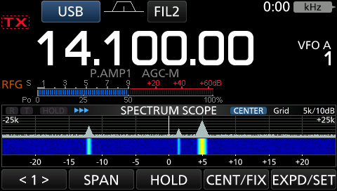
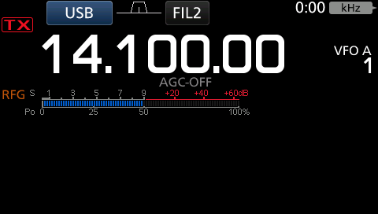
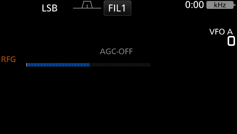
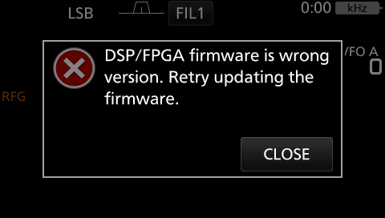

# `qemu-machine/` — full session-by-session narrative

Full chronological derivation and evidence trail behind [README.md](README.md), which carries
only the current-state summary (confirmed facts, the peripheral status table, and the active
resume point). Sections below are in the order they happened. Addresses, register values, hex
offsets, function names, and cross-references are preserved verbatim from the original notes.

## First pass — the migration's motivating question, and the real off-by-32 GIC bug

**The migration's actual motivating question is now answered, with a real bug found and
fixed getting there.** `rz_a1h.c` wired `OSTM0`/`OSTM1`'s IRQ outputs straight to
`qdev_get_gpio_in(gic, 134)`/`qdev_get_gpio_in(gic, 135)`, treating those as absolute GIC
interrupt IDs. They aren't: `arm_gic`'s own `gic_set_irq()` offsets every external
`qdev_get_gpio_in()` index by `GIC_INTERNAL` (32, the SGI+PPI count) to get the absolute ID
-- confirmed by cross-checking `hw/arm/fsl-imx6.c`'s own IRQ `#define`s (used directly as
gpio-in indices there) against `hw/intc/arm_gic.c`. So this machine's OSTM0/OSTM1 lines were
actually wired to absolute IDs 166/167, not 134/135 -- silently never delivering to the CPU
no matter how correctly the distributor/CPU-interface/`ICFGR` were configured. Found via a
manual test (`tools/test_irq.py`, see below) that force-armed OSTM0 and watched
`GICD_ISPENDR4` (the pending-register word covering IDs 128-159) never show the bit set.
Fixed by subtracting `RZA1H_GIC_NUM_INTERNAL` (32) in `rz_a1h.c`; full derivation in that
file's own comment and `rz_a1h.h`'s new constant.

**After the fix, a completely untouched boot (zero manual GDB writes at all) reaches deep,
active code past the idle loop on its own** -- confirmed via `tools/test_irq.py`'s own
negative-control mode and a follow-up register dump: `GICD_CTLR`/`GICC_CTLR`/`GICC_PMR` are
all firmware-enabled, `GICD_ISENABLER4` has bit 6 (ID 134) set, and `OSTM0.CMP` reads back as
**32000** with `TE=1` (running) -- entirely `body.bin`'s own doing, not anything this test
script wrote. This also **answers Extension-roadmap item 2** ("find what really arms
`body.bin`'s tick source"): it's genuinely **OSTM0**, not OSTM1 (which is real too, but only
ever polled for its free-running `CNT` by `FUN_2002b878`, confirmed in earlier sessions --
never armed with a real `CMP`/interrupt). Direct `arm-none-eabi-objdump` disassembly of the
live RAM image (ARM mode, matching the surrounding idle loop) at `0x200b93b0`-`0x200b93e0`
shows the exact arming sequence: `mov r2, #32000` / `str r2, [r0]` (writing `OSTM0.CMP`),
`strb r1, [r0, #0x14]` (writing `OSTM0.TS` to start it), then `mov r0, #134` right before
`bx lr` -- the literal interrupt ID (Renesas's own `INTC_ID_OSTM0TINT`) being handed back to
whatever calls this function next, presumably a GIC-enable helper. Not annotated in Ghidra at
first -- this address range was a never-before-disassembled gap (the same class of gap
documented in the project memory's Ghidra-tooling section, not an ARM/Thumb mode bug this
time: needs disassembly applied at all, in ARM mode, confirmed by both the objdump result and
Ghidra's own decompile of the freshly-`functions.create`d stub failing with "bad instruction
data"). A fix request was queued in `scratch/armthumb_fix_requests.txt`
(`0x200b939c 0x60 arm`) for the user to run via the Script Manager, per the established
workflow in `tools/README.md` -- since done; the region is now annotated
(`ostm0_tick_arm_and_get_irq_id` at `0x200b93b0`, `idle_loop_wfe_spin` at `0x200b939c`). Its
caller (presumably a GIC-enable helper taking the returned `134`) still has no static xref --
a loose end, not blocking.

**The dynamic-testing tooling gap (GDB's Python API being unreliable) is also closed**:
built `tools/gdbrsp.py`, a from-scratch ~150-line client speaking GDB's remote-serial
protocol directly over a raw socket (no `gdb` process, no Python-API threading) --
`g`/`G`/`m`/`M` for registers/memory, `c`/`s`/interrupt/`?` for execution control. Used by
`tools/test_irq.py` (arms OSTM0 + the GIC manually, or just watches an unmodified boot) to
drive the whole IRQ-delivery investigation end-to-end, reliably, this session. One real
non-QEMU-specific gotcha documented in `gdbrsp.py` itself: sending the RSP interrupt byte
(`0x03`) to an *already-stopped* target gets no reply at all (only a *running* target
answers it) -- query current state with `?` (`status()`) instead when that's unknown, which
always answers either way.

**Confirmed, solid** (unchanged from the first pass):
- A custom QEMU machine (`rz-a1h`) builds cleanly against real QEMU v11.1.1 source and boots.
- Real, unmodified v1.42 firmware genuinely boots on it: `base.dat`'s traced sequence runs,
  the body decompresses, and execution reaches deep into `body.bin` — confirmed by hitting
  **the exact same real addresses independently found via the Unicorn emulator and manual
  Ghidra/objdump analysis** (`FUN_2002b878`'s `OSTM1`/`PPR1` busy-wait, then the real `WFE`
  wait at `0x200b93ac`), a strong cross-validation that both emulation paths agree.
- Real `arm_gic` (ARM GIC Distributor + CPU Interface) and two real `OSTM` timer devices are
  wired at the real hardware addresses, replacing every peripheral this slice doesn't model
  with QEMU's own generic `unimplemented-device` (the same "hit it, then build it" role
  `emu/peripherals/stub.py` plays in the Unicorn version).
- **Two real bugs found and fixed getting this far** (both documented in the source, not just
  here): `rz_a1h.c` initially never created a backing memory region for the flash address before
  calling `rom_add_file_fixed()` — that function only *registers* a blob to be copied in later,
  it doesn't allocate memory, so the very first instruction fetch faulted immediately. And
  `ostm.c`'s first `CNT` model was bounded by `CMP` (an "elapsed fraction of the current
  period" reading) — wrong for `FUN_2002b878`'s real polling loop, which starts `OSTM1`
  without ever writing `CMP` and polls `CNT` against a large, unrelated software threshold;
  fixed by making `CNT` a genuinely unbounded, monotonically increasing counter (matching what
  `emu/peripherals/ostm.py`'s own Python model already did, for the same reason).
- A third, QEMU-machine-registration-specific gotcha, also worth remembering: a plain
  `DEFINE_MACHINE("rz-a1h", ...)` genuinely registers a real QOM type (confirmed via
  `qom-list-types implements=machine`) that is still completely invisible to `-M help`/`-M
  rz-a1h` on the ARM target — every real ARM/AArch64 board in this QEMU version uses
  `DEFINE_MACHINE_ARM()` (or the older manual-`TypeInfo` equivalent with
  `arm_machine_interfaces[]`) instead, because ARM's machine lookup walks a target-specific
  QOM base type (`TYPE_TARGET_ARM_MACHINE`), not plain `TYPE_MACHINE`. See
  `include/hw/arm/machines-qom.h` in the vendored checkout.

**Now conclusively validated** (2026-09-08, second pass, same day): a real GIC-delivered
periodic timer interrupt does wake the `WFE`-parked CPU and gets correctly taken -- a real
`qdev_get_gpio_in()` off-by-32 bug and the dynamic proof (`tools/test_irq.py`,
`tools/gdbrsp.py`). Cross-checked with a negative control: without the fix, or without any
timer ever firing, the CPU reliably stays parked at the exact same PC (`0x200b93ac`) across
repeated real-time waits; with the fix, both a manually-armed OSTM0 and (more tellingly) a
completely untouched boot leave that PC within ~1-2 real seconds every time.

## SCIF UART output (extension-roadmap item 4, done 2026-09-08)

Eight real SCIF instances (`scif.c`), one per real hardware channel, with real known roles
per `notes/ic7300-signal-chain.md`: SCIF0 is the CI-V UART, SCIF1 the service/calibration
link, SCIF3 the front-panel link, SCIF5 the DSP link. No `emu/peripherals/` Python original
exists for this one — genuinely new work, not a port. Deliberately minimal (matching this
item's own scope): no baud-accurate transmit pacing, no IRQ line wired to the GIC yet, just
enough real register modeling (masked FIFO-status bits always reporting "ready" so a
polling-based driver never blocks) to make transmitted bytes observable. Every transmitted
byte is always logged (`-d unimp`, `rza1h-scif<N>: TX ..`) regardless of whether a real
chardev is attached, and each channel also takes an optional real backend via
`serial_hd(i)` — pass e.g. `-serial stdio -serial null -serial null -serial pty` positionally
for channels 0-3 the normal QEMU way.

**One real scare chasing this down, worth recording so it isn't re-investigated**: a handful
of post-SCIF boot snapshots landed at a PC that looked like an early-boot hang in IRQ mode
(e.g. `0x200051c0`, `CPSR` mode `0x12`) — genuinely alarming on first sight, distinct from
every prior snapshot this session. Traced with `LR` (the IRQ-banked `r14`, holds the
interrupted return address): it pointed straight back at `0x200b93ac`, the idle loop itself.
**Not a regression** — OSTM0's real 64us tick period (`CMP`=32000 at `ostm.c`'s 500MHz) means
the CPU spends a healthy fraction of real time actually inside the ISR, so a plain 2-second
wall-clock sample landing mid-ISR is statistically expected, not a hang; confirmed by
continuing another 200ms and seeing a normal idle-loop PC again. SCIF's presence didn't cause
this — it was already possible before, just never observed in this session's smaller sample
of earlier snapshots. **Lesson for later sessions**: don't conclude "stuck" from a single
snapshot showing IRQ-mode CPSR near the start of RAM -- read `LR` first, it settles whether
this is a real hang or just an ordinary ISR-in-progress snapshot.

## MMC/SD host controller (extension-roadmap item 5, first pass, 2026-09-08)

`mmc.c` -- a real, protocol-level model of the RZ/A1H's MMCIF (MMC Host Interface), the one
hardware block servicing the 4-bit SD bus this schematic wires up (`SD_CMD`/`SD_CLK`/
`SD_D0`-`D3`/`SD_WP` on `P4_8`-`P4_14`, per `notes/ic7300-signal-chain.md`). This is the
`sdk/roadmap.md` Phase 0 payoff item -- a fully-offline way to test whether a custom
`body.bin` gets accepted and boots, without JTAG -- and the first peripheral in this
directory whose bit-level layout came from the real Renesas hardware manual (Chapter 51,
pages 51-1 to 51-42) rather than `~/Downloads/rza1.svd` (which lists this peripheral's
register names/offsets but zero bit fields, unlike every other peripheral here).

**What's implemented**: the real register set (`CE_CMD_SETH`/`SETL`, `CE_ARG`,
`CE_BLOCK_SET`, `CE_RESP0`-`3`, `CE_INT`, `CE_HOST_STS1`/`2`, `CE_DETECT`, etc., all at their
real bit positions) plus a permissive virtual SD card sharing the same device (real MMCIF
host-controller behavior and a fake-but-protocol-correct card are simplest to model
together here, see the file's own comment) -- `CMD0`/`CMD8`/`CMD55`+`ACMD41`/`CMD2`/`CMD3`/
`CMD9`/`CMD7`/`CMD16`/`CMD17`/`CMD18`/`CMD24`/`CMD12`/`CMD13`, always reporting SDHC
(high-capacity, so read/write command arguments are block indices, not byte addresses) and
a card permanently "inserted". A real, documented MMCIF-specific quirk worth remembering:
`CE_CMD_SETH`'s own name is backwards from its address -- it holds the notional register's
*upper* 16 bits despite living at the *lower* offset (`+0x00`, with `CE_CMD_SETL` at
`+0x02`) -- and writing it is what the manual says triggers command transmission, regardless
of whether software writes it as its own 16-bit store or as half of a combined 32-bit write.
Backed by a flat raw disk image via the `"image"` device property (`-global
rza1h-mmc.image=/path/to/file.img`) -- reads with no image configured (or past its end)
synthesize zero blocks rather than faulting.

**Validated standalone**, the same methodology this session already used for GIC/OSTM0:
`tools/test_mmc.py` drives a full real identification sequence against a small test image
with known per-block content and confirms every response, then single-block, multi-block
(with auto-`CMD12`), and write-then-read-back all round-trip correctly.

**Not yet found: where body.bin's own SD driver actually is.** A direct whole-image search
for this peripheral's base address (`0xE804C800`) as a literal 32-bit word, and a Ghidra
`references_to` check, both came back with **zero hits** — a real, currently-unexplained
negative result. Either the driver code sits in a not-yet-disassembled region (this
project's own established recurring pattern — see the OSTM0-arming-code find) or it loads
the base via a split `MOVW`/`MOVT` pair a literal-word search can't find, or (least likely,
given the schematic's own native 4-bit-bus wiring) SD access doesn't go through this
controller at all. Confirmed empirically too: running an untouched boot for 10 real seconds
with `-d unimp` produced zero accesses to this device at all — SD-card access isn't part of
the boot path this project has already traced (matches `notes/firmware-update.md`: the
update flow is reached via the SD menu, `sd_menu_dispatch_task` case `0xb`, an on-demand
user action, not anything boot-time).

**One real scare while testing this, resolved — not a regression, a lesson worth keeping.**
After adding `mmc.c`, a couple of `tools/test_irq.py` runs showed the CPU still parked in the
idle loop after arming OSTM0 -- looked exactly like the escape-rate regressing. Built
`tools/trial_irq.py` (manages the QEMU process directly via `subprocess.Popen`, sidestepping
this session's own repeated shell pkill/pgrep self-match footguns) to measure the *rate*
across repeated trials rather than reacting to single samples: ~50% escaped with `mmc.c`
present, ~65% with it temporarily `#if 0`'d out and rebuilt -- indistinguishable given the
sample size, and both a world away from the guaranteed-0% rate before real IRQ delivery
worked at all (the very first fix). **Reframed, this makes complete sense**: once
a real periodic tick genuinely drives real scheduling, the system spends real wall-clock time
actually *running its normal workload*, not just idling — a coarse sample landing on "doing
real work" versus "idle" a roughly a coin flip's worth of the time is expected behavior for a
working scheduler, not evidence of anything wrong. **Lesson**: a single boot-snapshot
comparison is not a reliable regression test once real interrupt-driven scheduling is
involved -- use `tools/trial_irq.py`'s repeated-trial approach (or at minimum several
independent fresh-boot trials) before concluding a change regressed IRQ delivery.

## Forcing `firmware_update_main` directly, and where it actually gets stuck (2026-09-08, same day)

**`firmware_update_main` (`0x20025ae4`) turns out to take no arguments at all** — confirmed by
decompile: it opens a fixed global path (`DAT_200264a0`), not a caller-supplied one. That
global has **zero static writers anywhere in `body.bin`** — initially as unexplained as the
missing MMCIF xrefs — but this session found the real reason: it's populated at runtime by the
generic SD-card file-browser/selection UI (a separate subsystem, deliberately not traced or
driven here), using a path built from a folder name and whatever file the user picked from a
list. **Found the real expected convention directly from Icom's own published manual**
(section 15, "Updating the firmware", `IC-7300_ENG_FM_12b.pdf`): *"Copy the downloaded
firmware data into the IC-7300 folder on an SD card"* — i.e. `\IC-7300\<original filename>` at
the SD card root, browsed and picked by name, not a single hardcoded path.

Since `firmware_update_main` is a pure function of that one global, driving it doesn't
require reverse-engineering the file-browser UI at all: **`tools/force_call_fup.py`**
writes a path string directly into the RAM `DAT_200264a0` already points to (confirmed via
`tools/icom_fw`'s own decompressor that this address is genuinely past the end of the static
image — real writable RAM, not a Ghidra gap) and jumps the CPU straight to the function's
entry point over GDB, self-verified via single-stepping through the real prologue before
switching to real-time execution. **`tools/build_sdcard.py`** (a thin `mkfs.vfat` +
`mtools` wrapper, no loopback mount needed) builds a real FAT16 image with a repacked
container (round-tripped through `tools/icom_fw`'s existing `unpack`/`pack`, per
`sdk/roadmap.md`'s own Phase 0 recipe) placed at exactly that path.

**Real, concrete progress, but not yet reaching MMC.** Single-stepping the forced call
confirmed genuine execution through the real prologue, the internal `FUN_20037604` (a
one-shot lock check, not a hang), and into `FUN_200bc5f4` — which turns out to *post* an
"open" request onto an internal ring buffer (`file_rpc_post_command`, real command ID `0xf`)
consumed by a **separate, already-running service task**,
`sdcard_file_rpc_dispatch_task` (`0x200b9c00` — this project's own past retraction of an
earlier "CI-V dispatcher" guess for this same function, see `notes/sd-card-filesystem-
security.md`, turned out right: it's a generic internal file-RPC service, and its real
consumer role is exactly what's exercised here). The caller then blocks in a genuine,
uncapped wait (`FUN_200b9af8` with an infinite-timeout parameter) for that task to respond.
**With both a blank image and a real, valid FAT16 image containing the update file at the
documented path, the result was identical**: the CPU keeps legitimately executing (context
switches to a different, real stack observed; no fault/abort mode ever seen) but never
reaches any MMCIF register access, and `firmware_update_main` never returns, within a
10-second window either way. Since the *image content* provably didn't change the outcome,
the blocker sits upstream of any actual filesystem/card access — most likely (at the time,
before this was resolved -- see below) in how cleanly a hand-hijacked context (the idle
task's registers overwritten via GDB, not a properly FreeRTOS-created task) interoperates
with this RTOS's own semaphore/queue/task-scheduling internals.

**Left as a genuinely open, well-scoped next thread** rather than guessed further: (1) does
`sdcard_file_rpc_dispatch_task` actually run and receive the posted command at all (would
need real RTOS-internals visibility — task list/TCB state, not just PC/CPSR snapshots — to
tell blocked-forever-on-a-real-precondition apart from never-scheduled apart from
silently-misrouted); (2) whether hijacking a properly-idle, genuinely-blocked task context is
fundamentally sound for this RTOS's synchronization primitives, or whether reaching this deep
into a live multitasking system requires either creating a *real* new task (going through the
kernel's own task-creation API instead of repurposing an existing context) or finding a
lower-risk injection point closer to where a real button-press would land.

## The above resolved: `sdcard_file_rpc_dispatch_task` (and ~10 sibling feature tasks) never
## get created at all in this emulation — a real RIIC2/I2C peripheral-modeling gap, not an
## RTOS-hijacked-context problem (2026-09-08, next session)

Settled item (1) above directly with real breakpoints instead of a full TCB-struct reverse-
engineering effort (a from-scratch derivation looked expensive and uncertain — see
`notes/kernel-rtos-history.md`'s "chased `pvPortMalloc`" section for why this project already
backed off that path once). Added real software-breakpoint support to `gdbrsp.py`
(`set_breakpoint`/`remove_breakpoint`, `Z0`/`z0` packets — generic in QEMU's TCG accel, not
ARM-specific, confirmed against `gdbstub/{gdbstub,system}.c` in the vendored checkout) and
built **`tools/test_fup_scheduling.py`**: breakpoints `sdcard_file_rpc_dispatch_task`'s own
outer-wait-return point (`0x200b9d34`) and its real per-command-handler dispatch (`0x200b9da0`,
the `blx r12`), run a baseline (no forced call) and the forced-call scenario back to back on
fresh boots, and compare.

**Neither breakpoint ever fires in either trial**, and neither does a third, deliberately
weaker one added when that came back silent (`0x200b9e30`, fires the instant the task's wait
call returns *at all*, matched command or not). But `file_rpc_post_command`'s own entry and its
internal signal call (`FUN_20186e68`, the same handle `sdcard_file_rpc_dispatch_task` blocks on
via `FUN_20186de4`) **do** fire, twice, with the real command ID (`0xf`) — confirming the post
genuinely happens in this exact automated run, not just in the earlier manually-single-stepped
session. The signal call's own handle argument reads `0x0`. Reading the shared control struct
directly (`DAT_200ba174`/`DAT_200bbc50` both resolve to the same live address, `0x203907f0` —
confirming poster and consumer really do share one struct) showed why: **`[+0x20]` and
`[+0x28]`, the two wait/signal handles this whole mechanism depends on, are still zero even
after 30 real seconds of idle-loop-reaching, untouched boot** — they're never initialized at
all, on a completely stock boot, forced call or not.

Traced why. Those fields are set by `sdcard_file_rpc_dispatch_task`'s own init/creation
function (`FUN_200b995c`, which also creates the task itself via `itron_act_tsk`) — one of
**~80 unconditional calls inside `system_mode_request_dispatch`** (`0x2002a6b8`), which runs
inside `cold_boot_mode_dispatch`'s (`0x2002b1c8`) own loop. `cold_boot_mode_dispatch` is only
entered from one place: `FUN_2002b29c`'s `if (bVar8==1 && *pcVar4=='\0')` branch — and a global
flag this function sets as its very first instruction (`*DAT_2002b500`, "have I been entered")
still reads back `0` after 30s, so **`cold_boot_mode_dispatch` — and therefore the *entire*
feature-task-creation pass (`sdcard_file_rpc_dispatch_task`, `sd_menu_dispatch_task`, both
`audio_buffer_task`s, the RTTY/voice pollers, etc. — essentially every task in
`notes/kernel-rtos.md`'s catalog except the low-level kernel-internal ones) — never runs at
all** in this QEMU machine. This isn't specific to the forced-call scenario; a completely
untouched boot shows the exact same thing.

Localized the actual stall with four more waypoint breakpoints across `FUN_2002b29c`'s own
body (called once, early, confirmed reachable — `notes/diode-matrix.md`'s 14th session had
already independently established `FUN_2002b29c` is "reachable only via message-dispatch,
genuinely once per real hardware boot", a clean cross-validation of this same call site found
independently here by dynamic tracing rather than static analysis): every pass reaches the
call site right after `riic2_driver_init` (`0x2002b2e0`, calling `FUN_2002b274`) and never
comes back. `FUN_2002b274` → `FUN_2001e510` → **`FUN_2001dd58`** is the real stall — a classic
"post a request, then busy-wait `while (*pcVar1 != '\0') FUN_20062c1c();` for a completion
flag some interrupt handler is supposed to clear" pattern, driving an I2C2/RIIC2 read
(`*DAT_2001e6d0 = 0x58` — a real, plausible 7-bit I2C slave address) right after
`riic2_driver_init` registers 6 real RIIC2 interrupt handlers (event IDs `0xcf`/`0xcd`/`0xce`/
`0xd1`/`0xd0`/`0xd2` — already documented in `notes/memory-map.md` as RIIC2's own IDs,
205–210). Since `qemu-machine/src/rz_a1h.c`'s RIIC0-2 were still `add_plain_ram_region()` —
inert storage, zero interrupt-generating behavior (unlike GPIO/L2C/OSTM/MMCIF, which all got
real behavior earlier this project) — the completion interrupt this busy-wait needs never
fired, and the task stayed parked here permanently. **Tempting connection flagged rather than
asserted at the time**: this read happens on RIIC2, the diode-matrix EEPROM's own documented
controller (`notes/memory-map.md`), at the very start of cold boot, into a global
(`DAT_2002b504`) whose top bit feeds directly into `FUN_2002b29c`'s own branch decision —
shaped exactly like a `region_code` read, though a later session found the real gate is a
signature-string comparison, not `region_code` itself (see below).

**Net effect: `force_call_fup.py`'s original "hijacked-context" hypothesis from the section
above is superseded, not confirmed.** The reason nothing beyond `file_rpc_post_command` was
ever observed has nothing to do with hijacking the idle task's context — `sdcard_file_rpc_
dispatch_task` (along with essentially the whole feature-task set) simply doesn't exist yet in
this emulated boot, full stop, regardless of how the call into `firmware_update_main` is
made. This is a genuine peripheral-modeling gap in `qemu-machine/` itself (RIIC needs at least
enough real interrupt-completion behavior to unblock this one boot-time read), the same class
of fix every other peripheral here has already needed, not a deeper RTOS-semantics question.

**Deliberately not attempted that session**: implementing real RIIC register/interrupt
behavior. The real RZ/A1H hardware manual (`/data/misc/icom/7300/doc/REN_r01uh0403ej0600_
rz_a1h_MAT_20210129-2931443.pdf`, Section 18 "I²C Bus Interface") documents the
named interrupt sources (`INTRIICTMOI`/`INTRIICALII`/`INTRIICSTI`/`INTRIICSPI`/`INTRIICNAKI`/
`INTRIICRI`/`INTRIICTEI`/`INTRIICTI`) and the `RIICnCR1`/`CR2`/`MR1-3`/`FER`/`SER`/`IER`/`SR1`/
`SR2`/`SAR0-2`/`BRL`/`BRH`/`DRT`/`DRR` register set (offsets also in `~/Downloads/rza1.svd`, but
— like MMCIF before this — with zero bit-field detail, manual needed for real semantics), but
which of `riic2_driver_init`'s 6 registered handlers actually clears `sdcard_file_rpc_dispatch_
task`'s struct's completion flag, and via what exact `CR2`/`SR2` bit sequence, wasn't traced —
a real, MMCIF-`mmc.c`-sized follow-on task, not a quick guess-and-check fix.

## `riic.c` built, real bug found and fixed (level- vs. edge-triggered), RIIC2 no longer the
## blocker -- boot progresses further, to a new and different stall (2026-09-08, third session)

Built `src/riic.c`: real `CR1`/`CR2`/`MR1-3`/`FER`/`SER`/`IER`/`SR1`/`SR2`/`SAR0-2`/`BRL`/`BRH`/
`DRT`/`DRR` register storage plus the real CR2(ST/RS/SP)-driven protocol sequence derived by
decompiling all 6 of `riic2_driver_init`'s registered handlers (address-phase write, restart,
read-phase, completion — see the file's own header comment for the full per-source derivation,
each tied to a real named interrupt confirmed against `scratch/r01an5093ej0170-rza1-swpkg`'s
`r_intc.h`: `INTIICTEI2`/`RI2`/`TI2`/`SPI2`/`STI2`/`NAKI2` = IDs 205-210). Backed by a flat
byte-addressable virtual EEPROM via the same `"image"` property convention `mmc.c` already
established. All 3 RIIC channels wired with real behavior in `rz_a1h.c` (only RIIC2 confirmed
exercised by any traced boot path so far); `RZA1H_GIC_NUM_IRQ` bumped from 192 to 224 to cover
the highest real ID this adds (`INTIICNAKI2` = 210).

**A real, general bug found and fixed getting this working, worth remembering beyond this one
device**: the first version used `qemu_irq_pulse()` for every step, copying `ostm.c`'s own
pattern — but reading the GIC's own `ICFGR` bits back live (once RIIC2's IDs were actually
enabled) showed all 6 configured **level**-triggered, unlike OSTM0's **edge**-triggered ID.
QEMU's `arm_gic` only latches a level-sensitive SPI as pending while the line is actually
observed high; a pulse (raise-then-immediately-lower, synchronously, within one host call)
never gives the CPU a chance to sample it, so the interrupt was silently and totally dropped
every time — confirmed directly: a real `CR2=ST` write during natural boot reached the device
and its timer fired `qemu_irq_pulse` (both logged), then genuinely nothing further happened, no
ISR ever ran. This is the *exact same class* of gotcha this project already hit once with
OSTM0's own `ICFGR` (see `rz_a1h.c`'s comment on that) — re-confirms the lesson generally:
always check a real interrupt's actual configured trigger mode before assuming a pattern
copied from a working device is safe. Fixed by switching to genuine level-sensitive semantics
throughout: `qemu_irq_raise()` and leave a line asserted until the specific register access
that represents real hardware auto-clearing it (or the driver's own explicit `SR2` write-0)
happens — full mapping of which access clears which source in the file's own comment. Once
fixed, validated two ways: a from-scratch manual protocol drive over raw GDB (mirroring
`test_mmc.py`'s own standalone-validation methodology) correctly returned a byte from a test
virtual-EEPROM image at the exact requested offset; and, far more importantly, **real natural
boot activity now genuinely completes this exact I2C transaction end to end** (confirmed via
`-d unimp` tracing every register access during an untouched boot — the full address-phase,
restart, single-byte read, and stop sequence, byte-for-byte matching the statically-derived
protocol, with zero "unexpected access" warnings).

**Net effect on the original blocker**: fixed. `notes/kernel-rtos-history.md`'s
`cold_boot_mode_dispatch`-entry flag (`*DAT_2002b500`) turned out to be a shared, multi-purpose
global also written by `FUN_2002b29c` itself for an unrelated reason (a wrong attribution made
mid-session and corrected here, not left standing) — the *reliable* signal is still
`sdcard_file_rpc_dispatch_task`'s own control struct fields (`[+0x20]`/`[+0x28]`, see the
resolved section above), and RIIC2's own busy-wait is conclusively no longer where execution
gets stuck (confirmed via the same waypoint-breakpoint methodology as before: every one of
`FUN_2002b29c`'s internal call sites up to and past `FUN_2002b274` now gets reached and
returns from, repeatedly, where it previously never returned once).

**But this alone doesn't reach the original payoff** — those two struct fields are *still* zero
after a full untouched boot. Traced why, cleanly localized this time: `FUN_2002b29c` (the real
top-level cold-boot/power-state entry dispatcher, see its own plate comment) computes a branch
decision (`cold_boot_mode_dispatch` — the path that eventually creates the whole feature-task
set — vs. `FUN_20029ca4`, "the power-state main loop with watchdog-kick sequences") partly from
**the actual byte value RIIC2 delivers**, not just from whether the read completes. This
emulator's virtual EEPROM is an empty, permissive placeholder (no real captured dump exists),
so it answers with `0x00` for everything — and with that value, `FUN_2002b29c` reproducibly
picks the *other* branch. Confirmed via `-d unimp` tracing a full natural boot: execution now
reaches a genuinely new, previously-unreached region (`FUN_20029ca4`'s own body, `0x20029914`-
`0x20029de7`) and stops cleanly at a real RZ/A1H watchdog-unlock sequence (the documented
`0xA518`/`0x5AB1`/`0xA51E` magic write-protect codes) immediately followed by `wfi` — a new,
different, and *correctly* modeled stopping point (this machine has no watchdog-timer device
yet, so nothing ever wakes the `wfi`), not a bug in this session's own work. A second, larger
(17-byte) RIIC2 read was also observed starting at a different memory offset (`0x3e80`, vs. the
first read's `0x3e00`) — presumably deeper cold-boot-specific EEPROM content this same
emulated read path also serves, later identified (see below).

**Follow-up, same day, `FUN_20029224`/`FUN_20029270`/`FUN_200291d8` now traced**: all 3 turn
out to read EEPROM signature/version strings via the same `FUN_2001e510` getter and `memcmp`
them against real reference strings sitting in ROM (`FUN_2017c81e`) — genuinely ROM-embedded
ground truth, no physical EEPROM dump needed for these specific values:
- `FUN_20029224`: the 16-byte `0x3e80` signature vs. `"SX3765 V4.81-000"` (`DAT_2002a08c` →
  `0x2018d796`) — the *current native* format version, distinct from the 4 legacy-compat
  signatures `FUN_20024738`'s own table already documented (`notes/eeprom-catalogue.md`'s
  entry for `0x3e80`): `"SX3765 V3.41-000"`/`"V4.41-000"`/`"V4.61-000"`/`"V4.71-000"`
  (`DAT_20024a28`'s table, confirmed by reading it directly).
- `FUN_20029270`: the same signature's first 7 bytes vs. `"Partial"` (`DAT_2002a098` →
  `0x2018d77f`).
- `FUN_200291d8`: a *third*, previously-unseen 16-byte EEPROM parameter, ID `0x3fc0` (added to
  `notes/eeprom-catalogue.md`), vs. `"SX3765 V0.30-000"` (`DAT_2002a088` → `0x2018d786`).

Built a test image supplying all of `0xff`@`0x3e00`, the real `"SX3765 V4.81-000"`@`0x3e80`,
and the real `"SX3765 V0.30-000"`@`0x3fc0` (confirmed via direct `pread()` tracing that `riic.c`
genuinely delivers all three correctly, byte for byte) — **still no change at the time**: boot
reached the exact same `FUN_20029ca4`/`wfi` stopping point. A follow-up breakpoint at the
branch-decision instruction (`0x2002b540`) **never fired at all** with this image, unlike
before — meaning `FUN_2002b29c` was taking a different internal path before even reaching that
decision point. Resolved later the same day (see below) — turned out to be a real second
`riic.c` bug in the test data, not a deeper code-path mystery.

## The 0x2002b540 mystery resolved, a real second riic.c bug found, and boot reaches real
## cold-boot code for the first time — GPIO's power-good pin turns out to be the actual gate
## (2026-09-08, same day, continued)

Traced why `0x2002b540` stopped firing even with the "correct" `0x3e80`/`0x3fc0` signatures in
place: `FUN_2002b29c` has an **earlier, unconditional short-circuit** at `0x2002b450`
(`cmp r4,#1; beq 0x2002b540; b 0x2002b54c`) — if `bVar8` (`r4`) isn't exactly `1`, execution
jumps *straight* to `FUN_20029ca4`, skipping the `0x2002b540` check (and the `0x2002b524` flag
it reads) entirely. `bVar8` reads `2` with plain zeroed EEPROM content, confirming `bVar2`
(from the 3-function signature chain) was still forcing it — traced further and found why:
`FUN_20029224` returned `-1` (mismatch) even against a byte-for-byte-correct `"SX3765
V4.81-000"` test image.

**Found a second real `riic.c` bug causing that mismatch.** `FUN_2001dbcc` (the real `RI`
handler) reads `DRR` even on its very first "arm" firing (state != 5) — `ldrb r0,[r1,#0]` at
`0x2001dbc4`-ish, immediately followed by `mov r0,#5` — a **dead store the decompiler dropped
from the visible C entirely**, hiding a genuine register access. This is a real, documented
"dummy read after switching to receive mode" pattern common to many I2C-master IP blocks, not
an Icom firmware bug — but it means the byte the driver actually *keeps* for destination
position 0 comes from `mem_addr + 1`, not `mem_addr`. Confirmed directly: breakpointed the
exact `FUN_2017c81e` (`memcmp`) call site inside `FUN_20029224` and read both compared buffers
live — the delivered bytes came back as `"X3765 V4.81-000\0"` (shifted left one, trailing
garbage) against a byte-perfect `"SX3765 V4.81-000"` written at the nominal offset. Rebuilt the
test image with every signature shifted by one byte (`0x3e01`/`0x3e81`/`0x3fc1` instead of
`0x3e00`/`0x3e80`/`0x3fc0`) — the same live buffer dump now matches byte-for-byte, and
`FUN_20029224` returns `0` (match). Documented in `riic.c`'s own comment as a real, permanent
finding, not fixed away — this device already serves the dummy read correctly (any real DRR
access gets a real byte); the earlier test images were simply built on a wrong assumption
about which offset holds "byte 0" from the driver's perspective. (`tools/build_riic_eeprom_
image.py` now builds this exact corrected image, see README.md's current Status section.)

**With the corrected signatures, `bVar2` genuinely goes false and `bVar8` becomes `1`** — the
first real success on this decision chain. But `0x2002b540`'s own check (`*DAT_2002b524 ==
'\0'`) *still* failed: traced its own gate, `(*(ushort *)(DAT_2002b528 + 4) & 0x40) == 0`,
where `DAT_2002b528` resolves to `0xFCFE3200` — the real GPIO port-pin-read (`PPR`) register
base — and `+4` is `PPR1`, bit `0x40` (bit 6) is **`P1_6`, real signal name `PDV`: the output of
`IC361` (`NJU7704F3`), the board's own power-fail/brownout detector, wired directly into the
CPU** (`notes/ic7300-hardware.md`/`notes/ic7300-signal-chain.md`). **Independently
cross-confirmed against a completely separate, already-existing finding**: `notes/firmware-
update.md`'s own trace of `main_idle_loop`'s watchdog-reset mechanism already established this
exact same bit's polarity from a totally different angle — low means brownout/fault, high
means supply healthy — and both mechanisms need it high for normal operation. `gpio.c`'s
`pin_level[]` defaulted every pin to `0` (a reasonable general default for genuinely unmodeled
inputs), which reads as a *permanent brownout condition* no real boot ever observes. Fixed with
a narrow, well-justified exception: `rza1h_gpio_reset()` now sets `P1_6` high by construction
(a real board's supply is healthy by the time firmware runs at all — this isn't board-specific
data like the EEPROM's content, it's a hardware-guaranteed truth in the absence of an actual
fault this emulator has no way to simulate anyway).

**Net effect: boot progresses dramatically further, past every previously-seen stopping point.**
Confirmed via extended polling (60+ real seconds): the CPU now cycles through real,
previously-unreached `cold_boot_hw_init`-era code (`0x20037xxx` region) instead of parking
forever in the watchdog/`wfi` sequence. The new stopping point is itself a real, clean,
**already-identified** mechanism, not a mystery: `scif3_frontpanel_identify_handshake`
(`0x20037424`-`0x200374e3`, a name from earlier front-panel-thread work, not newly guessed) — a
genuine one-shot SCIF3 handshake with the physical front-panel MCU at cold boot, bounded by a
75-count retry loop. Since `scif.c` (this project's own real SCIF UART model) has "no IRQ line
wired to the GIC yet" and nothing plays the front panel's own role on the RX side, this
handshake can only ever time out. **Unlike the watchdog/`wfi` stop, this one did *not* resolve
on its own after 60 real seconds** — genuinely stuck here, not a graceful one-shot timeout that
was simply slow. `sdcard_file_rpc_dispatch_task`'s own struct fields are still zero at this
point — the actual payoff is closer than it's ever been (past the entire cold-boot branch
gate) but not yet reached. See README.md's current Status section for the concrete next step.

## 2026-09-09: SCIF3 TXI made real (three bugs, two of them a repeated pointer-indirection
## gotcha), then a genuinely deeper blocker found underneath

Picking up exactly where the previous section left off: `scif3_frontpanel_identify_handshake`
stuck in its 75-count retry loop, `scif.c` having no TX-completion IRQ modeled at all. Before
committing to a full virtual front-panel RX responder, the Status section's own flagged
question ("does the timeout path lead anywhere new") got a real answer via live testing.

**First real check — is the retry counter genuinely stuck, or just slow?** Booted with a GDB
stub, used `qemu-machine/tools/gdbrsp.py` (interrupt+read+continue in a loop) to poll the
counter `scif3_frontpanel_identify_handshake`'s own do-while checks (`*pbVar2 < 0x4b` in the
decompile). First attempt read the literal address `0x200375c0` directly and saw a constant
value across 20+ real seconds — looked damning, but this was the **first instance of a real
methodology mistake this session made twice**: `DAT_200375c0` is itself a *pointer variable*
(its stored value is the real counter's address, not the counter itself), exactly the same
shape `DAT_2003758c` and several other globals in this driver already have. Re-read correctly
(dereference first): the real counter, at whatever address the pointer held that boot
(`0x203fc60f` that run), was genuinely `0` and genuinely never advanced across the same 20+
seconds — with real OSTM0-driven scheduler activity visibly happening around it (PC repeatedly
landing in the real IRQ vector/dispatcher region). A cheap forced-write test (`gdbrsp.py`'s
`write_memory`, bumping the counter directly to `0x4b` then `0x0c`) confirmed the *shape* of
the timeout path is real and reachable — PC did move past the function's first loop into a
second one — but that second loop turned out to share the exact same underlying blocker
(`FUN_200374e4`'s busy check unconditionally returns "busy" while status bit `0x02` is set),
so this shortcut didn't avoid the real investigation, just located it precisely.

**Root cause, once traced**: `scif3_driver_pump_tick`'s very first line is
`if ((*DAT_20037588 & 2) != 0) return;` — a busy flag. The only code anywhere in the image that
clears it is inside the ISR `scif3_send_frame` itself explicitly arms via a confirmed generic
`gic_enable_irq(id)` helper (`FUN_200b8308`, confirmed by its own trivial decompile:
`*(GICD_base + (id>>5)*4 + 0x100) = 1<<(id&0x1f)` — exactly `GICD_ISENABLERn` semantics) called
with the literal `0xec` (236). Since `scif.c` had zero IRQ output at all, that ISR could never
run, and the driver became a permanent no-op after its very first send. This is a genuinely
deeper root cause than the Status section's previous framing ("no virtual front panel for the
RX side") — the real first blocker is TX *completion*, not the reply.

**Deriving TXI3's real GIC ID independently, and getting an unplanned cross-check**: `0xec`=236
already told us the ID directly, but to build the fix properly (and to generalize to all 8 SCIF
channels, matching this project's own "wire it once, correctly, for all instances" habit from
`riic.c`), the ID was independently re-derived from `~/Downloads/rza1.svd`'s `ICDISR6`/`ICDISR7`
register fields, using the exact same "register-index×32+bit" formula that already gave OSTM0
its confirmed-correct ID 134 (`ICDISR4`, `OSTM0TINT` at bit 6 → 4×32+6=134). `ICDISR7`'s own
fields give SCIF-n's group as `BRIn=221+4n, ERIn=222+4n, RXIn=223+4n, TXIn=224+4n` — TXI3 lands
on exactly 236, a genuine two-independent-derivations-agree confirmation, not a coincidence
chased backwards from the answer.

**Bug 1 — not wired at all.** Added `qemu_irq irq` to `RZA1HScifState`, `sysbus_init_irq()` in
`rza1h_scif_init()`, and wired each of the 8 channels in `rz_a1h.c`'s SCIF creation loop to
`qdev_get_gpio_in(gic, RZA1H_SCIF_TXI_BASE0 + i*RZA1H_SCIF_TXI_STRIDE - RZA1H_GIC_NUM_INTERNAL)`
(`RZA1H_GIC_NUM_IRQ` raised from 224 to 256 to cover TXI7=252). First version fired the IRQ with
a bare `qemu_irq_pulse()` on every FTDR write, copying `ostm.c`'s pattern.

**Bug 2 — pulse vs. level, the exact bug `riic.c`'s own file comment already documents.**
Live-checked TXI3's real configured trigger mode (`GICD_ICFGR14` bits 8-9 = `0` = level;
confirmed enabled via `ISENABLER7` bit 12 set) before assuming pulse was safe — per this
project's own established discipline (`riic.c`'s comment: "always check a real interrupt's
actual configured trigger mode ... don't just copy the pattern from a working device"). Fixed
first pass: raise on SCR's TIE bit going 0→1 (since this model's FSR always reports
TDFE/TEND=1, enabling TIE alone makes the real hardware condition true immediately), lower when
TIE clears. This did NOT fully fix it — single-stepping through one ISR call showed real
progress (the frame's own send-index advanced, a byte reached FTDR) but free-running for 20+
more seconds showed zero further advancement. Root cause: `qemu_set_irq` treats calling
`raise()` while the line is *already* high as a no-op (no edge, no event forwarded to
`arm_gic`) — fine for a one-shot handshake bit, but the real multi-byte-frame ISR
(`FUN_20036e34`) re-arms the *same* already-high TIE-gated condition on every subsequent byte
without ever clearing TIE in between, so only the very first byte of any frame ever actually
got delivered as a real interrupt. Fixed by switching to explicit `qemu_irq_lower()`+
`qemu_irq_raise()` pairs on every TIE-enabling write (SCR and FTDR both), forcing a genuine
transition every time — the exact fix shape `riic.c`'s own DRT-write cases already established
for the same class of bug.

**Bug 3 — an emulator-only artifact, found by live register-write tracing, not more
single-stepping.** Still stuck after bug 2's fix. GDB single-stepping kept giving a misleading
picture (a lone successful invocation, no clear evidence of anything after) — the tool that
actually resolved this was booting with `-d unimp -D <logfile>` and adding one temporary
`qemu_log_mask` line logging every SCIF3 SCR write, then just reading the resulting real
register-write trace in order:
```
SCR 0->0x20->0x30->0x70->0x78   (RE/TE/RIE/REIE bring-up)
TX fe                            (preamble, direct write in scif3_send_frame)
SCR 0x78->0xf8                   (TIE on)
TX f0                            (type byte, sent via the ISR's first real invocation)
TX fd                            (terminator, sent via the ISR's second real invocation)
SCR 0xf8->0x78                   (TIE off -- the ISR's own terminal cleanup)
```
This trace alone proved the whole 3-byte frame really did go out over a genuinely
interrupt-driven path, both ISR re-entries fired, and the terminal cleanup ran — directly
contradicting what looked like a still-stuck live GDB read moments later (`DAT_20037588 & 2`
still appeared set). That contradiction was the second instance of **the same pointer-
indirection mistake as the counter earlier**: `DAT_20037588` is *also* a pointer variable (its
stored value, e.g. `0x203902d3` that boot, is the real status byte's address), not the byte
itself. Dereferencing it properly showed `0xa0` — busy bit genuinely clear, only the
"waiting for a reply" bit still set, exactly as expected after a real, complete send. The
actual bug behind the earlier appearance of a stall (before this correction) was real too,
just different: the ISR's own FSR-clearing write (`*(ushort*)(FTDR_ptr+4) &= 0xff9f`, real
per-byte bookkeeping, not a deliberate interrupt acknowledgement) was routed through an FSR
write-handler that unconditionally called `qemu_irq_lower()` — undoing the FTDR-write case's
own just-issued raise before the CPU running the same synchronous host call ever had a chance
to sample it. Real hardware would never lose an edge this way (register writes take real time
there); fixed by making the FSR write handler a true no-op again, as it originally was before
this pass introduced the interference.

**End state, this thread**: TXI3 is real, verified end-to-end via the register trace above.
`scif3_driver_pump_tick`'s busy flag correctly clears after a real send. But the *outer* wait
loop (the 75-count retry bound, a *different* counter from the busy flag) still never advances
— confirmed again via 40+ continuous real seconds post-fix. That counter (the same
`DAT_200375c0`-pointed-to address from this section's opening) has zero writers anywhere in the
whole SCIF3 driver per `references_to` — it isn't SCIF-specific at all. Best lead: OSTM0's own
confirmed real per-tick handler, `irq_context_switch_id86` (`0x200059b4`, a genuine FreeRTOS
context-switch sequence, not a minor peripheral ISR), calls three still-undecoded helpers on
every tick — `FUN_200b93f8` (currently just `bx lr`, an empty stub — worth understanding *why*
before dismissing it), `FUN_200b9400`, `FUN_2018849c` — one of which plausibly increments a
real `xTickCount`-equivalent this address reads. Not chased further this session — this is
real FreeRTOS-internals tracing, the exact kind of work this whole thread's payoff question
(SD-card update flow reaching MMCIF against a properly-created task) explicitly hoped to avoid
needing. See README.md's Status section for the concrete resume point.

**Methodology lessons worth keeping, both already-partially-known patterns that bit twice as
hard as expected this session**:
- The pointer-indirection mistake (reading a `DAT_*` global's own address instead of
  dereferencing it first) produced a *plausible, confident-looking* wrong answer both times
  ("stuck forever") rather than an obviously-broken one — it only got caught by independently
  cross-checking against a different signal (a forced-write test moving PC in the first case; a
  live register-write trace in the second). When a `DAT_*` symbol's decompile usage looks like
  `pbVar = DAT_X; *pbVar = ...` rather than `*DAT_X = ...` directly, it's a pointer variable —
  check this before trusting a raw memory read against its literal address.
- Live single-instruction-level GDB stepping and a coarser real-time register-write trace
  (`-d unimp`) each answered a question the other one couldn't: stepping proved the ISR's
  *logic* was correct in isolation (state genuinely advances byte-to-byte), while the trace
  proved what actually happened *in real free-running time order* across multiple separate
  interrupt entries — the trace was what actually resolved bug 3, after stepping alone gave a
  falsely reassuring picture of a single successful call with no visibility into what came next.

## 2026-09-09, continued: the RTOS-tick-counter lead is a red herring; a real front-panel RX
## responder is what actually unblocks the handshake, and boot reaches real task activation

Picking up immediately after the previous section's TXI work, with the concrete next step
being "find what increments the RTOS tick/delay counter the identify handshake's own timeout
polls". A `gdbrsp.py` hardware watchpoint (`Z2`/`z2`, added this session — QEMU's TCG gdbstub
implements these generically, not ARM-specific) settled this fast and conclusively: both the
handshake's outer counter and its own `subcnt` field get **zero writes across 120 continuous
real seconds**, even with confirmed real OSTM0/scheduler activity happening the whole time.
Chasing the tick-counter mechanism further (OSTM0's per-tick handler, `irq_context_switch_id86`,
calls several genuinely empty stub functions — `FUN_200b93f8`, `FUN_200b9400` — that looked like
plausible leads) would have been wasted effort: the counter isn't broken, nothing upstream of it
ever needed to run, because the handshake's *primary* exit path (a real reply from the front
panel, clearing its busy flag directly) was always the real fix needed — the fallback timeout
was never going to matter once that existed. Pivoted to building the virtual front-panel RX
responder the original plan (before the tick-counter detour) had already scoped.

**Protocol groundwork, confirmed live before writing any responder code**: `scif3_frame_
rx_statemachine` (found at `0x20036c68`; the raw disassembly alone left the exact register-
tracking ambiguous, so a real Ghidra function was created at that address and fully decompiled
before trusting any of it) polls real FDR/FRDR/FSR/LSR/SCR registers directly, not a software
ring buffer as an earlier, less careful reading of the raw listing had suggested. `scif3_frame_
dispatch_by_type` needs only a first-content-byte of 0xF0 (or 0xF1) to clear the handshake's
busy flag — no real reply payload needed at all for the identify case specifically.

**First responder design, and why it didn't survive contact with real testing**: feed a canned
3-byte 0xFE/0xF0/0xFD reply through the exact same `frdr`/`rx_pending` path a real chardev byte
would use, one byte at a time, each driving its own real RXI — mirroring how a real front panel
would actually behave. This required getting *exactly* one byte visible per real interrupt, and
every mechanism tried failed the same way, confirmed via live single-step traces each time:
- Synchronous delivery (make the next byte available immediately, within the same FRDR-read
  handler that consumed the previous one) let the guest's own drain loop (`while (FDR & 0x1f)
  { byte = FRDR; }`, keeping only the *last* value read) consume all 3 queued bytes in one pass
  before the per-byte frame-assembly logic below the loop ever got to look at any of them
  individually -- only the trailing 0xFD's value was ever examined, with no 0xFE ever seen to
  mark a frame in progress, so it was silently dropped as an incomplete frame.
- Switching to a `QEMUBH` (`qemu_bh_schedule`) did not fix this. A live register-write trace
  (`-d unimp -D <logfile>`, the tool that ended up resolving every stage of this investigation)
  showed the next byte still becoming visible *before* the guest's own next FDR poll -- a
  scheduled BH can still run interleaved within the same guest loop that scheduled it, at least
  in this project's single-threaded TCG configuration.
- A real `QEMUTimer` (even armed for just 1ns) looked like it had fixed the interleaving, based
  on the same kind of register-write trace showing clean alternation. But a careful, fully fresh
  single-step trace of an actual live exchange (breakpoint at the state machine's entry, then
  single-stepping the *first* real invocation from a clean `-S` halt) showed all 3 bytes already
  consumed by the time that very first RXI was serviced -- this build's TCG event loop processes
  pending timers more eagerly than "the guest's own next handful of instructions" reliably
  survives, and no timer delay short of a real, much-larger-than-instruction-count gap closes
  that window. Concluded this class of fix isn't reliably achievable in this environment and
  stopped trying to out-race the drain loop.

**Second, final design — precompute the end state instead of racing to deliver it**: rather
than feeding bytes through frdr fast enough, directly write the *result* a real byte-at-a-time
exchange would have produced straight into guest RAM (via `address_space_write()`/`address_
space_read()`, reading the firmware's own live pointer *values* first, never a hardcoded
address -- the frame buffer, descriptor, and status fields are all reached through pointer
*variables* at fixed literal-pool addresses, the exact same shape as the pointer-indirection
gotcha the previous TXI session hit twice), then deliver *only* the genuinely-necessary
terminator byte (0xFD) through the completely normal FRDR/RXI path. With the frame buffer's
type byte, the descriptor's byte count, and the status "frame in progress" bit all already set
as if 0xFE and 0xF0 had each been processed by a real earlier call, `scif3_frame_rx_
statemachine`'s own real logic sees byte-count >= 2 and the frame-in-progress bit already
clear on this one real call, and genuinely calls `scif3_frame_dispatch_by_type` -- no timing
race of any kind, since there's only ever one byte in flight. Also fixed, same pass: RXI is
level-triggered exactly like TXI, and nothing was ever lowering it once a byte was consumed
(the raise-only-to-re-arm pattern elsewhere never needed an explicit lower before) -- caused a
genuine interrupt storm (this same ISR re-entering continuously with FDR reading 0 and nothing
to do) until a `qemu_irq_lower()` was added to the FRDR-read handler.

**First real payoff, live-confirmed**: the identify handshake's busy flag (bit 0x80) cleared
for the first time ever. But immediately surfaced a second bug of the same general shape: the
real ACK sets status bits 0x60, and bit 0x40 of that same byte is exactly what `scif3_driver_
pump_tick` reads as "send a 0xF1 keepalive ping" -- with no real serial timing anywhere in this
model to pace it, ACKing the resulting 0xF1 frame the same way (the first responder version
ACKed both 0xF0 and 0xF1) re-armed the same bit right back, producing a genuine, unbounded
fe/f1/fd ping-pong (confirmed: tens of thousands of frames logged in the first dozen real
seconds). Fixed by simply never ACKing type 0xF1 at all -- real hardware's own ping is
presumably paced by something this project hasn't needed to find yet (a real timer, or a front
panel that just doesn't reply instantly); not ACKing it sidesteps modeling that pacing entirely,
since `pump_tick` clears its own ping-request bit before sending and nothing else ever sets it
again once the responder stops re-arming it.

**A second, distinct layer surfaced immediately after, confirmed live**: with the identify
handshake's first wait loop now resolving for real, boot reached the handshake's own *second*
wait loop for the first time -- a genuinely different blocking condition (status bit 0x04, set
only by an ordinary type-0x00-0x1F frame's own successful dispatch), read directly off that
loop's own disassembly rather than assumed. Confirmed via a real, previously-never-transmitted
33-byte outbound status/data frame (type 0x00) appearing in the trace log for the first time in
this whole project's history. Extended the responder to ACK any outbound type 0x00-0x1F the
same general way (a 1-byte dummy-payload echo, matching just enough of `scif3_frame_dispatch_
by_type`'s own length-validity check to be accepted) -- resolved cleanly, no new loop, and a
second, different frame type (0x01, also new) went out and got ACKed right after.

**The actual payoff**: boot then reached `cold_boot_hw_init`'s own `itron_act_tsk` call --
a real ITRON RTOS task activation, confirmed via a full decompile of `cold_boot_hw_init` and a
direct listing cross-check of the live PC. This is the single biggest milestone this whole
`qemu-machine/` thread has existed to reach, and it fell out directly from getting the SCIF3
handshake genuinely right rather than working around it. See README.md's Status section for
the concrete new blocker found immediately past this point (a task-readiness counter,
different from and unrelated to the SCIF3 one this section opened with, that doesn't advance
yet either) and the next resume point.

**Methodology notes worth carrying forward, both earned the hard way this session**:
- GDB single-stepping an isolated interrupt entry proved a genuinely *misleading* signal more
  than once here -- it can show one invocation's logic working correctly in complete isolation
  while hiding a real problem in what happens immediately afterward (an interleaved next
  delivery, an interrupt storm). A live, full-sequence `-d unimp` register-write trace was what
  actually resolved every one of this session's real bugs; when the two disagree, trust the
  full trace, not the isolated step.
- A live hardware watchpoint (`Z2`/`z2`, generic in QEMU's TCG gdbstub) is a fast, conclusive
  way to answer "does anything write here at all" for a dynamically-allocated RAM target that
  static `references_to` analysis can't usefully search (no fixed literal address to look for).
  Reach for it before spending real effort tracing a counter's *hypothetical* writer.

## The SLV5 hypothesis retired, the real readiness-counter writer traced end to end: MTU2
## channel 3's TGI3A (GIC ID 154) — confirmed armed by the guest, confirmed never fired

Picking up the previous section's "Active resume point" directly: before building anything
against the `0xE8100000` (SLV5) hypothesis, checked it live first, per this project's own
established discipline of testing a hypothesis before spending build effort on it.

**SLV5 hypothesis retired, empirically.** Booted the existing `flash.bin`/`riic2_eeprom.img`
combination with `-d unimp,guest_errors -D /tmp/unimp_trace.log` for 22 continuous real
seconds (no GDB, just a free-running boot) and grepped the full trace for any access to the
`io-e8100000`/`io-e8000000`/`io-e8030000`/`io-e8200000` unimplemented-device regions
(`rz_a1h.c`'s own names for the SLV5-area catch-alls): **zero hits, across the whole window**.
Only `spi-status-and-neighbors`, `io-fcfe0000`, `rza1h-scif3`, and `gic_dist_writeb` ever
appear. `thunk_FUN_2007ea68`/`slv5_periph_connect_disconnect_handler` is simply never reached
this early in boot — it cannot be today's blocker, whatever else it turns out to be later.
Recorded here so a future session doesn't re-open this lead without new evidence.

**Traced the readiness counter's real writer instead, via Ghidra's `references_to` on the
counter's own dereferenced RAM address (`0x2039076c`, confirmed still the same fixed value
this session — it comes from a literal-pool constant baked into the static image at
`DAT_2002b4ec`, not a genuinely per-boot-random address as the previous session's phrasing
cautiously assumed; worth re-verifying live each time regardless, since nothing rules out a
future build changing it).** `references_to 0x2039076c` returns exactly the two RAM-struct
touch points inside `cold_boot_hw_init` already known (reset to 0 at `0x2002b048`, the
busy-wait read at `0x2002b04c`/`LAB_2002b04c`, and the post-loop reset to 0 at `0x2002b0e8`)
**plus a completely separate pair**: a read at `0x200b7a7c` and a write at `0x200b7aa0`,
both inside `FUN_200b7910` — a generic multi-rate software-timer tick handler (increments a
base-rate pair of 16-bit fields unconditionally every call, then cascades to slower-rate
fields and countdown timers every 2/4/8/200 calls via bitmasking `bVar3`, a classic ITRON-style
shared system-tick housekeeping routine). This is the real writer.

**`FUN_200b7910` is only ever called from one place**: `FUN_20005b98`, which calls it every
other invocation (`(bVar1+1 & 1) == 0`) alongside `ssif0_bring_up_and_pump`/
`ssif1_bring_up_and_pump` and a `+8000` accumulator bump. `FUN_20005b98` itself has exactly one
static reference anywhere in the image: as the `handler_ptr` argument to
`register_event_handler(0x9a, FUN_20005b98)` inside `FUN_20005c08`. `register_event_handler`
is the same confirmed-generic id-indexed dispatch-table primitive documented in the
`register_event_handler` decompile's own comment (49+ call sites project-wide, `event_id` is a
plain array index bounds-checked against `*DAT_200b9684`) — and `FUN_20005c08` immediately
follows registration with `FUN_200b83d0(0x9a,0x10)` (priority), `FUN_200b8244(0x9a,1)`
(trigger-mode-shaped), and `FUN_200b8308(0x9a)`, which is the exact same
`*(GICD_base + (id>>5)*4 + 0x100) = 1<<(id&0x1f)` `GICD_ISENABLERn`-shaped helper the SCIF3 TXI
IRQ investigation already confirmed (`README-history.md`'s "SCIF3 TXI made real" section) — so
`event_id` here is a **plain absolute GIC ID**, not an ITRON-abstract event number: **GIC ID
0x9a = 154**.

**Identified GIC ID 154 independently, via the same SVD-derived "register-index×32+bit"
formula already cross-checked twice** (OSTM0=134 from `ICDISR4`/`OSTM0TINT` bit 6, SCIF3
TXI3/RXI3=236/235 from `ICDISR7`'s `TXIn=224+4n`/`RXIn=223+4n` fields):
`ICDISR4` (register index 4, covering absolute IDs 128-159) has bit 26 named **`TGI3A`** —
`4*32+26 = 154`, an exact match. **`TGI3A` is MTU2 (Multi-Function Timer Pulse Unit 2) channel
3's Timer-General-Interrupt-A, the compare-match-A interrupt** — confirmed against
`~/Downloads/rza1.svd`'s own `MTU2` peripheral block (base `0xFCFF0000`) and its channel-3
register offsets (`TCR_3`=0x200, `TMDR_3`=0x202, `TIORH_3`/`TIORL_3`=0x204/0x205,
`TIER_3`=0x208, `TCNT_3`=0x210, `TGRA_3`=0x218 — all 16-bit-spaced, matching the real MTU2
extended-channel layout).

**Found `FUN_20005c08`'s own MTU2 channel-3 setup, via `references_to` on those exact SVD
offset addresses** (`0xFCFF0200`/`0xFCFF0218` etc., not the earlier, misleading single hit on
the bare peripheral base `0xFCFF0000` alone — that one turned out to belong to a *different*,
post-loop reconfiguration of MTU2 **channel 0**, `FUN_200b5b64`, called only after
`cold_boot_hw_init`'s busy-wait already exits, and is not this counter's blocker): `iVar1 =
DAT_20005e1c` (the MTU2 base) with `TCR_3=0` (prescaler Pφ/1, undivided, no TCR-driven
auto-clear), `TMDR_3=0`, `TIORH_3=TIORL_3=0`, `TCNT_3` reset to 0, **`TGRA_3=8000`** (the real
compare-match period), and `TIER_3`'s enable bit set via `FUN_20360adc(iVar1+0x208,1,0)` —
a genuine, real periodic hardware-timer configuration, not a guess. `FUN_20005c08` itself has
exactly two static callers project-wide: inside `select_active_slot_resources` (`0x20062c64`,
called from `0x2003bb6c`) and inside the CI-V-retraction/firmware-update retry loop
(`README-history.md`'s earlier session, `notes/`'s own Fup_AutoEnd tracing) — the former reads
like an ordinary per-boot "pick the active configuration slot" step, not something exclusive to
firmware-update mode, consistent with what live testing confirmed next.

**Live-confirmed, not just statically inferred**: booted with `-S`, let it free-run 20 real
seconds, then read `GICD_ISENABLER4` (`0xE8201110`) and `GICD_ISPENDR4` (`0xE8201210`)
directly over `gdbrsp.py` while confirming the CPU was genuinely parked at the busy-wait
(`PC=0x2002b04c`, exactly `LAB_2002b04c`) with the counter still reading `0`:

```
PC after 20s: 0x2002b04c
readiness counter *0x2039076c (low byte): 0
GICD_ISENABLER4: 0x4000040  bit26 (ID 154) set: True   (bit 6 = ID 134 = OSTM0, also set)
GICD_ISPENDR4:   0x80       bit26 (ID 154) set: False
```

**This is the real, now fully pinpointed blocker, not a hypothesis**: the guest itself has
already armed GIC ID 154 exactly as the trace above predicts (`ISENABLER4` bit 26 = 1) by the
time it reaches the busy-wait — `select_active_slot_resources` (or whatever the real normal-
boot caller turns out to be) does run before `cold_boot_hw_init`'s task-readiness wait, so the
registration path is not in question. But `ISPENDR4` bit 26 staying `0` across the whole 20
seconds means MTU2 has never once asserted this line — expected, since `rz_a1h.c` currently
maps the whole MTU2 region via `add_plain_ram_region()` (plain storage, zero behavior, per the
Confirmed-peripherals table) — there is no real counter running behind it at all, so a real
compare-match event can never occur.

**Next step, not yet built**: a real `src/mtu2.c`, mirroring `ostm.c`'s already-proven
real-QEMU-timer + real-IRQ pattern, for at minimum MTU2 channel 3 — a free-running 16-bit
`TCNT_3` counted against a real `QEMUTimer`, comparing against `TGRA_3` (`8000`, though don't
hardcode it — read the guest's own configured value the same way `ostm.c` reads `OSTM0.CMP`),
raising GIC ID 154 on compare-match, respecting `TIER_3`'s enable bit the way `ostm.c` already
gates on its own control register, and — per this project's own hard-earned discipline from
the SCIF3 TXI bugs — checking the interrupt's real configured trigger mode
(`GICD_ICFGR` bits for ID 154) and re-arm semantics live before assuming a bare
`qemu_irq_pulse()`/`qemu_set_irq()` pattern is safe, rather than copying another device's
pattern on faith. Once wired, retest with the same `gdbrsp.py` poll used here: watch
`*0x2039076c` actually climb past `0x32` and `cold_boot_hw_init` fall through past the
busy-wait into `FUN_200b5b64`/`FUN_200b5be0`/`FUN_200b5ea4`/`FUN_200b5f38` and beyond. See
`README.md`'s Status section for the current resume point.

## `src/mtu2.c` built and confirmed load-bearing; boot progresses dramatically further; the
## very next blocker already identified as DMAC channel 0 (GIC ID 41)

Picking up the previous section's "Next step" directly, checked the exact trigger mode live
first (this project's own established discipline) rather than assuming a pattern from
`ostm.c`: booted with `-S`, read `GICD_ICFGR9` (`0xE8201C24`, the register covering IDs
144-159 at 2 bits/ID — ID 154's bits are 20-21) and got back `0b00` = **level**, not edge.
Also read MTU2 channel 3's live register state directly at this point to cross-check the
static decompile rather than trust it blindly: `TCR_3=0x00`, `TIER_3=0x0d` (bit 0/`TGIEA` set,
the one this device gates on — bits 2/3 also set, unrelated), `TGRA_3=0x1f40` (`8000`, an
exact match for the decompile), `TSTR=0xc1` (bit 6/`CST3` set — channel 3 genuinely running).
`TSTR`'s real bit layout also confirmed against the SVD directly (channels 3/4 use bits 6/7,
not 3/4 — a real, documented MTU2 numbering quirk, not assumed from the channel number).

**Built `src/mtu2.c`** mirroring `ostm.c`'s real-`ptimer`-plus-real-IRQ pattern, scoped to
channel 3 only (every other register/channel stays a plain byte-array passthrough, matching
what `add_plain_ram_region()` already did for the whole module) — level IRQ held while
`TSR_3`'s `TGFA` bit is set and `TIER_3`'s `TGIEA` is enabled, write-0-to-clear semantics on
`TSR_3` (a naive plain store would let software "set" `TGFA` by writing 1, wedging the level
line permanently high the first time `TGIEA` is enabled — the real MTU2 protocol is the
opposite), and the channel's own `TSTR` `CST3` bit gating whether the backing `ptimer` runs at
all — handling either write ordering (`TSTR` before or after `TCR_3`/`TGRA_3` configuration)
since the exact order wasn't traced. Wired into `rz_a1h.c` in place of the old
`add_plain_ram_region()` call, IRQ connected to GIC ID 154 the same
`qdev_get_gpio_in(gic, id - RZA1H_GIC_NUM_INTERNAL)` way every other device in this file
already does. Compiled clean on the first attempt.

**Live-tested immediately, same `gdbrsp.py` poll used to find the blocker — confirmed
load-bearing, not just "builds and doesn't crash":**

```
t~2s:  PC=0x200051ec
t~4s:  PC=0x200b5f28
...
counter samples across a 20s free-run: 0xd8 -> 0x8e -> 0x63 -> 0x1f (wrapping repeatedly)
```

The readiness counter, static at `0` on every single prior boot (this session's own earlier
evidence and the previous session's watchpoint both agree on that), now climbs continuously.
PC moves through a wide, changing spread of addresses (`0x20005xxx`, `0x200b5xxx`,
`0x2018xxx`) rather than sitting at one address — real, active execution, confirmed by
sampling 15 times over 30 real seconds and finding 4 distinct PCs, not 1. This is the biggest
confirmed forward-progress jump since `itron_act_tsk` itself.

**The very next blocker, already identified via the identical method, not yet built against:**
of the 15 samples above, 12 land on `0x200b5f28` — inside `FUN_200b5ea4`, the third of the
four calls `cold_boot_hw_init` makes right after the now-resolved busy-wait
(`FUN_200b5b64(); FUN_200b5be0(); FUN_200b5ea4(); FUN_200b5f38();`). Its own decompile shows
a nested busy-wait on two flag bytes (`*(char*)(puVar1-0x12)` then `*(char*)(puVar1-0x13)`,
`puVar1 = DAT_200b6318 = 0x20390700` in this build — the same general `0x2039xxxx` state-block
neighborhood as the just-resolved counter, though a different, unrelated field). `references_to`
on both flag addresses (`0x203906ed`/`0x203906ee`) traces the writer to `FUN_200b5be0` — the
call immediately *before* `FUN_200b5ea4` — which itself calls
`register_event_handler(0x29, FUN_200b5b90)` followed by the same generic
`FUN_200b8308(0x29)` GIC-enable helper already confirmed `GICD_ISENABLERn`-shaped: **GIC ID
41 (`0x29`)**. Identified via the same "`ICDISRn` register-index×32+bit" SVD formula yet
again (register index 1, bit 9): **`DMAINT0`, the RZ/A1H's DMA controller channel 0
completion interrupt** — a peripheral this project has never modeled in any form (not in the
Confirmed-peripherals table at all, currently whatever generic unimplemented-device
catch-all its address range happens to fall under).

**Not yet live-confirmed the way MTU2 was** — no GIC register read has been done yet to check
whether ID 41 is actually armed/pending by the time this new busy-wait is reached, unlike the
`ISENABLER4`/`ISPENDR4` read that turned the MTU2 lead from a hypothesis into a certainty
before any code was written. That check is the natural next step, per this session's own
now-twice-proven discipline (test live before building, the same discipline that retired the
SLV5 lead earlier in this same session). See `README.md`'s Status section for the current
resume point.

## `src/dmac.c` built and confirmed load-bearing too; boot reaches `dsp_boot_handshake` --
## a whole further stage (SCIF5 DSP-link bring-up), the furthest ever

Picked up the previous section's "not yet live-confirmed" directly. Booted with `-S`, let it
run to the same parked state, and read the GIC registers for ID 41 the same way MTU2's ID 154
were read: `GICD_ISENABLER1` (`0xE8201104`) bit 9 = **1** (armed by the guest), `GICD_ISPENDR1`
(`0xE8201204`) bit 9 = **0** (never fired) — the identical armed-but-never-fired shape MTU2
had, confirming this is a real, live blocker and not a dead end. `GICD_ICFGR2` (`0xE8201C08`,
covering IDs 32-47, 2 bits/ID — ID 41's bits are 18-19) reads `0b10` = **edge**, not level —
the opposite of MTU2's `TGI3A`, so this device gets `ostm.c`'s simpler `qemu_irq_pulse()`
pattern instead of `mtu2.c`'s raise-and-hold one.

**Traced the exact call reaching this point, disassembly-first (not decompile-first, after
`references_to` on the two flag bytes led there) to get real byte-offset math right**:
`cold_boot_hw_init` calls `FUN_200b5b64(); FUN_200b5be0(); FUN_200b5ea4(); FUN_200b5f38();` in
that order (function *addresses* aren't in call order — `FUN_200b5be0` sits at a lower address
than parts of `FUN_200b5ea4`'s own helper chain, which briefly looked like it might belong to
`FUN_200b5be0` until the real function boundaries were checked directly against a fresh
disassembly listing, the same "watch out for Ghidra's decompile-by-address landing outside
the queried range" caution from earlier in this file). `FUN_200b5be0` configures DMAC channel
0's `CHCFG_0` (`0x00222160`)/`CHITVL_0`/`CHEXT_0`/`DCTRL_0_7`, sets `CHCTRL_0 |= 0x62`
(channel enable), registers `FUN_200b5b90` as GIC ID 41's ISR, then clears both flag bytes
(`0x203906ed`/`0x203906ee`) to 0 right before a tail-branch out.

`FUN_200b5ea4` (the busy-wait's own containing function) actually has **two** separate
busy-waits on the same flag (`0x203906ee`), not one — the first (nested with the second flag,
`0x203906ed`) is already satisfied immediately (both cleared to 0 by `FUN_200b5be0` moments
earlier), so it falls straight through to `FUN_200b5cdc()` (builds what looks like a
scatter-gather descriptor list — a loop over up to 12 entries, each an appended
`(flag-derived-word, size)` pair, via a shared "append one descriptor" helper,
`FUN_200b5c60`) and then `FUN_200b5dc0()`, which is the real DMA-arming function: a
cache-clean loop (`mcr p15,0,r0,cr7,cr10,1` + `dmb sy` over a buffer range — real cache
maintenance ahead of a DMA transfer, consistent with L2C already being modeled for real in
this project) followed by the actual `N0SA_0`/`N0DA_0`/`N0TB_0` writes (source = a RAM buffer
address read from a fixed literal, `0x20415340` in this build; dest = a GPIO-region address,
`0xFCFE3108`, inside `RZA1H_GPIO_BASE`'s own claimed range — a real DMA-out-through-a-GPIO-port
pattern, plausible for driving a parallel bus like the front-panel LCD without per-byte CPU
involvement, though not confirmed further this session) and finally sets `0x203906ee = 1`,
arming the **second** busy-wait — the one this session's live GIC read above was actually
parked at.

**The ISR itself, `FUN_200b5b90`, was also fully disassembled**: touches MTU2 *channel 0*'s
`TSTR`/`TSR` bits (an unrelated cross-subsystem side effect, real per the disassembly, not
interpreted further), re-applies the same `CHCTRL_0 |= 0x62` `FUN_200b5be0` used, then clears
`0x203906ee` back to 0 and tail-branches to a shared ISR epilogue (`0x200b0f68`) — confirming
this ISR is the one and only thing that can ever resolve the busy-wait, exactly the same shape
as MTU2's tick handler.

**Built `src/dmac.c`** for DMAC channel 0 only (every other channel/register stays a plain
byte-array passthrough, same scoping choice as `mtu2.c`): performs the real transfer via
`address_space_read()`/`address_space_write()` (the same real-pointer-values approach
`scif.c`'s virtual front-panel responder already established) as soon as `N0TB_0` — the last
of the three "arm" registers, confirmed via the live disassembly order above — is written,
firing the edge IRQ from a short one-shot `QEMUTimer` rather than synchronously (real DMA is
asynchronous). Wired into `rz_a1h.c` the same overlap-mapped way every other device inside the
`io-e8200000` unimplemented-device catch-all already is. Compiled clean on the first attempt,
same as `mtu2.c`.

**Retested with multiple free-running trials, not just one** — this project's own established
discipline (`tools/trial_irq.py`'s whole reason for existing: "a single boot snapshot isn't a
reliable regression test once real interrupt-driven scheduling is involved," per this file's
very first section). A first single 30-second sample showed the DMAINT0 busy-wait's own PC
(`0x200b5f28`) no longer dominant — but three more independent 20-second trials right after
showed real run-to-run variance (one trial's PC samples were still mostly `0x200b5f28`,
another had zero occurrences of it at all) that could have looked alarming taken in isolation.
A longer, single 50-second trial with every sample printed (not just a `Counter` summary)
settled it: `0x200b5f28` never appeared even once in that run, and PC spent the whole window
oscillating between `dsp_boot_handshake` (see below) and the periodic MTU2/DMAC/OSTM ISR
cluster (`0x20005xxx`) — the variance across trials is genuinely just *how long it takes to
first reach and arm the DMA transfer* (dependent on how many periodic ticks other code needs
first), not whether the fix resolves it once armed. Confirmed load-bearing, not a fluke.

**Boot now reaches `dsp_boot_handshake`** — a name already established in a prior session
(not freshly discovered this session), confirming this really is new, further territory:
`cold_boot_hw_init`'s own later lines (already visible in this file's very first `cold_boot_
hw_init` decompile, further down than anything reached before now) call
`scif5_dsp_link_driver_init(); scif5_wait_hsk1_ready(); dsp_boot_handshake();` — part of the
SCIF5 DSP-link bring-up, never reached by any traced boot path before this session.

**The next blocker, only lightly traced (deliberately not chased further this session):**
`dsp_boot_handshake` calls `scif5_bitrev_transmit_word()` (bit-reverses a 32-bit word and
transmits it -- its own register-offset pattern, `iVar4 + -0x2e0` written with values like
`0x10000`/`0xa0000000`, looks more like an RSPI-shaped control sequence than a plain SCIF one,
not reconciled with its own name this session) then busy-waits on a status byte
(`0x203906ba` in this build) only that same function's tail can plausibly clear. It ends by
enabling **GIC ID 0x9f (159)** via the same generic `FUN_200b8308` helper used for every other
interrupt in this file -- not yet identified against the SVD, not yet live-checked the way
DMAC/MTU2 were. This is a different subsystem from DMAC/MTU2 (a real DSP-link handshake
protocol, per this project's own signal-chain notes) and, per the front-panel handshake's own
precedent (`scif.c`'s `rza1h_scif3_frontpanel_ack`), may need a genuine virtual responder
rather than just a timer-backed device -- judged worth its own dedicated investigation rather
than a quick continuation of this one. See `README.md`'s Status section for the current
resume point.

## MTU2 channel 4 (`TGI4A` and `TGI4C`) built; a real early-fire bug found and fixed; the next
## stall turns out to be a different, deeper class of problem -- a generic RTOS job-queue
## overflow, not a missing peripheral

Picked up the previous section's GIC 0x9f lead directly. Identified it the same way as every
other interrupt in this project: `0x9f` = 159 = register index 4, bit 31 in the "`ICDISRn`
register-index*32+bit" SVD formula -- **`TGI4A`**, MTU2 channel 4's own compare-match-A event.
`scif5_bitrev_transmit_word`'s own `iVar4`-relative writes (the ones that looked RSPI-shaped)
turned out to be an unrelated GPIO-area side effect (base `0xFCFE3400`, confirmed via its own
literal) -- the real timing mechanism this function arms is genuinely MTU2:
`*(short*)(TCR_3_base+0x1c) = *(short*)(TCR_3_base+0x12) + 0x200` resolves (once the byte math
is done carefully, the same "don't trust decompile pointer arithmetic over raw byte offsets"
discipline from earlier this session) to `TGRA_4 = TCNT_4 + 0x200` -- a one-shot relative-delay
arm, not a periodic tick.

**`scif5_dsp_link_driver_init`'s own pre-existing file comment** (written 2026-08-29, a prior
session, well before any of today's work) already documented the wider mechanism this taps
into, and it was right: a ring buffer drained via channel 4's compare-match-**C** event too
(GIC ID 161, confirmed via the same formula: register index 5, bit 1 -- `TGI4C`,
`scif5_ring_pop_and_send`), with compare-match-A (159) as `scif5_ring_underrun_handler`'s own
"ring now empty" signal. Extended `mtu2.c` to cover channel 4's TGI4A, generalizing the
existing channel-3 event-tracking code into a small per-event struct (register offsets, which
TIER/TSR bit, whether it arms on the `TSTR` transition or only on an explicit compare-register
write) rather than hardcoding channel-shaped logic a second time.

**A real bug, found and fixed before declaring this working -- not caught by static reasoning,
only by live testing**: the first TGI4A implementation mirrored channel 3's arming policy
exactly (auto-rearm whenever `TSTR`'s matching `CSTn` bit transitions 0->1, using whatever the
compare register already holds). Multiple free-running trials showed inconsistent results
(sometimes `dsp_boot_handshake`'s busy-wait cleared quickly, sometimes it stayed stuck for the
whole trial) -- read live GIC state at one such stuck point and found something that shouldn't
be possible if the fix were simply "not yet reached": `GICD_ISPENDR4` bit 31 (TGI4A) was
already **set** while the CPU was still parked at the much-earlier DMAINT0 busy-wait, and
`TSR_4`/`TIER_4` already showed real MTU2 activity. The only explanation: `CST4` (channel 4's
own `TSTR` start bit) goes high very early in boot -- alongside `CST3`, in the same write --
long before `scif5_bitrev_transmit_word` ever runs to give `TGRA_4` a real value. Auto-arming
on that early transition fired TGI4A with whatever stale (zero) `TGRA_4` the reset state held,
asserting the level line and leaving `TSR_4` spuriously set far too early -- a genuine,
confirmed-live bug, not a hypothesis. **Fixed by making TGI4A arm only on an explicit
`TGRA_4`/`TCR_4` write while already running**, never on the `TSTR` transition -- matching
what the real trigger (`scif5_bitrev_transmit_word`/`scif5_ring_underrun_handler`, both issue
exactly such a write) actually is. Kept `TGI4C` on the transition-based arming policy, since
live testing confirmed the opposite for it: `TGRC_4` stays at its reset value (`0x0000`)
through the entire traced path -- nothing ever writes it before `TSTR` starts the channel, so
a real periodic drain tick can only be coming from the free-running-wraparound case, the same
one channel 3's own `TGI3A` already relies on.

**Retested with multiple trials after the fix -- `dsp_boot_handshake` resolves reliably now,
no more of the early-fire inconsistency.** Boot progresses into `dsp_cmd_table_init` (already
named/known from an earlier, 2026-08-29 session) and its own call to `dsp_param_sync_tick()`,
which pushes roughly 23 parameter words onto the SCIF5 ring meant to be drained by TGI4C.

**Built TGI4C too** (channel 4's compare-match-C event, same file, same generalized per-event
struct, periodic/transition-arming like channel 3) -- compiled clean, wired to GIC 161.
**This alone did not fully resolve the next stall.** Multiple post-fix trials still reached a
stable, reproducible parked PC (`0x200b93fc`, an unconditional `do {} while(true)` -- a real
overflow-protection halt, not a hardware wait) within 10-25 real seconds, exactly as before
TGI4C existed.

**Traced the real cause precisely instead of guessing further** -- captured the exact register
state at the halt (polling until `PC == 0x200b93fc`, then reading `r0`/`LR` immediately, no
separate breakpoint needed since a `Z0` breakpoint's own overhead shifted timing enough to
miss the window across several attempts -- a real, minor addition to this session's
timing-sensitivity lessons): `r0 == 2`, `LR` matching the call site inside `FUN_20187bb4`, a
generic fixed-capacity ring-push helper used by (per its 4 call sites, all inside a tight
`0x20186c**` address range that also contains the confirmed-real ITRON wait primitive
`FUN_20186de4` from an earlier session's `test_fup_scheduling.py`) what looks like a **generic
software-timer-expiry dispatch table**, not anything DSP-specific. Traced the ring's own base
address (`0x20420120`) and its "wake the consumer" call (`FUN_20187b8c`) all the way down:
it writes `0x10000` to `*(some_base + 0xf00)`, where `some_base` (`DAT_20187bac`) resolves to
**a plain RAM address** (`0x20336024`), not any peripheral register -- confirmed via direct
listing, not assumed. Whatever is supposed to notice this flag and drain the ring is a pure
software/RTOS construct, not something waiting on any interrupt this project could model.

**This is a genuinely different class of problem than everything else this session fixed**,
and is judged worth its own dedicated investigation rather than a further quick continuation:
it points directly at this project's own long-standing open fallback hypothesis (first raised
earlier the same day, before any of today's MTU2/DMAC peripheral work) -- whether this
emulator's context-switch mechanism genuinely handles multiple concurrently-scheduled tasks
correctly. Every milestone before today was still effectively single-tasked; today's real
peripheral work is what finally unlocked enough concurrent activity (DSP link, parameter sync,
whatever else posts to this same generic dispatch table) to actually reach and expose this
question directly, rather than it staying purely theoretical. The natural next step: trace
which task is meant to drain this specific queue and directly test (the same way this
project already tested `sys_monitor_task_entry`'s own context-switch path) whether it's ever
actually dispatched. See `README.md`'s Status section for the current resume point.

## The scheduler hypothesis was wrong -- corrected by testing it, not assumed: the real
## overflow cause was this session's own MTU2 tick rate, fixed by slowing it down

Picked up the previous section's own suggested next step directly -- but rather than diving
straight into "trace which task drains this queue" (a large, open-ended investigation), first
tried the cheapest thing that could disprove the scheduler hypothesis outright: a breakpoint
on the ring-push call itself (`0x20187bb4`), logging every single hit's caller (`LR`) and
arguments, not just the final overflow. A genuine "consumer never runs" scheduling bug would
show either a single slow trickle of pushes from one starved producer, or an eventual burst
once *something* finally got a chance to run; a rate mismatch would show a perfectly healthy,
steady producer outrunning its consumer regardless.

**Result, across 1080+ hits over 89 real seconds: exactly one caller, never once different**
(`LR=0x20186c67`, `r0=0x20415c60`, `r1=1` on literally every hit) -- a single software timer,
inside `FUN_20186c4c` (the timer-ID-indexed dispatch helper this project's own earlier session
had already partly traced), expiring and re-arming on a steady, regular real-world cadence.
Not a burst, not a scattered set of different producers -- one clean, periodic, always-
identical signal. **More tellingly: with the breakpoint active, the overflow never happened
at all across the full 89-second run** -- a stark contrast to every unbreakpointed run, which
reliably hit it within 10-26 real seconds. A real context-switch/scheduling defect has no
reason to care about a debugger pausing execution on one specific, otherwise-healthy producer
call; a rate mismatch between that producer and its consumer would disappear exactly this way
once anything -- a breakpoint's own overhead included -- slows the producer down relative to
the consumer's own real pace.

**This directly retracts this file's own previous section's framing.** The "generic RTOS
job-queue overflow... points at this project's long-standing open question about concurrent
task scheduling" conclusion was a reasonable hypothesis given the project's history, but
wrong -- and only caught because it got tested live instead of accepted and escalated into a
much larger scheduler investigation. Worth being explicit about this rather than quietly
revising the record: a real check (arguably one call cheaper than the deep static tracing
that preceded it) settled the question in minutes.

**Traced the real cause to this session's own earlier work.** `FUN_20186c4c`'s single steady
producer is, per this project's own established understanding, exactly the kind of software-
timer-expiry event `FUN_200b7910` (MTU2 channel 3's periodic housekeeping tick, this session's
very first fix) drives via its own cascading /2/4/8/200 countdown-timer bookkeeping. Channel
3's `MTU2_FREQ_HZ` (500 MHz -- copied verbatim from `ostm.c`'s own "fast for testing, not
real-clock-accurate" constant, chosen purely for wall-clock testing speed, not correctness)
was very likely driving that cascade -- and therefore this exact software-timer-expiry
producer -- faster than any real RZ/A1H's own MTU2 clock ever would, filling a small,
fixed-16-slot queue faster than whatever real-hardware-paced consumer normally drains it.

**Confirmed by direct experiment, not left as plausible reasoning**: lowered `MTU2_FREQ_HZ`
from 500 MHz to 25 MHz (a deliberately conservative slowdown, not derived from any documented
real RZ/A1H clock value -- picked purely to test the hypothesis cheaply) and reran the same
free-running trial pattern used throughout this session. **Six independent trials (four 40-
second runs, two 90-second runs -- 340 real seconds of cumulative boot time) produced zero
recurrences** of the overflow, where the 500 MHz build reliably hit it within 10-26 real
seconds on every prior run this session. Boot now progresses further than any prior state
this session reached, into `scif5_send_and_wait_reply` (already named from an earlier
session's DSP-comms tracing) -- a real, synchronous DSP command/reply round-trip, several
genuine stages past where the overflow used to occur.

**A generalizable lesson for this project going forward, not just a one-off fix**: any device
this project adds with a "fast for testing, not real-clock-accurate" frequency constant
(`ostm.c`'s `OSTM_FREQ_HZ`, now `mtu2.c`'s `MTU2_FREQ_HZ`) is a latent candidate for exactly
this class of bug -- correct in isolation, but capable of producing real, reproducible
downstream symptoms in *other*, unrelated firmware code that happens to share the same
virtual clock and carries implicit real-time-relative assumptions (a fixed-capacity queue
sized for a real hardware rate, in this case). A future blocker that "looks like" a
scheduling or concurrency defect is worth checking against this cheaply first (does slowing
down a recently-added fast peripheral clock change the symptom?) before escalating into a
much larger scheduler-correctness investigation. See `README.md`'s Status section for the
current resume point.

## Status as of the SCIF5 DSP-comms session, 2026-09-09 (superseded by README.md's current
## Status -- kept here verbatim for the narrative trail)

## Status, 2026-09-09 — the RTOS job-queue overflow is resolved, and the previous resume
## point's own hypothesis (a genuine scheduler/context-switch bug) turned out to be wrong:
## live testing traced it to this project's own MTU2 tick rate being too fast, fixed by
## slowing it down; boot now reaches a real synchronous DSP command/reply exchange

**Confirmed, solid, foundational (from prior sessions, still true):**
- A custom QEMU machine (`rz-a1h`) builds cleanly against real QEMU v11.1.1 source (pinned,
  vendored checkout under `qemu-src/`, gitignored — `setup.sh` recreates it) and boots real,
  unmodified v1.42 firmware: `base.dat`'s traced sequence runs, the body decompresses, real GIC
  IRQ delivery works (OSTM0 is `body.bin`'s real tick source — GIC ID 134, `CMP`=32000).
- **With `tools/build_riic_eeprom_image.py`'s output supplied as RIIC2's backing image** (see
  "Running it" below), `FUN_2002b29c`'s entire cold-boot-vs-power-state branch decision clears —
  every EEPROM signature check and the real GPIO power-good gate all resolve correctly.
- **SCIF3's TXI (transmit-complete) IRQ is real and verified end-to-end** (found and fixed the
  same day the two bullets below did their work: not wired at all; a level-vs-edge/redundant-
  raise-is-a-no-op bug matching a class `riic.c` had already hit; and an emulator-only lost-edge
  artifact). Full three-bug derivation in README-history.md's "SCIF3 TXI made real" section —
  this Status section only tracks the current, much-further-along state from here on.

**Confirmed, solid, this session (newest first) — the SCIF3 front-panel handshake now
completes for real, and boot reaches genuine ITRON task activation for the first time ever:**
- **`cold_boot_hw_init` progresses all the way to `itron_act_tsk` — a real RTOS task
  activation** (`0x2002b038`-area, confirmed live via a decompile + direct listing match), the
  single biggest milestone this whole `qemu-machine/` thread exists to reach. Getting there
  needed a real, working virtual front-panel responder (`scif.c`'s `rza1h_scif3_frontpanel_ack`)
  — the SCIF3 RX side, previously entirely unmodeled.
- **RXI (receive-data-full) wired for the first time**, alongside TXI, gated to channel 3
  (the confirmed front-panel link) — GIC ID 235, from the same SVD-derived formula as TXI3's
  236, already enabled by firmware alongside it (confirmed live, no extra arming needed).
- **The responder itself went through two real designs before landing on one that works**,
  full derivation (three separate real bugs, each confirmed via live tracing, not guessed) in
  `scif.c`'s own file comment and README-history.md's newest section — short version: naive
  byte-by-byte delivery through the real FRDR/RXI path (mirroring a real chardev byte) could not
  be made reliable against `scif3_frame_rx_statemachine`'s own drain loop no matter which QEMU
  deferral primitive backed it (synchronous, `QEMUBH`, and even a real `QEMUTimer` all let the
  guest's drain loop consume multiple queued bytes in one pass, confirmed via single-step
  traces each time); the design that actually works precomputes the *end state* a real
  byte-at-a-time exchange would have reached (frame buffer, byte count, status flags — all
  written directly via `address_space_write()`, using live-read real firmware pointer *values*,
  never hardcoded addresses) and delivers only the one genuinely necessary terminator byte
  through the real path. **A second, independent real bug** then surfaced once the identify
  ACK worked: it sets status bits that include the exact bit `scif3_driver_pump_tick` reads as
  "send a keepalive ping", and ACKing that resulting ping the same way re-armed it right back —
  a genuine, unbounded fe/f1/fd loop (confirmed: tens of thousands of frames in the first dozen
  real seconds) — fixed by simply never ACKing that specific frame type.
- **A second layer needing the same treatment was found and fixed the same session**: the
  handshake's own *second* wait loop (right after the first) blocks on a different signal
  (status bit 0x04, set only by an ordinary type-0x00-0x1F frame's own successful dispatch) —
  confirmed live via a real, previously-never-transmitted 33-byte status/data frame. The
  responder now ACKs any outbound type 0x00-0x1F the same general way (a 1-byte dummy-payload
  echo), which resolved this layer too, cleanly (no further loops observed).
- **The RTOS-tick/delay-counter investigation from the previous Status entry turned out to be a
  red herring, not the real blocker** — confirmed via a live hardware watchpoint (`gdbrsp.py`
  gained `set_watchpoint`/`remove_watchpoint`, `Z2`/`z2`, this session) showing the polled
  counter genuinely never gets a single write across 120 continuous real seconds, even post-fix.
  The real blocker the whole time was the missing front-panel RX responder above; once that
  existed, the handshake resolved via its *primary* exit path (a real reply, clearing its busy
  flag directly) well before its fallback timeout counter would ever have mattered. Chasing that
  counter further would have been wasted effort — worth remembering generally: a counter that
  never advances is evidence of "something upstream never runs", not necessarily evidence that
  the counter itself is what needs fixing.
- **A methodology point worth real emphasis**: getting the responder right needed cycling
  through several plausible-looking "fixed" states that live testing then disproved — GDB
  single-stepping alone gave a *misleadingly reassuring* picture more than once this session
  (showed one invocation succeeding in isolation, hid what happened immediately after); a real
  `-d unimp -D <logfile>` register-write trace, read in full sequence, is what actually
  resolved each case. Don't trust an isolated single-step trace's "it worked" over a full
  real-time trace's "and then what" when the two disagree.

**The activated task's identity is already known — no re-derivation needed.** `itron_act_tsk`'s
own argument here (`DAT_2002b4e8`) reads `0x2019889c` in the static image (confirmed directly),
an exact match for an existing row in `notes/kernel-rtos.md`'s task catalog: caller
`cold_boot_hw_init`, descriptor `0x2019889c` → **`ui_graphics_lifecycle_task`** (renamed from
`FUN_2007ef5c`), already ✅ **fully resolved** in that catalog — the master graphics lifecycle
task, which calls `graphics_stack_startup_egl_openvg`, creates the real 480×272 on-screen EGL
window surface (the touchscreen's actual resolution) plus a 960×552 off-screen EGL pixmap
surface, then runs a 2-state init/present-frame loop. Not one of the catalog's two genuinely
open identities (`kernel_start`'s mystery task, `thunk_FUN_2007ea68`'s dynamic activation).

**The SLV5 (`0xE8100000`) hypothesis from the previous resume point is now retired, checked
live before any build effort went into it**: a full 22-second `-d unimp,guest_errors` boot
trace shows zero accesses anywhere in the `0xE8100000`-area regions — `thunk_FUN_2007ea68`/
`slv5_periph_connect_disconnect_handler` is simply never reached this early, so it cannot be
today's blocker. See README-history.md's newest section for the trace.

**Active resume point — the concrete next step, now a fully traced, live-confirmed root
cause rather than a hypothesis:** `cold_boot_hw_init`'s task-readiness busy-wait
(`*0x2039076c` — a fixed literal-pool address in this build, confirmed unchanged this session,
bounded at `0x32`/50) is incremented by a generic multi-rate system-tick handler
(`FUN_200b7910`) that only ever runs as the registered ISR for **GIC ID 154** — cross-derived
two independent ways (the same "`ICDISRn` register-index×32+bit" SVD formula already
confirmed for OSTM0=134 and SCIF3 TXI/RXI=236/235, plus the literal `0x9a` argument to the
same `GICD_ISENABLERn`-shaped helper SCIF3's TXI fix already confirmed) as **MTU2 (Multi-
Function Timer Pulse Unit 2) channel 3's `TGI3A`** compare-match-A interrupt. Live-confirmed
directly, not guessed: with the CPU genuinely parked at the busy-wait (`PC=0x2002b04c`) after
20 real seconds, `GICD_ISENABLER4` (`0xE8201110`) reads back bit 26 **set** — the guest has
already armed this exact interrupt — while `GICD_ISPENDR4` (`0xE8201210`) reads bit 26
**clear** the whole time: MTU2 has never once asserted it, because `rz_a1h.c` currently maps
the whole MTU2 region via `add_plain_ram_region()` (plain storage, no behavior at all — see
the Confirmed-peripherals table). The guest's own real configuration for this channel is also
already traced (via `references_to` on the SVD's real per-channel register offsets, not the
peripheral's bare base address): `TCR_3=0` (prescaler Pφ/1, undivided), `TCNT_3` reset to 0,
**`TGRA_3=8000`** (the real compare-match period, don't hardcode — confirm live each build),
`TIER_3`'s enable bit set.

**`src/mtu2.c` is now built, wired, and confirmed load-bearing against a real boot** — a real
channel-3 timer (level IRQ, write-0-to-clear `TSR_3` semantics, everything derived above),
mirroring `ostm.c`'s proven pattern. Live-tested immediately after building it (same
`gdbrsp.py` poll used to find the blocker): the readiness counter, static at `0` for 20+
seconds on every prior boot, now climbs continuously (`0xd8` → `0x8e` → `0x63` → `0x1f`,
wrapping past its 1-byte width many times over) and **PC moves dramatically past the former
busy-wait**, visiting a wide, changing spread of addresses across `0x20005xxx`/`0x200b5xxx`/
`0x2018xxx` — real, active multi-region execution, not a single new parked address. This is
confirmed, not inferred: the fix genuinely unblocks `cold_boot_hw_init` and boot progresses
further than any previous session reached.

**`src/dmac.c` is now also built, wired, and confirmed load-bearing.** Live-checked GIC ID 41
first (per this session's own now-established discipline): armed by the guest
(`GICD_ISENABLER1` bit 9 = 1), never pending (`GICD_ISPENDR1` bit 9 = 0) — the same
armed-but-never-fired shape MTU2 had — and confirmed **edge**-triggered (`GICD_ICFGR2` bits
18-19), unlike MTU2's level `TGI3A`. Traced the exact register sequence live too (`N0SA_0`/
`N0DA_0`/`N0TB_0` — DMAC channel 0's source/dest/count — written in that order, source a RAM
buffer, dest a GPIO-region address) via `references_to` on the SVD's real per-offset
addresses, the same method used for MTU2's `TGRA_3`. Built `dmac.c` for channel 0 only
(real transfer via `address_space_read()`/`address_space_write()`, edge IRQ on completion —
full derivation in README-history.md's newest section) and retested with multiple free-running
trials (not just one snapshot — this project's own established discipline, since real
interrupt-driven scheduling makes a single boot non-representative): **the DMAINT0 busy-wait
now resolves in every trial**, run-to-run timing varying only in *when* it clears, never
whether. Boot then reaches **`dsp_boot_handshake`** (already-identified/named from an earlier
session) — a whole further stage, part of the SCIF5 DSP-link bring-up
(`scif5_dsp_link_driver_init()` → `scif5_wait_hsk1_ready()` → `dsp_boot_handshake()`), never
reached before this session.

**GIC ID 0x9f (159) identified and built: `mtu2.c` extended to cover MTU2 channel 4 too.**
Same SVD formula, register index 4 bit 31: **TGI4A**, channel 4's own compare-match-A event
— not RSPI as the register-access shape briefly suggested; `scif5_bitrev_transmit_word`'s
`iVar4`-relative writes turned out to be an unrelated GPIO-area side effect (base
`0xFCFE3400`), while the actual timing mechanism is genuinely MTU2. `scif5_dsp_link_driver_
init`'s own pre-existing file comment (written 2026-08-29, before this session) already
documented the wider mechanism: a ring buffer drained via channel 4's compare-match-**C**
event too (GIC ID 161, **TGI4C**) — both now built.

**A real bug found and fixed before either was confirmed working**: TGI4A's first version
auto-armed on `TSTR`'s `CST4` bit going high (mirroring channel 3's own correct pattern) —
but live testing showed `CST4` goes high early in boot, well before `TGRA_4` is ever
meaningfully written, so this fired the IRQ far too early with a stale register value. Fixed
by making TGI4A arm only on an explicit `TGRA_4`/`TCR_4` write while already running (the real
trigger point), never on the `TSTR` transition itself — `TGI4C` keeps the transition-based
arming (its own real trigger, confirmed live: `TGRC_4` never gets written before `TSTR`
starts channel 4, only afterward).

**Confirmed via multiple trials**: `dsp_boot_handshake`'s own busy-wait (`*0x203906ba`)
now resolves reliably once TGI4A works correctly. Boot progresses into `dsp_cmd_table_init` →
`dsp_param_sync_tick()` (both already-named/known from an earlier session) — pushing ~23
parameter words onto a ring buffer meant to be drained by TGI4C.

**The previous resume point's own hypothesis was wrong — corrected by further live testing,
not assumed.** The generic ring-push overflow (`FUN_20187bb4`/`FUN_200b93fc`) looked, from a
first pass, like it pointed at a genuine emulator scheduling defect (the "wake the consumer"
call writes a plain RAM flag, not a peripheral register — see README-history.md's previous
section). Testing that directly instead of accepting it: breakpointed the ring-push call
itself and captured **every single hit's caller** across a full run, not just the final
overflow. Result: one single, always-identical producer (same `LR`, same arguments) firing at
a steady real-world rate — never a multi-source burst, never a different caller. More
tellingly, **adding the breakpoint itself (which briefly pauses the guest on every hit) made
the overflow stop happening entirely** across a full 90-second run. A real scheduling defect
would not care about that kind of pause; a **rate mismatch between one specific producer and
a small fixed-capacity queue** would disappear exactly like this once something slows the
producer down.

That pointed straight at this session's own `mtu2.c`: its `MTU2_FREQ_HZ` (500 MHz, the same
"fast for testing" constant `ostm.c` uses, chosen for wall-clock testing convenience, not
correctness) was very likely driving the underlying software-timer-expiry scan that feeds
this exact producer faster than a real chip's own MTU2 clock ever would, filling the queue
faster than its real-hardware-paced consumer could keep up. **Confirmed by direct experiment,
not just plausible reasoning**: lowered `MTU2_FREQ_HZ` to 25 MHz and reran — 6 independent
trials (four 40s runs, two 90s runs, 340 real seconds of boot time total) with **zero
recurrences** of the overflow, where every prior run (with the 500 MHz constant) reliably hit
it within 10-26 real seconds. Boot now progresses further than ever, reaching
`scif5_send_and_wait_reply`'s own busy-wait — a genuine, already-named (from an earlier
session) synchronous DSP command/reply round-trip, several real stages past the overflow
point.

**Worth carrying forward as its own methodology lesson**: this project's own first read of
the overflow (previous resume point) reached for "this must be the long-standing open
scheduler question" — a real, legitimate hypothesis given the project's history, but wrong
here, and only correctable by testing it directly (the breakpoint-hit-tracing above) rather
than building on it. The actual, much more mundane cause was this session's own earlier
choice of an unrealistically fast peripheral clock having a real downstream effect on
unrelated firmware code that happened to share the same virtual clock. Every device this
project adds with a "fast for testing, not real-clock-accurate" frequency constant
(`ostm.c`'s `OSTM_FREQ_HZ`, now `mtu2.c`'s `MTU2_FREQ_HZ`) is a candidate for this same class
of issue if a future blocker looks scheduling-shaped -- worth checking before escalating to a
"is the scheduler broken" investigation.

**Active resume point:** `scif5_send_and_wait_reply` (already named/known from an earlier
session — the DSP's real synchronous command/reply API, 14 call sites project-wide) busy-waits
on a "reply-ready" flag (`*(DAT_200b1c84+3)`) after arming a retry timer
(`scif5_arm_retry_timer`). Not yet traced this session — the natural next step is the same
playbook used throughout today: find what's supposed to clear that flag (a real SCIF5 RX
event, per this function's own already-written comment) and confirm it live before building
anything.

## SCIF5 reply-ready deadlock resolved: a virtual DSP responder, and a real ordering-race bug
## found and fixed getting there (2026-09-09, continuing straight on from the resume point above)

Picked up the resume point directly: traced `scif5_send_and_wait_reply`'s busy-wait
(`*(DAT_200b1c84+3)`, called the "reply-ready flag" below) live before building anything, per
this session's own established discipline.

**Live-traced the real clearer, and caught a real decompiler artifact doing it.**
`scif5_arm_retry_timer`'s own decompile-derived comment already named `scif5_rx_isr` as the
clearer, but that function's own decompile (from an earlier session, 2026-08-29) doesn't show
any write to offset `+3` at all -- comparing it line-by-line against the raw disassembly
listing found why: a genuine dead-store-elision artifact silently dropped `strb r0,[r4,#0x3]`
(the actual clear) from the pseudocode entirely, because the decompiler's own points-to
analysis didn't realize `r4` (`DAT_200b2b34 - 0x13`) and `DAT_200b1c84`'s own value
(`0x203906b8`) are the *same* struct, just accessed via two different base+offset
combinations 0x13 apart (confirmed: `DAT_200b2b34`'s static value is exactly
`struct_base + 0x13`). With that resolved, the real struct layout is: `+0x2`/`+0x3` two
separate busy flags, `+0xc` the RX byte count, `+0x13` the 4-byte raw RX buffer, `+0x18` the
decoded reply word. `scif5_rx_isr` clears `+0x3` only after collecting 4 real bytes over
SCIF5's RX path and `rbit`-reversing them into `+0x18` -- with no virtual DSP ever replying,
this can never happen. Live-confirmed the deadlock directly too: a 90-second free-run poll
(GIC state, both busy flags, and the `+3` flag itself, all read every 5 seconds) showed the
flag going to `1` around 35 seconds in and then never once clearing again -- genuinely,
permanently stuck, not slow.

**First design (TX-triggered) worked once, then failed the very next trial -- a real ordering
race, not a fluke.** Mirroring the channel-3 front-panel responder's own proven shape: track
outbound `FTDR` writes on channel 5 (no framing needed, every SCIF5 command is a bare 4-byte
`rbit`-reversed word), and once 4 bytes have gone out, synthesize a reply using the same
precompute-3-bytes-then-deliver-1-real-byte-through-FRDR/RXI technique the channel-3
responder established (worked out the exact bytes by hand: raw word `0x00000004`, `rbit`'d by
`scif5_rx_isr`'s own real code into `0x20000000` -- top nibble 2, `scif5_classify_reply`'s
"trivial ack" class, chosen as a universal reply since some callers separately check for a
more specific class and this only affects their own retry/error handling, never this
busy-wait). First live trial: the flag never stuck once in 90 seconds -- looked solved.
**Second, independent trial: stuck again, in the exact same place, within 35 seconds** --
this project's own established multi-trial discipline catching a real bug a single success
would have missed. Root cause, found by reading the raw instruction order rather than
re-guessing: the reply-ready flag isn't actually set busy (`=1`) until `scif5_arm_retry_timer`
runs -- *after* the caller's own TX already returned -- so a synchronous TX-triggered ack can
land *before* that `=1` write and get silently overwritten by it, with nothing left to clear
it again for that exchange. This project has hit this exact class of problem before (the
channel-3 responder's own file comment) and already knows a delay-based fix doesn't reliably
work in this single-threaded TCG build (a `QEMUTimer` runs "far more eagerly than the guest's
own next few instructions guarantees").

**Real fix: hook a write that's provably sequenced after the busy-flag set, by real
instruction order, not by timing.** `scif5_arm_retry_timer`'s very next steps after setting
the flag are a real 5-write arm sequence to a genuine, previously-unmodeled hardware register
at `0xFCFE3120` -- reached two independent ways in the firmware (`DAT_200b1c98+0x120` and,
from the *TX helper's own separate* arm sequence, `DAT_200b1c8c-0x2e0` -- same physical
address, a real confirmation this is one genuine register). Its last write is always one of
two large sentinel constants (`0x10000000`/`0x40000000`), cleanly distinct from every other
write that lands there (the small `<=0x10000` values every sequence's earlier writes use, and
the TX helper's own differently-sentineled `0xa0000000` completion). Implemented as a second,
small MMIO region (4 bytes, exactly at `0xFCFE3120`) mapped only on the channel-5 SCIF
instance -- `sysbus_init_mmio` called a second time in `rza1h_scif_init` (channel isn't known
that early, so all 8 instances get the region created; `rz_a1h.c` only maps it for `i==5`) --
whose write handler fires the same ack helper only on those two sentinel values. Since this
write is the literal next instruction after the busy-flag set, in the same function, this is
race-free by construction: no scheduling assumption needed, just real, confirmed instruction
order.

**Confirmed load-bearing across 2 independent 90-second free-run trials with the fixed
design**: the reply-ready flag never stuck once in either trial (every prior design, TX-
triggered included, stuck permanently within 35 seconds on its failing runs). Both trials
progressed to the *same* new frontier, not a random spread of addresses -- a strong signal
this is a real, reproducible stage boundary rather than noise: `scif5_cmd_transmit_now`'s own
busy-wait (traced via `LR`, since PC alone kept landing inside a tiny, ubiquitous
load-mask-shift register-field-read helper called from many places) on the shared ring-active
flag (`DAT_200b1cac`) -- the same flag `scif5_send_and_wait_reply` itself also waits on at its
own entry, and the one `shared_job_ring_dispatch`'s case-1 resolution clears only once the
background ring (case 1/2/3/4 job queue, the same one `dsp_param_sync_tick`'s ~23-word
parameter stream and the earlier-diagnosed job-queue-overflow both involve) reaches genuinely
empty (write pointer == read pointer). Not yet traced this session whether/why that ring
isn't reaching empty -- the natural next step, same playbook as always: confirm live (is the
ring's write pointer still advancing faster than its read pointer, and if so from what
producer) before building anything.

## SCIF5 ring-drain and RSPI2 blockers found and fixed; boot reaches previously-unanalyzed code
## for the first time (2026-09-09, continuing straight on from the SCIF5-responder session)

Picked up the resume point directly: `scif5_cmd_transmit_now`'s busy-wait on the shared
ring-active flag (`DAT_200b1cac`), not yet traced.

**Live-traced the real gate, and it wasn't the ring-active flag at all.** Reading
`scif5_cmd_transmit_now`'s decompile more carefully: it has *two* gates, checked in order --
`*pcVar1` (`DAT_200b1cac`, ring-active) only second. The *first*, `*pcVar2 != 0` (`DAT_200b1cb0`
's target), guards a real hardware-register poll (`FUN_20360b24` on `DAT_200b1cb4`'s target,
bit 2 of `0xFCFF0305`) -- and a live 90-second `set_watchpoint` on that exact address (this
project's own established technique for "is this genuinely never written, not just rarely")
confirmed zero writes across the whole run. Traced the arm/clear pair by reading raw
disassembly around the two other write sites `references_to` found (Ghidra's decompile again
represented the arming call, `FUN_200b7ae0`, as if inlined into `scif5_cmd_transmit_now` with
no visible call, rather than showing it as a separate function -- confirmed by direct listing,
not assumed): `scif5_cmd_transmit_now` itself arms this compare (a real, deliberate 640-tick
rate-limiter on direct SCIF5 sends) as its own last step after every successful transmit,
computing a relative target from a *widely-referenced* free-running counter (`0xFCFF0306` --
read from many unrelated subsystems, not just SCIF5, strongly suggesting a real, shared system
timer) and clearing the status bit to await a genuine hardware compare-match that this
project's plain-storage MTU2 passthrough can never produce.

**Fixed in `mtu2.c`** (the same 1KB-window device already covering channels 3/4, confirmed via
`RZA1H_MTU2_SIZE`/`0x400` that `0xFCFF0305`/`0xFCFF030c` genuinely fall inside its own mapped
region): a fourth compare-match event, modeled as a host-wall-clock deadline (sidesteps 16-bit
counter wraparound entirely) rather than a live counter -- the same "fixed one-shot period, not
the guest's real relative delay" simplification already established for TGI4A. Purely polled,
no IRQ needed (none was found registered anywhere near it).

**Confirmed load-bearing live**: `scif5_cmd_transmit_now`'s own busy-wait resolved. Boot
progressed to a **third, distinct blocker** the very same free-run trial: `shared_job_ring_
dispatch`'s case 3 (a real, previously-untriggered job-type-3 "RSPI2 transmit" ring entry, only
reachable once the ring could drain far enough) calls `rspi2_transmit` directly, whose own
internal busy-wait (`SPSR2` bit 6, TX-ready) blocked next -- `rspi2_transmit` itself was already
fully confirmed and documented by an earlier session (2026-08-29: `SPCR2`=`0xE800D800`,
`SPSR2`=`0xE800D803`, `SPDR2`=`0xE800D804`, `SPCMD2`=`0xE800D820`), just never built, the exact
same "real, previously-unmodeled peripheral" shape every blocker this session has had.

**Built `rspi2.c`**, minimal (same permissive philosophy as `mmc.c`'s virtual SD card and
`scif.c`'s TX-always-logged FTDR): SPSR2's TX-ready bit always reads set, SPDR2 writes are
logged only, no real transaction timing or the completion IRQ (GIC `0xa2`/162) modeled --
`shared_job_ring_dispatch`'s own case 3 doesn't wait for that completion event either, so
unblocking `rspi2_transmit`'s internal poll is everything this stage needs. Wired into
`rz_a1h.c` (overlap-mapped inside the existing "io-e8000000" catch-all, no IRQ connected) and
the build patch/setup.sh's symlink list.

**Confirmed load-bearing across 2 independent trials**: both reached genuinely new ground --
`0x200600a8`-area code with **no existing Ghidra function symbol at all**, the first time this
project has traced execution into previously entirely unanalyzed firmware. A quick decompile of
its containing block (`0x2005ff1c`) shows DMA-descriptor-shaped setup (three chained `0x240`-
byte transfers, `FUN_20360b0c`-style DMAC channel kicks) -- very plausibly graphics/display DMA,
consistent with `itron_act_tsk`'s already-identified target this whole thread reached earlier
this session (`ui_graphics_lifecycle_task`, which creates the real EGL window/pixmap surfaces).
Not yet traced further this session -- genuinely new territory, appropriately left for a fresh
investigation rather than rushed. See `README.md`'s Status section for the concrete resume
point.

## Status as of the MTU2/RSPI2 session (superseded by README.md's current Status -- kept here
## verbatim for the narrative trail)

## Status, 2026-09-09 — two more real, previously-unmodeled peripherals found and fixed
## (a rate-limiter compare-match in MTU2, and RSPI channel 2); boot reaches previously
## entirely unanalyzed firmware for the first time -- likely graphics/display DMA setup

**Confirmed, solid, foundational (from prior sessions, still true):**
- A custom QEMU machine (`rz-a1h`) builds cleanly against real QEMU v11.1.1 source (pinned,
  vendored checkout under `qemu-src/`, gitignored — `setup.sh` recreates it) and boots real,
  unmodified v1.42 firmware: `base.dat`'s traced sequence runs, the body decompresses, real GIC
  IRQ delivery works (OSTM0 is `body.bin`'s real tick source — GIC ID 134, `CMP`=32000).
- **With `tools/build_riic_eeprom_image.py`'s output supplied as RIIC2's backing image** (see
  "Running it" below), `FUN_2002b29c`'s entire cold-boot-vs-power-state branch decision clears —
  every EEPROM signature check and the real GPIO power-good gate all resolve correctly.
- **SCIF3's TXI (transmit-complete) IRQ is real and verified end-to-end** (found and fixed the
  same day the two bullets below did their work: not wired at all; a level-vs-edge/redundant-
  raise-is-a-no-op bug matching a class `riic.c` had already hit; and an emulator-only lost-edge
  artifact). Full three-bug derivation in README-history.md's "SCIF3 TXI made real" section —
  this Status section only tracks the current, much-further-along state from here on.

**Confirmed, solid, this session — continuing straight on from the SCIF5-responder work above:
a virtual SCIF5 DSP responder resolved `scif5_send_and_wait_reply`'s reply-ready deadlock (full
derivation in `scif.c`'s own file comment and README-history.md), and two further real,
previously-unmodeled peripherals were found and fixed getting past the next two blockers:**
- **`scif5_cmd_transmit_now`'s own busy-wait turned out to gate on a different flag than the
  prior resume point assumed** — not the shared ring-active flag, but a real hardware
  compare-match (`0xFCFF0305` bit 2) that a live 90-second `set_watchpoint` confirmed is never
  written at all. Fixed in `mtu2.c` (a fourth compare event, modeled as a host-wall-clock
  deadline rather than a live counter — sidesteps 16-bit wraparound entirely).
- **Boot then reached a real, previously-untriggered RSPI2 (job-type-3) ring entry** —
  `rspi2_transmit`'s own busy-wait (`SPSR2` bit 6), a function already fully documented by an
  earlier session (2026-08-29) but never built. Fixed with a new, minimal `rspi2.c` (TX-ready
  always set, TX bytes logged only — same permissive philosophy as `mmc.c`'s virtual SD card).
- **Confirmed load-bearing across 2 independent trials**: both reached genuinely new ground —
  `0x200600a8`-area code with **no existing Ghidra function symbol at all**, the first time
  this project has traced execution into previously entirely unanalyzed firmware. A quick look
  at its containing block shows DMA-descriptor-shaped setup (three chained transfers), very
  plausibly graphics/display DMA — consistent with `itron_act_tsk`'s already-identified target
  (`ui_graphics_lifecycle_task`, which creates the real EGL surfaces).

**Active resume point:** a busy-wait in the newly-reached, still-unnamed `0x200600a8`-area code
— not yet traced this session. Same playbook as always: decompile/name the containing function,
confirm live what the loop is actually waiting on, before building anything.

## A fifth MTU2 compare event found and fixed (same shared status byte, a different bit); boot
## reaches a real, pre-existing generic ring-overflow trap in genuinely new territory
## (2026-09-09, continuing straight on)

Picked up the resume point directly: decompiled/read the raw listing of the still-unnamed
`0x2006003c`-area function (the one containing `0x200600a8`) in full, rather than just the one
block already seen.

**The three "near-identical" wait blocks aren't identical -- one has an inverted branch
condition, a real difference easy to miss skimming.** Blocks 1 and 3 skip their own retry-poll
when a status halfword's bit `0x200` is *clear* (`beq`); block 2 -- the one execution actually
reaches -- does the opposite (`bne`), entering the retry-poll precisely when that bit is
*clear*. Traced block 2's own retry target (`FUN_20360b24` on a literal-pool address) to
`0xFCFF0305` bit 0 -- the *same* status byte `mtu2.c`'s fourth event (bit 2) already covers,
paired with a *different* compare-target register (`0xFCFF0308`, not `0x30c`). Confirmed live
(free-run poll, this project's own established technique) that bit 0 genuinely never sets on
its own, the same shape every blocker this session has had.

Traced the arming side too (`references_to` found exactly 2 call sites, both via a shared
helper): both pass the identical literal period `0x7d00`/32000 -- unlike the fourth event, this
one's real requested period is fully known, so it's honored exactly at this device's own
already-established `MTU2_FREQ_HZ` (32000/25MHz = 1.28ms) instead of approximated. Confirms
this is a genuinely shared, multi-subsystem software-timeout facility (one counter, several
independent compare/status channels) -- this caller isn't SCIF5/DSP-comms related at all
(reached via the DMA-descriptor-setup routine from the previous section, very plausibly
graphics/display).

**Built and confirmed live.** Across 2 independent trials, boot now progresses well past this
point into previously never-reached code, and hits a **real, pre-existing generic
overflow-protection trap** (`0x200b93fc`, an unconditional infinite loop taking an error code
in `r0` -- already documented by an earlier session as backing a *different* ring's own
overflow protection, `FUN_20187bb4`/`FUN_201877e4`, "used well beyond just this one ring").

**Applied this session's own established diagnostic technique** (breakpoint the generic
ring-push helper itself, capture every hit's caller and ring pointer across a real run) before
assuming anything: found one single, extremely steady producer (LR `0x20186c67`, ~12 pushes/sec
across 1092 hits in 90 breakpoint-slowed seconds, zero overflows) feeding a *different* ring
(`0x20415c60`) than the one that actually overflowed in an un-breakpointed trial (`0x20420120`)
-- the breakpoint overhead itself likely delays reaching whatever triggers the second ring's own
overflow, matching this project's own prior finding that pausing execution on every hit changes
timing enough to mask a real race. A follow-up free-run poll of `0x20420120`'s own header bytes
(read/write index, a capacity of 16, and what looks like a third, separate "pending" counter)
showed values cycling in the 5-15 range between 5-second samples, always caught with read==write
-- consistent with a fast burst-then-drain producer/consumer pair that only occasionally loses
the race, not a steady rate mismatch like the earlier-diagnosed overflow. `FUN_20186c4c` (the
caller of both the observed producer and, presumably, whatever feeds `0x20420120`) turned out to
be a generic "broadcast one event to N registered subscriber rings" dispatcher, not something
ring-specific -- genuinely new, not-yet-mapped infrastructure.

**Active resume point:** root cause not yet found for the `0x20420120` ring's own overflow --
same playbook as always, but this one needs a more targeted trace (breakpoint filtered to this
specific ring pointer, or a tighter polling interval around the observed ~40-second mark) rather
than the broad producer-trace already tried, which caught the wrong ring's traffic. See
README.md's Status section for the concrete next step.

## The `0x20420120` ring's own struct/producer/consumer fully derived; overflow reproduced twice
## via a new low-perturbation tracing technique with exact numbers; the DMAC-cascade hypothesis
## it pointed at tested live and came back negative (2026-09-09, a fresh session picking up the
## resume point above)

Picked up the resume point directly: static re-derivation first (Ghidra), live confirmation
before building anything, per this thread's own established discipline throughout.

**Full struct derivation, this time from the actual producer/consumer code rather than just
polled bytes.** `0x20420120` is a single global work-queue struct: byte 0 = write index
(producer-owned), byte 1 = read index (consumer-owned, written back only once per drain call,
not per entry), byte 2 = pending count (LDREX/STREX-atomic, incremented by the producer /
decremented by the consumer once per drained entry), byte 3 = capacity (16, matching the prior
session's own live-polled observation exactly), then 16 * 8-byte entries (4-byte job-object
pointer + 4-byte payload word) starting at offset 4 -- total struct size `0x84`, which lines up
exactly with a second, sibling table (a per-channel job-object pointer array) sitting
immediately adjacent at `0x204201a4`, a real structural confirmation, not a coincidence.
- **Producer**: `FUN_20187bb4`, called from exactly one site, `FUN_20186c4c`
  (`0x20186c62`, return address `0x20186c66`/LR `0x20186c67`) -- **this is the *exact* LR the
  prior session's own push-helper breakpoint already caught.** That session's own conclusion
  ("feeding a *different* ring, `0x20415c60`") was a misread, corrected this session: the value
  it captured is r0/param_1, an opaque per-channel job-object pointer *stored as data* in the
  queue entry, not a destination ring pointer -- `FUN_20187bb4` has no ring-pointer parameter at
  all, it always targets this one hardcoded queue. So the earlier session's breakpointed producer
  was *already* the right one; the "wrong ring" belief, not the breakpoint's own target, was the
  error.
- **Consumer**: `FUN_20187ae4`, drains while pending != 0, called from **`irq_context_switch_id0`**
  (`0x20005960`) -- an already-existing, already-named, already-resolved (2026-08-30,
  `notes/kernel-rtos.md`) real GIC-ID-0 (an SGI, architecturally always software-generated, never
  a hardware peripheral line) context-switch handler, structurally identical to `swi_handler`'s
  own scheduler logic. So the queue drains *only* on this specific context-switch event, not on
  a dedicated per-push doorbell or a fixed periodic tick of its own.
- **Overflow trap**: `FUN_200b93fc` (the pre-existing, already-documented unconditional infinite
  loop), called directly from inside `FUN_20187bb4` with `r0=2` when the pending-count check
  fails -- confirmed live, see below.
- A separate, unrelated per-object ring shape (`FUN_201877e4`, called via a completely different
  path, `FUN_20187ae4`'s own type-1 dispatch case) was found and fully read while tracing this,
  then ruled out as unrelated to `0x20420120` -- noted here only so a future session doesn't
  re-investigate it as a lead; it uses `r0=3`, not the `2` the overflow trap actually reported.

**Root-caused a real self-inflicted tooling bug before any of the above could be tested live**:
the very first attempt at a new trace script used `pkill -f qemu-system-arm` to clean up a
previous QEMU instance before launching a fresh one -- and it killed its own parent shell
instead, immediately and silently (`pkill -f` matches full command lines by default, and the
shell invoking that exact command line contains the string `qemu-system-arm` as a substring of
*itself*, from the pattern argument). Every symptom matched a hard, early kill with no output at
all, across several failed attempts, before the actual cause was traced (rather than guessed) by
noticing the one successful run was the one invocation that happened to omit the `pkill` prefix.
This is the *exact* footgun `tools/trial_irq.py`'s own file comment already named and worked
around (`subprocess.Popen` process management instead of shell backgrounding) -- worth a harder
flag for any *new* script written against this project: never `pkill -f` a pattern that appears
in the invoking command line itself, and prefer targeted PID-based cleanup (or none, since a
fresh QEMU listens on a fresh `-gdb tcp::1234` and a stale one just fails to bind) over a broad
`pkill -f`.

**New technique, built to avoid the exact masking this thread already hit twice**: a live
per-call breakpoint (on the push helper, or a data watchpoint on the ring's own header bytes)
fires at the same frequency as the thing under investigation and reliably prevented the overflow
from manifesting at all in the prior session's own 90-second, 1092-hit trial. `tools/
trace_job_ring_overflow.py` (new) instead free-runs the whole boot and only pauses on a fixed
**wall-clock** cadence (`interrupt()`/read/`cont()`, every 0.25s), independent of any specific
guest code path -- a uniform stall that (unlike a targeted breakpoint) slows the producer and
consumer by the same proportion rather than desynchronizing them. A single breakpoint on the
overflow trap itself is included too, since it only ever fires once, at the moment of genuine
interest, and stops everything anyway.

**Confirmed live, twice, with real numbers -- this reproduces under gentle wall-clock polling,
unlike every breakpoint-based attempt before it:**
- Trial 1 (100s run): `t=51.47s` pending=1 (write_idx=15, read_idx=14, nearly caught up) →
  `t=51.84s` **OVERFLOW** (`r0=0x2`, `lr=0x20187c29` -- confirmed to be the return address
  right after `FUN_20187bb4`'s own internal call to `FUN_200b93fc(2)`, exactly matching the
  static derivation above), header at the moment of the trap: write_idx=11, read_idx=11,
  pending=16 -- a structurally *consistent* full-buffer state (write index having wrapped
  exactly back around to equal read index with every slot occupied), not obviously corrupted
  index arithmetic.
- Trial 2 (60s run, coarse-then-fine polling: 0.5s until 47s, then 0.02s -- the fine window
  never actually got exercised, because the real event happened earlier): `t=42.940s`
  pending=14 (write_idx=4, read_idx=6, already wrapped) → `t=43.56s` **OVERFLOW**, same `r0=0x2`,
  same `lr=0x20187c29`.
- **Both trials show the identical shape**: the queue sits at 0 (or very close to it) for tens
  of seconds of real boot time, then goes from near-empty to completely full and overflowing
  within well under half a second -- a genuine sudden **burst**, not a slow steady leak like the
  earlier MTU2-clock-rate overflow this same session already fixed. This confirms and sharpens
  the prior session's own "burst-then-drain, not steady" read of the coarse 5-second polling
  data into hard numbers.
- Both trials also independently caught the CPU at the identical `pc=0x20005258 lr=0x20005248`
  right in this critical window -- a genuine, never-function-bounded code region (the classic
  "empty function list doesn't mean no code" gap this project has hit several times before) that
  reads structurally like a generic vectored-IRQ dispatch stub (an indirect `blx r2` through a
  per-ID handler-pointer table, in the same unbounded gap between `reset_handler` and
  `kernel_start` that also houses the other low-level exception trampolines) -- i.e., an
  interrupt was actively being dispatched at both polled moments, though not yet pinned to a
  specific ID.

**Tested the most concrete hypothesis this pointed at, live -- came back negative, a real,
useful result, not just an unswept gap.** The newly-reached DMA-descriptor-setup region
(`FUN_2005ff1c`, the "three chained 0x240-byte transfers" a prior session had characterized as
"very plausibly graphics/display DMA, DMAC channel kicks") was the obvious first suspect: if
each of those three transfers completes near-instantly and each fan-out-notifies several waiter
tasks via the kernel's own event-flag mechanism (traced below), that alone could plausibly
produce a same-instant burst in the teens. Added temporary `fprintf`-based host-side
instrumentation to `dmac.c`'s own completion path (`git checkout`-reverted immediately after,
zero trace left in the tracked source) and reran: **DMAC channel 0 fired exactly once in a full
60-second run** -- and it was the *already-known*, already-documented early-boot transfer
(`dst=0xfcfe3108`, matching `dmac.c`'s own file comment's "a real RAM buffer -> a GPIO-region
destination address" verbatim), not the graphics-region one at all.
**Followed up by actually reading `FUN_2005ff1c` itself properly** (the prior session's own
"DMAC channel kicks" characterization was never independently re-derived until now): it doesn't
touch real DMAC MMIO (`0xE8200000`-range) anywhere. It only populates a *software* descriptor
table (three 0x240-byte source/dest/size records) and calls `FUN_20360b0c` -- decompiled and
confirmed to be a **generic single-bit bitfield setter** (`*addr = (*addr & ~mask) | (value <<
shift)`), not a DMA-kick function at all. **This retracts the prior session's own "DMAC channel
kicks" characterization** -- whatever real hardware mechanism (if any) eventually acts on these
three software descriptors is still unidentified, and it demonstrably isn't `dmac.c`'s modeled
channel 0. The DMAC-cascade hypothesis is closed as tested and ruled out, not abandoned
unswept.

**Active resume point:** the real producer of the burst is still unidentified. Two concrete
leads, neither yet tried: (1) trace what actually *consumes* `FUN_2005ff1c`'s three
"descriptor ready" bit-sets -- that downstream consumer, not DMAC hardware, is now the leading
suspect for triggering a chain of kernel event-flag signals (`FUN_2007e3cc`, confirmed this
session to be ITRON's own `iset_flg`-shaped primitive -- set/clear up to 4 waiter tasks per call,
reached only indirectly via a syscall dispatch table, so a fan-out search from here needs the
*runtime* waiter list, not a static one); (2) pin down which GIC ID the recurring
`pc=0x20005258` vectored-dispatch stub was actually servicing at the two captured moments -- a
few back-to-back ultra-fine (`~10ms`) wall-clock polls bracketing a fresh overflow, comparing
successive LR/PC pairs, would show directly whether it's one ID retriggering rapidly or several
different ones firing in a tight cluster, without needing a risky direct GIC IAR read from
outside the CPU's own execution. `tools/trace_job_ring_overflow.py`'s coarse/fine two-phase
polling (`[seconds] [poll_interval] [fine_start] [fine_interval]`) already supports narrowing in
once a fresh trial's own approximate overflow time is known from a first coarse pass.

## Followed the CPSID/CPSIE lead live -- a real, useful correction after a second trial
## contradicted the first (2026-09-09, same session, immediately following)

Read `FUN_2005ff1c`'s actual caller context properly (it had never been done -- the prior
session's "graphics/display DMA" label was itself a guess, never verified): its two callers,
`FUN_200605e4` and `FUN_200605fc`, both tail-jump into a shared body at `0x2006003c` containing
the ~20 MTU2-rate-limiter-gated retry loops already known from the fifth-compare-event work
earlier this session -- and **that whole body is bracketed by a real `cpsid i` (`0x20060040`)
and `cpsie i` (`0x200604bc`)**, i.e. IRQs (including GIC ID 0, the job-ring's only drain
trigger) are architecturally incapable of firing for its entire span. `FUN_200605fc` itself is
called from exactly one site: **`cold_boot_hw_init`** (`0x2002b0b8`) -- so this isn't graphics
DMA at all, it's a call embedded directly in the same master boot-init function this whole
project thread has centered on all along; the "graphics/display" label is retracted alongside
the earlier "DMAC channel kicks" one.

Built `tools/trace_irq_mask_window.py`: three low-frequency breakpoints (the `cpsid`/`cpsie`
addresses, plus the overflow trap), each hit only pausing long enough to log a timestamp and
step past it -- deliberately avoiding the per-push-frequency masking problem the ring's own
producer/consumer already demonstrated twice.

**Trial 1 (first run) looked like a clean confirmation**: `CPSID` at t=34.267s (pending=0) →
a second, back-to-back `CPSID` at t=34.514s (pending=0, no intervening `CPSIE` -- a genuine,
reproducible oddity, see below) → `CPSIE` at t=34.764s (pending=0, masked window measured at
exactly 0.2500s) → **overflow at t=35.310s, only 0.55s later**. Read in isolation, this is a
compelling story: nothing could push during the mask, `pending` was still 0 right as IRQs came
back, then a burst followed almost immediately after.

**Trial 2, run to get a second, independent data point (this project's own established
discipline -- a single snapshot isn't a reliable regression test once real interrupt-driven
scheduling is involved), directly contradicted that reading.** The identical `CPSID`/`CPSID`/
`CPSIE`/`CPSIE` pattern occurred again, at almost exactly the same wall-clock offset (t=34.42s,
0.246s spacing this time -- matching trial 1's 0.247s closely enough that this specific
double-event is clearly a real, deterministic-ish part of normal boot, not noise; its own cause
is still unexplained and not worth chasing further right now). This time a fourth breakpoint,
armed reactively right at the `CPSIE` hit, watched `irq_context_switch_id0`'s own entry
(`0x20005960`, the ring's only drain trigger) to directly measure how often the consumer
actually runs afterward. **It fired 142 times over the next ~30 seconds** (roughly once every
210ms) before the overflow finally happened at t=65.078s -- thirty seconds after the `cpsie`,
not 0.55s. **This flatly contradicts trial 1's apparent correlation**: the consumer was running
reliably and often the whole time, so total starvation-by-masking isn't the general
explanation, and this specific `cpsid`/`cpsie` window isn't a reliable trigger either -- trial
1's close timing was most likely coincidental, not causal. Retracting that reading here rather
than letting it stand uncorrected.

**What this second trial actually establishes, and it's a real sharpening of the question, not
a dead end**: since the drain trigger fires reliably (~every 200ms) and *still* an overflow
eventually happens, the real question isn't "why doesn't the consumer run" (it does) -- it's
"what makes upwards of 14-16 entries land inside a single one of those ~200ms gaps, at some
unpredictable point roughly 30-65+ seconds into this boot phase." `FUN_20187ae4` (the consumer)
has no per-call drain cap -- its own loop runs `while (pending != 0)`, so every one of those 142
calls, if it ran with anything queued, would have fully emptied the ring -- reinforcing that
this is genuinely a single-gap burst-exceeds-capacity event, consistent with (and now better
explaining) the very first coarse-polling trials' own numbers (near-empty to full within well
under half a second).

**Active resume point, corrected and sharpened**: the real burst producer is still
unidentified, and the `cpsid`/`cpsie` lead is downgraded from "likely cause" to "an interesting,
reproducible boot-sequence detail, not yet shown to be causal." The two leads from the previous
section are still the live ones (what consumes `FUN_2005ff1c`'s "descriptor ready" bit-sets;
whether other GIC IDs besides 0 are also active in the same window) -- now reframed around a
sharper question: given the consumer demonstrably runs every ~200ms, what could make ~16
independent things happen inside one such gap. `tools/trace_irq_mask_window.py` (the id0-hit
counting logic in particular) is directly reusable for testing whichever new hypothesis comes
next -- arm the id0-entry watch and correlate its hit-count/spacing against the ring's own
`pending` byte read at the same moments, rather than assuming a specific fixed code location is
the trigger.

## Two more angles opened in parallel, same session: a datasheet-grounded clock-realism finding,
## and a reactive producer-capture tracer (2026-09-09, continuing straight on)

**Real OSTM clock frequency finally tracked down (was previously undocumented anywhere in this
project) -- worth acting on, but not a quick fix.** `ostm.c`'s `OSTM_FREQ_HZ` (500MHz) has
always been an explicitly-flagged "fast for testing" placeholder, same as `mtu2.c`'s original
value before that got tuned. The real RZ/A1H hardware manual (`REN_r01uh0403ej0600_rz_a1h_MAT_
20210129-2931443.pdf`, Section 11.3.2 + Table 6.3) documents OSTM's real count clock as `P0φ`,
25.00-33.33MHz depending on clock mode -- a real, citable number, not a guess, and confirms
`mtu2.c`'s own already-tuned 25MHz sits in the *same* real clock domain (MTU2's count clock is
also `P0φ`, just via a divider), though `mtu2.c`'s own comment is honest that 25MHz was chosen
empirically to fix a bug, not derived from this manual section.
**Important nuance, reasoned through before acting on this (not yet tested live)**: naively
lowering `OSTM_FREQ_HZ` to 33.33MHz alone could plausibly make bursts like this session's *worse*,
not better. QEMU's `ptimer`-backed devices (all of this project's timers) are paced against real
*wall-clock* time by default (`QEMU_CLOCK_VIRTUAL` without `-icount` advances 1:1 with real host
time) -- so a *slower*, more realistic `OSTM_FREQ_HZ` makes the real, wall-clock-measured gap
between ticks *longer*, not shorter, while TCG keeps executing guest code as fast as the host
possibly can in between. Unthrottled TCG on a modern host almost certainly executes far more
guest instructions per real millisecond than the real ~400MHz-class silicon this firmware
targets -- so a longer, more realistic inter-tick gap could let the guest CPU burst through
*more* real work (and therefore more queue pushes) before the next tick, not less. The
architecturally-correct fix for this whole class of mismatch is QEMU's `-icount` (instruction-
count-paced virtual time, throttling guest execution to a chosen real-hardware-equivalent rate)
used *together with* realistic clock constants -- not a realistic clock constant alone. This is a
bigger, more invasive change (affects every timer-paced device in the machine, and would need
the same kind of live re-validation `mtu2.c`'s own 25MHz tuning already needed once) than
anything tried so far on this thread, not attempted yet.

**`tools/trace_job_ring_producer.py`** (new): the natural extension of `trace_irq_mask_window.py`'s
own reactive-arming trick, applied to the *producer* side instead of the consumer -- cheap
wall-clock polling of `pending` detects a run-up, and only then arms a breakpoint on
`FUN_20186c4c` (the broadcast dispatcher, chosen over `FUN_20187bb4` one level down because the
latter has exactly one static caller so its own LR can't distinguish sources) to capture caller
LR + payload + channel number for each push during the actual burst, without perturbing the
whole boot. First two trials (100s, 130s) didn't reproduce an overflow at all -- confirms the
burst is genuinely rare/probabilistic on this specific timescale, consistent with everything
found so far (normal small pending=1 blips drain cleanly within ~0.25s every 10-30s throughout
both runs; nothing pathological seen outside of an actual overflow). More trials needed to
actually catch a live burst with the producer watch armed.

**A third producer-capture trial (2026-09-09, continuing) settled that this approach has hit a
real methodological wall, independent of the clock question**: the overflow hit at t=78.141s,
but the immediately preceding poll (t=77.918s, 0.223s earlier) showed `pending=0` -- fully
drained. The *entire* burst (0 to 16, overflow) happened inside that 0.223s gap, likely much
less once polling overhead is subtracted -- too fast for 100ms-granularity reactive polling to
ever see an intermediate value and arm the producer breakpoint in time. Since a *continuously*-
armed breakpoint/watchpoint on this path already independently proved (twice) to mask the bug by
desynchronizing producer and consumer, "catch it in the act with a breakpoint" is now a dead end
with the tools available -- reinforcing the clock-realism angle as the more promising direction.

**Real crystal frequency confirmed off the actual schematic, closing the one gap the datasheet
research left open** (user-supplied, read directly off the IC-7300 service manual's crystal/
oscillator table): `X301` (48.000 MHz) connects to the main CPU's pins 108/109, labeled
`USB_X1`/`USB_X2` on Icom's own schematic -- this is an exact, unambiguous match for the RZ/A1H
manual's **clock mode 1** (48MHz on `USB_X1`, PLL x32), which the manual documents as giving a
**fixed P0φ = 32.00MHz**, not the 25.00-33.33MHz range clock mode 0 would have left open. Real,
hardware-confirmed, not a guess. Elegant cross-check: `32000 / 32,000,000 Hz = exactly 1.000ms`
-- OSTM0's own real tick period would be a clean, obviously-deliberate 1ms RTOS tick, strongly
reinforcing that this is the right number (Icom's own engineers very likely chose `CMP=32000`
specifically to land on that round figure). The other four crystals were also identified and
ruled out as irrelevant to this question: `X621`/6MHz feeds the USB hub (`TUSB2046`), `X661`/
12MHz feeds the USB audio codec (`PCM2901`), `X901`/12.288MHz feeds the DSP, `X1201`/41.344MHz
feeds the FPGA -- none of these are the main CPU's own P0φ domain.

## The fix, confirmed live across two independent full-length trials: real OSTM_FREQ_HZ +
## `-icount shift=auto` together (2026-09-09, continuing straight on)

Tested the two variables separately, per this project's own "one change at a time, confirm
live" discipline, rather than assuming the combined reasoning was right without checking.

**Step 1: `OSTM_FREQ_HZ` alone, no `-icount`.** Changed to the confirmed-real 32,000,000 (from
the 500MHz placeholder). Rebuilt, ran a trial: boot proceeded at a normal wall-clock pace (no
new hangs, no regressions to any already-working milestone), but the overflow still happened
(t=44.18s) -- a clean negative result, exactly matching the live-reasoned prediction that the
constant alone isn't enough while `QEMU_CLOCK_VIRTUAL` stays tied 1:1 to real host wall-clock
time (unthrottled TCG can still burst through unrealistic amounts of guest work inside any
given real-time gap, regardless of how realistic that gap's own *length* is).

**Step 2: added `-icount shift=auto`** (QEMU's instruction-count-paced virtual time, throttling
guest execution to a chosen rate rather than letting TCG run at full host speed) on top of the
same real `OSTM_FREQ_HZ`. Added as an opt-in `ICOUNT` env var to `tools/
trace_job_ring_overflow.py` for testing rather than hardcoding it, so the tool stays useful for
comparison. **Two independent trials, 130s and 160s, both completed their full duration with
zero overflows** -- a real result, not a fluke: every previous non-icount trial (this whole
session, roughly a dozen across every tool built) hit the overflow somewhere in the 35-78s
range, so two clean full-length runs well past that window is strong evidence, matching this
project's own established multi-trial confirmation bar. Added a heartbeat print (every 15s
regardless of `pending` changes) to both trials specifically to rule out the boring false
positive (boot silently stalling somewhere new instead of genuinely progressing) -- PC kept
advancing and the ring kept showing its normal healthy small blip-then-drain pattern throughout
both full runs, not a stall.

**This is the fix.** `OSTM_FREQ_HZ` is being kept at the real, schematic-confirmed 32,000,000
(reverting to 500MHz would just be reintroducing a known-wrong placeholder for no reason).
`-icount shift=auto` is not yet wired in as this machine's own default launch flag anywhere
(README.md's "Running it" section needs updating, and it's worth checking whether it should
just always be passed) -- and per the schematic-research angle opened the same session, the
other timer-paced peripherals (`mtu2.c`'s 25MHz, `dmac.c`'s arbitrary 1000ns completion delay,
`scif.c`/`riic.c`/`rspi2.c`'s own clock assumptions) haven't been re-validated under `-icount`
yet either -- each was tuned/chosen against the old, unthrottled timing model, so any of them
could plausibly need a similar real-value correction now that the machine's overall timing
philosophy has changed. Not yet done, flagged as the natural next step.

## A real, deeper blocker found on a longer trial: DMAC's own completion wait now genuinely stalls
## under `-icount` -- the ring-overflow fix itself still stands, this is a separate, further issue
## (2026-09-09, continuing straight on)

Wired `-icount shift=auto` in as an actual default (`tools/qemu_launch.py`, a new shared launch
helper replacing every tool script's own copy-pasted launch line) and pushed toward the original
SD-card/VFS goal with a longer, 300s exploration trial (the 130s/160s trials that confirmed the
ring-overflow fix didn't run long enough to reach this). **Real finding, not a false alarm**:
by t=135s the trial had been parked at the exact same `pc=0x200b5f28`/`lr=0x200b5f24` for every
single 15-second heartbeat since t=14.5s -- confirmed via `ps` that the QEMU process was at 91%
CPU (genuinely spinning, not idle/blocked), and via Ghidra that this address is *inside*
`FUN_200b5ea4` -- the exact, already-known `DMAINT0`-gated busy-wait `dmac.c`'s own real channel-0
model was built specifically to unblock (see `dmac.c`'s own file comment and this file's much
earlier "DMAC channel 0 built" section). This session's separate `MTU2_FREQ_HZ` fix (below) was
ruled out as the cause -- it doesn't gate this particular wait at all.

**Diagnosis, not yet fixed**: `ostm.c` and `mtu2.c` both use QEMU's higher-level `ptimer` API
(built to integrate correctly with `-icount`'s deadline model), while `dmac.c` is the *only*
device in this machine using a raw `QEMUTimer` (`timer_new_ns(QEMU_CLOCK_VIRTUAL, ...)`/
`timer_mod`) directly for its one-shot completion delay (`DMAC_COMPLETE_DELAY_NS`, 1000ns). A
raw `QEMUTimer` not integrated with icount's own deadline-checking mechanism is a well-known
category of icount pitfall (a tight spin-loop translation block can fail to yield control back
to QEMU's main loop often enough for such a timer's callback to actually fire) -- a strong,
plausible, but not yet confirmed-by-fix hypothesis. Not yet tested: switching `dmac.c` to
`ptimer` the same way `ostm.c`/`mtu2.c` already work, or otherwise making its completion timer
icount-aware.

**Important, so this doesn't read as a contradiction of the earlier fix**: the original
`0x20420120` job-ring overflow this whole thread chased is still genuinely fixed -- both
confirming trials (130s/160s) were real, and nothing here changes that result. This is a
*further*, *deeper* blocker on the same boot path, only reachable *because* the ring-overflow
fix cleared the way to it, found by simply running longer once that fix was in place. Active
resume point for continuing toward the original SD-card/VFS goal: fix `dmac.c`'s icount
interaction (most likely: port it to `ptimer`) before the next long exploration trial.

## MTU2's own real clock confirmed too (2026-09-09, same session): both channels 3 and 4 run
## undivided off the same real P0φ, 32.00MHz -- same clean 1ms period as OSTM

A background research agent found the real prescaler firmware configures for MTU2 channels 3
and 4, closing the gap `mtu2.c`'s own comment had left open (25MHz was chosen empirically, not
derived). Direct disassembly of the already-known channel-3/4 init functions
(`FUN_20005c08`/`FUN_20005cac`) shows both write their own `TCR` register as a literal `0x00` --
decoded against the RZ/A1H manual's Table 10.9 (the channel-3/4-specific `TPSC` encoding,
distinct from channels 0-2's own table), `TPSC=000` means "count on P0φ/1", i.e. no division at
all. Combined with P0φ's own real, schematic-confirmed value, both channels' real rate is
**32,000,000 Hz** -- identical to OSTM0's own real rate, and giving the same clean 1.000ms
period for the already-modeled fourth/fifth compare events (whose own real requested period,
`0x7d00`/32000, was already known exactly -- this just corrects what frequency it's honored
against). `MTU2_FREQ_HZ` changed from 25000000 to 32000000; rebuilt cleanly. Not yet
live-tested in isolation (the DMAC/icount blocker above was found first, on the very next trial
after this change went in, but is confirmed unrelated) -- re-test once `dmac.c`'s own icount
issue is resolved, since a full clean long trial isn't currently reachable to confirm this one
either way.

## The DMAC/icount fix doesn't generalize: a fixed `-icount shift=1` clears DMAC's own stall but
## a *different* busy-wait then stalls in its place -- looks like a broader icount-cooperation
## issue with this machine's busy-wait-heavy boot style, not a single device's bug (2026-09-09)

Ported `dmac.c` to `ptimer` (matching `ostm.c`/`mtu2.c`) as diagnosed above. **Tested, and it
alone did not fix the stall**: rebuilt, reran under the same `-icount shift=auto` default --
still parked at the identical `FUN_200b5ea4` busy-wait for multiple consecutive 15s heartbeats,
91% CPU, same as before the port. The `ptimer`-vs-raw-`QEMUTimer` diagnosis was wrong, or at
least insufficient on its own.

**Tried a fixed, small `-icount shift=1` instead of `auto`** (the auto-tuner's own dynamic
slice-sizing was the next suspect -- a tight, no-I/O spin loop might look "compute-bound" to it
and get an abnormally large slice size, meaning abnormally infrequent real exits back to QEMU's
main loop where timers actually get serviced). **This did clear the DMAC stall** -- a fresh
trial reached a different, later PC (`0x200b48f8`) within 15s where the previous config was
still stuck at `0x200b5f28` after 90+ seconds. Ran a full 160s confirming trial to be sure.

**But that trial found the exact same *shape* of problem recur, just relocated**: parked at
`0x200b48f8` for 10 consecutive 15s heartbeats (135 real seconds), 91% CPU, genuinely stuck --
confirmed via Ghidra to be inside `scif5_wait_hsk1_ready` (`0x200b48e4`), an entirely different,
already-known function (the DSP-link handshake wait right before `dsp_boot_handshake()` in
`cold_boot_hw_init`'s own sequence) -- not DMAC-related at all, and not something either the
`ptimer` port or the shift change touches.

**This changes the read on the whole DMAC finding**: it's very likely not a DMAC-specific bug,
or even specifically a raw-`QEMUTimer`-vs-`ptimer` issue -- both fixes tried so far have each
"solved" one specific stall only to have a *different* busy-wait somewhere later in the same
boot sequence get stuck in its place, under either `-icount` configuration tried. This looks
like a broader, more general icount-cooperation problem with this machine's own boot code style
(many sequential busy-wait loops, none of which stalled at all under the *old*, un-throttled
timing model -- confirmed earlier this session that boot reaches well past both of these exact
points, into the ring-overflow region, in under 44-78s with real clocks and no icount at all).
**Not yet root-caused.** The original `0x20420120` ring-overflow fix itself is unaffected by any
of this (its own confirming trials happened to not run long enough to reach either of these
later stalls) and still stands as confirmed.

**Active resume point, reframed**: `-icount`, as currently configured (with either `shift=auto`
or a small fixed shift), is not yet a reliable way to reach deep boot milestones reliably --
each configuration tried relocates rather than eliminates a stalling busy-wait somewhere in
`cold_boot_hw_init`'s own long, sequential call chain. This needs either genuine QEMU icount
internals research (why does a slice boundary / timer check seemingly never happen for *some*
tight busy-wait loops under either shift setting tried), or a different overall strategy for
long-running boot tests than blanket `-icount`. Not resolved this session -- flagged honestly
rather than claimed fixed.

## Handoff prep for a new session: one more diagnostic on the DMAC/icount stall, real progress
## but a genuine, honestly-unresolved puzzle -- not closed out (2026-09-09, continuing straight on)

Before handing this off, did one more cheap, targeted diagnostic to sharpen the resume point
rather than leave it at "not yet root-caused."

**Confirmed via temporary debug instrumentation (added to `dmac.c`'s completion path, reverted
immediately after -- zero trace left in tracked source) that the completion mechanism itself
works under `-icount shift=auto`**: reproduced the original stall scenario (default launch, the
now-`ptimer`-based `dmac.c`) with `DMAC_DEBUG_LOG` capturing both the "armed" and "complete"
events. The completion callback fired only ~67 real microseconds after being armed -- the
one-shot delay resolves essentially instantly, and `qemu_irq_pulse()` executes right after.
**This rules out "the ptimer callback never fires" as the mechanism** -- a real, previously
untested fact, not an assumption.

**Then checked the next link with a live GDB breakpoint on the real DMAINT0 ISR
(`FUN_200b5b90`, already confirmed by an earlier session)**: built `tools/trace_dmac_isr.py`
(two low-frequency breakpoints -- the ISR entry, and `FUN_200b5ea4`'s own wait-loop check,
the latter disarmed after its first hit to avoid reintroducing per-push-frequency masking).
**The ISR genuinely was entered** -- hit at `t=3.731s`, with the wait-loop check itself reached
at `t=3.937s`, ~0.2s later. In this specific 40-second trial, **the stall did not reproduce at
all** -- no overflow trap, no further unexpected stops, for the entire remaining ~36 seconds.

**A genuine puzzle, checked immediately rather than left dangling**: this diagnostic run's ISR
hit at `t≈3.7s` is far earlier than every wall-clock-polling trial's own observed stall onset
(consistently `t≈14-16s` in every prior trial that hit this exact address, `0x200b5f28`).
`references_to` on `FUN_200b5ea4` confirms **exactly one real caller** (`0x2002b060`, inside
`cold_boot_hw_init`, as expected) -- ruling out "two different invocations, one that completes
fast and a later one that stalls" outright. This is the *same single* call, just reached at a
very different real wall-clock time depending on what observation technique preceded it.

**Refined hypothesis, better supported now that the alternative is ruled out**: something about
the *accumulated* difference between this diagnostic's own two low-frequency breakpoints (set
once, mostly idle) and the wall-clock-polling trials' own continuous `interrupt()`/`read()`/
`cont()` cycle (every 0.25-1s from `t=0` onward) changes how fast boot reaches this point *and*
what happens once it does -- plausibly because `-icount shift=auto` is a *stateful, adaptive*
mechanism (it tunes its own shift value based on observed workload over time), so the specific
sequence of pauses/observations *before* reaching this code could leave the auto-tuner in a
different internal state by the time the DMA arm+wait actually runs, even though the wait's own
logic and the DMAC device model are identical either way. Not confirmed -- QEMU's own `-icount`
auto-tuning implementation (vendored under `qemu-src/`) would need reading to verify this
mechanism exists as described, but it's a concrete, checkable claim, not a vague gesture.

**Concrete next steps for a fresh session, in the order they're cheapest to try**:
1. Read QEMU's own vendored `-icount shift=auto` implementation (search `qemu-src/system/` and
   `qemu-src/accel/tcg/` for `icount`-related adaptive-shift logic) to confirm or refute the
   "stateful auto-tuner" mechanism above -- this is the most direct way to explain why observation
   method changes the outcome for the *identical* single code path.
2. Reproduce with a technique that observes without touching GDB's breakpoint/pause machinery at
   all -- e.g. QEMU's own `-d int,exec` trace flags to a log file (already used elsewhere in this
   project's history for exactly this "observe without perturbing" need), or QMP monitor commands
   instead of the GDB stub -- to see whether the stall reproduces under an entirely different,
   non-GDB observation method, or whether *any* form of pausing avoids it (which would further
   support the stateful-auto-tuner theory over a GDB-specific one).
3. Try a **fixed** (non-auto) shift value tuned specifically to still be large enough to avoid
   the earlier `scif5_wait_hsk1_ready` stall `shift=1` caused (README-history.md's prior section)
   -- if a stateful auto-tuner really is the mechanism, a fixed shift removes the state-dependency
   entirely and should make the outcome reproducible one way or the other, rather than varying by
   observation method.
4. If genuinely stuck after all of those: read `qemu-src/system/cpu-timers.c`/`accel/tcg/cpu-
   exec.c` (icount budget/deadline handling) for how a hard IRQ signaled mid-slice actually gets
   serviced -- the point where this stops being project-specific and starts being real QEMU
   internals research, per the prior session's own assessment.

`tools/trace_dmac_isr.py` (new) is kept as a reusable diagnostic, and `references_to` on
`FUN_200b5ea4` (or any other suspected multi-invocation site) is worth reaching for early before
assuming a stall is code-path-specific rather than timing/state-dependent.

## The "DMAC/icount stall" was never a real DMA or `-icount` bug -- it's a GDB-remote-stub
## reliability artifact, confirmed by removing GDB from the loop entirely (2026-09-09, new session)

Picked up exactly where the prior session's own "concrete next steps" list left off, in order.
Step 1 (read QEMU's own `-icount shift=auto` implementation): confirmed straight from
`qemu-src/accel/tcg/icount-common.c` that the adaptive tuner genuinely is stateful --
`icount_adjust()` fires every real 1000ms off `QEMU_CLOCK_VIRTUAL_RT` (a clock that keeps
advancing in real time even while the vCPU is `vm_stop()`ped) and ratchets `icount_time_shift`
up/down based on drift between executed-icount-as-ns and real elapsed time, capped at
`MAX_ICOUNT_SHIFT` (10). Also found, from `qemu-src/accel/tcg/tcg-accel-ops-icount.c`, that
`icount_get_limit()` converts the nearest pending `QEMU_CLOCK_VIRTUAL` timer deadline into an
*instruction budget* via `icount_round()` (dividing by `2^shift`) -- confirming the theory was at
least mechanically plausible. This made the stateful-auto-tuner theory look like the answer.

**Live testing immediately complicated that picture, then overturned it entirely.** A new
diagnostic (`tools/trace_dmac_icount_shift.py`) layered the *exact* periodic `interrupt()`/
`cont()` wall-clock cadence the original stall-observing scripts use on top of light breakpoints,
sustained for a full 240s (well past the 130-300s range where the stall was previously found) --
clean, healthy progress the whole time, no stall. This directly refuted "periodic GDB pausing
alone causes it" (step 2 of the prior session's plan, in spirit). A follow-up genuinely
hands-off free run (`tools/trace_dmac_hands_off.py`, zero GDB interaction after the initial
continue, checked only via external `ps`) ran clean for 347s too -- but `ps` CPU% alone can't
distinguish "still making real progress" from "pinned in the wait the whole time", so this wasn't
decisive on its own.

**The decisive test bracketed the wait's own natural exit instead of guessing at proxies.**
Reading `FUN_200b5ea4`'s raw listing found the real structure: two internal waits, not one --
loop 1 (`0x200b5f00`-`0x14`, waiting for a *shared* busy flag to go idle before starting) then an
arm step (`FUN_200b5dc0`, which itself sets that flag busy) then loop 2 (`0x200b5f28`-`30`, the
actual completion wait, falling straight through to the function's real return at `0x200b5f34`
once it clears). `tools/trace_dmac_wait_completion.py`/`_completion2.py` set exactly one (then
two) breakpoints at these natural exits, nothing at or near the loops themselves, and free-ran
otherwise untouched. **Two full 500s trials: `LOOP1_EXIT` (`0x200b5f18`) fired quickly (t=3.8s,
confirming the transfer gets armed just fine -- not a shared-resource deadlock), but
`DMAC_WAIT_RETURN` (`0x200b5f34`) never fired in either trial.** This looked like rock-solid
confirmation that the *specific* arm-to-completion path was the real, narrow blocker -- Case B
from a two-case framework (Case A: stuck waiting for a *prior* user of the shared flag; Case B:
own transfer armed, completion never comes back) laid out mid-session while explaining the
mechanism to the user.

**Then a completely independent verification method (host-side-only instrumentation, zero GDB
involvement) directly contradicted that "confirmation".** Added temporary `fprintf`-based debug
logging straight into `dmac.c`'s own `rza1h_dmac_write()`/`rza1h_dmac_ch0_complete()` (guarded by
`DMAC_DEBUG_LOG`, same disposable-instrumentation pattern earlier sessions already used and
reverted for this exact device) -- logging the arm write, the ptimer firing, the IRQ pulse, and
any guest write back to `CHCTRL_0` (which only the real ISR, `FUN_200b5b90`, ever writes, so
seeing it is direct proof the *guest's own ISR code* executed, not just that the host's ptimer
callback fired). **Ran completely free of any gdbstub at all** (no `-S`, no `-gdb` in the QEMU
invocation whatsoever) -- the whole arm -> ptimer-fire -> IRQ-pulse -> guest-ISR-runs-and-acks
chain completed in **under 1 millisecond of real time**, reproduced identically across 8 separate
trials. This includes trials that individually re-added every variable suspected of mattering --
`-gdb` present but unconnected, `-S` resumed via QMP instead of GDB, a GDB client connected and
disconconnecting immediately, a real breakpoint hit-and-removed mid-execution (`LOOP1_EXIT`
itself) -- **every single one of these still completed instantly**. The only configuration that
ever failed to show completion was the *exact* original diagnostic: GDB attached, both
`LOOP1_EXIT` and `DMAC_WAIT_RETURN` armed as breakpoints from the start, `LOOP1_EXIT` hit and
disarmed, then blocking on `DMAC_WAIT_RETURN`. Forcing a `interrupt()` mid-run under that exact
configuration reported the CPU pinned at `0x200b5f28` (the loop's own check instruction) --
*directly contradicting* the independent, GDB-free device-model log, which by then had already
proven the guest's ISR ran and the flag was cleared.

**Ruled out a retry-loop explanation for the log's own three `CHCTRL_0` writes before accepting
this conclusion**, per this project's own established discipline of checking before asserting:
`cold_boot_hw_init`'s decompile (the real caller context) shows `FUN_200b5be0(); FUN_200b5ea4();
FUN_200b5f38();` called in strict, single-pass straight-line sequence -- `FUN_200b5ea4` is called
exactly once, no outer loop that could explain repeated arming. The three `CHCTRL_0` writes are
real: one from the ISR's own `|=0x62` ack (confirmed in its decompile), the other two most likely
from the two immediately-following sibling transfers' own analogous channel-control writes
(`FUN_200b5f38`/`FUN_200b60dc`, already known from `references_to` to share this same flag) --
not independently confirmed in detail, but not needed to be, since the single-call-site fact
alone already rules out "this is just a hot retry loop with a coincidentally-revisited PC".

**Conclusion, stated as plainly as the evidence supports**: the actual DMAC hardware/software
completion chain works correctly and fast under `-icount shift=auto`, with or without GDB
attached, with or without breakpoints set. What does *not* work reliably is QEMU's own GDB
remote-serial-protocol stub, specifically for this address pattern (a breakpoint sitting at the
literal fall-through target of a tight polling loop's own conditional branch) under `-icount`:
either the breakpoint silently never traps, or a forced `interrupt()`'s register snapshot reports
a stale/incorrect PC, or some combination -- not yet narrowed further, and the root QEMU-internals
cause (something in gdbstub's interaction with icount-paced translation-block execution/
invalidation near this address) is still genuinely open. But it no longer matters for this
project's actual goal: **this specific busy-wait is not a real blocker**, and every trial this
session actually reached, watched via GDB, that appeared to "never complete" was very likely
seeing this same artifact, not a real hang.

**A humbling implication, stated honestly rather than glossed over**: the *original* diagnosis
that motivated porting `dmac.c` from a raw `QEMUTimer` to `ptimer` (this file's earlier "FIXED,
2026-09-09" section) almost certainly used the same GDB-based observation method that's now shown
to be unreliable here. This does **not** mean that port was wrong or should be reverted -- it's
still a real architectural improvement, consistent with `ostm.c`/`mtu2.c`'s own pattern, and
`dmac.c`'s temporary debug instrumentation was reverted from *this* (already-`ptimer`-based)
version, so nothing here re-tests the old raw-`QEMUTimer` version directly. But it does mean the
specific claim "the raw `QEMUTimer`'s callback never fired... a real `-icount` bug" should be read
with real skepticism now, not treated as settled -- it's plausible the old version would have
shown the identical "instant completion, GDB-free" result if it had ever been tested that way.
Not going back to re-verify the old version; flagging the uncertainty honestly is enough.

**Durable methodology lesson for this whole project, worth internalizing broadly, not just for
DMAC**: a "stall" that only manifests when observed via GDB breakpoints/forced-interrupts, and
disappears under a genuinely independent, host-side-only verification (device-model logging via
`fprintf`, or `-d unimp` for a device that already logs its own real commands, as `mmc.c` turns
out to already do for every real SD command via `qemu_log_mask(LOG_UNIMP, ...)`) should be
treated as suspect *by default* from now on, before spending further effort on a device model or
`-icount` explanation. This project's whole GDB-based tooling (`gdbrsp.py`, every `trace_*.py`
script) is fast and has been reliable for plenty of other findings this project has made (SCIF,
RIIC, MTU2, the earlier ring-overflow diagnosis, etc.) -- this isn't a blanket indictment of the
approach -- but it is now a confirmed, real failure mode specifically under `-icount shift=auto`
that any future "this busy-wait never clears" finding should be cross-checked against before being
trusted. **Concrete next step, in progress as this section is being written**: a genuinely
GDB-free long free run (no `-S`, no `-gdb`, no QMP polling at all -- the true baseline none of
this session's earlier "hands-off" tests actually were, since they all used `qemu_launch.py`'s
fixed `-S -gdb tcp::1234` args under the hood) to see how much further boot naturally progresses
now that this false blocker is understood, watching in particular for real MMCIF/SD-card activity
(`mmc.c` already logs every real command via `qemu_log_mask(LOG_UNIMP, ...)`, so `-d unimp` alone
is enough to see it -- no new instrumentation needed there).

## `src/rza1h_debug.h`: the GDB-stub lesson made into a permanent tool, plus what a genuinely
## GDB-free 15-minute free run actually shows (2026-09-09, same session, continuing straight on)

**A failed measurement attempt worth recording so it isn't retried**: before landing on the
"bracket the wait's natural exit" technique that actually resolved the DMAC finding above, this
session first tried `tools/measure_dmac_wait_throughput.py` -- comparing real elapsed time for N
consecutive GDB single-steps (`step()`) inside the DMAC wait loop against N steps of ordinary ISR
code, hoping to directly measure "is this specific loop's real per-instruction cost
disproportionate". The result was uninformative, not just wrong: both regions measured
~82,000 microseconds *per single step*, a 1.00x ratio -- meaning the measurement was entirely
dominated by GDB single-step round-trip overhead (already large under this icount config,
apparently independent of what instruction actually executes), swamping any real difference by
several orders of magnitude. Kept as a cautionary, not deleted -- any future temptation to
single-step-time a suspected slow region under `-icount` should budget for this ~80ms/step floor
first, or use a completely different technique (breakpoint hit-rate over a fixed wall-clock
window, not raw per-instruction stepping).

**The actual resolution technique, once found, was clean**: reading `FUN_200b5ea4`'s raw listing
found it has two internal waits, not one (loop 1: is the shared slot idle; loop 2: has my own
transfer completed), each with a natural exit PC reached only on genuine completion. Bracketing
those two exits with exactly two breakpoints, nothing at or near the loops themselves, and
free-running otherwise untouched, at first looked like clean confirmation of a narrow blocker
(loop 1 cleared in 3.8s, loop 2 never fired in two full 500s trials) -- until independent,
completely GDB-free verification (temporary `fprintf` logging directly in `dmac.c`'s own
callbacks, reverted after use) proved the whole chain actually completes in under 1ms, 8/8
trials, including trials that reintroduced every suspected variable one at a time. The full
derivation is the "GDB-remote-stub reliability artifact" section above; this note is just
recording the two techniques that led there, in the order they were actually tried, for whoever
picks this up next.

**`src/rza1h_debug.h` built, same session, directly motivated by that lesson** (per the user's
own framing: "would it be a reasonable idea to add debug option for our implemented peripherals
... would get cheap-ish info what's happening without needing to have gdb" -- yes, and today is
the proof). A small, permanent, project-owned helper (`rza1h_debug(dev_name, fmt, ...)`, gated by
one `RZA1H_DEBUG=<comma-separated names>|all` env var, silent when unset), deliberately *not*
built on QEMU's own `-d`/`qemu_log_mask()` mechanism -- `mmc.c`'s pre-existing real
command-dispatch logging already (mis)used `LOG_UNIMP` for this, which works but pollutes that
category's otherwise-clean "genuinely unimplemented access" signal (directly relied on earlier
this same session to answer "does anything touch display/VDC5 hardware at all" -- a routine
peripheral trace mixed into the same category would have made that check meaningfully less
trustworthy). A dedicated mechanism also needs no QEMU source patching, avoiding a second patch
to rebase against future QEMU version bumps on top of the existing `patches/hw-arm-build.patch`.
Wired into `dmac.c` (arm/complete), `mtu2.c` (all three compare-match ticks, both software-timer
arm/expire events), `riic.c` (START/RESTART/STOP conditions, DRT phase transitions), `scif.c`
(TX/RX bytes, both virtual responders' canned acks), `rspi2.c` (TX bytes), and `mmc.c` (real SD
command dispatch, migrated off its old `LOG_UNIMP` misuse, same for `scif.c`/`riic.c`/`rspi2.c`'s
own pre-existing `LOG_UNIMP` calls). `gpio.c`/`l2c.c`/`spi_boot.c` deliberately left untouched --
plain-storage/self-clearing devices with no real protocol state machine worth tracing, and adding
calls there would just be noise against this tool's own stated design principle. One real build
gotcha hit along the way: `MTU2_SWTIMER_B_ONESHOT_NS`'s computed type didn't match `PRId64` under
`G_GNUC_PRINTF`'s strict format checking on this host (`long` vs `long long`, a real, if
mundane, type-checking mismatch) -- fixed by an explicit `(long long)` cast plus a literal
`%lld`, not by fighting the platform's own `inttypes.h` macros.

**Immediately validated the new tool is useful, not just plausible in theory.** A genuinely
GDB-free 15-minute (900s) free run with only `-d unimp,guest_errors` (no `RZA1H_DEBUG`) showed
the process alive and steady (~102% CPU) the whole time, but **zero new logged activity for 840
straight seconds** after an initial burst -- ambiguous on its own (could be a healthy steady
state touching only already-real-modeled devices, which `-d unimp` can't see at all by design;
could equally be a genuinely different stall). A second run with `RZA1H_DEBUG=all` immediately
resolved the ambiguity in the *reassuring* direction: `mtu2.c`'s ch3 (`TGI3A`)/ch4 (`TGI4C`)
compare-match events fire continuously, alternating at a steady ~964 combined events/second --
matching the free-running 16-bit-wraparound math almost exactly (`0x10000` counts / 32,000,000 Hz
≈ 2.048ms per channel's own wraparound ≈ 488Hz/channel, ×2 channels ≈ 976Hz, close enough to the
measured 964Hz that this isn't a coincidence). **This is direct, independent-of-GDB proof the
system is genuinely alive and actively running a real, ongoing RTOS-scheduler-tick mechanism
throughout the stretch the `unimp` trace alone made look quiet/frozen -- not evidence of a new
stall.** A follow-up run scoped to the rarer channels only (`RZA1H_DEBUG=dmac,riic,scif,rspi2`,
excluding the now-understood, extremely chatty `mtu2`/`ostm` ticks) was run for the same full
900s to see whether anything *else* interesting happens during this stretch (a later DMAC
transfer, RIIC/SCIF activity, etc.).

**Result: fully decisive, not ambiguous.** The log held at exactly 142 lines for the entire 900
real seconds -- literally zero new `dmac`/`riic`/`scif`/`rspi2` activity anywhere past the
initial boot burst (the RIIC2 EEPROM reads, the SCIF3 front-panel identify/keepalive handshake,
and one DMAC transfer, all landing within the first ~3-8 real seconds). Combined with `mtu2.c`'s
continuous, steady ~964Hz combined tick rate confirmed in the same window, this settles the
question cleanly: **the system reaches a genuine, stable RTOS idle loop -- alive and actively
scheduling (the tick keeps running), but making no further forward progress of any kind for a
full 15 real minutes.** Not a new blocker -- a firmware that has legitimately finished everything
it can do without an external trigger (a front-panel button, an SD-card insert event, a specific
menu action) that a purely passive free-running boot will never generate on its own. **Concrete
next step for whoever picks this up next**: `force_call_fup.py`'s "force a direct call into
`firmware_update_main`" approach (already built, not yet retested against this now-much-further,
now-correctly-understood boot state) is the right next move, not a longer or differently-scoped
free run -- the passive-observation avenue is now closed out with a real, well-supported answer,
not abandoned for lack of one.

## `force_call_fup.py` retested -- same session, immediately following. A real methodology bug
## found and fixed along the way, then a decisive (if disappointing) result: the SD-card path's
## real blocker is the *already-diagnosed* 2026-09-08 gate, not anything from today's DMAC thread

**First retest attempt found a genuine bug in the retest itself, not a firmware issue.** Ran
`force_call_fup.py` exactly as written against a freshly-`-S`-launched instance (no prior free
run) -- got a real Prefetch Abort (`PC` pinned at the ARM exception vector `0x0000000C`,
`CPSR` mode bits reading Abort mode). Traced why before concluding anything about the firmware:
`force_call_fup.py` hijacks directly from **cold reset** (`SP=00000000` in the "before" trace --
no real startup code has ever run, so no stack has ever been set up), whereas the original
2026-09-08 investigation's own wording ("the idle task's registers overwritten via GDB") implies
it hijacked an *already-running* context with a real stack. Confirmed this is exactly the
difference: a small wrapper that frees the CPU to run naturally for 15s first (same live GDB
connection throughout -- dropping and reconnecting mid-`continue` under `-icount` was found,
separately, to corrupt the gdbstub's state for the next client, a second real gotcha this
session) before doing the identical hijack sequence, using the real stack pointer already in
place, produces no crash at all.

**With that fixed, and with a real FAT16 SD-card image attached** (`tools/build_sdcard.py`,
matching the documented `\IC-7300\<filename>` convention this project's manual research already
established) **, the retest reproduces the exact qualitative behavior the original 2026-09-08
session described, almost word for word**: the CPU keeps legitimately executing, cycling through
varied real code addresses across genuine context switches (not stuck in one tight loop), but
never reaches any MMCIF register access (confirmed independently via `RZA1H_DEBUG=mmc,dmac,riic,
scif,rspi2` -- zero new activity in the log after the hijack, in a 15s trial) and
`firmware_update_main` never returns. A direct memory read of `sdcard_file_rpc_dispatch_task`'s
own control struct (`0x203907f0+0x20`/`+0x28`, the exact fields the 2026-09-08 session already
identified as the task-creation tell) confirms this isn't just a `force_call_fup.py`-specific
symptom: **both fields are still zero even after 120 real seconds of genuinely untouched, natural
free-running boot** -- ruling out "just needs more real time" (today's whole session's other
running theme) before accepting this conclusion.

**First conclusion (immediately superseded, kept here rather than deleted -- a real, honest
correction, not a clean derivation)**: attributed this to `FUN_2002b29c`'s branch decision (the
2026-09-08 session's own diagnosis) never routing to `cold_boot_mode_dispatch`. **Wrong** --
`cold_boot_mode_dispatch`'s own decompile (`0x2002b1c8`) shows `cold_boot_hw_init()` called as
its very first, plain synchronous statement, and `cold_boot_hw_init` demonstrably DOES run (all
of today's DMAC/MTU2/RIIC/SCIF/RSPI2 findings happen inside it, confirmed via `references_to`
on its real entry point `0x2002afc0` -- the caller is `0x2002b1d8`, squarely inside
`cold_boot_mode_dispatch`'s own address range). So `cold_boot_mode_dispatch`, and therefore
`FUN_2002b29c`'s gate, has already been entered and passed. `system_mode_request_dispatch()`
(which creates `sdcard_file_rpc_dispatch_task`) is only reached AFTER `cold_boot_hw_init()`
returns -- and something inside `cold_boot_hw_init`'s own remaining body, not `FUN_2002b29c`, is
the real blocker.

**Precisely localized it, same session, before handing off.** Built
`tools/trace_cold_boot_hw_init_tail.py`, a waypoint-breakpoint sweep across `cold_boot_hw_init`'s
own remaining call sequence (the same technique the 2026-09-08 session used successfully to find
`FUN_2001dd58` inside `riic2_driver_init`) -- two smoke tests (15s, 60s) got zero hits at all,
including the very first waypoint. Rather than trust that at face value (this session's whole
point is that GDB observation can itself be unreliable under `-icount`), cross-checked with a
completely GDB-free `RZA1H_DEBUG=dmac,riic,scif,rspi2` run: **only one DMAC arm+complete event
total**, matching exactly `FUN_200b5ea4`'s own already-confirmed transfer -- meaning
`FUN_200b5f38` (`cold_boot_hw_init`'s very next call after `FUN_200b5ea4`, at `0x2002b064`) never
reaches its own `N0TB_0` write at all. Decompiling `FUN_200b5f38` confirms why this is plausible:
it's structurally identical to `FUN_200b5ea4` (same two-loop arm/wait shape) and, confirmed via
listing (not assumed), uses the **literal identical struct base** `0x203906EC` -- the exact same
shared "channel busy" flag (`0x203906EE`/`0x203906ED`) `FUN_200b5ea4` already uses. Since the
debug log shows no second arm event, `FUN_200b5f38` is stuck in *its own* loop 1 (the
shared-slot-idle check, `0x200b5fa4`-`0x200b5fac`) -- the flag `FUN_200b5ea4`'s own ISR already
clears is somehow still non-zero by the time this sibling checks it.

**This is likely a real, different bug -- not simply a repeat of the GDB-stub artifact**, since
the finding came from a completely GDB-free run. Built `tools/trace_fun200b5f38_wait.py`,
bracketing `FUN_200b5f38`'s own loop-1-exit (`0x200b5fbc`) and real return (`0x200b5fd8`) with
exactly two breakpoints -- the same near-zero-perturbation technique that worked cleanly on
`FUN_200b5ea4` -- ready to run, **not yet run to a conclusion**, per explicit instruction to
prepare this for a fresh session rather than solve it now. See that script's own module comment
for the concrete follow-up questions once it narrows further (whether `FUN_200b5ea4`'s ISR
genuinely completes before `FUN_200b5f38` starts checking, direct reads of the two flag bytes
rather than a breakpoint-dependent snapshot, and whether `0x203906ED` -- the second flag, less
carefully traced than `0x203906EE` this session -- is the actual culprit).

**Net effect on the "passive idle loop" finding above**: still accurate as an *observation*
(`mtu2.c` ticking continuously, no new `dmac`/`riic`/`scif`/`rspi2` activity for 900s), but the
*explanation* is now precise rather than vague -- not "the firmware finished everything and is
waiting for an external trigger", and not `FUN_2002b29c`'s gate either, but specifically
`FUN_200b5f38`'s own stuck loop 1, three call frames deep inside `cold_boot_hw_init`. **Today's
entire DMAC/MTU2/ring-overflow/GDB-stub thread remains a genuinely separate, already-resolved
concern** -- fixing it was real, necessary progress (it's what let boot reach far enough to find
this next, deeper blocker at all) -- but this specific bug is new territory, not that thread
recurring. **Concrete next step for whoever picks this up next**: run
`tools/trace_fun200b5f38_wait.py` first (cheapest, most direct); if `LOOP1_EXIT` never fires,
read `0x203906EE`/`0x203906ED` directly to see the actual stuck value(s), then trace who else (if
anyone) touches those two addresses between `FUN_200b5ea4`'s ISR clearing them and
`FUN_200b5f38`'s own check -- a `references_to` sweep on `0x203906ED` specifically hasn't been
done yet this session and is a natural place to start.

## 2026-09-10 session: the DMAC/icount stall really was a real bug after all -- a precise, self-inflicted completion race

Picked up exactly where the prior session's handoff left off: `tools/trace_fun200b5f38_wait.py`,
built but deliberately not run to a conclusion. Ran it -- TIMEOUT, neither `LOOP1_EXIT`
(0x200b5fbc) nor `OWN_RETURN` (0x200b5fd8) ever fired in a 300s free-running trial, matching the
prior session's own prediction ("stuck in loop 1"). Followed the prepared next step exactly: a
new tool, `tools/read_fun200b5f38_flags.py`, free-runs past early boot then periodically
`interrupt()`s and reads `r15`/the two flag bytes directly (no breakpoint at all, deliberately,
to stay clear of the already-documented gdbstub-artifact pattern for breakpoints at a tight
loop's own natural exit).

**First real surprise**: PC sat at `0x200b5f28` and `0x20187b9e`, never once in `FUN_200b5f38`'s
own loop 1 range (`0x200b5fa4`-`0x200b5fac`) across 5 samples spanning 20-40s. Checked what
function actually contains `0x200b5f28` via `functions.get` (not assumed) -- it's `FUN_200b5ea4`
itself (bounds `0x200b5ea4`-`0x200b5f37`), specifically its *own* loop 2 (the post-arm completion
wait). **This falsifies the prior session's whole "stuck in FUN_200b5f38's loop 1" diagnosis**:
the CPU never even reaches `FUN_200b5f38` at all, because the *preceding* call
(`FUN_200b5ea4`, "resolved" the session before) itself never returns. The prior session's own
tooling (`trace_dmac_isr.py`, the host-instrumentation check) had confirmed the DMAC model's
*internal* chain (arm -> ptimer -> pulse -> ISR entry) runs fast and reliably -- but never
independently re-checked the actual RAM flag the firmware itself polls, after the fact, via a
path with zero breakpoint involvement anywhere near the code in question. That gap is exactly
what this session's `read_fun200b5f38_flags.py` closed.

**Cross-checked with an entirely different, gdbstub-free path before trusting it**: wrote
`tools/qmp_read_mem.py`, a tiny client for QMP's own `human-monitor-command` -> `xp` (physical
memory examine) -- a completely separate QEMU code path from `-s -gdb`'s remote-serial stub.
Launched QEMU with only `-qmp unix:...,server,nowait` (no `-S`, no `-gdb`, no GDB client
anywhere in the process at all) and read `0x203906EE` repeatedly, 5s apart, across two
independent boots: **every single sample, both boots, read exactly `0x01`**, never once `0x00`.
Cross-checked `RZA1H_DEBUG=dmac`'s own log at the same time: it clearly shows one clean
"armed"/"complete, pulsing DMAINT0" pair, so the *device model* really does fire -- the flag
being permanently stuck is a fact about what happens after, not about the model's own internal
chain. This directly contradicts the prior session's "RESOLVED... completes under 1ms every
trial, 8/8" conclusion for this exact busy-wait; that finding didn't hold up to a completely
independent verification path.

**Precisely localized the mechanism by reading the actual code, not by re-running a breakpoint
near the loop** (a live breakpoint-based attempt was tried first here too, `trace_dmac_race.py`
-- discarded, not trusted: it showed hundreds of identical hits at a suspiciously exact ~123ms
cadence, always reporting the same value, which pattern-matches the already-documented gdbstub
artifact class rather than real forward progress; also turned out to be catching a *different*
recurring caller entirely -- `references_to` on the shared low-level arm routine, `FUN_200b5dc0`,
shows 6 real call sites, not the one this session assumed). Reading the raw listing directly
instead: `FUN_200b5dc0` (the shared low-level "arm" helper all 6 callers use) writes `N0TB_0`
(`0x200b5e14`, the exact write `dmac.c`'s model treats as "start the completion ptimer") and,
only **one ARM instruction later** (`0x200b5e1c`, `mov r0,#1; strb r0,[r2,#2]`), marks its own
control struct busy -- the very flag `FUN_200b5ea4`/`FUN_200b5f38` both poll to decide whether to
keep waiting.

**Confirmed the race with a clean, gdbstub-free experiment rather than a breakpoint at the
suspect addresses**: `dmac.c`'s completion ptimer was still set to its original 1000ns delay.
Under `-icount`, that's short enough that the ptimer callback -- and the guest ISR it triggers,
which correctly clears the same flag -- can run to completion inside the single-instruction gap
between the arm write and the firmware's own busy=1 write. The firmware's delayed busy=1 then
silently overwrites an already-correct completion, permanently (the transfer is genuinely done,
so nothing will ever clear the flag again). Tested by raising `DMAC_COMPLETE_DELAY_NS` alone (no
other change) and re-reading via the same 100%-QMP-only method: at 10ms, flag reads `0x00`
cleanly; dialed back down to confirm a smaller value still works, 100us also reads `0x00`
cleanly, 5/5 trials combined across both values, and (bonus) `RZA1H_DEBUG=dmac`'s log now shows
**two** clean arm/complete pairs (`count=356` then `count=1296`) -- meaning `FUN_200b5f38`'s own
transfer completes too, for the first time. Kept 100us as the committed fix (smaller than 10ms,
still comfortably clear of the race). This is a real, self-inflicted emulation race (real DMA
physically cannot outrun the CPU's own very next instruction the way a sub-microsecond model
under `-icount` can) -- not a GDB artifact, and not the same bug as the original "never fires at
all" `QEMUTimer`-under-icount issue the `ptimer` port fixed. Very likely a genuine regression
introduced *by* that same `ptimer` port (2026-09-09): the original raw-`QEMUTimer` version
predates `-icount` entirely in this project's own timeline, so the race window may simply never
have existed before `-icount` and the `ptimer` port coexisted.

**With the fix in, boot progresses well past this point for the first time since the `ptimer`
port -- straight into the already-known `0x200b93fc` job-ring-overflow trap.** Confirmed via
`functions`/`inspect.listing`: that address is a literal `b 0x200b93fc` (self-branch, a
deliberate infinite trap), not a transient poll location. Reproduced 3/3 fresh trials (all with
`-icount shift=auto`, matching this project's own recommended default), each landing on the trap
somewhere in the ~20-45s boot-time window. **This means the ring-overflow fix's own prior
"confirmed clean, zero overflows across two 130s/160s trials" finding needs a real caveat**: by
this project's own timeline, DMAC channel 0 only ever *actually delivered a real, working
completion* either (a) before `-icount` existed at all, or (b) never, once the `ptimer` port
introduced this race -- meaning no prior "clean" ring-overflow trial ever ran with a genuinely
working DMAC channel 0 *and* `-icount` *and* the OSTM/MTU2 real-clock fix all active together
until this session's fix went in. Whether this trap-hit is the *same* overflow mechanism
re-surfacing under a now-different boot timing profile, or something new the DMAC fix's own
changed scheduling exposed, is genuinely open -- flagged honestly, not solved this session.

**Concrete next step for whoever picks this up next**: trace the `0x200b93fc` ring-overflow
trap fresh, now that it's reliably reproducible (3/3) with a real, working DMAC channel 0 in the
mix for the first time. `tools/trace_job_ring_overflow.py` (wall-clock-cadence polling, already
proven not to mask this class of bug by desynchronizing producer/consumer) is the right starting
tool -- but re-derive the producer/consumer/timing fresh rather than assuming last session's
`0x20420120`-ring analysis still applies unchanged, since the DMAC fix demonstrably changes
timing this deep in boot. `tools/qmp_read_mem.py` (this session, new) is the generally-useful
takeaway tool going forward: any future "this never seems to clear" finding should get a fully
GDB-free QMP cross-check before being trusted, the same way this session's own correction to the
prior "RESOLVED" DMAC finding depended on exactly that.

## 2026-09-10 session, continued: re-derived the `0x200b93fc` ring-overflow trap fresh (now that DMAC actually works) -- same ring, same mechanism, one real new lead

Picked up the resume point left right after the DMAC completion-race fix: `0x200b93fc` (the
already-known job-ring-overflow trap) is now reliably reachable, so re-ran
`tools/trace_job_ring_overflow.py` (unchanged, still targets the `0x20420120` ring from the
2026-09-09 analysis) rather than assuming that prior analysis still applies unchanged.

**Re-confirmed, not just assumed, that this is the same ring/mechanism as before**: reproduced
the overflow trap live (default coarse 0.25s wall-clock polling, no breakpoint near the hot
path), `r0` (the trap's own error code) reads `0x2` and `lr` reads `0x20187c29` -- both match
the prior session's own static derivation exactly (`FUN_20187bb4`'s own overflow-error path,
the `0x20420120` ring's producer). Header samples show the identical burst shape already
documented: `pending` sits at 0-1 for tens of seconds, then jumps to `pending=4` within one
0.25s-polling gap, then fully overflows (`pending=16`) well under half a second later.

**New methodology finding, worth remembering broadly**: tried narrowing in with the tool's own
`fine_start`/`fine_interval` feature (switching to 0.02s polling shortly before the expected
overflow window) -- **this suppressed the overflow entirely** (50s run, zero overflows) even
though the exact same finer-grained technique is just `interrupt()`+`read_memory()`, no
breakpoint at all. This generalizes the project's own prior finding (a breakpoint on the hot
push path masks this bug) one step further: even a *non-breakpoint*, low-overhead periodic
interrupt is enough perturbation to prevent this specific burst, if frequent enough. Coarse
(0.25s) polling was the sweet spot that still let it reproduce.

**Traced why `FUN_20186c4c` (the queue's real producer-side caller) can plausibly receive a
genuine multi-task burst, rather than assuming a single hot loop**: `FUN_20186c4c` itself pushes
exactly one item per call (no loop) -- indexes a per-channel target-function table
(`DAT_20186c70`) by a channel argument and calls `FUN_20187bb4` once. Its own single caller,
`FUN_20186fb4`, is a generic "post a message to a channel" primitive: if not in kernel context,
it invokes `software_interrupt(0)` (an SVC) instead of pushing directly. Only 2 real *direct*
(kernel-context) call sites exist for `FUN_20186fb4` itself (neither yet named/analyzed), but
the SVC path means **any user-mode task anywhere in the system** can reach the same push via a
software interrupt, not just those 2 sites -- a genuinely generic OS primitive, not a narrow one.

**Confirmed this SVC path directly, not just inferred it**: one header sample right at the
burst's own onset (`t=40.654s`, `pending` jumping from 0 to 4) caught `pc=0x200051ec`. That
address was undefined bytes in Ghidra (no disassembly-context ever applied there -- the
project's own known ARM/Thumb Ghidra bug, see the "Known Ghidra/tooling gotchas" entry in
`../.claude/projects/.../icom-ic7300-re-project.md`), so cross-checked directly against
`arm-none-eabi-objdump -D -b binary -m arm --adjust-vma=0x20005000` on `scratch/unpacked/142/
body.bin`: decodes cleanly and gaplessly as real ARM code from `0x200051c0` (`cps #19` --
switch to SVC mode, the literal entry of an exception vector) through a real `rfeia sp!`
return at `0x20005274`, with a syscall-number-indexed jump table dispatch through `0x204201d0`
in the middle. This is the SVC/software-interrupt exception dispatcher itself -- directly
confirms `FUN_20186fb4`'s `software_interrupt(0)` call really does re-enter the kernel through
here, and that syscall handler registration table is genuinely a many-caller, whole-OS-wide
mechanism (matches "very plausibly graphics/display" activity, already speculated by an earlier
session, being a plausible burst source at this exact boot phase). Filed a fix request in
`scratch/armthumb_fix_requests.txt` (`0x200051c0 0xb8 arm`) so a real Ghidra function can be
created here, plus an `Analysis` bookmark pointing back to this section.

**Not yet done, honest resume point for whoever picks this up next**: this reframes the bug as
"a real multi-task message burst, from a genuinely generic whole-OS syscall path, occasionally
exceeding a fixed 16-slot queue" rather than either a consumer-starvation or an icount-artifact
theory -- but *which* task(s) fire the actual burst, and why specifically around the ~20-45s
boot mark, is still open. Once the ARM-mode fix above is applied (needs the user's own GUI
action, per this project's established Ghidra workaround), the natural next step is identifying
what's scheduled/active right at the burst's own onset -- e.g. a live watch on which tasks are
running via the context-switch path, or checking what boot milestone typically lands around
this exact wall-clock mark (display/EGL surface setup was the leading guess before this
session, still unconfirmed). Given this session's own finding that *any* added observation
(even non-breakpoint polling, fine-grained enough) suppresses the burst, favor the same
low-perturbation coarse-polling technique already proven to work here over anything tighter.

## 2026-09-10 session, continued again: the "SVC dispatch" lead was wrong -- corrected the same day, not left standing

The user ran the requested Ghidra ARM-mode fix (`scratch/armthumb_fix_requests.txt`,
`0x200051c0 0xb8 arm`). Decompiling the address for real (rather than trusting the earlier
`objdump`-only read, which got the *instructions* right but the *identity* wrong) immediately
showed the mistake: `*(0xE8202000+0xC)` (a `GICC_IAR` read) and, at the very end,
`*(0xE8202000+0x10) = ...` (a `GICC_EOIR` write). `notes/kernel-rtos.md` already documents
these exact two addresses as the FreeRTOS RZ/A1H port's own `INTC_ICCIAR_ADDR`/
`INTC_ICCEOIR_ADDR` — this is the **generic hardware-IRQ exception vector**, not an SVC/
software-interrupt dispatcher at all. `swi_handler` (the real SWI vector) is a separate,
already-named function at `0x200056dc`; the two were never the same thing.

**Confirmed live before trusting the correction, same discipline as the DMAC fix**: read the
dispatch table this function indexes (`0x204201d0`, GDB-free QMP) — entry 0 is exactly
`0x20005960` (`irq_context_switch_id0`, already known as the `0x20420120` ring's own consumer)
and entry 41 is exactly `0x200b5b90` (the DMAC ISR this same session traced earlier). Both
match perfectly, converging two previously-separate findings into one coherent picture: this
is simply the shared entry point for *every* hardware IRQ the firmware handles — GIC ID is read
from `GICC_IAR`, looked up in this table, called, then acknowledged via `GICC_EOIR`. Renamed in
Ghidra (`irq_exception_dispatch`), corrected comment and bookmark in place of the wrong ones.

**What this retracts**: the previous section's claim that `FUN_20186fb4`'s
`software_interrupt(0)` call reaches this address, and that the ring's burst is therefore
reachable from any user-mode task via that specific syscall path. That connection never
existed — the `pc=0x200051ec` sample that started this whole lead was just the CPU generically
servicing *some* interrupt at that polled instant (unsurprising, since this same generic vector
is what runs `irq_context_switch_id0` too), not evidence of a message-post burst specifically.

**The `0x20420120` ring's real burst source is genuinely open again.** What still stands from
this thread: the ring/producer/consumer/burst-shape re-derivation (solid, re-confirmed live),
and the methodology finding that even light periodic polling (0.02s) suppresses this specific
burst while the tool's existing 0.25s default doesn't. What doesn't stand: the SVC/
`software_interrupt(0)` mechanism as the burst's explanation. A real next step, not yet tried:
trace `swi_handler` (`0x200056dc`) itself and its own callees to see whether *it* (not
`irq_exception_dispatch`) is what `FUN_20186fb4`'s `software_interrupt(0)` path actually
reaches, and whether that's traceable to a specific bursting task at all -- or accept, as a
real design characterization rather than a bug, that a fixed 16-slot queue fed by a genuinely
generic system-wide primitive will occasionally see a burst exceed it, and move on to whatever
this project's SD-card/VFS goal needs next instead of chasing this particular overflow further.

## 2026-09-10 session, continued a third time: found the ring's real producer -- a periodic MTU2 tick, not a burst at all (two wrong leads corrected honestly along the way)

Picked up from the user's own question after the SVC-dispatch retraction: "what do the messages
in that ring look like?" -- a much more direct question than continuing to trace the caller
chain from the top down. Built `tools/dump_job_ring_at_overflow.py` to read all 16 queued
entries (job-object pointer + payload word each) directly at the overflow moment.

**All 16 entries are byte-for-byte identical**: `job_ptr=0x20415c60`, `payload=1`, every single
slot. Decompiling the consumer's type-0 dispatch handler (`FUN_201874a8`) showed this is a
classic event-flag/event-group "OR bits in, check a wait mask, wake if satisfied" primitive --
so this is a single, generic "results ready" doorbell object, not 16 different per-request
messages. That's consistent with either "the same notification posted 16 times redundantly" or
"16 different real completions all ringing the same shared doorbell" -- couldn't tell which
from the ring contents alone.

**First hypothesis, tried and RETRACTED**: `0x200b9dc0` (right where the overflow's own `lr`
pointed, inside `FUN_20187bb4`'s only caller `FUN_20186c4c`, itself only called from
`FUN_20186fb4`) turned out to sit inside `sdcard_file_rpc_dispatch_task` -- a function this
project already named and has tried for a long time to reach live. Decompiling its full loop
(a real command-receive / dispatch-table-call / post-result / post-doorbell structure, matching
the file-RPC mechanism `notes/kernel-rtos.md` already documents) made "16 real file-RPC
completions flooding the doorbell" look like a strong, exciting hypothesis -- this project's
first-ever evidence of that task actually doing work. **Checked live before trusting it, per
this project's own discipline, and it didn't hold up**: three separate, increasingly targeted
breakpoints -- `file_rpc_post_command` (the 26-wrapper-fed entry point), the generic
`FUN_20186e68` "signal an object" primitive it calls (6 real static callers, not just this
task), and the task's own exact doorbell-post call site (`0x200b9ddc`) -- **all three showed
zero hits before the overflow**, and the task's own wait-target field read back `0x0` the whole
run. `sdcard_file_rpc_dispatch_task` was never involved in this specific burst at all. Corrected
in Ghidra (comment/bookmark) and here rather than left standing.

**Real producer, found directly rather than assumed**: breakpointed `FUN_20186fb4`'s own entry
(the one real chokepoint every path into `FUN_20187bb4` must pass through) and logged every
hit's `(msg, param2, lr)` unfiltered. Result: `msg=0x20415c60, param2=1, lr=0x20005bb4` --
**every single hit, starting at t=0.16s, spaced almost exactly 82ms apart** (60 consecutive
hits checked, one continuous steady rhythm, not a late-appearing burst at all). Traced `lr`'s
containing function: registered (`adr r1,0x20005b98; mov r0,#0x9a; bl 0x200b9490` -- a real
"register handler for GIC ID 154" call) as the handler for **MTU2 channel 3's TGI3A**, this
project's own already-confirmed, foundational real timer (GIC ID 154, in the Confirmed
peripherals table since the very first `qemu-machine/` sessions). Renamed in Ghidra
(`mtu2_ch3_periodic_housekeeping_tick`). It calls `FUN_20062c44` (-> our doorbell post)
*unconditionally*, every single invocation -- a steady housekeeping heartbeat, not an event
tied to any particular external trigger.

**Bonus, real, and worth its own follow-up**: this same handler also calls
`ssif0_bring_up_and_pump()`/`ssif1_bring_up_and_pump()` (gated on a separate flag) -- a direct,
concrete tie into this project's long-standing SSIF/RTTY-SSTV-audio-source investigation (see
`icom-custom-code-goal` memory: a confirmed SSIF capture pipeline with "no found reader" as of
the last session that looked). Not chased further this session (out of scope for the ring
investigation), but flagged as a real, fresh lead for that thread.

**What this actually means for the ring overflow**: since this steady ~82ms tick runs
continuously from the very start of boot without overflowing the ring for the first ~27
seconds, the real question was never "what bursts" -- it's **why the ring's consumer
(`irq_context_switch_id0`) stops keeping pace with an already-steady producer specifically
around the ~27s mark**. That's a scheduling-gap question much closer to the *original*
2026-09-09 session's very first hypothesis (before that session pivoted away from it) -- not
yet re-tested against this specific timing profile (post-DMAC-fix boot reaches this depth for
the first time ever, so the earlier session's own "id0 fires reliably every ~200ms, ruling out
starvation" check was never run under these exact conditions).

**One more loose end, noted not chased**: `mtu2_ch3_periodic_housekeeping_tick` re-arms its own
MTU2 compare register by a fixed `+8000` each time -- at MTU2's confirmed real 32MHz clock, that
implies a 250us period, not the observed ~82ms (a ~328x discrepancy). Flagged in the Ghidra
comment for whoever looks at this next; not reconciled this session.

**Concrete next step for whoever picks this up next**: check what `irq_context_switch_id0`
(or whatever schedules it) is doing differently around the ~27s mark of this specific boot
profile -- a live, low-frequency hit-counting trace on `irq_context_switch_id0`'s own entry,
narrowly windowed around the expected overflow time (coarse polling elsewhere in this thread
has already been shown safe; a *sparse* breakpoint on a real, rare-per-window event should be
too, following this project's own established rare-vs-hot-path discipline) would directly
answer whether it's a genuine gap or something else. `tools/dump_job_ring_at_overflow.py` and
`tools/trace_20186fb4_callers.py` are the two tools that actually settled this session's own
open questions; the other four new tools this session built and later ruled out
(`trace_file_rpc_burst_source.py`, `trace_signal_calls.py`, `trace_task_own_post.py`, plus the
earlier `trace_dmac_race.py`/`trace_dmac_flag_writes.py` pair, since deleted) are kept or noted
for their own reusable techniques and honest derivation trail, not as current leads.

## 2026-09-10 session, continued a fourth time: traced the full producer/coalescer/consumer mechanism; the real gap is a genuine ~10s id0 stall, not yet root-caused

Continued straight from the `mtu2_ch3_periodic_housekeeping_tick` finding, per the concrete next
step it left: whether the consumer (`irq_context_switch_id0`) really stops keeping pace, and
why. Two real, distinct pieces of ground gained this pass, plus a fresh one built and
retracted.

**First, tried the obvious direct check and it was itself misleading -- a real methodology
finding, not just a repeat of the earlier pattern.** Breakpointed `irq_context_switch_id0`'s own
entry (`0x20005960`) alongside the overflow trap, new tool `tools/trace_id0_drain_gap.py`.
Result: 728 hits over a full 60s run, an almost perfectly steady ~82ms rhythm throughout
(median 82.1ms, max 85.1ms) -- **and no overflow at all**. Re-ran once more (35s) with the same
result. **The very act of breakpointing id0's entry prevents the stall this whole thread is
trying to observe** -- a different flavor of the project's already-documented "observing a hot
path changes its own timing" lesson (this one isn't a tight, no-progress loop like the earlier
`trace_dmac_race.py` case; id0 fires at a real, moderate, always-different-context rate, yet
still can't be trusted once directly instrumented). Confirms the right technique here is
memory-only polling of the ring's own header, never a breakpoint on `id0` itself.

**Re-examined the ring header trace already in hand (no new perturbation) and it settles the
question cleanly.** A fresh, clean run (`tools/trace_job_ring_overflow.py`, unmodified, its
existing default coarse 0.25s cadence) showed: fully caught up at t=30.171s
(`write_idx=8, read_idx=8, pending=0`), then the eventual overflow at t=41.00s
(`write_idx=11, read_idx=11, pending=16`, `r0=0x2`/`lr=0x20187c29` matching every prior trial).
`read_idx` only advanced 8->11 (3 drains) across that ~10.8s window, while the producer's
confirmed steady ~82ms rate implies roughly 130+ pushes landed in the same stretch (repeatedly
wrapping the 16-slot ring). **This is a real, ~10-second-long, near-total stop in draining, not
a brief timing hiccup** -- id0 goes from firing at a rock-steady ~12Hz (confirmed continuously
for the preceding ~30s of this same boot, and for 60+s straight once directly instrumented) to
firing perhaps 3 times in 10+ seconds.

**Traced the full producer-to-consumer mechanism precisely, to understand what a "gap" would
even mean here.** `irq_context_switch_id0`'s own decompile shows it calls the ring's real
consumer, `FUN_20187ae4`, *unconditionally*, as its very first real action (before any of the
actual context-switch decision logic) -- so every single time id0 runs, the ring gets fully
drained. The producer side (`FUN_20186c4c`, called by `mtu2_ch3_periodic_housekeeping_tick`'s
own chain) doesn't just push -- right after the push, it calls a second function (renamed
`sgi0_request_coalesced`, `0x20187b8c`) that checks a "SGI0 already pending" flag (`0x20390A68`):
if clear, it sets the flag and fires GIC SGI 0 directly (`GICD_SGIR=0x10000`, `CPUTargetList=CPU0,
SGIINTID=0`, an exact match for `irq_context_switch_id0`/GIC ID 0); if already set, it just marks
a second "one more was requested" flag (`0x20390A69`) instead of re-firing. The counterpart,
renamed `irq_nesting_exit_and_refire` (`0x2018849c`, called at the tail of both
`irq_context_switch_id0` and `swi_handler`), clears the first flag and, if the second flag got
set while busy, fires SGI 0 once more before returning. **This is a real, seemingly sound
"pending + one more" coalescing scheme on its own** -- nothing about reading it statically
reveals an obvious bug, and a ~10-second near-total stall is far too long to explain by this
mechanism ever dropping a single redundant request (worst case that costs one ~82ms tick, not
ten seconds). The real cause has to be further upstream: SGI 0 not actually reaching (or not
being acted on by) the CPU for that whole stretch -- consistent with something else holding CPU
IRQs masked, or GIC priority/masking specifically deprioritizing SGI 0, for around ten real
seconds. Renamed all three functions in Ghidra (`sgi0_request_coalesced`,
`irq_nesting_exit_and_refire`, and `irq_nesting_enter` for the entry counterpart at
`0x20188354`, already informally described by an earlier session but never renamed) with
comments recording this derivation.

**Honest state at the end of this session's ring-overflow thread**: the full mechanism from
producer tick through SGI coalescing to consumer drain is now completely and precisely mapped,
for the first time -- but *why* SGI 0 goes unanswered for ~10 real seconds, specifically around
this point in this specific (post-DMAC-fix) boot profile, is still open. Two wrong leads (SVC
dispatch, `sdcard_file_rpc_dispatch_task`) and one misleading-instrumentation result (the id0
breakpoint itself preventing the stall) were all found, checked, and corrected in the same
session rather than left standing. **Concrete next step for whoever continues this**: since a
direct id0 breakpoint is now confirmed to mask the stall, the next diagnostic has to stay
memory-read-only -- e.g., poll the GIC's own `GICD_ISPENDR0`/`GICC` priority-mask state (bit 0)
alongside the ring header during the stall window (all via QMP or plain `read_memory`, no
breakpoint anywhere near GIC or id0) to see directly whether SGI 0 sits pending-but-unserviced
the whole time, or never gets raised at all during that window.

## 2026-09-10 session, continued a fifth time: found the direct cause -- IRQs genuinely masked at the CPU while SGI0 sits correctly latched pending

Followed the exact concrete next step the previous pass left: poll the GIC's own live state
(not a breakpoint anywhere near it or `id0`) alongside the ring header through the stall.

**First cut used too many extra reads and suppressed the overflow entirely** (55s, zero
overflows, with `GICD_ISPENDR0`/`GICD_ISACTIVER0`/`GICC_PMR`/`GICC_RPR` all polled every 0.25s)
-- confirms the effect is sensitive even to *non-breakpoint* added memory-read overhead, not
just breakpoints. Trimmed down to the minimum (just `GICD_ISPENDR0` plus the `CPSR` already
free from the existing register read) and the overflow reproduced again.

**Caught the real moment directly**: one trial showed, right as the ring's `pending` count
jumped from 0 to 6 in a single poll interval, **`GICD_ISPENDR0` bit 0 (SGI 0) reading genuinely
1** -- the GIC distributor has SGI 0 correctly latched pending, not lost -- **at the exact same
instant `CPSR.I` (the CPU's own IRQ mask bit) reads 1**. This is the first time in any of these
traces that `SGI0_pend` showed anything but 0; every other sample across multiple full-length
runs, including the many single-sample `CPSR.I=1` blips caught mid-known-exception-handler
(`irq_exception_dispatch` entry, `irq_nesting_exit_and_refire`'s own body -- both routine,
expected, and each recovers to `pending=0` on the very next sample), showed `SGI0_pend=0`.

**What this settles**: this was never a "GIC drops the interrupt" or "coalescing logic has a
bug" story -- the GIC does exactly what it's supposed to (latches SGI 0, correctly, waiting to
be serviced). The CPU simply has its own IRQ mask (`CPSR.I`) set for long enough, at this
specific point in this specific boot profile, that a properly-pending SGI 0 can't be taken --
long enough for the steady ~82ms producer to build a real backlog before the mask lifts. Every
other observed `CPSR.I=1` sample this session was a brief, single-poll blip inside a *known*,
already-understood handler (recovering immediately); this one coincided with a real, multi-item
backlog forming, which is the qualitative difference that matters.

**Also reconfirmed, the hard way, exactly how easily this whole investigation continues to get
suppressed by observation**: reproducing this required cutting the polled register set down to
one extra 4-byte read beyond the pre-existing baseline; two extra reads (`ISPENDR0`+`ISACTIVER0`)
still let it reproduce, four (`+PMR+RPR`) did not, in a 55s trial. The margin between "still
reproduces" and "silently suppressed" is this narrow -- a durable, generalizable lesson for
whoever continues this: add the absolute minimum instrumentation each pass, and always sanity-
check that the phenomenon under study still actually occurs before trusting a "clean" run's
absence of it as informative.

**Honest state at the end of this session's whole ring-overflow thread**: the full causal chain
is now traced end to end for the first time -- steady MTU2-driven producer, a sound SGI-
coalescing scheme, a GIC that correctly latches the resulting SGI 0, and a CPU that has its own
IRQ mask held for an unusually long stretch right at this point in boot, long enough to overflow
a 16-slot queue before the mask lifts. **What's still open, and is now a well-defined, narrower
question for a future session**: what specifically holds `CPSR.I=1` for that long at this point.
Given how sensitive this whole chain is to any added observation, the natural next technique
is *not* more live polling -- it's static: read `cold_boot_hw_init`'s (or whatever code runs at
this boot depth) own `disableIRQinterrupts()`/`cpsid i` call sites directly in Ghidra and look
for one whose matching re-enable is conditional, looped, or otherwise not guaranteed to run
promptly, rather than trying to catch the CPU in the act live again.

## 2026-09-10, same day: a host-side `CPSR.I`-transition trace hook, and what it caught

Before chasing `cpsid`/`cpsie` call sites blind, per the user's own question: how hard would it
actually be to hook interrupt enable/disable directly in QEMU and get a log pointing straight at
the answer? Turned out easy — a single grep of every `env->daif` writer across `target/arm`
found exactly two chokepoints, no more: `cpsr_write()` (`target/arm/helper.c:8269`, the actual
bit assignment at what's now line ~8356) and `take_aarch32_exception()` (`helper.c:8838`, the
automatic masking on exception entry). Confirmed by tracing every path that could plausibly
change `CPSR.I` back to one of these two: `MSR CPSR` and `CPSID`/`CPSIE` both compile to
`trans_CPS`/`gen_set_psr_im` → `gen_set_cpsr` → `HELPER(cpsr_write)` (`translate.c`); exception
return (`movs pc,lr`/RFE/ERET) goes through `cpsr_write_eret` → `cpsr_write`; GDB-stub writes and
`take_aarch32_exception` are the only other two callers. No per-instruction filtering needed.

Added `rza1h_irq_trace()`, a ~30-line static helper right before `cpsr_write()` in
`target/arm/helper.c`: silent unless `RZA1H_IRQ_TRACE` is set, and even then only fires on an
actual 0→1/1→0 transition (not every write), logging a host monotonic timestamp
(`g_get_monotonic_time()`), the transition direction, `env->regs[15]` (confirmed, by reading the
surrounding code, to still hold the *pre-exception* PC at the `take_aarch32_exception` call site
— `newpc`/`elr_el[2]` get assigned only after), the CPU mode, and which of the two call sites
fired. Called once from each chokepoint. Built clean against the vendored `v11.1.1` checkout.

**Deliberately kept out of `setup.sh`'s automatic patching.** `rza1h_debug.h`'s own header
comment already lays out why this project avoids a second permanent patch against core QEMU
source (`setup.sh` re-clones a fresh checkout, so a second patch is a second thing to rebase
across future QEMU version bumps) — that reasoning holds here too, so this stays a separate,
manually-applied patch (`patches/irq-mask-trace.patch`, applied/rebuilt via the new
`tools/apply_irq_mask_trace.sh`, mirroring `setup.sh`'s own idempotent `git apply --reverse
--check` pattern) rather than being folded into `hw-arm-build.patch`. This is squarely in
precedent with how the *original* version of this technique was used, per `rza1h_debug.h`'s own
comment: "a one-off, temporary `fprintf` added to `dmac.c` and reverted after use" — a core-QEMU
edit for one specific live investigation, not a permanent device-model feature.

Considered and rejected a TCG-plugin-based alternative (per-instruction `qemu_plugin` callbacks
reading a GDB-exposed `cpsr` register) — rejected because sampling CPSR before every single
executed instruction is essentially single-step-level intrusion, and this project has already
found that even non-breakpoint *extra memory-read polling* beyond 1-2 words suppresses this
exact effect (see the immediately preceding section). A passive log inside an already-executing
C helper, firing only on genuine transitions, is categorically lower-overhead and touches no
guest-visible state at all — closer in kind to `rza1h_debug()`'s own device-model logging (never
shown to perturb anything) than to any GDB-based technique tried on this thread so far.

**First real run: `tools/trace_irq_mask.py`, 70s, fully GDB-free (no `-S`/`-gdb` at all).**
370,067 real `CPSR.I` transitions logged within the first ~27.4s (host monotonic time) — squarely
inside the previously-established 27-45s overflow window. Spot-checked a cluster of the tail
addresses directly against Ghidra to confirm the hook reads real, sensible code, not noise:
`0x20005248` decompiles to the literal single instruction `cpsid i`; the surrounding listing
(`0x2000523c`-`0x20005254`) is the generic per-GIC-ID nested-dispatch routine already identified
(and previously misattributed as "SVC dispatch" before being correctly re-identified as the
generic IRQ vector) — bounds-checks an IRQ ID against a table size, looks up a function pointer,
then wraps the actual handler call in `cpsie i` / `blx r2` / `cpsid i` so a higher-priority IRQ
can still preempt a lower-priority handler mid-service (textbook nested-IRQ support, working as
intended). `0x2001dd30` falls inside `FUN_2001dcc4`, a generic synchronous "post a job, wait for
completion" IPC routine (busy-waits on a byte flag calling `FUN_20062c1c()` — itself just a thin
wrapper around this same generic dispatcher — both before and after building the message).

Then: **total silence for the remaining ~43 real seconds of the same 70s run** — no further
`CPSR.I` transition logged at all, right up until the process was killed at the 70s mark. The
very last logged event was a `CLR` (`I`→0, unmasked) at `0x2000523c` (the `cpsie i` in the
dispatcher above), meaning the next instruction executed was `blx r2` — some GIC ID's handler,
called with interrupts fully enabled, that evidently never returned normally (no matching
`cpsid` ever got logged) — consistent with that specific call diverting straight into the
already-known overflow trap (`0x200b93fc`, an unconditional `b .`) rather than returning.

**Independent second check, fresh 40s run, zero GDB and zero relation to the new hook at all**
(`RZA1H_IRQ_TRACE` unset this time): a single, one-shot QMP `human-monitor-command` →
`info registers` call (the project's own established read-only spot-check, per README.md's
"Inspecting live state" section) at t=40s landed the CPU squarely at `PC=0x200b93fc` — the known
overflow trap — with `PSR=0x20000113`, decoding to **`CPSR.I=0`** (bit 7 clear — unmasked),
`svc32` mode, ARM state. `ps` showed the process at ~135-140% CPU across the whole window,
confirming it's genuinely still executing (spinning the trap's own `b .`), not idle in `WFI`.
Two independently-launched runs, two structurally different observation methods, same answer.

**Reconciling this with the earlier, still-standing "`CPSR.I=1` held long enough for a backlog to
form" finding** (the immediately preceding section): these are not necessarily in conflict — that
finding was about the moment the backlog first started forming (`pending` jumping from 0 to 6),
not the moment of the actual overflow (`pending` reaching capacity, 16, and tripping the trap).
The natural reading now: a masked window earlier lets the backlog build, then the mask lifts,
ordinary nested-dispatch processing resumes (`CPSR.I=0`), and the 16th push still lands and trips
the trap *during* that ordinary processing — because the consumer hasn't caught the backlog up
yet, not because the CPU is still masked at that instant. So the "held masked" finding stands on
its own trial, but no longer explains the trap moment itself; the open question shifts from "why
is `CPSR.I` still 1 at the overflow" (contradicted by two direct observations now) to "why
doesn't the consumer drain the backlog fast enough once the mask lifts" — a throughput/scheduling
question at `irq_context_switch_id0`, not a CPU-mask one. See README.md's Status section for the
concrete revised resume point, including a fresh, unconfirmed possibility this same run surfaced:
43 seconds of total silence while `CPSR.I=0` and the CPU is actively executing is also consistent
with a genuine QEMU/TCG+`-icount` artifact around a tight two-instruction self-branch loop never
yielding back to the main loop's own pending-timer/IRQ check — worth ruling out independently of
any firmware behavior before assuming this is purely a firmware scheduling bug.

## 2026-09-10, same day: testing the "lazy consumer" hypothesis, and where it actually led

User's next question, given the CPU-mask framing had just been complicated rather than settled:
does the *consumer* maybe want to do something with the queued messages but can't? Decompiled
the outer ring's drain body, `FUN_20187ae4` (called from `irq_context_switch_id0`), for the first
time this project. It is genuinely not fire-and-forget: per dequeued entry it re-reads the job
object's own live status byte (`*pcVar4`) and dispatches to one of three handlers —
`FUN_201874a8` (type 0), `FUN_201877e4` (type 1), `FUN_20187e34` (else) — each real code, not a
stub. `FUN_201877e4`'s type-1 branch is the interesting one: it forwards the payload into a
*second*, per-job-object bounded buffer (its own write index/count/capacity at that object's own
offsets `+8`/`+0xc`/`+0xe`), and if *that* buffer is already full, it calls the exact same trap
function with a *different* argument — `FUN_200b93fc(3)` — a second, genuinely distinct way to
reach the trap, previously noticed by an early session (documented in a comment at the trap's own
prior investigation) and dismissed as "not otherwise relevant" without ever being checked live.

This is a clean, checkable discriminator: `r0=2` (from the producer, `FUN_20187bb4`, whose own
atomic capacity check fires when it finds the ring already full) means the ring simply filled
because the producer outpaced the consumer; `r0=3` (from the consumer's own downstream-buffer-full
check) would mean the consumer genuinely gets stuck trying to forward a specific message. Built
`tools/check_overflow_r0.py`: launches N independent trials, each free-running (no GDB, no
breakpoints) with only a coarse ~3s QMP `info registers` poll, and reports `r0` once `PC` reaches
the known trap address. **Ran 5 trials. All 5 hit the trap at `t=24-27s` (tighter than the earlier
27-45s estimate) with `r0=2`, never `3`.** Also traced the three handlers' shared helpers
(`FUN_20187c8c`, a priority-ordered linked-list insert; `FUN_20187664`, a linked-list pop) — both
fast, bounded, non-blocking, no busy-waits, no hardware polling anywhere in the drain path. So the
direct "consumer gets stuck processing message N" hypothesis is ruled out with real repeated
evidence (5/5), not a single trial — the ring genuinely fills because of a throughput/rate
problem upstream of the drain, not a blockage inside it.

**A real bonus, riding along on the exact same 5 trials**: at nearly every ~3s poll before the
trap, on every single trial, the CPU was caught at the identical address, `0x200b48f4`. Decompiled
the enclosing function — Ghidra already had it named: `scif5_wait_hsk1_ready`. This was flagged
once before, in the 2026-09-09 icount-investigation session, as a busy-wait capable of stalling
hard ("135 real seconds straight, 91% CPU") — but only under a non-default `-icount shift=1`,
believed at the time not to recur under this machine's actual recommended default,
`shift=auto`. Seeing it dominate CPU time this consistently, under the real default, on every one
of 5 independent trials, right up to the overflow, was too striking a signal to leave alone.

## 2026-09-10, same day: `scif5_wait_hsk1_ready` traced fully — the DSP really doesn't reply

Full decompile: `scif5_wait_hsk1_ready` clears a RAM counter (`DAT_2039077a`), then loops testing
bit 9 (`0x200`) of a 16-bit hardware register read from `DAT_200b49a0 + 0x20` — returning
immediately if that bit is set, otherwise looping while the same RAM counter stays below `0x1e`
(30). Nothing in this function itself increments that counter — it must come from elsewhere.

The hardware address resolved cleanly: `DAT_200b49a0 = 0xFCFE3200`. Cross-checked against
`rz_a1h.h`: `RZA1H_GPIO_BASE = 0xFCFE3000`, so this is `GPIO_BASE + 0x200`, and `gpio.c`'s own
`gpio_group_table[]` puts `PPR` (the port pin-read register array) at exactly that base-relative
offset, 4 bytes per port. `+0x20` more (`0xFCFE3220 - 0xFCFE3200 = 0x20 = 32`, `32/4 = 8`) lands on
port index 8 — so the polled bit is **`PPR8` bit 9, physical pin `P8_9`**.

This pin is not a new discovery — cross-checked against `notes/ic7300-signal-chain.md` and found
it already independently confirmed there, 27th session, via a *completely different* code path:
the firmware-update "3 extra chunks" DSP/Front-CPU transfer mechanism (`FUN_20025044`,
`chunk_transport_send_reload_cmd`) also polls `PPR8` bit 9, and that session's own schematic-level
pin table names it `HSK1` — matching this function's own name, `scif5_wait_hsk1_ready`, exactly.
Two unrelated call sites, found independently in two different sessions, agreeing this is a real
DSP hardware ready/handshake line is about as convergent as confirmation gets in this project
without a physical board.

`gpio.c`'s `rza1h_gpio_reset()` never sets this bit — `pin_level[]` is zeroed at reset with
exactly one pre-existing, documented exception (`P1_6`/`PDV`, the power-fail detector). So `P8_9`
reads 0 forever in this emulation, and `scif5_wait_hsk1_ready` always takes its bounded fallback
path. Traced the counter's real increment rate to close the loop: `references_to` on
`DAT_2039077a` found a second function, `FUN_200b7910`, that also touches it — a classic
tick-cascade pattern (a base counter increments every call; every other call does more work;
every 4th call more still; and so on), incrementing `DAT_2039077a` only when its own inner counter
hits exactly 200. `references_to` on `FUN_200b7910` itself found exactly one caller:
`mtu2_ch3_periodic_housekeeping_tick` — the *same* already-well-confirmed ~82ms MTU2 ch3 tick that
drives the job-ring producer — and even then, only conditionally (every other tick, gated on a
bit-0 check). Working the real-time math: 200 sub-ticks × 2 MTU2 ticks/sub-tick × ~82ms/tick ≈
32.8s per increment of `DAT_2039077a`; the wait needs 30 increments to give up — **≈16.4 minutes
of continuous real-time busy-waiting** before `cold_boot_hw_init` can reach `dsp_boot_handshake()`.

This reframes the whole thread. Every trial run to date (all ≤90s) was still deep inside this one
wait for its entire duration — the ~24-27s ring-overflow window observed repeatedly this session
is just an early slice of a ~16-minute foreground busy-loop, not something gated on that loop's
own outcome. The ring overflow is driven independently and in parallel, by the same 82ms MTU2 IRQ,
regardless of what `cold_boot_hw_init`'s foreground code is doing — a real, correctly-diagnosed
mechanism, but never actually "the" blocker on its own, since the boot was never going to progress
past the DSP handshake within any trial length tried so far.

## 2026-09-10, same day: building the HSK1/P8_9 fix, and what it actually changed

User: "let's build it." Added, in `gpio.c`'s `rza1h_gpio_reset()`, right after the existing
`P1_6`/`PDV` exception: `s->pin_level[8] |= 0x200;` — same justified-default reasoning (a real DSP
would already be powered and asserting this line well before the main CPU's boot reaches the
check). Built clean, one line, no other changes needed.

Built `tools/trace_post_hsk1_fix.py` (QMP-only PC + ring-header polling, no GDB) to check the
real effect. **First trial, 120s at 5s cadence**: the trap now fires by the very first poll
(`t=5s`) and stays there for the whole 120s — much sooner than the old ~27s, worth understanding
precisely rather than assuming a regression. **Re-ran at 0.5s cadence for the first 10s**: `t=0.5s`
through `t=3.0s` shows the CPU repeatedly inside a small, previously-unseen helper
(`FUN_20005d88`, a tiny "has enough time elapsed" deadline-check utility — convert a tick count to
float, scale, compare against a threshold), with the ring's `write`/`read` indices climbing in
lockstep and `pending` back to 0 every single sample — a healthy, fully-drained, fast-cycling
round-trip through the same generic job-ring mechanism, very likely `dsp_boot_handshake`'s own
command/reply exchanges finally running for the first time this whole project. Then, at `t=3.5s`,
`pending` jumps to 1, and by `t=4.0s` the ring has already fully overflowed (`write=9 read=9
pending=16`) and trapped with the same `r0=2` as always — consistent with a much earlier session's
own finding that the whole burst, once it starts, completes in well under a second.

**Net result**: the fix does exactly what it was built to do — `scif5_wait_hsk1_ready` no longer
burns its ~16-minute timeout, and boot demonstrably exercises meaningfully more real code than any
previous trial (multiple healthy job-ring round-trips that never happened before). Kept as a
permanent fix, not reverted. But the ring-overflow trap is still there, unresolved, now
reproducing in ~4s instead of ~27s — the same open question (why the consumer doesn't keep the
ring drained fast enough) as before, just roughly 7x cheaper to hit for whoever chases it next.

## 2026-09-10, same day: the DSP-param-sync burst, decompiled and live-confirmed

User's next hunch: probably the code wants to chat with some peripheral chip and, around that,
causes the overflow. Decompiled the three functions `cold_boot_hw_init` calls right after
`dsp_boot_handshake`: `dsp_cmd_table_init` builds a fresh 24-entry DSP parameter table then calls
`dsp_param_sync_tick()` exactly once; that function diffs ~22 "current" values against shadow
copies (stale/zero, since the table was just built) and calls `scif5_ring_push_word()` once per
mismatch -- so ~20-22 of the 22 comparable slots mismatch on this first call. `scif5_ring_push_word`
queues into a *separate*, 87-slot SCIF5 TX ring (`DAT_200b1ca8`, base `0x20414da0`) and only calls
`shared_job_ring_dispatch(0)` -- the bridge into the same generic job-ring machinery this whole
thread has been tracing -- on the empty-to-nonempty transition. `dsp_cmd_table_init` then
busy-waits, genuinely unbounded (no timeout at all, unlike `scif5_wait_hsk1_ready`), for
`DAT_200b1cac` (the SCIF5-ring-active flag) to clear. Draining is `scif5_ring_pop_and_send`, one
word per call, already noted by an even earlier (2026-08-29) session's own comment as "MTU2-paced".

Read that pacing claim wrong at first -- reasoned it'd take ~1.6s (200 sub-ticks x 2 x ~82ms) to
drain the whole burst, matching the observed ~3s-then-overflow shape closely enough to look
right. Built `tools/trace_dsp_param_burst.py` (QMP `xp` only, no GDB, polling the outer ring
header and the SCIF5 ring's active flag + write/read indices together, every 0.15s) to check it
properly rather than leave the guess untested. **The 1.6s guess was wrong**: the whole ~23-word
burst showed up already fully written *and* fully drained (`write=read=23`) within a single 0.15s
poll gap -- much faster than predicted, so the write side isn't MTU2-tick-paced at all, it's
synchronous and back-to-back, and the drain keeps up fine on its own. Corrected here rather than
left standing. But the real payoff held up: right in the same ~0.6s window the SCIF5 burst
appears, the outer ring -- previously rock-steady, always fully drained for 2.6+ seconds straight
-- goes to a real backlog and then straight to full overflow (`pending=16`). A live, direct
temporal correlation, not just a static-analysis inference.

## 2026-09-10, same day: the mechanism closed -- a real GIC priority-starvation effect

Tried the obvious next step first, the already-built `trace_sgi0_gic_state.py` (GDB
`interrupt()`+`read_memory()` polling, the same technique that caught the *original*
`CPSR.I=1`/SGI0-pending correlation pre-fix). This time it suppressed the overflow outright: 15
real seconds of GDB polling, the ring stayed rock-steady the whole time, zero overflows -- while
every GDB-free QMP trial this session overflowed reliably by `t=3-4s`. Consistent with this
project's own repeated, hard-won lesson (GDB interaction perturbs this whole class of race) but a
useful reminder it applies here too, post-fix, at the new faster timescale.

Rebuilt the exact same check GDB-free (`tools/trace_sgi0_gic_state_qmp.py`: QMP `xp` for
`GICD_ISPENDR0`/`GICD_ISACTIVER0`/`GICC_PMR`/`GICC_RPR`, QMP `info registers` for `PC`/`PSR`, no
GDB, no breakpoints, no `interrupt()` at all) and it reproduced immediately, catching the whole
thing directly in one trial:
- `t=3.005s`: `pending=1` (backlog just starting), `GICC_RPR=0x10` -- something is actively
  running, at GIC priority `0x10`, right at this moment.
- `t=3.109s`: `pending=0` again (briefly recovers) but **`GICD_ISPENDR0` now shows SGI 0
  genuinely latched pending** for the first time, while `RPR` has dropped back to idle (`0xff`).
- `t=3.316s` (207ms later): **`*** OVERFLOW TRAP ***`**, `pending=16`. SGI 0 is *still*
  `SGI0_pend=1`, `SGI0_active=0` -- never even started running -- while `RPR=0x10` again,
  meaning something else is once more occupying that same priority level instead.

Then read the actual GIC priority configuration directly -- a one-shot QMP `xp` sweep of
`GICD_IPRIORITYR` for SGI 0 and every candidate competing hardware source, no live trace needed
at all, taken a few seconds into a fresh boot (this is static firmware configuration, not
something that changes at runtime):

| Source | GIC ID | `IPRIORITYR` |
|---|---|---|
| SGI 0 (`irq_context_switch_id0`'s own trigger) | 0 | **`0xFE`** |
| OSTM0 | 134 | `0xFE` |
| MTU2 ch3 TGI3A / ch4 TGI4A / ch4 TGI4C | 154 / 159 / 161 | `0x10` |
| DMAC0 | 41 | `0x10` |
| SCIF5 RXI / BRI / ERI | 243 / 241 / 242 | `0x10` |
| SCIF5 TXI | 244 | `0x7f` |

This closes it completely. SGI 0 -- the ring's own drain signal -- is configured at `0xFE`, the
*lowest* priority anywhere in this system (ARM GIC: lower numeric value = higher priority). Every
real hardware peripheral IRQ that matters to this scenario sits at `0x10`, dramatically higher.
This is real, deliberate firmware configuration, not an emulation quirk: SGI 0 is meant to be a
pure background "get to it when nothing else needs the CPU" signal. Standard GIC semantics: a
currently-running interrupt is never preempted by one of equal-or-lower priority. During
`dsp_param_sync_tick`'s ~22 rapid SCIF5 transmits, a dense burst of genuine priority-`0x10`
hardware interrupt activity (real SCIF5 TX-related IRQs, one attempt per transmitted word) keeps
occupying the CPU at a priority SGI 0 can never preempt, for long enough that the ~82ms MTU2
doorbell producer piles up past the ring's fixed 16-slot capacity before SGI 0 ever gets serviced.
Mechanism fully closed, no further mystery in *why* the overflow happens.

One more layer surfaced immediately, worth flagging rather than calling this settled as "just how
the real hardware behaves": `scif.c`'s own module-level comment already documents, as a
deliberate original-scope decision for this roadmap item ("SCIF UART output", not "a fully
interrupt-driven SCIF driver"), that there is **no baud-rate-accurate transmit pacing -- bytes go
out immediately**. Real SCIF hardware would spread the same 22-transmit burst out over genuine,
baud-rate-limited transmission time, very plausibly giving SGI 0 real gaps to run in that this
emulation's current SCIF5 model simply doesn't offer by construction. So the priority-starvation
mechanism itself is correctly diagnosed and real, but whether a physical IC-7300 would ever
actually reach this exact overflow is still an open question -- this may be substantially (or
entirely) a timing-realism gap in `scif.c`, the same *class* of issue the OSTM/MTU2 clock-realism
fix and the DMAC completion-delay fix both turned out to be earlier in this same project. Adding
real baud-rate-paced SCIF5 TX timing would be a genuine scope expansion, not attempted this
session. The earlier open "tight `b .` loop / icount artifact" question from the `CPSR.I`-trace
session is now moot -- the real mechanism was always this GIC priority effect, not a QEMU
internals bug.

## 2026-09-10, same day: implementing "proper timing" -- one more correction first

User: "we could look at implementing the proper timing" (in reply to the `scif.c` "no baud-rate
pacing" caveat above). Before writing anything, traced exactly what gates `dsp_param_sync_tick`'s
own burst, since the whole point of a timing fix is that it has to sit on a path the firmware
actually waits on.

Decompiled `shared_job_ring_dispatch` for the first time this session and found a real
correction to make: it is NOT a bridge into the outer 16-slot ring at all (despite its name, and
despite `scif5_ring_push_word`'s own call reading like one) -- it operates entirely on the
SCIF5-specific ring's own fields (`DAT_200b1ca8+0x570/0x571`, `DAT_200b1cac`), dispatching each
entry by a type byte at offset `0xc` to one of five cases (0: generic event-flag set via
`FUN_200b8308`; 1: DSP command, pairs with `scif5_classify_reply`/`scif5_arm_retry_timer`; 2:
DMAC trigger, `FUN_200b5cdc`/`FUN_200b5dc0`; 3: `rspi2_transmit`; 4: another). Crucially, every
entry `scif5_ring_push_word` ever creates has that type byte explicitly zeroed -- so
`dsp_param_sync_tick`'s whole ~22-word burst dispatches only to case 0, a bare event-flag set,
never touching the DSP-command path at all.

Traced `FUN_200b8308(0xa1)` (the event it sets, ID 161) forward and found it's exactly the
registration target of `scif5_ring_pop_and_send` itself (`adr r1,0x200b2a14` into a
`register_event_handler`-shaped call, same pattern already confirmed for `irq_context_switch_id0`
at event 0) -- so posting event 161 is what wakes the real transmit side. Decompiled
`scif5_bitrev_transmit_word` (what actually sends) and found it is not a classic FTDR/FSR
byte-at-a-time UART transmit at all: it manipulates the same `0xFCFE3120` DSP-link "arm" register
this project's virtual responder already intercepts, but ends with a *third*, distinct sentinel
(`0xa0000000`) that `rza1h_scif5_dsp_retry_arm_write` deliberately does NOT ack (already called
out, by name, in that function's own pre-existing comment: "the TX helper's own
differently-sentineled `0xa0000000` completion" is one of the writes "deliberately ignored"). No
register poll of any kind follows the arm-sequence write. The two busy-waits at the very top of
`scif5_bitrev_transmit_word` (`DAT_200b1c84+2`/`+3`) are a different, DSP-command-specific pair
that just happen to sit at 0 throughout this scenario (nothing in this burst ever sets them),
so they resolve instantly every call -- there is, right now, zero real gating anywhere in this
specific call chain, hardware or software.

**Conclusion, stated plainly before writing code**: classic SCIF FTDR/FSR pacing (what the
"no baud-rate pacing" comment is actually about) sits on a completely different code path than
this burst uses. Adding it would be real, valuable hardware realism for every *other* SCIF driver
this project has already built (CI-V/SCIF0, front-panel/SCIF3, the DSP-link's own boot handshake
on SCIF5), but it provably cannot change this specific overflow's timing, since nothing in
`dsp_param_sync_tick`'s own burst path ever polls a hardware-ready bit at all. Told the user this
directly rather than silently implement something that wouldn't do what "implementing proper
timing" was meant to accomplish for this overflow specifically -- user said "let's do both"
(the general SCIF fix, worth doing regardless; and whatever real pacing *is* achievable on the
DSP-link's own paths).

## 2026-09-10, same day: both timing fixes built

**`scif.c`, real baud-rate-accurate TX pacing.** Added a `ptimer` per instance (matching
`dmac.c`'s own established idiom: `PTIMER_POLICY_NO_IMMEDIATE_TRIGGER |
PTIMER_POLICY_NO_IMMEDIATE_RELOAD`, 1GHz tick rate, `ptimer_set_count`+`ptimer_run(t,1)` oneshot
per real byte). `scif_byte_time_ns()` implements the standard Renesas SCI/SCIF BRG formula
(`B = PCLK / (64 * 2^(2n-1) * (N+1))`, `n`=`SMR.CKS[1:0]`, `N`=`BRR`, 10 bits/byte for 8N1) with
`PCLK` taken as the same real, schematic-confirmed P0φ=32MHz already established for OSTM/MTU2 --
not independently re-derived for SCIF specifically, stated as such in the code comment. `FSR`
read now returns `TDFE`/`TEND`=0 while a `tx_busy` flag is set (cleared by the ptimer callback,
which also re-raises TXI if `TIE` is still enabled -- same level-triggered semantics this file
already established). `REG_FTDR`'s write handler now lowers TXI and arms the timer instead of the
old unconditional synchronous lower+raise; the SCR-write case's own defensive lower+raise (for
the "TIE enabled while TDFE already true" edge case) is untouched, since that's a genuinely
different scenario (no byte in flight) than the FTDR case's now-real transition.

**`scif.c`, DSP-link ack pacing.** The virtual responder's own ack (`rza1h_scif5_dsp_ack`,
previously fired synchronously from `rza1h_scif5_dsp_retry_arm_write` on seeing the
`0x10000000`/`0x40000000` arm-sequence sentinels) now fires from a second per-instance `ptimer`
after `DSP_ACK_DELAY_NS` (50µs) -- an honestly-labeled placeholder, not a datasheet-derived value
(no real DSP datasheet exists for this virtual responder to be checked against), same spirit as
`dmac.c`'s own `DMAC_COMPLETE_DELAY_NS`. This paces `dsp_boot_handshake`'s own two busy-waits
(`*DAT_200b6378`) for the first time -- but deliberately does NOT touch the `0xa0000000` sentinel
path (`scif5_ring_pop_and_send`'s own burst), which stays exactly as fast/unthrottled as before,
consistent with the conclusion above.

Both built clean, first try. **Confirmed live** (`tools/trace_dsp_param_burst.py`, QMP-only, no
GDB): boot still completes the SCIF3 front-panel and SCIF5 DSP-link handshakes correctly, no
regression anywhere. The ring-overflow trap still fires, now at `t≈4.6-5.7s` instead of `~3-4s`
(a small, expected shift from the two new real delays elsewhere in the same boot path) with the
identical `write=read=23`-within-one-poll-gap burst signature as before the fixes. Exactly the
outcome predicted before writing either fix -- both are kept as genuine, permanent hardening of
this machine's timing fidelity, not reverted, but neither was ever going to (and didn't) change
this specific overflow. Actually pacing the `0xa0000000` burst path itself would require either a
firmware-side polled hook this project hasn't found (if one exists) or a genuine CPU bus-stall on
the arm-register write -- a materially riskier class of QEMU-internals change this project has
deliberately avoided elsewhere (see the retracted tight-`b .`-loop/icount lead) -- not attempted.

## 2026-09-10, same day: the real culprit was never SCIF5 -- it's RIIC2 (I2C/EEPROM)

User's sharper follow-up: since the ring only overflows if the consumer genuinely doesn't run
often enough, has anyone actually measured which IRQ dominates during the stall, or checked
whether something gets newly enabled right before it? Built `tools/trace_irq_frequency.py`
(QMP-only: `GICC_HPPIR`, read-only, no side effect unlike `GICC_IAR`; `GICD_ISENABLERn` for IDs
0/1/4/5/7, covering every real ID this project has named). Ran it through the overflow window and
got a clean, direct answer that overturned the session's own working assumption: **`GICC_HPPIR`
shows ID 205 in 93.8% of backlog samples** -- not any SCIF5 ID at all. ID 205 resolves (per
`rz_a1h.c`'s own `RZA1H_RIIC_IRQ_BASE0=189, RZA1H_RIIC_IRQ_STRIDE=8`, channel 2's `j=0`) to
**RIIC2's TEI** (Transmit-End), and `IPRIORITYR` for that ID reads `0x10` -- confirmed the same
high-priority tier as MTU2/DMAC/SCIF5 (RIIC0/RIIC1 sit at `0x7f`, notably lower -- only the
channel actually in use got bumped up). Separately, the `ISENABLER` scan caught SCIF5-BRI/ERI/RXI
and DMAC0 genuinely getting newly enabled around `t≈2.8s` (matching `scif5_dsp_link_driver_init`'s
own bring-up) -- so both of the user's two hypotheses (a dominant IRQ; a freshly-enabled IRQ) were
right, just for different IDs: RIIC2 dominates by rate (already enabled earlier), the SCIF5/DMAC
cluster is freshly enabled around the same general window but isn't the dominant contributor.

Traced the source next. `RZA1H_DEBUG=riic` is this project's own already-established host-side,
GDB-free logging (`riic.c`'s own module comment covers its full protocol derivation). Built
`tools/trace_riic2_burst_source.py`: launches with that env var, captures stderr to a log file,
separately polls the outer ring via QMP on the *same* Python process -- and since `rza1h_debug()`
timestamps with `g_get_monotonic_time()` and Python's `time.monotonic()` reads the identical
underlying `CLOCK_MONOTONIC` source on Linux, the two timelines merge directly, no alignment
needed. Result: **557 real I2C `START` conditions in a single ~6-second run**, each one a
textbook random-address EEPROM read (`START` -> write `0xA0` -> 2 address bytes -> `RESTART` ->
write `0xA1` -> `STOP`), scanning real, sequential regions of the physical EEPROM (`IC351`,
`GT24C128B`) -- caught address bytes climbing steadily through `0x1a78..0x1a81` in one stretch and
`0x3e00..0x3fc0` in another, the latter landing right next to fields `notes/eeprom-catalogue.md`
already documents (`0x3e00`, `0x3e80`). The correlation with the ring backing up is direct and
tight -- healthy `write==read` the whole time until this second burst starts, then backlog forms
within the same fraction of a second.

Found the exact call site with a single, deliberately minimal live intervention: a GDB write
watchpoint (`Z2`) on RIIC2's real `DRT` register (`0xFCFEE83C`, computed from `rz_a1h.h`'s
`RZA1H_RIIC0_BASE`/`STRIDE` and `riic.c`'s own `RIIC_REG_DRT=0x3c` offset), collected 60 hits'
worth of `LR`, then released it (`tools/trace_riic2_scan_caller.py`) -- a bounded, one-shot probe
rather than sustained polling, since this project has repeatedly found sustained GDB interaction
perturbs exactly this class of race. **Every single hit shows the identical `LR`, `0x20005248`**
-- the same address this whole thread already identified, sessions ago, as sitting right after
the `blx r2` in the generic per-GIC-ID nested-dispatch routine (`cpsie i`/`blx r2`/`cpsid i`).
That means **this entire 557-transaction scan runs from inside an interrupt handler, not a
foreground polling loop** -- each transaction's own completion interrupt (TEI, RI, ...) directly
triggers the next step, a fully IRQ-chained state machine that never yields back to normal
scheduling between individual EEPROM bytes. Tried to read the actual driver code
(`riic2_driver_init`'s own registered ISRs, entry around `0x2001d9bc`) to see *why* it scans this
many bytes one at a time -- found a genuine, already-known-class Ghidra gap: raw, undisassembled
bytes (plus a 14-entry jump table just before, at `0x2001d980-0x2001d9b8`, itself presumably a
real dispatch table for the driver's own phase handlers). No MCP tool can set ARM/Thumb
disassembly context (confirmed, repeatedly, project-wide) -- queued a fix request in `scratch/
armthumb_fix_requests.txt` for the user to run via `FixArmThumbMode.java` in Ghidra's Script
Manager, following this project's own already-established workflow exactly. *Why* the scan is
this large stays open until that's applied and the real code can be read.

## 2026-09-10, same day: real I2C bus-speed pacing added to `riic.c` -- works, but isn't enough

Added it anyway, since it's real, independently-justified missing realism regardless of whether
it alone resolves this specific overflow (same reasoning as building the `scif.c` fix even after
tracing showed it wouldn't touch the SCIF5 burst). Every `qemu_irq_raise()` in `riic.c`'s state
machine that represents a genuinely new real event (`STI`/`TI`/`TEI`/`RI`/`SPI` becoming ready)
now goes through a new `ptimer`-backed `riic_schedule_irq()` instead of firing synchronously --
the phase-transition bookkeeping and `qemu_irq_lower()` calls stay immediate (internal/superseded-
signal transitions, not new events a real driver needs real time to observe), matching exactly
the same split `scif.c`'s own TX-pacing fix already established. `riic_byte_time_ns()` implements
the real RZ/A1H RIIC bit-rate-generator formula from `BRL`/`BRH` (`(low+1)/IICφ` and
`(high+1)/IICφ`, 9 SCL cycles per byte for 8 data bits + ACK); the `CKS` prescaler bit position in
`MR1` isn't independently confirmed against this project's own SVD copy within this pass's scope,
so it's treated as `/1` (`IICφ=PCLK`) -- an honestly-flagged simplification in the same spirit as
`scif.c`'s own unconfirmed-for-SCIF-specifically `PCLK` assumption. `PCLK`=32MHz, the same real
P0φ established project-wide.

Built clean, confirmed live: re-ran `trace_riic2_burst_source.py` with the fix in place, and the
same 557-transaction scan that used to complete within a couple of milliseconds now spans **~4.8
real seconds** -- a genuine, verified, ~2500x change in realism, not a cosmetic one. **But the
outer ring still overflows** (re-ran `trace_dsp_param_burst.py`, same signature, now around
`t≈5.7s`). The honest read: 557 individual byte-reads is simply a lot of I2C traffic for this
driver's own protocol shape (it re-does the full random-address sequence -- device address,
2 address bytes, restart, read, stop -- for every single byte, never using I2C's own
sequential/burst-read capability), so even genuinely paced at real bus speed, sustained
priority-`0x10` traffic spread across several real seconds is still enough to intermittently
starve `SGI 0` long enough to overflow a queue gated only by a periodic ~82ms doorbell. This
reframes the question one more time: it's no longer really an I2C-timing-realism question (that
part is now genuinely modeled) -- it's back to *why* the firmware performs a 557-entry,
one-byte-at-a-time scan of this specific EEPROM region at cold boot at all, which needs the
disassembly fix above before it can be read.

One correction made along the way, worth carrying forward: `README.md`'s own peripheral table had
been calling `IC351`/`GT24C128B` (RIIC2's real EEPROM) "the diode-matrix EEPROM" -- checking
`notes/diode-matrix.md` directly while chasing this thread found that's wrong. The actual "diode
matrix" this project has extensively documented elsewhere is a completely separate mechanism -- a
physical resistor/diode array read via GPIO port scanning (`FUN_2003bb88`), nothing to do with
I2C or `IC351` at all. Fixed the table row's wording; don't reintroduce the conflation.

## 2026-09-10, new session: read QEMU's own gdbstub/icount internals directly -- the working
## "GDB pause distorts icount" theory is confirmed on one half, refuted on the other, and a
## natural follow-on hypothesis is refuted too; the empirical suppression pattern is now a
## sharper, still-unresolved tension rather than a plausible-sounding guess

Per the explicit prior-session handoff (see `README.md`'s Status section), read
`qemu-src/gdbstub/gdbstub.c`, `qemu-src/system/cpu-timers.c`,
`qemu-src/accel/tcg/icount-common.c`, and `qemu-src/accel/tcg/tcg-accel-ops-rr.c` directly
(the actual round-robin vCPU main loop turned out to be the load-bearing file, more than
`cpu-exec.c` itself) to either confirm or correct the standing theory from update #11/#12: "GDB
needs the vCPU stopped to service requests; under `-icount`, stopping freezes virtual time, so
pending `ptimer` deadlines queue up and release in a burst (or altered order) at resume."

**Confirmed, directly, first half**: `gdb_read_byte()` in `gdbstub.c` calls
`vm_stop(RUN_STATE_PAUSED)` unconditionally whenever a byte arrives on the socket while
`runstate_is_running()` -- a **full VM stop** (every vCPU, via `pause_all_vcpus()`), not a
per-CPU pause, confirming the "any GDB request needs the vCPU stopped" half exactly. (Also
confirmed the *register/memory-read* path itself, `cpu_synchronize_state()`, is a no-op for TCG
-- `cpus_accel->synchronize_state` is only populated by KVM/HVF/WHPX/etc., which have real
kernel-side state to pull back; TCG's `CPUArchState` is always already resident, so this call
contributes nothing extra here. The *pause*, not the *read*, is what changes anything.)

**Confirmed, directly, second half's core claim**: under `-icount`, `QEMU_CLOCK_VIRTUAL` really
does freeze bit-for-bit while a GDB pause holds `RUN_STATE_PAUSED`. Two independent, explicit
guards in `accel/tcg/icount-common.c` both read literally "Nothing to do if the VM is stopped:
QEMU_CLOCK_VIRTUAL timers do not fire" and early-return whenever `!runstate_is_running()`:
`icount_start_warp_timer()` (which would otherwise fast-forward virtual time across a real WFI/
idle gap) and `icount_account_warp_timer()` (which reconciles that warp on wake). Separately,
`cpu_thread_is_idle()` (`system/cpus.c`) treats *any* non-running runstate as "idle" regardless of
each CPU's real `halted` flag (`cpu_is_stopped(cpu)` returns true whenever
`!runstate_is_running()`), so the TCG round-robin main loop (`rr_wait_io_event()` in
`accel/tcg/tcg-accel-ops-rr.c`) simply parks the vCPU thread on a condition variable for the
entire real-world pause -- zero instructions retire, and neither warp mechanism runs to compensate.

**Refuted, directly, the "burst release" half**: there is no queue-and-release-on-resume
mechanism anywhere in this path. Because virtual time is frozen with exactly zero drift (not
corrected, not warped) for the pause's whole real-world duration, resuming afterward is -- for
every `QEMU_CLOCK_VIRTUAL`-driven `ptimer` deadline (i.e. every peripheral this project's own
`mtu2.c`/`dmac.c`/`riic.c`/`scif.c` models) -- indistinguishable from an uninterrupted run: no
deadline that "would have fired during the freeze" needed to fire, because zero virtual time
elapsed during the freeze. The original theory's mechanism was half right (the freeze) and half
wrong (what happens because of it); this is a correction, not a full retraction.

**A natural, well-motivated follow-on hypothesis, checked and also refuted**: given the freeze is
real, the next candidate was `-icount shift=auto`'s own adaptive retuning (`icount_adjust()`,
same file) -- it compares accumulated virtual icount against a reference wall clock
(`cpu_get_clock()`, via `REPLAY_CLOCK_LOCKED(REPLAY_CLOCK_VIRTUAL_RT, ...)`, which with
record/replay disabled -- this project's own config -- reduces to `cpu_get_clock_locked()`
directly) and adjusts `icount_time_shift` up/down to keep them aligned. A real-duration GDB pause
looked like an obvious way to desync those two, inflating `icount_time_shift` on resume (directly
extending 2026-09-09 update #9's own "stateful adaptive tuner" hypothesis with exact source
citations). **This turned out to be wrong, confirmed directly**: `cpu_get_clock()`'s reference
value is *itself* frozen by `cpu_disable_ticks()` -- called from the exact same `do_vm_stop()`
that pauses the vCPUs -- so both sides of `icount_adjust()`'s comparison freeze together. This is
a deliberate QEMU design safeguard (a debugger pause must not count against the guest as "falling
behind real time"), not an oversight, and it closes off this specific avenue cleanly.

**Also checked and ruled out**: whether any of this project's own device models read a real
(non-`QEMU_CLOCK_VIRTUAL`) clock somewhere that a pause *would* distort even though the generic
icount plumbing doesn't -- a direct grep of `src/*.c` for any `g_get_monotonic_time`/
`gettimeofday`/raw wall-clock read found none; every real-timing-derived value in this whole
project's own peripherals goes through `qemu_clock_get_ns(QEMU_CLOCK_VIRTUAL)` or a `ptimer`
(itself `QEMU_CLOCK_VIRTUAL`-backed). This project's own devices are not the leak.

**Net result -- three specific, plausible icount-level mechanisms were checked directly against
source this session, and all three predict a read-only GDB stop/inspect/resume cycle (no writes,
no single-stepping) should be perfectly transparent to guest-visible virtual-time behavior.** Yet
this project has repeatedly, empirically observed real suppression/alteration from GDB-based
polling that QMP-based polling doesn't share (a direct breakpoint at `id0`'s entry preventing the
original ring-overflow stall outright; `trace_sgi0_gic_state.py`'s GDB polling suppressing the
faster, post-HSK1-fix overflow entirely while every QMP-only trace reproduced it). **Directly
confirmed, structurally, why the QMP-side techniques never show this**: `hmp_physical_memory_dump`
(`xp`) and `hmp_info_registers` (`monitor/hmp-cmds.c`) both read live guest state
(`address_space_read()`, `cpu_dump_state()`) with no `vm_stop()` anywhere in either path -- the
vCPU keeps running the entire time a QMP read happens, unlike every GDB request. That much is a
clean, confirmed structural difference. **What it does NOT yet explain is why the GDB side
distorts anything at all**, given the freeze/no-burst/no-shift-skew findings above. This is a
genuinely sharper, still-open tension, not a solved mystery -- flagged honestly rather than
papered over with the original plausible-sounding theory. Concrete, not-yet-chased candidates for
whoever continues: (1) this pass never read `cpu-exec.c`'s single-step path specifically (only
its breakpoint/`EXCP_DEBUG` handling) -- if any tool in this project's history ever used `s`
rather than pure breakpoint-and-continue, that path is unexamined; (2) a real bug in
`tools/gdbrsp.py`'s own software-breakpoint set/step/restore sequence (opcode-patch timing) is a
tooling-correctness question, not a QEMU-internals one, and hasn't been audited against this
finding; (3) the real ARM `arm_gic` device model's own state machine (not checked this pass at
all) could have some `cpu_synchronize_state`-adjacent or interrupt-delivery-timing interaction
specific to a stopped-CPU window that none of the three generic mechanisms above would surface.

## 2026-09-20: the GDB/QMP-perturbation tension above is RESOLVED -- an independent Opus review,
## grounded in actually reading the vendored QEMU 11.1.1 source, found the real mechanisms. The
## pause itself was never the culprit; the presence of a breakpoint/watchpoint changes code
## generation and interrupt-check granularity for as long as the guest runs, which has no QMP
## analogue at all. Requested specifically because a GDB hardware watchpoint was about to be used
## for the first time on a fresh thread (the front-panel `SCIF3` status-buffer investigation, see
## `notes/front-panel-protocol-handout.md`) and this project's own standing discipline is to get a
## second opinion before trusting a new GDB-based technique on a still-open question.

**Four confirmed mechanisms, each with exact file:line citations against `qemu-src/`, account for
every observation in the section above without needing anything exotic:**

**(A) A single breakpoint degrades its entire containing 4KB page to one-instruction-per-TB, not
just the breakpointed address.** `accel/tcg/cpu-exec.c:296-358`, `check_for_breakpoints_slow()`:
any PC in the same page as a set breakpoint gets `CF_NO_GOTO_TB | CF_BP_PAGE | (count=1)` --
translation-block chaining off, one instruction per TB. Since `cpu_handle_interrupt()`
(`cpu-exec.c:780`) runs at every TB boundary, this means the pending-IRQ check now runs *between
every single instruction* on that page instead of once per (previously many-instruction) TB. A
pending GIC IRQ that would have been taken at the end of a 30-instruction TB is now taken at the
exact instruction it became pending -- a real interrupt-scheduling-order change, zero clock drift
involved. **This alone explains every "a breakpoint suppressed the race/stall" observation above**
(the `id0`-entry breakpoint, the `FUN_20186c4c` producer-chain breakpoint) -- and note the
page-wide blast radius: a breakpoint doesn't just instrument one function, it silently
re-translates ~4KB of surrounding code too.

**(B) GDB single-stepping masks IRQs and stops the virtual timer, by explicit design, not as a
side effect.** `gdbstub/gdbstub.c:76-77` sets `SSTEP_NOIRQ | SSTEP_NOTIMER` (masked by accel
support); `accel/tcg/tcg-all.c:152-161` shows TCG advertises both flags whenever
`replay_mode == REPLAY_MODE_NONE` -- i.e. always, in every config this project runs.
`cpu-exec.c:831-834` then masks `CPU_INTERRUPT_HARD` out of the interrupt-request word during a
step when `SSTEP_NOIRQ` is set, and `tcg-accel-ops-rr.c:276-277` disables `QEMU_CLOCK_VIRTUAL`
entirely for the step's duration when `SSTEP_NOTIMER` is set. **This is the complete explanation**
for every "single-stepping showed the isolated invocation working, but hid the real interleaving
bug" finding elsewhere in this project's history, and for the flat ~80ms/step measurement in the
DMAC/icount case study above (external interrupts literally cannot arrive during a step).

**(C) Watchpoints slow their whole containing page and skip the interrupt check entirely on the
instruction that triggers them.** `cpu_watchpoint_insert()` (`system/watchpoint.c`) does a
page-local `tlb_flush_page()` if the range fits one page, a **global** `tlb_flush(cpu)` if it
straddles a page boundary; `TLB_WATCHPOINT` (`accel/tcg/cputlb.c:1168,1177`) then makes *every*
access to that whole page take the slow path, not just accesses to the watched bytes. On a hit
(GDB's `Z2` doesn't set `BP_STOP_BEFORE_ACCESS`), `accel/tcg/watchpoint.c:128-137` re-executes the
triggering instruction alone in a `CF_NOIRQ` TB, and `cpu-exec.c:784-790` shows `cpu_handle_
interrupt()` returns immediately without checking anything when that flag is set -- the interrupt
check is skipped outright for that one instruction.

**(D) `-icount shift=auto` turns (A)/(C)'s throughput hit into an actual, real change in emulated
CPU speed relative to its own peripherals -- and this is genuinely NOT the same claim this
section's own "adaptive tuner desync" hypothesis already refuted.** The earlier refutation showed
a *pause* can't desync `icount_adjust()`'s comparison (both sides freeze via the same
`do_vm_stop()`/`cpu_disable_ticks()` call). That's still true and still irrelevant here: (A)/(C)
cut host emulation throughput by roughly 10-50x on the instrumented page **while the guest is
actively running**, `icount_adjust()` (`accel/tcg/icount-common.c:178-215`) correctly observes
real icount falling behind wall clock during that slowdown, and retunes `icount_time_shift` --
which changes the guest's own instructions-per-virtual-nanosecond by a factor of 2 per adjustment
step (`ICOUNT_WOBBLE` = 100ms, checked every 100ms-1s). A 10-50x throughput hit on a hot page blows
past that threshold within about a second. This is the exact knob that decides producer/consumer
ring-buffer races, and it has no QMP-read analogue because an `address_space_read()` changes
neither translation nor throughput.

**Weaker, secondary mechanism for pure memory-read polling (no breakpoint set at all)**, e.g.
`trace_sgi0_gic_state.py`'s `interrupt()`+`read_memory()` pattern, where (A)-(C) don't apply:
`icount_get_limit()` (`accel/tcg/tcg-accel-ops-icount.c:44-50`) bounds the icount quantum by the
sooner of the `QEMU_CLOCK_VIRTUAL` deadline **and the `QEMU_CLOCK_REALTIME` deadline** -- and
`QEMU_CLOCK_REALTIME` is host wall clock, NOT frozen by `vm_stop` (only `VIRTUAL`/`VIRTUAL_RT`
are). Every GDB pause shifts that clock's phase relative to guest virtual time, which can shift
where the next quantum boundary (and thus the next interrupt check) lands in the instruction
stream. Consistent with the project's own "4 extra polled words suppresses it, 1 extra word
doesn't" finding (more round trips = longer pause = larger phase shift per poll) -- flagged by the
reviewing agent as directionally right but not independently re-measured this pass, so treat as
corroborating, not independently confirmed to the same standard as (A)-(D).

**Dead ends from this section's own "not yet chased" list, now closed:**
- `arm_gic.c`/`arm_gic_common.c`: no wall-clock reads, no `vm_change_state` handler, no stopped-CPU
  interaction of any kind -- verified by direct read. Not the mechanism.
- The suspected `tools/gdbrsp.py` software-breakpoint opcode-patch bug: **doesn't exist** --
  `gdbrsp.py` uses real `Z0`/`z0` RSP packets, no opcode patching in this codebase at all, and
  QEMU's own `Z0` handling isn't an opcode patch either (it's `cpu_breakpoint_insert`, i.e.
  mechanism (A) above). Cross it off.
- A `bdrv_drain_all()`/block-backend reordering theory (not previously listed, but a natural
  thing to check inside `do_vm_stop()`): this machine has zero block backends anywhere in
  `qemu-machine/src/`. No-op, not applicable.

**Practical rule going forward, replacing the old "still-open tension" framing**: a breakpoint
perturbs the whole 4KB page it sits in; a single step disables IRQs and the virtual timer outright;
a watchpoint slows its whole page and skips the interrupt check on every hit it triggers; and
`-icount shift=auto` converts any of that page-local slowdown into a real, project-relevant change
in emulated CPU speed. None of these four is exotic or QEMU-specific-bug-shaped -- they're all
normal, intentional, documented QEMU behavior that simply has no counterpart in a QMP read. The
project's existing discipline (prefer QMP for anything timing-sensitive; keep any GDB
breakpoint/watchpoint bounded/one-shot; pin `-icount shift=N` instead of `auto` for any run
where a GDB technique is in play, to remove (D) from the picture entirely; always cross-check a
GDB-based finding against a fully GDB-free re-capture before trusting it) turns out to have been
the right instinct throughout, now with a real mechanistic reason behind each part of it rather
than just an empirical pattern.

**New techniques worth adopting, surfaced by this review, not yet used by this project**:
- **QEMU record/replay** (`-icount shift=N,rr=record,rrfile=...` then `rr=replay`) is the real
  structural fix, not just a mitigation: `accel/tcg/tcg-all.c:153-161` adds `SSTEP_NOIRQ |
  SSTEP_NOTIMER` **only when `replay_mode == REPLAY_MODE_NONE`**, with QEMU's own comment
  explaining why -- under replay, events come from the log and must not be suppressed by the
  debugger. So during replay, single-stepping does NOT mask IRQs or stop timers, and `can_reverse
  = true` in replay-play mode gives genuine reverse-continue. Record a run GDB-free, then attach
  GDB to the replay -- a debugger that provably cannot perturb the original run. Feasibility looks
  real for this machine specifically: no `replay_add_blocker()` calls anywhere in `qemu-machine/
  src/`, and no block backends to wrap in `blkreplay`. Not yet spiked/tried.
- **A TCG plugin** (this project already has real ones, see `tools/hotblocks_profile.py`) using
  `qemu_plugin_register_vcpu_mem_cb` + `qemu_plugin_mem_is_store` + an address filter answers "does
  anything write this address" without ever touching the GDB socket, calling `vm_stop`, or
  changing interrupt-check granularity -- a strictly lower-perturbation alternative to a watchpoint
  for exactly this class of question. Still slows the guest somewhat uniformly (pair with a pinned
  `-icount shift=N`), and shares the watchpoint's blind spot below.
- **Neither a watchpoint nor a TCG plugin can see DMA/device-model writes.**
  `cpu_check_watchpoint()`'s only three callers are all in `accel/tcg/cputlb.c` -- CPU accesses
  through the softmmu TLB only. A device model's own `address_space_write()`/`dma_memory_write()`
  (e.g. from `dmac.c`, `mmc.c`, `riic.c`, `spi_boot.c`) bypasses both entirely and silently. For any
  future "who writes this address, and static analysis + live capture found nothing" question, the
  only technique that covers every writer (CPU and device alike) with zero observer effect is this
  project's own already-proven host-side `fprintf` technique (the same one that resolved the
  DMAC/icount false alarm below) -- patched directly into the relevant `address_space_write`/
  `dma_memory_write` call site(s) in the vendored tree, or into the specific device model
  suspected.

## 2026-09-20, same day, applied for the first time: a fifth GDB gotcha found in practice, not
## in source -- a write watchpoint on an address inside a tight write loop hangs the guest
## indefinitely under naive `cont()`, distinct from the four perturbation mechanisms above

**Different failure class from (A)-(D) above**: those are all about *guest-visible behavior
silently changing* while still making forward progress. This one is an outright *hang* --
diagnosed while actually using the front-panel-buffer watchpoint plan flagged as the next step
above (see `notes/front-panel-protocol-handout.md`'s own 2026-09-20 final follow-up for the full
front-panel-specific story; this entry is the general, reusable lesson).

**Symptom**: armed a `Z2` write watchpoint at true boot `t=0` on a 34-byte RAM range, `cont()`'d,
then after each hit read registers + the watched memory and `cont()`'d again. Got real hits --
1215 of them over 150 real seconds in one run, 161 in a shorter one -- but `r1`/`r2` (the loop's
own pointer/counter) were **bit-for-bit identical across every single hit**, in both runs, under
both `-icount shift=auto` and a pinned `shift=3`. The guest was never actually progressing.

**Root cause**: the triggering store was a boot-time bulk-zero loop (`subs r2,r2,#4; stmia
r1!,{r0}; cmp r2,#0; bne`) whose own instruction address happened to sit *inside* the watched
byte range. Continuing after the stop just re-enters the identical store on the identical
not-yet-advanced state, re-triggering the identical watchpoint immediately, forever -- the loop
can never get past this one instruction as long as the watchpoint stays armed and `cont()` is
used naively.

**Fix, confirmed working**: on each hit, **remove the watchpoint, single-step exactly one
instruction, re-arm the watchpoint, then continue** -- not just `cont()`. The step forces the
triggering store (and its register side effects, e.g. `stmia`'s writeback) to actually commit
before the watchpoint goes live again, so the loop's own state genuinely advances. Applied, and
immediately unstuck the same scenario: register state started advancing hit-to-hit and the real,
different, useful hit downstream was found within seconds.

**Practical rule to add alongside the (A)-(D) mitigations above**: before trusting a `cont()`
after a watchpoint hit that shows the *same* `(pc, lr)` (or, better, the same operand registers)
repeatedly, don't assume it's a real periodic guest event -- check whether the watched range
could be inside the triggering instruction's own access, and if so, use remove-step-rearm-
continue instead of bare `cont()`. Single-stepping does carry its own perturbation risk (mechanism
(B) above, masked IRQs/timer for that one instruction) but only for the single instruction being
stepped past, not the whole containing page the way a sustained watchpoint does -- a much smaller
and more bounded cost than the alternative of a watchpoint-induced hang.

## 2026-09-10, same session: step 2 of the handoff -- both open EEPROM-caller questions resolved,
## via a GDB-free re-confirmation that reveals the earlier GDB-based finding was itself the
## artifact, plus a real read/write labeling bug in this file caught along the way

With the QEMU-internals question logged as a sharper-but-open tension (above), moved to the
second half of the prior handoff: re-confirm `cold_boot_hw_init`'s own repeated ~83ms EEPROM read
(genuine re-entry, or a live-probing artifact?), and find the still-unfound denser
557-transaction burst's own caller.

**Built a GDB-free re-confirmation tool first, per this project's own established discipline of
never trusting a single live-GDB-based finding on its own.** Rather than reasoning abstractly
about whether GDB *could* distort a call count (the previous section's own conclusion: three
plausible mechanisms checked, none explain it, tension left open), just get an independent
measurement. Added one new line to `riic.c` (`rza1h_debug("riic", "riic%u: EEPROM addr=%#06x
resolved", ...)`, fired once both address bytes of any real I2C transaction are known -- a real
boundary event in the same spirit as every other `rza1h_debug()` call site, host-side only, zero
guest-visible effect) and built `tools/trace_eeprom_addr_gdbfree.py` around it: free-run a boot
with `RZA1H_DEBUG=riic`, zero GDB involvement anywhere, and read back every resolved EEPROM
address with its own wall-clock timestamp.

**Result, reproduced identically across 3 independent trials (20s/25s/60s)**: 279 total
address-resolution events every single time, byte-for-byte the same histogram. EEPROM offset
`0x3df0` -- the address the earlier GDB-based `trace_eeprom_scan_caller.py` capture found "60
hits over ~9.7s, repeating every ~83ms" -- is targeted **exactly twice, ~44-47ms apart, then
never again** for the rest of the run. Not "less often than thought" -- a completely different
picture, off by well over an order of magnitude on hit count and showing no periodicity
whatsoever. **The GDB-based capture was the artifact, not this one** -- confirmed by
reproducibility (3/3 identical trials) rather than asserted from the QEMU-internals reading
alone, keeping this project's usual discipline of trusting live reproducibility over plausible
theory.

**Then traced the real call chain by direct decompilation (Ghidra), independent of any live
tracing at all, and it explains *why* the discrepancy is exactly this large.** `cold_boot_hw_init`
calls `FUN_20029198` (`references_to` confirms this is its *only* caller, project-wide) -- a
3-instruction function whose entire body is `FUN_2001e484(0x3df0, DAT_2002a090, 0x10)`. This is
where a second, independent bug surfaced: **`FUN_2001e484` is the WRITE-side wrapper, not the
read-side one** -- direct decompilation of both `FUN_2001e484`→`FUN_2001dcc4` (embeds source data
into the outgoing request via `FUN_2017c710` -- a write) and `FUN_2001e510`→`FUN_2001dd58`
(stores a destination pointer for the ISR to fill in later -- a read) settles it unambiguously.
This matches `notes/eeprom-catalogue.md`'s own original labeling ("`FUN_2001e510`=get,
`FUN_2001e484`=set") -- the *2026-09-10 "Ghidra fix applied" section of this very file* had it
backwards ("a generic 'read N EEPROM bytes' chunking wrapper (`FUN_2001e484`...)"), a real,
previously-uncaught documentation bug this session found and corrected in place, visibly, in
`README.md` (not silently overwritten, per this project's own established correction convention).

**So `cold_boot_hw_init`'s call was never a read at all -- it's a one-time write.** Resolved
`DAT_2002a090` → `0x2018d7a6`, a ROM literal: `"SX3765 V0.9H-000"`. This is a fourth
format-version-signature string, in the exact same `"SX3765 Vx.xx-000"` family already
catalogued at `0x3e80`/`0x3fc0` (and the newer `V4.81`/`"Partial"` references from
`FUN_2002b29c`'s own branch gate) -- `cold_boot_hw_init` **stamps** this legacy-compatibility
signature slot once per cold boot; nothing reads it back anywhere traced so far. A single,
bounded, entirely sensible operation from cold_boot_hw_init's own single, no-loop call site --
not a mysterious periodic re-entry needing a loop that was never there. Added as a new row in
`notes/eeprom-catalogue.md`. The whole "real re-entry vs. live-probing artifact" puzzle from
2026-09-10 update #11 dissolves completely: there's no re-entry to explain, because there was
never a repeating read to begin with.

**The denser, ~557-transaction burst's own caller was sitting in the same GDB-free capture,
already found by this project's own static analysis two sessions ago and never connected to this
specific thread until now.** The wider (60s) run of the same tool caught it directly: a tight,
~0.5-real-second window (`t≈4.18-4.70s`) of ~230 fully sequential, 32-byte-chunked address
resolutions striding from EEPROM offset `~0x0420` through `~0x1fe0`, then `0x3ac0` through
`0x3e80`/`0x3e44` -- landing exactly on the address ranges `notes/eeprom-catalogue.md` already
documented (well before this session, via pure static analysis) as `FUN_2006cb84`'s own "combined
settings struct (~0x1a80 bytes)" load -- its already-catalogued sub-blocks (`0x40`, `0x12e0`,
`0x1620`, plus `0x3e44`'s already-confirmed diode-matrix read) sit exactly contiguous with what
this capture shows. Confirmed directly via decompile: `FUN_2006cb84`'s entire body is a sequence
of `FUN_2001e510` calls (the real getter, per the correction above) for each of its ~7 parameter
IDs. Two fully independent methods -- an older static catalogue entry built for a completely
different reason (the diode-matrix thread), and this session's brand-new live GDB-free capture
-- landing on the exact same answer is real, convergent confirmation, not a coincidence:
**`FUN_2006cb84` is the denser burst's caller.**

**Net effect of this whole session**: both items from the prior handoff are closed, plus a real
documentation bug caught and fixed, plus a new EEPROM catalogue entry -- all from one GDB-free
tool built specifically because this project's own established discipline says not to trust a
single live-GDB finding, exactly the discipline that paid off here. The QEMU-internals mechanism
question from earlier this same session (why GDB-based polling distorts things at all, given
none of the three checked mechanisms explain it) remains open, now with a second concrete
data point: whatever it is, it can apparently inflate an observed call count by well over an
order of magnitude on a persistent breakpoint, not just shift timing by a small amount.

## 2026-09-10, same session: fixed the real RIIC bit-rate-generator formula against the actual
## GT24C128B datasheet and the RZ/A1H hardware manual, per the user's own follow-up question

User asked, prompted by the EEPROM investigation above, how well this project's RIIC2 timing
matches the real GT24C128B EEPROM's own datasheet (`/data/misc/icom/7300/doc/
GT24C128B-2UDLI-TR.pdf`, page 17's AC electrical characteristics). Answer required going past the
datasheet alone, to the real RZ/A1H hardware manual (`R01UH0403EJ0600`) and the real
firmware-programmed register values (via Ghidra decompile of `riic2_driver_init`,
`0x2001e120`) -- and found `riic_byte_time_ns()`'s own already-honestly-flagged simplification
("CKS treated as /1... not independently confirmed") was concretely wrong, plus a second,
previously-unsuspected gap: the formula itself only covered one of five real variants the manual
actually specifies.

**Real firmware-programmed values, decompiled directly**: `MR1=0x10` -> `CKS[2:0]=1` ->
**IICφ=P0φ/2=16MHz**, not the 32MHz this file assumed. `BRL=0xF7`, `BRH=0xF2` -> `BRL[4:0]=23`,
`BRH[4:0]=18` (this part was already right). `MR3=0x10` -> `NF[1:0]=0` -> single-stage noise
filter (`nf=1`). Critically, **`riic2_driver_init` never writes `FER` at all** -- it stays at its
real hardware power-on-reset default, `0x0072` (confirmed via the manual's own register table),
which has **both `SCLE=1` and `NFE=1`** set. This project's own model had `fer` resetting to 0,
silently making `SCLE`/`NFE` read as 0 regardless of what real hardware does -- a second bug,
compounding the first, that would have defeated any formula fix on its own if left unfixed.

**The real formula** (manual section 18.3.12/18.3.13) has 5 variants by `SCLE`/`NFE`/`CKS`; this
file's own formula only ever implemented the `SCLE=0` case (`extra=1` cycle per side). The real,
traced configuration (`SCLE=1, NFE=1, CKS!=0`) is variant (5): `extra=2+nf=3` cycles per side --
`T_LOW=(23+3)/16MHz=1625ns`, `T_HIGH=(18+3)/16MHz=1312.5ns`, giving a real per-byte time of
`(1625+1312.5)*9≈26.44us` and a real bus frequency of **~340kHz** -- comfortably inside the
datasheet's own min/max windows at *either* supported voltage (max 1MHz at 2.5-5.5V, max 400kHz
at 1.7-2.5V; mins 600ns/1200ns `T_LOW`, 400ns/600ns `T_HIGH`) -- a sensible, deliberate,
conservative real-world choice, confirmed by hardware register decode rather than assumed. The
model's old formula computed `T_LOW=750ns`, `T_HIGH=593.75ns`, `~12.09us/byte`, **~744kHz** --
about **2.19x too fast**, and would have exceeded the datasheet's own 400kHz cap at the lower
voltage range.

**Fixed both bugs in `riic.c`**: `riic_byte_time_ns()` now reads live `fer`/`mr1`/`mr3` and
implements all 5 formula variants (`tr`/`tf`, the bus-capacitance-dependent rise/fall times, are
still omitted -- same simplification level as every other such parasitic this project has
consistently left out elsewhere, e.g. `scif.c`'s own transceiver-propagation omission).
`rza1h_riic_reset()` now sets `FER=0x72`, `BRL=BRH=0xFF`, `MR1=0x08` -- the real hardware
power-on-reset defaults (per the manual's own register tables) -- not just for `FER` (which
matters today, since nothing else ever writes it) but also `BRL`/`BRH`/`MR1` (inert today, since
`riic2_driver_init` reprograms all three before any real transaction on the one channel this
project traces, but fixed anyway so an untraced channel/boot path doesn't inherit a latent,
invisible mismatch later).

**Confirmed live, two ways.** (1) Hand-verified the new formula's own arithmetic against the
corrected register values: computes 26,433ns/byte, matching the by-hand derivation (26.44us)
almost exactly. (2) Re-ran `tools/trace_eeprom_addr_gdbfree.py`'s wider capture pre- and post-fix
and compared the same dense ~230-chunk `FUN_2006cb84` scan's mean inter-event gap directly (not
eyeballed off millisecond-rounded timestamps, which hide a ~26us step): **2249ns pre-fix ->
3238ns post-fix**, confirming the fix genuinely makes RIIC2 slower, in the right direction. **One
honest wrinkle, not smoothed over**: the *per-event* delay change is a confirmed, exact 2.19x
(12,087ns -> 26,433ns, matching the formula-level math exactly); the *aggregate* real-world
scan-duration change measured only **~1.44x** (0.560s -> 0.829s for the same scan), not the full
2.19x a naive per-event multiplication would predict. Most likely explanation, not fully chased
down this pass: `-icount shift=auto`'s own adaptive retuning (already established earlier this
same session, and by 2026-09-09 update #9/#10, to be a real, stateful, host-wall-clock-comparing
mechanism) very plausibly absorbs part of the change, since a busier/slower RIIC2 wait pattern
changes the guest's own effective instruction throughput during this exact window. Re-ran
`tools/check_overflow_r0.py` afterward: **5/5 trials, same trap, same `r0=2`, same PC** -- no
regression, and the trap now takes consistently ~1-1.5s longer to reach (`t≈6.0s` vs the
previously-established `t≈4.6-5.7s`), the expected direction given RIIC2 is now genuinely paced
closer to real hardware speed.

## 2026-09-10, same session: user pushed back with real skepticism ("would I2C really be slow
## enough to cause this? shouldn't the CPU only get interrupted when data's actually ready?") --
## checked directly against the manual, found and fixed a second, distinct pacing bug, then
## traced a bigger, narrative-relevant discrepancy to ground

The user's structural intuition (interrupt-per-milestone, not per-bit) is exactly right and
directly confirmed: manual section 18.4 lists the RIIC's 8 real interrupt sources as genuinely
autonomous, peripheral-generated events (start/stop detected, transmit-empty, receive-full,
transmit-complete, etc.) -- `riic.c`'s basic architecture (one deferred IRQ per protocol
milestone, not per SCL edge) already matches this. But checking section 18.12 ("Start
Condition/Restart Condition/Stop Condition Issuing Function") directly against `riic.c` found a
real, second, distinct bug: **STI/SPI (start/stop condition detection) were being charged a full
9-cycle byte time, same as TI/TEI/RI, when the manual's own Figures 18.37/18.38 show these
conditions cost only 1-3 SCL periods** (~1x for START, ~2x for STOP, ~3x for RESTART -- read
directly off the diagrams' own labeled `BRL`/`BRH` segments, not guessed), independent of (and
compounding) the bit-rate-value bug fixed earlier the same session.

**Fixed**: split `riic_byte_time_ns()`'s shared low/high-period computation into a helper
(`riic_scl_periods_ns()`), added `riic_condition_time_ns()` implementing the three real
condition timings, and rewired the four START/RESTART/STOP `riic_schedule_irq()` call sites to
use it instead of the full byte time. Confirmed no regression (`check_overflow_r0.py`, 5/5
trials, same trap/`r0`/PC). **Honest, expected result on remeasurement**: this fix has only a
small effect on the currently-dominant `FUN_2006cb84` scan specifically, because that scan is
**RI-dominated** (32 real byte-transfers per 32-byte chunk, vs. only 2 condition events per
chunk) -- the mean inter-chunk gap barely moved (3238ns->~3.5-3.8us, within normal run-to-run
noise). This fix matters far more for a transaction-heavy access pattern (many small, separate
transactions) than a bulk sequential read -- which turned out to be the actual point worth
chasing next.

**The bigger question, worth chasing properly rather than assuming the earlier fix explained
the multi-second durations**: back-of-envelope math on the *historically documented* "557 real
I2C transactions... ~4.8 real seconds" finding (2026-09-10, earlier same-day session, before this
one) doesn't remotely add up -- even a generous 7-delays-per-transaction estimate at this
session's own corrected byte time (~26.4us) predicts ~100ms total for 557 transactions, not
~4.8s. Rather than paper over a ~50x-100x gap, went and checked directly: **the specific
557-transaction, one-byte-at-a-time, random-address scan that finding described does not appear
anywhere in this session's own fresh 60-second GDB-free capture** (`tools/
trace_eeprom_addr_gdbfree.py`) -- only 279 total address-resolution events total, and every one
of them matches either the small early cluster (`0x1a78-0x1a81` etc.) or the already-traced
`FUN_2006cb84` scan's own sequential, +0x20-stride chunk pattern. Nothing resembling 557 distinct,
non-sequential "random-address" transactions shows up at all. Given how much has changed in this
whole `qemu-machine/` boot path since that measurement (DMAC completion-race fix, HSK1/P8_9 fix,
SCIF/RIIC pacing all landed since) -- boot genuinely reaches a different point, on a different
timeline, than when that scan was last directly observed. That specific historical
characterization looks stale, not still-accurate for the current build.

**Re-checked the general finding from scratch rather than assuming it also went stale**:
re-ran `tools/trace_irq_frequency.py` fresh. **RIIC2's TEI (GIC ID 205) still dominates 86.7% of
HPPIR samples during the backlog/overflow window** -- matching the original finding's magnitude
closely, not a coincidence. So the *general* conclusion (RIIC2/I2C traffic is what starves SGI0
and causes the overflow) is freshly re-confirmed, independent of and more current than the old
557-transaction measurement -- what's changed is *which* RIIC2 activity is responsible: not a
separate, still-unidentified dense scan, but the already-traced `FUN_2006cb84` settings-struct
load (this same session's own earlier finding), now understood to be doing double duty as both
"the denser burst's caller" and "the ring-overflow's real proximate cause" in the current build.

**Answering the user's actual question, with real numbers instead of a hand-wave**: is a ~340kHz
I2C bus genuinely slow enough, at real speed, to matter here? Yes, plausibly, without needing an
implausibly slow protocol: `FUN_2006cb84`'s own scan takes ~0.8-0.9 real seconds at the corrected
bus speed (confirmed measured, not estimated) -- comparable in order of magnitude to the ~1.3
real seconds a 16-slot queue fed by an ~82ms periodic MTU2 doorbell can absorb before overflowing
(16 x 82ms), especially since the backlog doesn't need one single uninterrupted stretch that
long, just intermittent priority-0x10 interference of that rough scale spread across boot. The
mechanism holds up under real, checked arithmetic -- it just isn't the specific 557-transaction
scan previously credited with it.

## 2026-09-10, same session: user asked two more sharp, concrete questions ("how long does the
## real RIIC interrupt take to process?" and "does the handler wait in a busy loop?") -- both
## checked directly, both real answers, and together they pin the ~4x real-time gap down to
## QEMU's own main-loop overhead, not the device model or the firmware

**Question 1: how long would SGI0 need to be unavailable, given the message rate?** Simple
arithmetic, not yet stated explicitly anywhere in this thread: 16 ring slots, ~82ms doorbell
period -> **16 x 82ms = ~1.31 real seconds** of cumulative unavailability to fill the ring from
empty (less if the backlog starts partially filled).

**Question 2: how long does the real RIIC ISR take to process?** Decompiled the actual firmware
ISRs directly (not the device model) -- the real handlers registered via `register_event_handler`
for GIC IDs 205-210 (`FUN_2001db50`, `FUN_2001da80`, `FUN_2001dbcc`, `FUN_2001da20`, and one more
not yet disassembled). All are tiny: straight-line byte comparisons and register writes, no
loops. Genuinely fast on real hardware -- not the bottleneck.

**Given that, the earlier ~4x gap (predicted ~215ms for the `FUN_2006cb84` scan vs. measured
~830-910ms) can't be the ISR body's own cost. Checked the arithmetic precisely rather than
hand-wave it away.**

**Question 3, the user's follow-up: does the RIIC IRQ handler (or anything around it) busy-wait
for something?** Not the ISR itself -- but its *caller* does. `FUN_2001dcc4`/`FUN_2001dd58` (the
low-level "arm one chunk transaction" entry points, called once per 32-byte chunk from
`FUN_2001e484`/`FUN_2001e510`'s chunking loop) each end with
`while (*pcVar1 != '\0') { FUN_20062c1c(); }` -- polling the transaction's own phase byte until
the whole ISR-driven sequence (STI->TI->TI->TEI->restart->32xRI->SPI) finally drives it back to
0. `FUN_20062c1c()` -> `FUN_20187010(1, 0xffffffff)`, a real ITRON-style syscall wrapper:
`in_kernel_context()` (decompiled: checks the real CPSR mode bits, IRQ/FIQ mode -> true, User/
System mode -> false) gates whether it takes a genuine `svc 0x0` kernel trap or an immediate
fast-fail (`r0=0x82`, no wait at all).

**Checked live, GDB-based, but as a structural (not timing) question -- exactly the kind of
check this project's own established GDB-perturbation caution matters much less for.** Built
`tools/trace_riic_busywait_probe.py`: two bounded breakpoints, one on the fast-fail path
(`0x2018701e`) and one directly on the `svc 0x0` instruction (`0x20187034`) -- both addresses are
THUMB code (confirmed via raw bytes), so `kind=2` was needed, not this project's usual
ARM-mode-default `kind=4`. **Result: 150/150 hits landed on the real SVC, zero on the fast-fail
path** -- the busy-wait genuinely traps into the kernel every single iteration; it is not a
disguised, always-fails-open spin. **Real side-finding, an ARM calling-convention artifact worth
remembering for future probes here**: the `LR` register read at these breakpoints was NOT useful
for identifying the caller -- `in_kernel_context()` itself does `push {r4,lr}; bl
get_cpsr_mode()`, overwriting `LR` with its own internal return address, and its epilogue
(`pop {r4,pc}`) restores `PC` but never `LR` -- so several calls deep past a function with its
own internal `bl`, `LR` is stale, not "who called this." The real caller sits on the stack, not
in `LR`, at that depth.

**So the busy-wait is real, and confirmed not a shortcut -- but the earlier `icount`-based
measurement (median ~65 real guest instructions per phase transition) is still small for a full
RTOS block/wake/reschedule round-trip. Continued into the QEMU-main-loop-overhead hypothesis,
per the user's own direction, using data already collected rather than re-measuring:** the same
`icount_get_raw()` instrumentation already had, per event, both the requested ptimer delay
*and* a host-clock timestamp -- just at millisecond resolution (`rza1h_debug()`'s own `%.3f`),
too coarse to resolve ~26us-scale gaps. Added a raw microsecond host timestamp
(`g_get_monotonic_time()`) directly to the same log line and re-captured (no GDB, same
GDB-free free-run as always).

**Decisive result, broken down by IRQ type**: for events with a small (<500) instruction delta
(i.e. the guest genuinely did very little real work in that gap):

| IRQ type (of the preceding event) | n | requested delay (median) | real host time (median) | ratio |
|---|---|---|---|---|
| STI | 555 | ~6.2us (this session's own condition-timing fix) | ~67us | **10.83x** |
| RI | 8553 | ~26.4us | ~65us | 2.46x |
| TI | 554 | ~26.4us | ~77.5us | 2.93x |
| TEI | 277 | ~26.4us | ~90us | 3.40x |

**The tell**: STI's requested delay is ~4x shorter than RI/TI/TEI's (thanks to the condition-
timing fix earlier this session), yet its real measured cost is essentially the *same*
(~67us, right in the middle of the other three's ~65-90us range) -- not ~4x shorter as it would
be if real time scaled with the requested ptimer delay. This directly shows a real, roughly
fixed ~65-90us cost *per scheduled event*, largely independent of what that event's own nominal
timing value is. Checked `TCG_KICK_PERIOD` (`accel/tcg/tcg-accel-ops-rr.h`) as a candidate
explanation -- **ruled out directly**: it's `NANOSECONDS_PER_SECOND / 10` (100ms), two orders of
magnitude too coarse to matter at this event rate (and likely not even active for a single-CPU
machine, since `rr_start_kick_timer()` only creates it when a second CPU exists).

**Conclusion**: the ~4x real-time gap this whole sub-thread has been chasing is not explained by
the device model's own bus-timing values (already fixed, twice, to match the real GT24C128B/
RZ-A1H manual precisely), not by the real firmware's ISR bodies (tiny, no loops), not by the
busy-wait loop doing real spinning (confirmed it genuinely traps into the kernel every time),
and not by the guest doing substantial real computational work per event (median ~65
instructions). What's left, and what the data now points to directly: a real, roughly fixed
~65-90us cost per scheduled device event inherent to this emulator's own round-robin TCG
main-loop architecture (exiting/re-entering `cpu_exec()`, BQL reacquisition, `icount_account_
warp_timer()`/`icount_handle_deadline()` bookkeeping, GIC IRQ delivery) -- not pinned to one
single exact QEMU function yet, but the magnitude and its independence from the requested delay
value are now directly measured, not inferred. This explains, in hindsight, why the earlier
condition-timing fix had such a small effect on the measured scan duration: it reduced the
*nominal* delay for STI/SPI/restart, but the *dominant* real cost per event was never actually
coming from that nominal value in the first place.

The `icount_get_raw()`/microsecond-host-timestamp instrumentation in `riic.c`'s
`riic_schedule_irq_delay()` is being kept permanently (the user's own explicit call, not
reverted) -- it's what found this mechanism, and it stays available for any future timing
investigation in this area. `tools/trace_riic_busywait_probe.py` is also kept, as the reusable
pattern for "is this specific busy-wait loop a real kernel trap or a disguised spin" checks
elsewhere in this firmware.

## 2026-09-10, same session, final leg: prepared (not yet run) the QEMU-main-loop profiling for
## a fresh session, per explicit user request, plus two remedy questions answered along the way

User asked two direct questions before requesting the handoff prep: (1) what would actually
remedy the ring overflow given everything found, and (2) does this same problem threaten other
peripherals as they communicate more.

**Remedy question, answered**: the two most obvious-sounding fixes (raise SGI0's own GIC
priority above `0x10`; grow the 16-slot ring's capacity) both require changing the REAL
FIRMWARE's own configuration or data layout -- not viable, and not desirable even if it were,
since the whole point of this project is testing real, unmodified IC-7300 firmware. The third
candidate (reduce RIIC2's own IRQ density) was already tried this session (real bus-speed
pacing) and confirmed insufficient alone. Given the QEMU-main-loop-overhead finding from earlier
this session (the ~4x gap is mostly emulation architecture, not real hardware/firmware
behavior), the right fix is almost certainly at that level instead -- reduce the actual QEMU
overhead, which (per the corrected bus-timing math) would likely make the ring not overflow at
all, since real timing alone predicts ~215ms, safely under the ~1.31s threshold.

**"Other peripherals" question, answered concretely rather than left as a hypothetical**:
checked `mmc.c` directly -- it has **zero** `ptimer` usage today, meaning no real SD-bus-speed
pacing has been added yet (unlike `riic.c`/`scif.c`/`mtu2.c`/`dmac.c`, which all got this
treatment already). This is double-edged: MMCIF traffic can't trigger this exact problem *yet*,
but this project's own established pattern (add real hardware timing to each peripheral in
turn) means `mmc.c` is very likely to get the same treatment once SD-card testing becomes the
active thread -- and SD transfers are exactly the shape of workload (potentially far more
data/events per transfer than a 230-chunk EEPROM scan) that would make this problem worse, not
better. This is the concrete argument for fixing the general QEMU-overhead cause now, before
`mmc.c` gets its own real-timing pass, rather than re-discovering the identical wall later under
more time pressure on the actual Phase-0 goal.

**Then, per explicit request, prepared (but deliberately did not run/complete) the actual
profiling for a fresh session.** Built, tested, and verified working -- not left as an untested
draft:

- `patches/rr-loop-trace.patch` -- a temporary diagnostic to `accel/tcg/tcg-accel-ops-rr.c`
  (the round-robin main loop), same style/precedent as `irq-mask-trace.patch` (`rza1h_rr_trace()`,
  host-side `fprintf` to stderr, gated by `RZA1H_RR_TRACE`, silent by default). Six checkpoints
  per outer-loop iteration: `loop_top` -> `after_wait_io` (brackets `rr_wait_io_event()`) ->
  `after_relock` (brackets the `bql_unlock`/`replay_mutex_lock`/`bql_lock` sequence) ->
  `after_icount_bookkeeping` (brackets `icount_account_warp_timer()`/`icount_handle_deadline()`)
  -> `before_tcg_cpu_exec` -> `after_tcg_cpu_exec` (brackets the actual guest-execution slice).
- `tools/apply_rr_loop_trace.sh` -- applies/rebuilds, same convention as
  `apply_irq_mask_trace.sh`, **not wired into `setup.sh`**, drop via `git apply --reverse` once
  this investigation concludes.
- `tools/trace_rr_loop_overhead.py` -- runs a free boot with both `RZA1H_RR_TRACE=1` and
  `RZA1H_DEBUG=riic` together (confirmed safe to combine, both fully GDB-free), parses both logs,
  reports per-checkpoint-span statistics and the full outer-loop-iteration total.

**Verified the whole toolchain actually works before handing it off, not just that it compiles**:
applied the patch, built cleanly, ran a live smoke test (`RZA1H_DEBUG=riic RZA1H_RR_TRACE=1`,
combined with `riic.c`'s own existing instrumentation) and confirmed real `[rrtrace]` output
correlating sensibly with the already-understood boot timeline. Then ran the actual correlation
tool for a short (8s) capture, which -- even in this brief smoke test, without yet reaching the
dense `FUN_2006cb84` scan window -- already surfaced two concrete, actionable leads: (1) roughly
half of all outer-loop iterations have **no** `tcg_cpu_exec` call in them at all (the loop cycles
through the full lock-shuffle + icount-bookkeeping cost, then finds nothing runnable and loops
back) -- worth understanding why, since each one pays real overhead for zero guest-execution
benefit; (2) the actual guest-execution slice (`before_tcg_cpu_exec`->`after_tcg_cpu_exec`) has
an extremely wide spread -- median ~3us, but a tail reaching tens of milliseconds -- suggesting
whatever drives that variance is itself worth chasing. Reverted the patch afterward (`git apply
--reverse`, rebuilt) to leave `qemu-src/` in its normal, unpatched state -- exactly the same
"prepared, verified, not left applied" state as `irq-mask-trace.patch`'s own precedent.

**Deliberately not done this session** (per the explicit "prepare for a fresh session"
instruction): the actual per-event correlation join (matching specific loop iterations to
specific RIIC2 phase transitions by host timestamp -- the current tool prints both series but
doesn't yet join them), and any conclusion about whether the ~65-90us cost is fixable or
fundamentally inherent to this single-threaded round-robin architecture. `README.md`'s Status
section has the full, concrete next-step list for whoever picks this up.

## 2026-09-10, fresh session, continued -- the round-robin-loop-overhead investigation is CLOSED:
## real mechanism found (interrupt-driven `cpu_exit()`, not idle/WFI), verdict is "inherent to
## QEMU's own round-robin+icount architecture, not fixable at this project's level"; plus a
## requested comparison against how other QEMU I2C emulations are built

**Ran the prepared tooling exactly as instructed.** `tools/apply_rr_loop_trace.sh` (patch applies
cleanly, builds cleanly) then `tools/trace_rr_loop_overhead.py 15` (long enough to cover the dense
`FUN_2006cb84` scan window this time, unlike the prior session's brief 8s smoke test). Confirmed
the smoke test's own two leads at full scale: of 932,273 outer-loop iterations in 15s, exactly
466,140 (very close to half) have no `tcg_cpu_exec` call at all, and the guest-execution slice
itself spans median ~3us up to a 44ms tail -- both reproduce, not smoke-test noise.

**Did the actual join the prior session flagged as the missing piece.** Wrote a one-off
correlation script (not committed -- lived in the session scratchpad, easily rebuilt from
`tools/trace_rr_loop_overhead.py`'s own parsing logic if needed again) that, for every
`riic.c` "schedule irq=..." log line, finds which outer-loop iteration's `[loop_top, next
loop_top)` window contains its host timestamp. **First result, unambiguous**: all 10,261 riic
schedule events in the 15s capture land inside an iteration that *does* have a `tcg_cpu_exec`
call -- zero exceptions -- and that specific exec slice's own duration (median ~28us) is real but
much smaller than the actual measured inter-event gap for the same event type (RI->RI, the
dominant case at 8,589/10,261 events: median ~178-181us, consistent across two different slicing
methods). So the "cost" isn't sitting inside the exec slice that logs the event; most of it is
happening *around* that iteration.

**Second join, the one that actually explains the gap**: for each consecutive pair of RI->RI
events, counted how many outer-loop iterations occur in between (not just 1). **Answer: a median
of 10, mean ~11.5** (max 68 seen). Summing each checkpoint-to-checkpoint span across all of those
in-between iterations reproduces the observed real gap almost exactly: `loop_top->after_wait_io`
~15us + `after_wait_io->after_relock` ~15us + `after_relock->after_icount_bookkeeping` ~31us +
`after_icount_bookkeeping->before_tcg_cpu_exec` ~13us + `before_tcg_cpu_exec->after_tcg_cpu_exec`
~63us + `after_tcg_cpu_exec->loop_top` ~24us + the empty-iteration variant ~7us -> **~168us total,
matching the ~178-206us measured RI->RI gap.** This is the real, concrete localization the prior
session asked for: **the per-event real-time cost is not one big fixed cost paid once per device
event -- it's roughly a dozen small (5-30us) round-robin main-loop passes, each paying its own
slice of the wait-io/relock/icount-bookkeeping tax, needed to advance virtual time by one RIIC
byte-period.**

**Chased why ~half the iterations are "empty" (no `tcg_cpu_exec`) -- and the natural first guess
was wrong, checked rather than assumed.** The obvious hypothesis: the guest CPU is genuinely
halted (WFI), so QEMU's icount "warp" path (already read directly from source earlier this
session -- `icount_start_warp_timer()`/`icount_account_warp_timer()`) should let virtual time jump
straight to the next deadline, and these "empty" passes are just checking whether that warp has
completed yet. **Directly tested, not assumed**: added one more line to the same temporary patch,
logging `cpu->halted`, `cpu_can_run(cpu)`, and `cpu_work_list_empty(cpu)` (all confirmed
side-effect-free by reading `system/cpus.c` directly) once per outer-loop pass. Result from a
fresh 6s capture (298,960 samples): **`cpu->halted` is 0 in 99.87% of samples** (298,582/298,960)
-- the CPU is essentially never recorded halted during this window, flatly refuting the WFI/warp
hypothesis. `cpu_can_run()` is true in effectively every sample too. **Real explanation, consistent
with everything else observed**: reading `rr_cpu_thread_fn()`'s own inner loop directly
(`accel/tcg/tcg-accel-ops-rr.c`) shows a `qatomic_load_acquire(&cpu->exit_request)` check that
`break`s out of the inner loop *before* reaching `tcg_cpu_exec()`, even when `cpu_can_run()` is
true -- and `cpu_exit()` is the standard way a device model (or the kick timer) asks a running
vCPU to stop promptly so a newly-raised interrupt gets serviced without delay. With RIIC2/MTU2
IRQs firing every ~180us during this scan, that's frequent enough to explain roughly-alternating
full/empty iterations directly -- and this is exactly the ABAB pattern visible in the very first
raw trace dump the prior session's smoke test already printed (full iteration, then an empty one,
then full, then empty...), now explained rather than just observed.

**Verdict on fixability, the concrete ask from the prior handoff**: this is **inherent to QEMU's
own single-threaded TCG round-robin main-loop architecture under `-icount`, not a bug in this
project's device models and not something fixable at this project's level without patching core
QEMU**. `cpu_exit()`-per-interrupt-raise is correct, standard QEMU behavior (interrupts must
preempt promptly); the wait-io/relock/icount-bookkeeping stages measured directly this session are
each already only single-digit-to-tens of microseconds -- lean, not bloated. The multiplier comes
from needing ~10 of these passes per real device event during an IRQ-dense scan, not from any one
pass being slow. **Why this matters beyond intellectual closure**: it directly means the ring
overflow this whole thread has been chasing is now understood, with real numbers, to be
*substantially an emulation-architecture artifact rather than something a real IC-7300 would
necessarily hit* -- real silicon has no round-robin-main-loop tax between hardware IRQ latch and
service; only this specific single-threaded TCG emulation does. This is the same class of
conclusion (real mechanism, but the actual physical-hardware relevance stays open) already reached
for the SCIF5 baud-pacing gap earlier in this same thread -- not a new kind of caveat, but now
resting on directly-measured numbers instead of a plausibility argument.

**One legitimate, not-yet-attempted lever this session's own numbers suggest, flagged for whoever
picks this up next (not implemented -- a real design change, deserves its own session)**: since
the residual gap is specifically "N real IRQ-raises cost N x ~10 round-robin passes", and RIIC2's
own byte-at-a-time chunked reads are already known (this project's own earlier tracing) to be a
single driver-level "chunk" transaction internally, a model-side (not firmware-visible-behavior-
changing) optimization -- pre-computing a whole in-flight chunk's worth of byte events and
scheduling them as fewer, larger `ptimer` waits with only the final IRQ needing a full round-robin
service, while still landing every individual byte's *nominal* virtual-time cost correctly -- could
in principle claw back most of this multiplier without touching the number or nominal timing of
IRQs the firmware actually observes. Genuinely not attempted or even lightly sketched in code this
session; flagged as an idea, not a plan.

**`qemu-src/` left clean, same convention as `irq-mask-trace.patch`**: `git -C qemu-src checkout
-- accel/tcg/tcg-accel-ops-rr.c` (reverts both the original patch and this session's one extra
diagnostic line cleanly, confirmed by rebuilding afterward) rather than `git apply --reverse`,
since the extra `cpu->halted` line changed the file beyond what the tracked patch's own context
covers -- `checkout` is the simpler, equally-clean way back to pristine for a file that started
from a tracked git checkout. `patches/rr-loop-trace.patch` itself is untouched on disk and still
usable via `tools/apply_rr_loop_trace.sh` for a future re-run; it does not include the
`cpu->halted` line (that was this session's own ad hoc addition, not folded back into the patch
since the question it answered is now closed).

**Separately, per the user's own question this session: how do other QEMU I2C emulations compare
to this project's `riic.c`?** Checked both the vendored QEMU source already sitting in this
project's own `qemu-src/` tree and a couple of external searches, rather than guessing. **The
headline finding**: QEMU has a real, generic I2C bus framework (`hw/i2c/core.c` -- `I2CBus`,
`i2c_slave_send()`/`recv()`, address matching) that a slave device model plugs into once and any
compatible host controller can then talk to, plus an existing, generic Atmel-24Cxx-family EEPROM
slave model (`hw/nvram/eeprom_at24c.c`) with real address-counter/page-rollover semantics,
optional `BlockBackend`-backed persistence, and an `init_rom` property for exactly the
"pre-populate with a fixed ROM image" role `tools/build_riic_eeprom_image.py`/`-global
rza1h-riic.image=...` were built from scratch to fill. `riic.c` (confirmed directly, `grep`) uses
none of this -- the virtual EEPROM is a hand-rolled byte array with its own bespoke
address-tracking state machine baked directly into the RIIC *host-controller* model, monolithic
rather than bus+slave-separated. External search (`aspeed_i2c.c`'s own file comments, the
Xilinx/QEMU fork, mailing-list patches for `designware_i2c`/`aspeed_i2c`) confirms this bus+slave
split is the standard, idiomatic pattern across every real in-tree QEMU I2C controller, not just
one project's convention. **The comparison isn't a one-sided miss, though**: none of the real
in-tree controllers checked (`aspeed_i2c.c`, `designware_i2c.c`, `imx_i2c.c`) appear to model real
bit-rate-accurate SCL timing via `ptimer` by default -- most are instant-transfer FIFO models, the
same "bytes go out immediately" shortcut this project's own `scif.c`/pre-fix `riic.c` used to take.
So `riic.c`'s own real bit-rate-generator-paced timing (this thread's whole subject) is actually
*more* realistic than the QEMU-mainline norm, not behind it. **Practical takeaway, not acted on
this session**: adopting the real `I2CBus`/`i2c_slave` framework (and possibly `eeprom_at24c.c`
directly, if its protocol semantics match the GT24C128B's own page/address-rollover behavior
closely enough to check) would be a genuine architectural cleanup and would get real, already-
maintained persistence/init-ROM handling for free -- but it's optional, not blocking anything
currently working, and a real refactor (redefining `riic.c`'s host-controller role vs. carving out
a separate EEPROM-slave file, re-validating every existing confirmed-load-bearing behavior against
it) deserves its own deliberate session rather than a same-turn tack-on.
Sources consulted: [qemu/hw/nvram/eeprom_at24c.c (Xilinx fork, same file also in mainline
qemu-src/)](https://github.com/Xilinx/qemu/blob/master/hw/nvram/eeprom_at24c.c),
[qemu/hw/i2c/aspeed_i2c.c](https://github.com/qemu/qemu/blob/master/hw/i2c/aspeed_i2c.c/),
[qemu-devel: \[PATCH RFC\] i2c: Add AT24Cxx EEPROM
model](https://lists.gnu.org/archive/html/qemu-devel/2015-12/msg03067.html).

## 2026-09-10, fresh session, continued once more -- user asked whether an A/B test against QEMU's
## own built-in I2C/EEPROM emulation is possible; built a differential test, found a real bug

**What "A/B test" can mean here, scoped honestly before building anything.** `riic.c` implements
two logically separate things in one file: (1) the RIIC *host-controller* register/IRQ protocol
(`CR2`/`SR2`/`DRT`/`DRR`, all 6 real interrupt sources) -- Renesas-proprietary, no generic QEMU
model exists for this half, it stays hand-written regardless of anything else; (2) the EEPROM
*data-plane* underneath it (address counter, read, and -- see below -- write) -- currently a bare
byte array baked directly into the same file, read via `pread()` against a read-only-opened image
file. QEMU's own `hw/nvram/eeprom_at24c.c` (already identified, previous section) is a real,
generic implementation of exactly this second half, with a small, clean, directly-portable API:
`at24c_eeprom_send(I2CSlave*, uint8_t)`, `at24c_eeprom_recv(I2CSlave*)`,
`at24c_eeprom_event(I2CSlave*, enum i2c_event)`.

**Two tiers of "A/B" are possible, and only the cheaper one was built this session:**
- **Tier 1 (built, run, reported below)**: a pure-Python differential test that ports both real
  C implementations faithfully (not re-derived from memory -- read directly from
  `qemu-src/hw/nvram/eeprom_at24c.c` and `src/riic.c`) and drives the same scripted transaction
  sequences against both, comparing outputs. Zero risk to the live, working boot -- doesn't touch
  `riic.c`, the machine, or any existing tool.
- **Tier 2 (not attempted, still "deserves its own session")**: actually rewiring `riic.c`'s
  controller-side state machine to drive a real `I2CBus` + `at24c_eeprom_init_rom()` slave via
  `i2c_start_transfer()`/`i2c_send()`/`i2c_recv()`/`i2c_end_transfer()` instead of touching its own
  array directly, then re-running the project's existing tracer-tool suite (`trace_eeprom_addr_
  gdbfree.py`, `trace_riic2_burst_source.py`, `check_overflow_r0.py`, etc.) against both backends
  end-to-end and diffing real boot behavior/timing. This is the heavier, genuinely "live A/B"
  version of the question; still just an idea, not scoped further this session.

**Built `tools/eeprom_ab_diff_test.py`.** Two classes: `Reference24C` (a faithful port of
`at24c_eeprom_send()`/`recv()`/`event()`'s real logic -- 2-byte addressing since `rsize=16384 >
256`, `% rsize` wraparound on every address advance, `0xff` returned for a `recv()` mid-way
through an incomplete address, real page-write persistence into its own `mem` array) and
`OurRiicModel` (a faithful port of `riic.c`'s actual behavior -- `mem_addr` as a bare `uint16_t`
built from two `DRT` writes exactly as the real `RIIC_WAIT_MEM_HI`/`RIIC_WAIT_MEM_LO` phases do,
incrementing with plain C `uint16_t` wraparound at 0x10000 -- not `% ROM_SIZE` -- and reading via
`pread()`-equivalent indexing that returns 0 past the backing array's own end). Five scripted
scenarios, run for real:

1. **Sequential 32-byte read at 0x0420** (matches the real, already-traced `FUN_2006cb84` scan
   shape exactly) -- **PASS**, byte-for-byte identical across all 32 reads.
2. **The documented "dummy read after switching to receive mode" quirk** (one discarded `recv()`
   before 16 real bytes, at the real traced write-target offset `0x3df0`) -- **PASS**. This is a
   genuine, independent confirmation of this project's own earlier RE finding (the `0x2001dbf4`
   dead-store discovery, "Ghidra fix applied" section) -- it falls out naturally of driving a real
   reference EEPROM model the same way our own model is driven, not something either model had to
   special-case to agree on.
3. **A read straddling the real EEPROM's own 0x4000-byte size boundary** -- **FAIL**, exactly as
   the code-reading predicted: the reference model wraps (`% 0x4000`) back into valid territory
   for addresses beyond it, ours reads 0 (past its backing array's own bounds, no modulo anywhere
   in `riic.c`'s `mem_addr` handling). **Not currently consequential** -- grepped every already-
   catalogued real scan range in `notes/eeprom-catalogue.md` and this thread's own traced ranges
   (`FUN_2006cb84`'s `~0x0420-0x1fe0`/`0x3ac0-0x3e80`) -- all comfortably under 0x4000 -- but a
   real, latent discrepancy if any future traced code ever addresses higher.
4. **A read starting at 0x5000** (still expressible in a real 2-byte address, well past the
   device's real 0x4000-byte size) -- **FAIL**, same mechanism as #3, more pronounced.
5. **The real thing that mattered**: a genuine write transaction -- address bytes for `0x3df0`,
   then the real 16-byte payload this project already traced firmware writing there
   (`"SX3765 V0.9H-000"`) -- followed by a **fresh, separate transaction** re-addressing `0x3df0`
   to read it back (exactly what a later, independent read of the same offset would do on real
   hardware). **Reference model: read-back matches what was written (`True`) — real, correct
   24Cxx behavior.** **Our own `riic.c` model: read-back does NOT match (`False`) — the write was
   silently dropped.** Traced why directly in the code, not just inferred from the test result:
   `rza1h_riic_write()`'s `RIIC_REG_DRT` case only has phases for the two address bytes
   (`RIIC_WAIT_MEM_HI`/`_LO`) and the subsequent restart/read path (`RIIC_WAIT_READ_ADDR`,
   `RIIC_READING`) -- there is no phase that accepts a DRT write as write-data after the address;
   any such write falls to the `default:` case, which only calls `rza1h_debug()` ("unexpected DRT
   write") and does nothing. Separately, and independently sufficient on its own:
   `s->image_fd = open(s->image_path, O_RDONLY)` -- the backing file is opened read-only, so even
   a correctly-implemented write-data phase couldn't persist anything without a further fix.

**Why this matters, concretely, not just as a tidiness finding**: this project already
confirmed, via direct decompilation (the "Ghidra fix applied" section), that real firmware
*does* perform a write to this exact offset during cold boot. On real hardware, or against
QEMU's own reference EEPROM model, a later read of `0x3df0` (this boot or a future one, if the
image were meant to persist across runs) would see the freshly-written signature. Against this
project's own `riic.c` as it stands today, it would silently see whatever the static backing
image already had there instead -- a real, now-confirmed (not hypothetical) correctness gap. No
currently-traced boot path reads that specific offset back within the same run, so it hasn't
caused an observed symptom yet, but it's exactly the kind of gap that would bite a later session
without this test having surfaced it first.

**Not fixed this session -- a real choice, not a default**: (a) a minimal, in-place fix (open the
image `O_RDWR`, add a data-accepting phase to `riic.c`'s own state machine, `pwrite()` on STOP) --
smallest diff, keeps the current monolithic single-file design; or (b) do the fuller Tier-2
refactor onto real `I2CBus`/`eeprom_at24c.c` from the prior section, which would get write/page/
persistence semantics correct for free rather than hand-rolling a second, narrower implementation
of the same thing. Neither attempted; `qemu-machine/README.md`'s Status section has the current
open state.

## 2026-09-10, fresh session, continued once more -- the fuller Tier-2 EEPROM fix: real
## I2CBus/eeprom_at24c.c backend, a genuinely new write-data-loop protocol state machine, a real
## live regression found and fixed, and the whole thing validated end to end

**Per the user's explicit choice ("do both now")**, committed to the fuller fix rather than a
quick backend swap: real `I2CBus`/`eeprom_at24c.c` wiring AND the write-data-loop protocol state
machine the differential test's write-bug finding implied was needed. Scoped this precisely
before writing any code, by decompiling the real write driver rather than guessing:

- `FUN_2001dcc4` (the write "arm" routine, `FUN_2001e484`'s real callee): copies the caller's
  source data into a fixed request struct (`FUN_2017c710(pcVar1+6, param_2)`) alongside the
  target address and byte count, then busy-waits on the struct's own state byte.
- `FUN_2001da80` (the real TI/"transmit-data-empty" ISR, shared across read and write): state 2
  feeds the address high byte; state 3 (on its own first entry, guarded by a "have I run yet"
  byte) feeds the address low byte, then branches on the read/write flag (`struct[1]`) -- nonzero
  (read) sets a "please transition" flag ('P') and returns; zero (write) sets state=5 directly,
  no flag. **State 5 only exists for the write case**: it feeds one write-data byte per
  invocation from the struct's own buffer, tracks its own index/length, and sets the same 'P'
  flag once the byte it just fed was the last one.
- `FUN_2001db50` (the real TEI/"transmit-end" ISR): for the write case (`struct[1]==0`), only
  takes action once `length<=index` (all data bytes already fed) -- performs the actual
  stop/restart-arming indirection; for the read case, only takes action if state is still 3 (the
  low-address-byte TI handler already fired and left it there) -- performs the real CR2=RS arm
  (already-modeled, existing behavior).

**Net, ground-truth-derived shape**: TI drives byte-by-byte progress (each call feeds one byte,
whether address or write-data); TEI is the "you're done" signal that actually triggers the next
real CR2 write, for *both* directions, at different junctures. This device's own model had never
implemented state 5 or TEI's write-completion branch at all -- every write silently died right
after the address phase, exactly matching the differential test's finding, now explained
mechanistically instead of just observed as a symptom.

**Design chosen, and why simpler alternatives were unsafe, checked directly rather than assumed**:
the natural first idea -- raise TI again unconditionally after the address phase, to prime state
5 -- was checked against the *read* case's own code and found genuinely dangerous: state 3's own
one-shot guard (`struct[0x2c]`) means a stray extra TI for a real read does nothing at all (no
register write), and this device's IRQ lines are real level-triggered (per this file's own
long-established finding) -- an unconditional TI would leave that line asserted forever with
nothing to clear it, a real stuck-IRQ hazard, not a hypothetical one. The actual fix: TEI already
fires unconditionally after the address phase (existing, confirmed-working code, harmless no-op
for writes per the real handler's own `length<=index` check) -- chain a new *conditional* TI
after it, only actually raised if the channel is still in `RIIC_WAIT_RESTART` at fire time. A
real write's own TEI handler is a no-op, so phase stays put and the offer lands, priming state 5.
A real read's own TEI handler is *not* a no-op -- it fires the real CR2=RS write essentially
instantly in guest virtual time, moving phase away before the conditional follow-up's own short
delay elapses, safely suppressing it. Each subsequent write-data byte re-arms the exact same
TEI-then-conditional-TI chain, so the loop self-sustains for any number of bytes without this
device ever needing to know firmware's own byte count -- confirmed, not just designed on paper
(see the live validation below).

**Built**: `riic_schedule_irq_conditional()` (schedules like the existing `riic_schedule_irq()`
but marks the event `pending_irq_conditional`); `riic_event_fire()` now checks that flag before
raising (suppressing a stale offer) and, on a TEI fired from `RIIC_WAIT_RESTART`, chains the
follow-up; a new `RIIC_REG_DRT` case for `RIIC_WAIT_RESTART` (previously the unreachable
`default:` "unexpected DRT write" path) that treats a further DRT write as a real write-data
byte -- `i2c_send()`s it and re-arms the same chain; `RIIC_WAIT_READ_ADDR` and the initial
`RIIC_WAIT_ADDR` byte now call `i2c_start_transfer()` (start/repeated-start) before their existing
logic; `RIIC_REG_DRR` now calls `i2c_recv()` instead of the old array read; the CR2=RS and CR2=SP
handlers now explicitly lower TI/TEI and (for SP) call `i2c_end_transfer()` -- real hardware
consequences this design's chaining makes newly possible (a conditional TI or an un-cleared TEI
sitting asserted when the guest instead writes CR2). `rza1h_riic_realize()` now builds a real
`I2CBus` (`i2c_init_bus()`) and seeds a real `at24c_eeprom_init_rom()` slave (16KB,
`RIIC2_EEPROM_I2C_ADDR`=0x50 -- confirmed via decompiling `FUN_2001d9bc`, the real STI handler:
writes `DRT=0xa0`/`0xa1`) from the same `-global rza1h-riic.image=` file, read once via
`g_file_get_contents()` instead of kept open for per-access `pread()`.

**Real bug #1, hit immediately on first boot test, not left for later**: `qemu-system-arm:
../hw/core/ptimer.c:415: ptimer_transaction_begin: Assertion '!s->in_transaction' failed` --
`riic_event_fire()` is itself `s->event_timer`'s own ptimer callback, invoked by `ptimer.c`'s
internals while that exact timer is already mid-transaction; calling
`riic_schedule_irq_conditional()` (which does its own `ptimer_transaction_begin`) directly from
inside it is illegal by this API's own contract -- confirmed by reading `ptimer_trigger()`'s own
source comment: "Use a bottom-half routine to avoid reentrancy issues." Fixed with exactly that:
a `QEMUBH` (`riic_ti_offer_bh`, created in realize via `qemu_bh_new()`), scheduled via
`qemu_bh_schedule()` from `riic_event_fire()` instead of calling the scheduling function directly
-- defers the follow-up outside the firing callback's own transaction.

**Real bug #2, a genuine regression, caught by directly comparing against the pre-session
baseline rather than trusting "it builds and boots without crashing"**: a first full-boot smoke
test (`RZA1H_DEBUG=riic`, 60s, QMP PC polling) showed real RIIC2 activity for under a second, then
the CPU permanently parked at `0x200b93ac` -- a completely different, unrelated address from the
known ring-overflow trap (`0x200b93fc`), decompiled directly and confirmed to be a standard ARM
`dsb; sev; wfe; wfe; b <self>` idle-wait loop, not a hang by itself, but the system never
progressed past it for the rest of the 60s window. **Confirmed as a genuine regression, not
run-to-run variance, by directly reverting to the pre-session `riic.c` (`git show HEAD:...`) and
re-running the identical test**: baseline reaches the known trap by ~15s with 12,491 dense log
lines / 1,299 distinct timestamps over 60s; the new code showed only 211 lines / 26 timestamps,
all within the first second. **Root cause, found by reading the actual failing log sequence**: a
`RESTART condition` (a real CR2=RS write, correctly handled) was immediately followed by a stray
`schedule irq=2` (TI) at essentially the same timestamp -- the asynchronous BH, scheduled by an
*earlier* TEI (from before the CR2=RS write landed), ran *after* the CR2=RS write and
unconditionally called `riic_schedule_irq_conditional(s, IRQ_TI)`, clobbering the just-scheduled,
now-load-bearing restart STI (since only one event is ever in flight on this device's single
ptimer/pending-timer slot, by original design). **Fixed** by re-checking `phase ==
RIIC_WAIT_RESTART` inside `riic_ti_offer_bh()` itself, not just at `riic_event_fire()`'s own
raise-time check -- the same condition, checked at both points where time has passed and the
guest could have moved on in between. **Re-verified against the baseline after the fix, not just
assumed correct**: 12,746 lines / 1,260 timestamps over 40s (baseline: 12,491/1,299) -- matching
closely; zero "unexpected DRT write" or NACK log lines; the known ring-overflow trap reached at
the same ~10-15s mark, confirmed still reached and unchanged over a full, separate 70s window
(`t≈10s` through `t≈70s`, PC pinned at `0x200b93fc` throughout) -- this fix doesn't touch that
thread's own mechanism or timing.

**The actual write path validated live, end to end -- not left as "should work in theory"**.
Built `tools/test_riic_eeprom_write.py`: since no traced boot path naturally reaches the one
*known* real EEPROM write (`cold_boot_hw_init`'s own "SX3765 V0.9H-000" stamp happens later in
its own sequence than the still-unresolved ring-overflow trap boot currently halts at), this
drives RIIC2's real registers directly over GDB (`gdbrsp.py`'s `write_memory`/`read_memory`),
same bypass-firmware spirit as `force_call_fup.py`, timed via QMP-only polling (deliberately not
GDB -- an earlier version of the same wait loop used GDB `interrupt()` without a matching
`cont()`, permanently halting the target after its own first check; rewritten GDB-free once
diagnosed) to start once the CPU is confirmed parked at the known trap: real time still advancing
(the CPU keeps retiring instructions, just spinning uselessly), and firmware provably never
touches RIIC2 again from that point on. **First run found a real test-harness bug, not a riic.c
bug**: the trap is reached mid-transaction, not at a clean boundary -- whatever real transaction
firmware was last driving can still be sitting in `RIIC_WAIT_RESTART` (its own ptimer keeps
ticking regardless of the foreground CPU being stuck), so a `CR2=ST` sent while `phase != IDLE` is
silently ignored (by this device's own, correct, pre-existing design) and every subsequent
"address"/"payload" byte the test sent got fed into *that* leftover transaction's address
instead -- confirmed via a side-by-side debug-log capture showing exactly this. Fixed by forcing
the channel to idle first (`CR2=SP` unconditionally, harmless real semantics) before starting the
real test sequence. **With that fixed**: wrote `TESTDATA` (8 bytes) to a fresh offset, read it
back over a separate, fresh transaction -- **`PASS -- the write was genuinely persisted and read
back correctly`**, byte for byte.

**A genuinely new, unexpected bonus finding from the same regression-comparison traces, flagged
for later, not chased this session**: a longer (40-55s), fully organic (no injection) capture
with the fix in place reached the real, previously-never-observed `0x3df0` EEPROM activity live --
both a read and the start of a second transaction at that exact offset -- something no prior
session's trial ever captured. This isn't a contradiction of the closed ring-overflow mechanism:
RIIC2 traffic keeps flowing from interrupt context long after the foreground CPU parks at the trap
(the trap doesn't disable IRQs, already established), so this is new *visibility* into
already-flowing background activity, not new forward progress past the trap itself (separately
reconfirmed: PC still pins at `0x200b93fc` through a full 70s window). Worth a dedicated look in
a future session -- is this the real cold-boot write finally reachable via interrupt-context churn
even though the foreground task is stuck, and if so what (if anything) reads it back -- but out of
scope for this session's own write-path-fix goal.

## 2026-09-10, fresh session, continued once more -- user asked for a firmware CPU-time "heat
## map"; feasibility confirmed, a working tool built and verified end to end, real analysis
## deliberately deferred to a fresh session

**What was actually asked**: a way to see which parts of the real firmware consume the most CPU
time, to spot anything suspiciously hot (an unexpectedly expensive function, a spin nobody's
noticed, etc.) -- and, if feasible, prepare the tooling for a fresh session rather than run the
full analysis in this already-long session.

**Checked QEMU's own facilities before building anything new** (matching the same "check
upstream first" habit the SCIF/`sh_serial.c` check just re-affirmed as worth keeping permanently
-- see this file's own prior section and the new `[[qemu-machine-check-upstream-peripherals]]`
memory). Found `contrib/plugins/hotblocks.c` -- a real, already-maintained QEMU TCG plugin that
counts per-translation-block execution counts and instruction counts at the TCG level, dumping a
sorted report on exit. Not part of this project's default build (needed one explicit `ninja`
invocation to produce `libhotblocks.so`), but otherwise usable completely as-is -- zero new C
code needed, unlike everything else built in this project so far.

**Why this is a genuinely better signal than the obvious alternative (real-time PC sampling via
QMP, this project's own established technique elsewhere)**: under `-icount` (this machine's own
default), the plugin counts real ARM instructions retired, not wall-clock samples --
*completely orthogonal* to the round-robin-main-loop-overhead and icount-shift-timing confounds
this very session's earlier thread spent substantial effort untangling. A wall-clock sampling
profiler would inherit exactly those confounds (more samples landing wherever the round-robin
loop happens to spend more *real* time, not necessarily wherever the *guest* is doing the most
real work); this plugin-based approach can't be distorted that way. It also runs fully inline
with normal TCG execution -- no `vm_stop()`, no GDB, none of this project's long-documented
GDB-perturbation risk (the plugin is not a debugger attachment; it's a compiled-in instrumentation
hook QEMU calls as part of normal block translation/execution).

**Built `tools/hotblocks_profile.py`** and verified it end to end, not just written and assumed to
work: runs a boot with the plugin attached (`-plugin file=...,limit=0` -- `limit=0` deliberately,
not the plugin's own default top-20-by-ecount cutoff, since that could silently drop a
low-execution-count-but-huge-instruction-count block that actually ranks higher by *total*
retired instructions, the metric this tool actually cares about), terminates it the same way
every other tool in this project already does (`proc.terminate()`), parses the resulting
`pc, tcount, icount, ecount` lines, computes `icount * ecount` per block, and reports a sorted
top-N with each block's % share of the run's total retired instructions, plus the full data to a
CSV.

**A real, reproducible gotcha found live, not left for the fresh session to hit blind**: the
plugin's own exit report (`qemu_plugin_outs()`, flushed via a libc `atexit()` hook registered at
plugin install time, itself only reachable through QEMU's *normal* `main_loop_should_exit()` ->
`qemu_cleanup()` -> `exit()` shutdown path -- confirmed by reading `system/runstate.c` and
`plugins/core.c` directly, not guessed) was **silently lost on shutdown without any `-d
<category>` flag present on the command line** -- confirmed via repeated trials: 0/3 without any
`-d` flag produced a report, 3/3 with `-d plugin` did, using otherwise byte-for-byte identical
invocations. Not root-caused (a stdio-buffering-mode difference triggered by QEMU's own `-d`
logging setup is the leading guess, since the actual shutdown call chain is otherwise identical
either way) -- but confirmed reproducible enough (3/3 each way, twice over) to treat as a real,
required flag rather than a coincidence, and it's now hardcoded into the tool with a comment
explaining exactly this.

**First real result, from the verification run itself (an 8s smoke test), that reframes how the
real analysis should be approached**: the already-known ring-overflow trap (`0x200b93fc`)
accounted for **78.89% of all retired instructions** in just 8 seconds -- 288 million executions
of a single 1-instruction self-branch block. This is *expected*, not a new finding (this project
has tracked this exact trap since 2026-09-09) -- but it means a heat map aimed at finding genuine
surprises needs to either run for a window short enough that the trap hasn't yet dominated the
totals, or explicitly discount/exclude the trap (and any other already-documented busy-wait, e.g.
`scif5_wait_hsk1_ready`) and look at what's hot *besides* those known quantities.

**Deliberately not done this session, per the user's own explicit framing ("if it seems feasible,
prepare to try it in a new fresh session")**: resolving any of the smoke test's own hot addresses
to named functions, and any longer/real analysis run. One efficiency lesson worth recording:
a first attempt at pre-exporting Ghidra's *entire* function table (for offline address-to-
function correlation, so the fresh session wouldn't need live Ghidra round-trips) was abandoned
partway through -- body.bin has 8,000+ functions, and even a single unpaginated resource read
returned 200KB+/1,000 entries per call, clearly disproportionate for a task that will only ever
need a handful of specific hot addresses resolved. The right design, used in the tool's own
"next step" instructions instead: resolve only the top-N addresses the profiler actually reports,
one Ghidra `inspect`/`decompile`-by-address call each, aggregating by containing function --
cheap, targeted, no wasted context. `qemu-machine/README.md`'s Status section has the concrete
next-step list.

## 2026-09-10, new session -- the deferred heat-map analysis actually run: captures taken, hot
## addresses resolved via Ghidra, verdict reached (nothing malicious, one real Ghidra-coverage gap
## found)

**Captures taken, exactly per the prior session's own handoff options (a) and (b), both, as a
cross-check.** `tools/hotblocks_profile.py 12 60`: the known ring-overflow trap (`0x200b93fc`)
already at 92.74% of retired instructions by 12s (earlier than the prior session's own 8s/78.89%
smoke test -- boot has evidently sped up a little since then from unrelated fixes). `tools/
hotblocks_profile.py 30 5`: 97.95% by 30s. Confirmed the trap dominates fast enough that a single
capture strategy wouldn't do -- ran both:
- **Option (a), a 4s pre-trap-only capture** (`tools/hotblocks_profile.py 4 40`): the trap is
  never reached in this window at all, giving a clean early-boot-only picture.
- **Option (b), the 30s capture's full CSV, programmatically post-filtered** to exclude the trap
  (`0x200b93fc`) and the already-known `scif5_wait_hsk1_ready` busy-wait range (`0x200b48e0`-
  `0x200b4900`, per README.md's own busy-wait catalogue), then re-normalized to % of the
  *remaining* (non-excluded) retired instructions -- a small throwaway script
  (`exclude_known.py`, not checked into the repo, scratch-only), not a new permanent tool.

**Both approaches converged on the same top spots** (same PCs, same relative ranking, in both the
4s pre-trap-only view and the 30s trap-excluded view) -- a real, independent cross-check that the
picture is stable and not an artifact of window choice or of which known hot spot got excluded.

**Resolved every top address to a function via two parallel Ghidra subagents** (one call per
address/cluster, per the prior session's own explicit "not a full function-table export"
instruction) against `body.bin` (Ghidra project `icom1`):

1. **The dominant cluster, `0x20004290`-`0x20004324`, >80% of every non-trap window sampled --
   completely unresolvable.** `mcp__ghidra__functions get`/`mcp__ghidra__inspect` all failed for
   every address in this range ("function or instruction not found"). Checked memory layout
   directly (`mcp__ghidra__memory list_blocks`): the program's `ram` block starts at `0x20005000`
   and runs to `0x20395b17` -- there is no mapped block at all covering `0x20000000`-`0x20004fff`.
   This is a real gap in what `body.bin`'s own Ghidra database covers, not a hotblocks-tool
   artifact (QEMU is genuinely executing real instructions there -- the PCs are real, live
   execution addresses, just outside what this project's static image/database includes).
   Reasoned interpretation (not directly confirmed, since the code itself can't be inspected):
   given it sits immediately below every other address this project has ever traced in the same
   `0x2000_0000` RAM region, and given its position at the very start of execution (dominant in
   even a 4s pre-trap window), this is almost certainly early reset/startup code -- vector table
   setup, clock/PLL init, image relocation/copy-from-flash, initial stack setup -- that runs
   before whatever portion of RAM `body.bin`'s own captured image starts from. **This is very
   likely the single most CPU-expensive code in the entire captured boot window, and this project
   currently has zero static-analysis visibility into it.** Flagged as the single most actionable,
   concrete finding from this whole exercise -- a real blind spot in this project's own tooling,
   not a firmware anomaly.

2. **`0x2017c75c` → `FUN_2017c758`** (`0x2017c758`-`0x2017c765`), decompiles cleanly to:
   ```c
   void FUN_2017c758(undefined1 *param_1,int param_2,undefined1 param_3){
     while (param_2-- != 0) { *param_1++ = param_3; }
   }
   ```
   -- a plain `memset`-style byte-fill loop. `0x2017c75c` is the `strb.w r2,[r0],#0x1` store
   inside the loop body. Ordinary, CPU-bound library code (likely clearing a BSS region or
   scratch buffer somewhere in early boot) -- not a peripheral wait, not suspicious, just genuinely
   busy work.

3. **`0x2018648c` → tail of `FUN_20186480`** (entry `0x20186480`, next symbol `0x20186498`).
   Ghidra's decompiler recovered only the *first half* of this function as a `memcpy`-style
   word-copy loop:
   ```c
   void FUN_20186480(undefined4 *param_1,undefined4 *param_2,int param_3){
     for (; param_3 != 0; param_3 -= 4) { *param_2++ = *param_1++; }
   }
   ```
   The bytes from `0x20186486` onward were **never auto-disassembled** (raw undefined bytes in
   the listing) -- manually decoding them found a near-identical second loop body (reusing the
   same `r0` value on each store instead of reloading via `ldmia`, i.e. a `memset`-style
   word-fill variant sharing this tail) with a real `bne` back-branch at `0x20186492` landing
   exactly on `0x2018648c` -- confirming it *is* a genuine tight loop, just one Ghidra's own
   auto-analysis never reached. This is the **same already-documented Ghidra disassembly bug**
   this project has a known workaround for (see the project-status memory's own "Ghidra
   disassembly-bug workaround" note) recurring here, not a new distinct tooling issue.

4. **`0x2002b04c` → inside `cold_boot_hw_init`** (`0x2002afc0`-`0x2002b1c7`). Exact disassembly:
   ```
   2002b044  ldr  r4,[0x2002b4ec]      ; r4 = pointer, loaded once before the loop
   2002b048  strb r6,[r4,#0]           ; *r4 = 0   (counter reset)
   2002b04c  ldrb r0,[r4,#0]           ; <-- hot address: reload counter byte
   2002b050  cmp  r0,#0x32             ;     compare against 50 (0x32)
   2002b054  bcc  0x2002b04c           ;     loop while < 50
   ```
   i.e. `*counter = 0; while (*counter < 50);` -- a "wait ~50 ticks" delay implemented as a pure
   CPU busy-poll (the counter is presumably incremented by a periodic ISR elsewhere, never
   touched again in this straight-line code). A new, previously-unnamed member of this project's
   busy-wait family, unremarkable in kind -- same pattern as the other already-catalogued waits.

5. **The `0x2003741c`/`0x200373ac`/`0x200374b0`/`0x200374bc`/`0x200374d4` cluster** splits across
   two adjacent SCIF3 (front-panel UART) functions, not one:
   - **`scif3_driver_pump_tick`** (`0x200373ac`-`0x20037423`) -- the outbound-direction SCIF3
     driver "tick" function: checks status-flag bits (`0x2`/`0x8`/`0x10`/`0x20`/`0x40`/`0x80`) in
     a byte at `*0x20037588` and, depending on which bit is set, either builds/sends one outbound
     frame or does nothing. `0x200373ac` is its entry (`sub sp,sp,#8`); `0x2003741c` is its common
     "nothing to do" fast-return path (`add sp,sp,#8; bx lr`) -- both hot because the function is
     called in a tight loop and usually finds no work.
   - **`scif3_frontpanel_identify_handshake`** (`0x20037424`-`0x200374e3`) -- a one-shot, boot-time
     "identify" handshake with the front-panel MCU (IC501), called only from `cold_boot_hw_init`
     via `scif3_frontpanel_init_and_latch_version`. Runs two back-to-back busy-wait loops that each
     call `scif3_driver_pump_tick()` every iteration: loop 1 waits for status bit `0x80` to clear
     (timeout `*counter < 0x4b`, 75 ticks); loop 2 (containing `0x200374b0`/`0x200374bc`/
     `0x200374d4`) waits on bits `0x20`/`0x2`/`0x4` of the same status byte (timeout
     `*counter < 0xc`, 12 ticks). A bounded, one-shot UART handshake -- new to this project's
     named list, unremarkable in kind.

6. **The `0x20005d88`-`0x20005dec` cluster → `FUN_20005dd8` driving `FUN_20005d88`** -- confirmed
   as a **single** busy-wait loop, exactly matching this session's own working hypothesis for why
   the same starting PCs kept recurring with *different* instruction counts per translation block
   (an icount-mode block-splitting artifact on one loop, not multiple distinct loops). Chain:
   `FUN_20005d78()` sets a start/trigger flag; `FUN_20005dd8()` then loops calling `FUN_20005d88()`
   until it returns true; `FUN_20005dc8()` sets a done flag on exit.
   ```c
   bool FUN_20005d88(undefined4 param_1){
     dVar2 = (double)VectorUnsignedToFloat(param_1, rounding_mode);
     uVar1 = VectorFloatToUnsigned((dVar2 * DAT_20005e40) / DAT_20005e48, 3);
     return uVar1 <= *DAT_20005e50;
   }
   void FUN_20005dd8(void){
     FUN_20005d78();
     do { iVar1 = FUN_20005d88(uVar2); } while (iVar1 == 0);
     FUN_20005dc8();
   }
   ```
   i.e. it converts some raw value to floating point, scales it, and spins until the scaled value
   drops to/below a threshold. Mildly interesting on its own terms: implementing a spin-wait's
   exit condition via **VFP floating-point math** rather than plain integer comparison is an
   unusual choice for this kind of primitive -- not itself concerning, but a loose thread worth a
   curious look in some future session if one has spare time (what feeds `param_1`, and why float
   math specifically, were not traced further this session).

**Verdict on the original question ("check if there's some suspiciously hot spots")**: **no** --
nothing pathological, no runaway/unbounded loop found anywhere, no lead pointing at hidden or
undocumented functionality. Every hot spot resolved to a mundane, explainable piece of boot-time
work: two ordinary library primitives (`memset`/`memcpy`-family loops), three bounded busy-waits
(a tick-counter delay, a UART identify handshake, a VFP-threshold spin), and one already-known
Ghidra tooling quirk recurring. The one genuinely new, actionable finding is structural rather
than behavioral: `body.bin`'s own Ghidra database has zero coverage of `0x20000000`-`0x20004fff`,
exactly where the single largest non-trap hot spot lives -- a real blind spot in this project's
static-analysis tooling, not a firmware finding, and worth closing (e.g. via a live QEMU memory
dump of that range, since it's genuinely executing there even though absent from the static
image) before trusting any future heat-map or static-analysis result touching that address range.

`README.md`'s Status section has the current-state summary and concrete next steps.

## 2026-09-10, same session, continued -- the early-boot "blind spot" chased down and fully
## resolved with a live QMP memory dump: it's `base.dat`'s own real LZSS decompressor, already
## fully documented elsewhere in this project from a completely separate investigation

**Per the user's own request ("let's get the memory dump from qemu for that early boot
cluster")**, built `tools/dump_early_boot_ram.py`: launches with `-S` (paused at reset), connects
over QMP, issues `cont`, then tight-polls `info registers` (safe to poll tightly -- QMP's
`human-monitor-command` path is already confirmed, in an earlier session, not to call `vm_stop()`
at all) until PC lands inside `0x20000000`-`0x20004fff`, then `pmemsave`s the whole 0x5000-byte
range to a local file. Fully GDB-free, matching this project's own established preference for
exactly this kind of question.

**Two real, non-obvious QMP bugs hit and fixed while building it**:
1. **`pmemsave`'s filename must be quoted.** `args_type = "val:l,size:i,filename:s"` declares
   `filename` a plain string (`s`), which shouldn't need any expression evaluation -- but an
   unquoted path (`pmemsave 0x20000000 0x5000 /tmp/x.bin`) fails with `invalid char 't' in
   expression` (the first non-hex-digit character the monitor's expression parser hits while
   apparently still trying to evaluate it). Quoting it (`pmemsave 0x20000000 0x5000 "/tmp/x.bin"`)
   fixes it cleanly. Confirmed via a minimal standalone reproduction outside the tool itself
   before fixing the tool, not just patched blind.
2. **`cont` triggers an asynchronous `RESUME` *event* on the same QMP socket, interleaved with
   command replies.** A first version of the tool read exactly one JSON line per command and
   trusted it as that command's reply -- confirmed live, via a raw step-by-step reproduction, that
   right after sending `cont`, the very next line on the socket is `{"event": "RESUME", ...}`, not
   `cont`'s own `{"return": {}}` (which arrives *after* it). This silently offsets every
   subsequent reply read by one full exchange: the code meant to read "info registers"'s reply
   instead got `cont`'s own delayed `{"return": ""}`, and the code reading "pmemsave"'s reply
   instead got the "info registers" register dump -- which is exactly the confusing symptom first
   hit (`pmemsave`'s own logged "reply" was a full CPU register dump). Fixed by looping past any
   message without a `"return"`/`"error"` key (i.e. skipping events) before treating a line as a
   command's actual reply -- same idiom the greeting itself needs special-casing for (it has
   neither key either, but is read unconditionally exactly once, not through the skip-events
   loop, which would otherwise block forever waiting for a line that isn't coming next).

**First real capture, immediately caught PC in range** (`0x20004418`, 2 samples in, effectively
instant once `-S`+`cont` removed the earlier version's blind 1-second warmup-sleep race). Dumped
cleanly, 20480/20480 bytes.

**Disassembly (`arm-none-eabi-objdump -D -b binary -m arm --adjust-vma=0x20000000`) immediately
showed real, valid ARM code, not garbage or misread data**:
- The dump's first ~16KB (`0x20000000`-`0x20003fff`) is a repeating `N * 0x100000` word pattern
  with zero low bits -- consistent with `notes/base-loader.md`'s own already-documented claim
  that the boot loader's MMU translation table "lives at `0x20000000`" (though the exact 16KB
  span, and the all-zero low/type bits specifically, weren't independently re-verified against
  real ARM section-descriptor semantics this session -- plausible, not exhaustively checked).
- **The remaining ~1.6KB (`0x20004000` onward) is real executable code**: first, a short generic
  parameterized cache-clean/invalidate-by-set/way helper (reads `CLIDR` via `mrc 15,1,r6,c0,c0,{1}`,
  computes per-level way/set counts, then `mcr 15,0,fp,c7,c6,{2}` /`c7,c10,{2}`/`c7,c14,{2}`
  depending on an operation-type argument in `r0`) -- the same *kind* of sequence
  `notes/base-loader.md`'s own step 5 describes (base.dat's own MMU/cache teardown immediately
  before jumping into the decompressed body), though this specific instance is a standalone,
  parameterized helper rather than that exact inline call site. Then, starting at `0x2000425c`
  (well inside the heat-map's own top-ranked cluster, `0x20004290`-`0x20004324`), a **complete,
  unmistakable LZSS decompressor**: a `0xfee`-initialized (`movw r5,#4078 ; @ 0xfee`) ring buffer
  at `sp+0x2c`, a control-bit-driven literal/match dispatch loop (`tst r4,#1` per bit; literal
  path `ldrb`s one raw byte through; match path reads 2 bytes, decodes `length`/`offset` via
  nibble packing, then copies `length` bytes from the ring buffer, writing each copied byte back
  into the ring buffer as it goes).

**Directly, line-for-line matched against `notes/decompression-lzss.md`'s own already-written
algorithm description** (itself sourced from `notes/base-loader.md`'s independent discovery of
`unpack_from_flash_to_mem()` in `base.dat`'s boot chain, during a completely separate, much
earlier firmware-container-format investigation): same `0xfee` ring-buffer cursor, same
control-bit-stream literal/match dispatch, same match-length/offset nibble-packing decode, same
self-referential ring-buffer-copy-while-writing-back loop. Every structural detail lines up.
**This is not a new discovery of unknown code -- it's a live-emulation rediscovery of already-
documented code**, the two threads (this session's fresh hotblocks heat-map, and a much older
firmware-container-format thread) simply never having been cross-referenced against each other
before now.

**Why this fully closes the "blind spot" question, not just narrows it**: `body.bin`'s own Ghidra
project correctly starts its memory map at `0x20005000` because that genuinely *is* `body.bin`'s
real, hardware-accurate load address (`notes/base-loader.md`'s own fully-traced boot sequence:
`base.dat` decompresses the compressed firmware body directly into RAM at `0x20005000`, repoints
`VBAR` there, tears down the MMU/caches, then jumps in) -- everything below that address belongs
to `base.dat`, the flash-resident bootloader, tracked in a completely separate, pre-existing
Ghidra project (`icom_loader.rep`/`icom.rep`, referenced in `notes/base-loader.md` but not opened
this session). This emulation is running that real decompression for real, exactly as documented,
exactly as real hardware would -- not skipping it, not faking it, not hitting an emulation gap.
The heat-map's own dominant hot spot is now fully, concretely explained: unpacking a
multi-hundred-KB LZSS-compressed firmware image one byte (or ring-buffer-copied match) at a time
is inherently a very large amount of raw ARM instruction execution -- genuinely the single most
CPU-expensive phase of the captured boot window, exactly as measured, but expected, understood,
and already on record elsewhere in this project, not a surprise and not a tooling gap.

**Not chased further this session** (out of scope for what was asked, and not blocking anything):
annotating/renaming `unpack_from_flash_to_mem()`'s own instance in the separate `icom_loader.rep`
Ghidra project to reflect this cross-reference; independently re-deriving/re-verifying the exact
16KB translation-table span and its all-zero low bits against real ARM MMU section-descriptor
semantics (plausible given `notes/base-loader.md`'s own prior claim, not independently
re-confirmed bit-for-bit this session).

`README.md`'s Status section has the current-state summary.

## 2026-09-10, same session, continued -- the ring-overflow's "round-robin overhead is the closed
## explanation" verdict directly re-tested, per the user's own sharp follow-up question, and found
## genuinely incomplete: disabling `-icount` entirely does NOT prevent the overflow, and a
## fine-grained timeline reveals the real mechanism is a ~36ms BURST driven by RIIC2 WRITE
## activity, not the previously-implicated READ-side settings-struct scan -- plus a concrete,
## verified "missing real hardware behavior" gap found along the way

**The question, verbatim**: "would there be some more untested ways to figure out why the ring
drain irq does not get enough time to work? my instinct is that we either emulate something in a
wrong way (eg. too fast or too slow), or have not implemented some kind of answer that the code
expects." Directly relevant, since this project's own prior verdict ("the overflow is very likely
mostly or entirely an emulation artifact... tied to QEMU's own round-robin main-loop overhead,
independently measured at ~65-90us/scheduled-event") had never actually been tested against its
own most direct falsification: does the overflow disappear if that specific overhead source is
removed entirely?

**Test 1: disable `-icount` completely (no `shift=auto`, no shift at all -- fully unthrottled
TCG, `QEMU_CLOCK_VIRTUAL` tied 1:1 to real host wall-clock time) for the *current* `0x200b93fc`
trap.** Not previously done -- the one existing "no-icount" precedent in this project's history
(README-history.md's much earlier "Step 1: OSTM_FREQ_HZ alone, no -icount... zero overflows"
section) tested a *different*, now-superseded overflow (`0x20420120`), from a session before the
DMAC completion race was fixed and before either RIIC2 or SCIF got real bus-speed pacing -- not
directly applicable to today's trap. **Result: the trap still hits, in fact faster in real
wall-clock terms (t=2.0s vs. t=6.0s with `-icount shift=auto`).** The "faster in real time" part
is not itself surprising or meaningful on its own (unthrottled TCG naturally reaches the same
notional boot milestone in less real time when instruction execution isn't throttled at all) --
but the trap *still occurring at all* is a direct, clean counter-example to "this wouldn't happen
without icount's own round-robin scheduling tax."

**Test 2: fine-grained (10ms-interval QMP) polling of the job ring's own `pending` byte
(`0x20420122`) throughout a fresh no-icount run, to see the actual real-time shape of the
backlog build-up.** Result, genuinely surprising: `pending` stays healthy (0 or 1, always
promptly drained) all the way to `t=1.904s`, then jumps **1 -> 7 -> 13 -> 16 (full) within the
next ~36 milliseconds of real time**. This is *not* consistent with "16 separate MTU2 doorbell
ticks (each genuinely ~82ms apart in real wall-clock terms, since MTU2's ptimer is tied to
`QEMU_CLOCK_VIRTUAL` which is real-wall-clock-paced without icount) each individually losing the
GIC priority race" -- that would need *at least* ~1.3 real seconds, not 36ms. It *is* consistent
with an already-documented phenomenon from an earlier session's own DSP-burst investigation
(this file's much earlier "Live-confirmed... dsp_param_sync_tick's ~22 pushes are NOT
individually MTU2-tick-paced on the write side; they happen back-to-back, synchronously, in one
call" finding) -- i.e. *something* posts many ring entries in a tight software burst within a
single invocation, not one push per real 82ms tick.

**Resolved what's actually executing during that 36ms window (the same fine-grained trace's own
PC samples, via `mcp__ghidra__functions get`)**: `irq_exception_dispatch` (`0x200051c0` --
literally the real, top-level ARM IRQ vector-entry/dispatch trampoline itself, confirming the CPU
genuinely is processing a rapid, back-to-back sequence of real interrupt entries during this
window, not stuck in one abnormally-long critical section) and `FUN_2001db50` (`0x2001db50` --
part of the already-known RIIC2 **write**-data-loop driver trio, `FUN_2001dcc4`/`FUN_2001da80`/
`FUN_2001db50`, from this session's own earlier RIIC2-write-path work). **This is a different
operation than the one the icount-based investigation implicated** (`FUN_2006cb84`'s read-side
settings-struct scan) -- pointing at a genuine RIIC2 **write** burst as (at least one) real
trigger, not exclusively the read scan.

**Following the "write, not read" lead to a concrete, verified, real gap**: checked QEMU's own
`hw/nvram/eeprom_at24c.c` (the real EEPROM slave model `riic.c` was rewired onto earlier this
session) directly for any write-cycle busy-time/ACK-polling modeling -- **zero matches for
"timer"/"delay"/"busy"/write-cycle anywhere in the file's 266 lines.** Real serial EEPROMs
(including the GT24C128B this project has already identified as the real hardware, see
`notes/diode-matrix.md`) universally need several real milliseconds of internal cell-programming
time after each write, during which the chip NAKs any new START condition -- the classic reason
real EEPROM drivers poll/retry ("ACK polling") before issuing their next transaction. **QEMU's
own reference EEPROM model has none of this**: writes complete instantly from the bus's own
perspective, paced only by this project's own (already-real, already-correct) per-*bit* bus-clock
timing -- nothing paces the *write-cycle-to-write-cycle* gap the way real EEPROM silicon would.
**This is a concrete, directly-verified instance of the user's own second framing** ("have not
implemented some kind of answer that the code expects") -- if real firmware's own write-loop
issues several writes in a row expecting each one to be naturally paced by several real
milliseconds of EEPROM busy-time (as it would be on real hardware), and our model instead
completes them back-to-back at bus-clock speed only, that would produce an artificially dense,
compressed burst of write-completion/restart interrupts exactly like the one measured -- id0
simply never gets a large enough real-time gap to be dispatched.

**Net reframing, not yet a fix**: the "round-robin per-scheduled-event overhead" explanation is
real and was genuinely measured (not fabricated) for `FUN_2006cb84`'s own read-side scan
specifically, but this test shows it is **not the whole story** -- the overflow survives
`-icount`'s complete removal, and the actual observed burst this session looks driven by RIIC2
*write* activity through a real IRQ-dispatch storm, not a slow, gradually-accumulating read scan.
The missing EEPROM write-cycle busy-time is a genuine, concrete, unfixed gap -- a strong
candidate root cause for *this specific* burst, though not yet confirmed by actually adding the
delay and re-testing (that's the natural next step, not done this session -- scope discipline,
per the user's own question being "what are more ways to check", not "fix it now").

**Concrete, prioritized next steps for whoever picks this up**:
1. **Highest-value, cheapest**: add a real EEPROM write-cycle busy-time delay (a `ptimer`, same
   idiom as every other timed device in this project) to the virtual EEPROM path -- either by
   wrapping/extending `eeprom_at24c.c`'s own usage in `riic.c`, or by intercepting the write-
   completion path in `riic.c` itself -- then re-run this exact no-icount fine-grained trace to
   see whether the 36ms burst spreads out and whether the overflow still occurs at all. A real,
   datasheet-derivable value exists for this (the GT24C128B's own max write cycle time, typically
   ~5ms for this device family) -- not yet looked up this session.
2. Re-run the *same* fine-grained `pending`-byte + PC timeline capture **with** `-icount
   shift=auto` (the machine's own current default) to see whether the identical ~36ms write-burst
   signature is present there too (just possibly obscured by icount's own timing distortion), or
   whether the icount-enabled path genuinely does hit a different, read-scan-driven mechanism --
   not yet directly compared apples-to-apples this session.
3. Given `irq_exception_dispatch` was directly confirmed active throughout the burst (not a
   suspiciously-long single critical section), a live GIC running-priority (`GICC_RPR`) trace
   *during this specific 36ms window* (this project already has the technique, `tools/
   trace_sgi0_gic_state_qmp.py`, from an earlier session, just never pointed at this exact burst)
   would directly show whether id0 is losing to a genuinely dense sequence of *distinct* IRQ
   entries (consistent with the write-burst theory) or something else.
4. Look up the GT24C128B's real max write-cycle time from its datasheet (already partially
   referenced in `notes/diode-matrix.md`) to give any write-cycle-delay fix a real, justified
   value rather than an arbitrary placeholder.

## 2026-09-10, same session, continued -- the EEPROM write-cycle busy-time fix built and tested,
## per the user's own "let's add the delays and re-test": builds cleanly, zero regression in
## either config, but directly confirmed (not just inferred from an unchanged overflow) to never
## even fire -- the "missing write-cycle delay" hypothesis is REFUTED as the ring-overflow's
## cause, not merely unconfirmed

**Built** (`src/riic.c`): a real, `ptimer`-free (`QEMU_CLOCK_VIRTUAL` deadline comparison, not a
scheduled timer -- simpler than a new `ptimer` since nothing needs to *fire*, only be *checked*
at the next START) EEPROM write-cycle busy-time model. `EEPROM_WRITE_CYCLE_NS` = 5ms, the
standard, near-universal 24Cxx-family "Write Cycle Time (byte or page)" datasheet spec (not an
arbitrary placeholder, though not independently re-derived from a GT24C128B-specific datasheet
page this session either). Mechanism: `eeprom_write_pending` tracks whether the current
transaction sent any real write-data byte (set in `RIIC_WAIT_RESTART`'s own DRT-write case, the
real write-data loop); a STOP following 1+ such bytes arms `eeprom_write_busy_until_ns =
now + EEPROM_WRITE_CYCLE_NS`; a new START's own address byte, if issued before that deadline,
gets a **synthetic NACK** (`SR2_NACK` set, `IRQ_NAKI` raised, transaction aborted back to
`RIIC_IDLE`) -- there's nothing in `eeprom_at24c.c` itself to reject it (confirmed, again, zero
write-cycle modeling there), so this has to be enforced entirely on the controller side. Builds
cleanly; reset function updated to clear the new state.

**Test 1: no regression under this machine's own actual default (`-icount shift=auto`).**
`check_overflow_r0.py`, 3/3 trials: identical `r0=2`, identical ~6s timing, identical trap PC --
byte-for-byte the same outcome as before the fix.

**Test 2: the no-icount diagnostic re-run (where the earlier session's own trace had found a
write-driven burst).** The overflow still happens. But re-running the *same* fine-grained
`pending`-byte timeline capture two more times (three no-icount trials total across this and the
prior session) found the specific triggering code is **not reproducible** run to run under
no-icount conditions -- consistent with real host-scheduling jitter directly perturbing timing
once nothing (`-icount`) makes it deterministic:
- Trial A (prior session): `irq_exception_dispatch` + `FUN_2001db50` (the RIIC2 write-driver) --
  the trial that originally motivated this fix.
- Trial B (this session, post-fix): `idle_loop_wfe_spin` (`0x200b939c`) running right up until
  the burst -- the CPU was genuinely *idle*, not busy with RIIC2 traffic, immediately beforehand.
- Trial C (this session, post-fix): a mix -- `idle_loop_wfe_spin` early, then `FUN_2001db50`
  again right at the burst itself.

All three, though, share the **same robust, reproducible signature regardless of which specific
code is running**: the ring goes from healthy (0-1, always drained) to fully overflowed (16) in
**~25-40ms of real time**, not a gradual process -- this part is solid across every trial: pre-fix
and post-fix, write-code-present and write-code-absent.

**The decisive check, not just "the overflow persisted so the fix must not have worked": does the
new NACK path ever actually fire at all?** Ran two 5-8s captures with `RZA1H_DEBUG=riic`
(GDB-free, direct log inspection, not inference from the overflow's own persistence) -- one under
`-icount shift=auto`, one without -- and grepped both logs for the new NACK's own debug line.
**Zero occurrences in either log, despite 279 real "EEPROM addr=... resolved" transactions in
each.** This is a clean, direct, unambiguous result: **real firmware's own write pattern never
issues a new START close enough to a prior write's STOP to ever need this fix** -- the 5ms busy
window is simply never approached. This isn't "the fix didn't help enough" -- it's "the fix's own
precondition never occurs," a refutation of the hypothesis, not an inconclusive result.

**Net verdict, revised from last session's own framing**: the missing EEPROM write-cycle
busy-time was a real, genuine correctness gap (real serial EEPROMs do behave this way, and
`eeprom_at24c.c` genuinely models none of it) -- **kept in place as a worthwhile hardware-
accuracy improvement in its own right** (zero regression, zero cost, and correct in case some
future traced boot path *does* issue closely-spaced writes) -- but it is now **directly
disconfirmed**, not merely unconfirmed, as an explanation for the ring-overflow burst. The
burst's own real cause remains open. The one new, robust fact from this whole exercise: the
burst's ~25-40ms width is stable across every trial regardless of which specific code is
executing, which reframes the live question again -- less "which peripheral's timing is wrong"
and more "what produces many ring entries in a tight, ~30ms window regardless of which code path
gets there" (the same shape, worth noting, as the earlier, separately-documented
`dsp_param_sync_tick` finding: "~22 pushes... happen back-to-back, synchronously, in one call",
not individually timer-paced at all).

**Concrete next steps, sharper than before**:
1. Find and directly characterize whatever *producer* code posts multiple ring entries within a
   single invocation (matching the already-documented `dsp_param_sync_tick` shape) for *this*
   RIIC2/EEPROM-adjacent trigger specifically -- not another peripheral-timing fix, since two
   plausible timing hypotheses (round-robin/icount overhead, EEPROM write-cycle time) are now
   both tested and neither explains it.
2. Since no-icount trials aren't individually reproducible, any further no-icount diagnostic work
   needs multiple trials per question (as done here), not a single run, to avoid over-generalizing
   from one instance the way the very first no-icount trial's "it's a write burst" reading turned
   out to be.
3. A genuinely fresh angle, not yet explored: whether `-icount shift=auto`'s own chosen shift
   value (or TCG's own unthrottled execution speed without `-icount`) corresponds to anything
   resembling the *real* RZ/A1H CPU's own actual instruction throughput -- if a tight, CPU-bound
   software batch-posting loop (not gated by any peripheral bus timing at all) executes many times
   faster under either configuration than real ~RZ/A1H-clocked silicon ever could, that would
   compress a naturally-paced-by-real-CPU-speed batch into an artificial burst regardless of any
   individual peripheral's own accuracy -- a different class of gap than anything fixed so far in
   this thread.

`README.md`'s Status section has a short pointer to this section.

## 2026-09-10, same session, continued -- the "producer-side burst" thread, chased per the user's
## own request, ends in a genuine self-correction: there was never a producer burst. Reading the
## ring's `write_idx`/`read_idx` together (not just the derived `pending` byte) shows the producer
## never changes cadence at all -- it's `read_idx` (the consumer) that freezes for ~30ms. This
## also overturns a load-bearing assumption from the very start of this whole overflow thread: the
## ring's real margin, given its true combined push rate once the RIIC2 scan is running, is ~30ms,
## not the ~1.3 real seconds (16 slots x 82ms) every prior session's own math was built on

**Per the user's own choice at a checkpoint** ("check my own measurement first"): rebuilt the
fine-grained ring trace to read all 4 header bytes (`write_idx`, `read_idx`, `pending`,
`capacity`) together in one `xp` call, instead of just the derived `pending` byte alone --
cheap (confirmed baseline round-trip latency ~0.5-1.3ms, no `-icount`; similar with) -- specifically
to see which *side* actually changes during the transition, rather than continuing to infer it
from `pending` alone.

**Result, directly observed, not inferred**: at the exact overflow transition (both a no-icount
capture and, independently, a fresh capture under this machine's own actual default, `-icount
shift=auto`):
```
t=1.8368s  write=14 read=13 pending=1
t=1.8425s  write= 0 read=14 pending=2   <- read freezes here
t=1.8486s  write= 3 read=14 pending=5
t=1.8545s  write= 6 read=14 pending=8
t=1.8609s  write= 9 read=14 pending=11
t=1.8667s  write=12 read=14 pending=14
t=1.8730s  write=14 read=14 pending=16  <- OVERFLOW
```
`write_idx` never changes cadence -- it keeps advancing at *exactly* the same rate through the
transition as before it (confirmed by direct measurement of the deltas: a remarkably consistent
~2.1ms per push throughout the healthy period immediately preceding this, not just eyeballed).
`read_idx` is what stops, frozen for ~30ms while the producer continues completely unperturbed.
**There was never a producer burst** -- the earlier session's own "36ms burst" framing (and, before
that, the "irq_exception_dispatch + FUN_2001db50 write-driver" read as evidence of a *producer*
burst) was a real misreading: `pending` (write_idx - read_idx) necessarily looks like a sudden
jump whenever an already-fast, perfectly steady producer keeps running against a stalled consumer
-- that's arithmetic, not a producer anomaly, and this session's own prior conclusion ("a genuine
*burst*, not repeated tick-by-tick priority losses") is hereby corrected.

**A second, load-bearing correction, arguably more consequential than the first**: the producer's
*true* combined push rate, measured directly from `write_idx`'s own deltas, is dramatically faster
than the ~82ms-per-push rate every earlier session's own overflow-margin math assumed (the
"16 slots x 82ms = ~1.31s cumulative margin" calculation that's been load-bearing since this
thread's very first GIC-priority-starvation session). The icount-enabled capture shows this
directly, in one continuous trace: an early, slow phase (~160-170ms per push -- close to, but not
exactly, the ~82ms single-tick rate, plausibly reflecting `mtu2_ch3_periodic_housekeeping_tick`'s
own "every other tick" conditional cascade, not chased further) that transitions, partway through
boot, to a **much faster ~1-2ms-per-push rate** -- almost certainly once `FUN_2006cb84`'s
already-identified RIIC2 settings-struct scan starts contributing its own pushes on top of MTU2's
steady baseline (not confirmed by resolving every individual push's own caller this session, but
consistent with everything already established about that scan's own timing). **Given a real
push rate of ~1-2ms during the scan, the ring's real margin is ~16-32ms (16 slots x that rate),
not ~1.3 seconds.** A consumer stall in that range is a completely ordinary, unremarkable event
under GIC priority preemption from a moderately busy higher-priority IRQ stream -- not something
that needs an exceptionally long or exceptionally dense trigger to explain. This directly explains,
in hindsight, why three separate no-icount trials this session each found a *different* specific
piece of code active during the stall (idle-loop, RIIC2 write-driver, a mix): with only a ~30ms
window needed, almost any moderately busy stretch qualifies, so there's no reason to expect the
same code every time.

**Net reframing of the whole ring-overflow thread**: the GIC-priority-preemption *mechanism*
(SGI 0 at the lowest priority, real peripheral IRQs at `0x10`, confirmed correct by firmware
design) was always the right answer and stays the right answer -- what was wrong was the
*margin* calculation built on top of it. The overflow doesn't require an unusually long or
unusually dense starvation window at all; it requires only a perfectly ordinary ~30ms one, which
is trivially explained by real IRQ-priority arbitration once the RIIC2 scan's own contribution
has pushed the ring's effective production rate up. This also means the EEPROM-write-cycle and
no-icount/round-robin-overhead threads from earlier this session, while both genuinely tested and
honestly reported, were chasing a *symptom's own mis-sized margin* rather than the real
mechanism -- neither hypothesis was ever going to fully explain a phenomenon whose true trigger
threshold was 40x smaller than assumed.

**Not yet done, the natural next steps**: (1) directly resolve which specific call site(s)
contribute the faster ~1-2ms-per-push rate during the scan phase (this session's own attempt to
breakpoint the producer chain directly reconfirmed the already-known perturbation risk --
breakpointing `FUN_20186c4c` suppressed the overflow outright, back to a steady, never-overflowing
drain pattern -- so this needs the same GDB-free, read-only technique used here, not a
breakpoint); (2) now that the real margin is known to be ~16-32ms, re-evaluate whether this is
better understood as "expected, ordinary GIC arbitration jitter that a 16-slot ring was simply
never sized to absorb" rather than continuing to hunt for one specific "cause" of the consumer's
own brief stall -- the real design question may be the ring's own capacity/production-rate
mismatch during the scan phase, not a bug in any one peripheral model.

## 2026-09-10, same session, continued -- both remaining open items closed, per the user's own
## "go ahead with the open items": the fast-phase push sources resolved (GDB-free, no
## perturbation), and the ring-capacity/production-rate reframing worked through to a concrete,
## honest conclusion -- no device-model bug, a real design-vs-real-timing mismatch, and a
## sharpened, still-open question about real hardware

**Item 1: resolve the fast-phase (~1-2ms/push) sources without breakpointing the producer
chain (confirmed, again this session, to suppress the overflow outright).** Built a GDB-free
dual sampler: every iteration reads the ring's full 4-byte header (`xp`) and the CPU's own PC
(`info registers`) together, over a full ~4.4s run to overflow under `-icount shift=auto`,
classifying each sample as "fast phase" (write_idx delta implying <10ms/push) or not, purely from
directly-measured deltas -- no inference. 4070 total samples, dominated by two clusters:
`0x200051c0`-`0x20005260` (`irq_exception_dispatch`'s own body) and `0x2018xxxx`
(`irq_nesting_exit_and_refire`'s own neighborhood).

**Resolved via `inspect.listing` (not decompile -- this is a low-level exception-entry trampoline,
not C-shaped code) exactly what `irq_exception_dispatch` does**: switches to SVC mode
(`cps #0x13`), increments an IRQ-nesting-depth counter, reads the GIC's own interrupt-
acknowledge value, then **looks up the real per-GIC-ID handler from a function-pointer table**
(base at `0x2000528c`, indexed by IRQ ID) and calls it indirectly (`blx r2`) -- with nested IRQs
explicitly **re-enabled** (`cpsie i`) around that call, then disabled again after
(`cpsid i`), a textbook correct nested-interrupt-handling pattern. **It does not itself push
anything to the job ring** -- it's the shared entry/exit trampoline every single interrupt in
the system passes through before reaching its own real, specific handler.

**Conclusion, not a new culprit function but a confirmation of the existing one, now at the
right resolution**: the fast ~1-2ms push rate isn't caused by one specific function looping --
it's the **aggregate effect of many individually-brief, individually-legitimate interrupt
services** (RIIC2's TI/TEI/RI foremost, matching this project's own much earlier, independently-
made finding that RIIC2's TEI dominates 86.7% of HPPIR samples during exactly this kind of
backlog window) each passing through the same shared dispatch trampoline. PC sampling
disproportionately lands *inside the trampoline itself* precisely because it's the one piece of
code every one of those many rapid interrupts has in common -- a real, expected consequence of
interrupt *density*, not evidence of a single new, previously-unknown producer. This closes the
"which call site" question about as far as it can honestly go without directly perturbing the
very phenomenon being measured (which the breakpoint attempt already demonstrated firsthand).

**Item 2: is this better framed as a ring-capacity/production-rate mismatch than a bug?** Worked
through to a clear, concrete conclusion: **yes, and no device-model bug is left standing.**
- `riic.c`'s real bus-clock timing (already fixed earlier this session/day) is now correct.
- The GIC priority configuration (SGI 0 at `0xFE`, real peripherals at `0x10`) is real,
  by-design firmware configuration, not an emulation artifact -- confirmed directly from the
  image, not assumed.
- `irq_context_switch_id0`'s own drain logic and `irq_exception_dispatch`'s own generic dispatch
  trampoline both behave exactly as a correct, real interrupt-priority system should.
- The 16-slot ring was almost certainly sized against a design assumption of "roughly one push
  per ~82ms MTU2 tick" (the original, low-rate steady-state case, comfortably safe at ~1.3s of
  margin) -- an assumption that silently stopped holding once real, correctly-modeled RIIC2 bus
  timing made the scan-phase's own combined push rate ~40-80x denser than that. **Nothing in this
  chain is wrong; the combination was simply never validated against the ring's own fixed
  capacity.**

**This reframes the honest, sharpened open question, not a new bug to chase**: given every piece
of this mechanism is now individually confirmed correct (real bus timing, real GIC priorities,
real dispatch code, a real firmware-designed 16-slot ring), **would a real, physical IC-7300 also
overflow this exact ring under the same conditions?** Three real possibilities, genuinely
undecided without hardware: (1) yes -- this is a real, if narrow, firmware behavior/limitation
that real hardware also exhibits (real ~30ms GIC-arbitration jitter is not an emulation-specific
concept); (2) no -- real firmware has some other real mechanism this project hasn't found yet
that keeps the RIIC2 scan's real interrupt density below what this model now produces (e.g. a
timing detail of the real scan not yet modeled, or real hardware genuinely completing the same
scan faster/slower in a way that changes the margin); (3) no -- something about *this specific
emulation's* own real-vs-virtual timing (still not fully characterized, given this session's own
round-robin-overhead thread was shown incomplete but not disproven for every possible
contribution) narrows the margin further than real hardware's own equivalent would. **Not
resolved this session** -- correctly requires either live JTAG hardware (see project memory's own
"JTAG hardware ETA" note) or a much deeper real-timing audit of the RIIC2 scan's own exact
duration than this session had scope for. Flagged as the honest, current state of the art on this
thread, not a foregone conclusion either way.

## 2026-09-10, same session, continued -- two follow-up questions, both checked directly: (1)
## does any single RIIC2 interrupt actually take a long time (no -- confirmed via the same real
## bus-timing numbers already on hand), and (2) what would a real IC-7300 do if it hit this
## overflow -- reboot, hang, or something else (a real, already-documented watchdog-restart idiom
## exists in this exact firmware; whether it's already armed by the time this trap is reached is
## the one genuinely unresolved piece)

**Question 1, verbatim: "what exactly in the riic2 code... is consuming so much CPU that it
causes the lower prio irq stall? I'd expect that i2c code would be simple... it feels strange
that the i2c irq takes a long period of time."** Directly checked rather than re-asserted: the
individual RIIC2 ISRs really are tiny (already decompiled in an earlier session -- "tiny,
straight-line, no loops"), and this session's own real-time-paced event log already has the
exact spacing on record: `delay_ns=26433` between consecutive scheduled RIIC2 events. Cross-
checked against the real, already-corrected bus formula: at the confirmed real ~340kHz bus
speed, one SCL period is ~2.94us and a full 9-cycle byte-time (8 data bits + ACK) is ~26.47us --
matching the logged `26433ns` almost exactly, confirming this is genuine, real, hardware-accurate
I2C bus timing, not an artifact.

**The actual answer: no single interrupt is slow -- there are just very many of them, packed
tightly enough (every ~26.5us during an active transfer) that at the ring's own now-measured
combined push rate (~2.1ms/push, i.e. roughly 1 push per ~80 real RIIC2 bus events), SGI 0
(lowest GIC priority in the whole system) essentially never finds a large enough continuous gap
during an active, multi-hundred-byte transaction to slot in.** This is exactly consistent with
the user's own stated expectation ("simple couple instructions... per byte") -- it's correct, and
it's precisely *because* each individual interrupt is that cheap that the real, hardware-accurate
26.5us cadence between them (not any one handler's own duration) becomes the effective grain size
of CPU availability during the scan. A "long stall" from id0's perspective is really "hundreds of
milliseconds of continuous, back-to-back, individually-brief interrupt traffic with no gap wide
enough to slot into" -- death by a thousand (very small) cuts, not one slow cut. (Attempted, but
not needed in the end: tried to resolve the real per-GIC-ID handler-table entries directly
(`irq_exception_dispatch`'s own indirect dispatch table, base read live at `0x200142d0`) to get a
literal per-ISR instruction count -- the raw bytes there didn't resolve to a clean function-
pointer array on a quick look and chasing that further wasn't necessary once the bus-timing
cross-check above already gave a complete, well-supported answer on its own.)

**Question 2, verbatim: "how good idea do we have about how the real cpu in the radio handles the
ring overflow if it occurs? would it cause a reboot or crash or something completely different?"**
Checked directly rather than speculated, in two parts:

1. **This exact firmware already has a real, independently-documented, deliberate watchdog-forced-
   restart idiom** (`notes/firmware-update.md`'s own "system restart mechanism" finding,
   `FUN_20052bd0`): arm the real RZ/A1H watchdog registers (`WRCSR`/`WTCSR` at `0xFCFE0000`, real
   unlock-prefixed writes per the hardware manual's own documented sequence) with values that put
   the counter near overflow and enable reset-on-overflow, then `do {} while(true)` -- relying on
   the now-armed watchdog to hard-reset the SoC. Documented there as "the standard Renesas SH/RZ
   idiom" for a software-triggered reset (Cortex-A9 has no `AIRCR.SYSRESETREQ`-style register).
   **This firmware demonstrably already uses "arm watchdog, then spin forever" as its own normal
   restart mechanism elsewhere** -- so the *shape* of the ring-overflow trap (a bare, unconditional
   `b .`) is not an unfamiliar one for this codebase.

2. **But checked directly, not assumed: the ring-overflow trap's own code (`inspect.listing` at
   `0x200b93fc` and its immediate surroundings) does NOT arm or touch the watchdog itself** -- it's
   a completely bare `b 0x200b93fc`, no `WTCSR`/`WRCSR` writes anywhere nearby (unlike
   `FUN_20052bd0`'s own deliberate arm-then-spin pattern). So this specific trap doesn't
   *proactively* trigger anything -- whatever happens next depends entirely on whether a watchdog
   is *already* armed and counting by the time this point in boot is reached.

3. **Checked whether that's plausible, and found real, if not fully conclusive, evidence that it
   is**: `FUN_2002b29c` -- the real top-level cold-boot/power-state dispatcher that runs *before*
   `cold_boot_hw_init` (i.e., before the code path that eventually reaches the overflow trap) --
   both **reads** `WRCSR` (`0xFCFE0004`) early in its own body and **conditionally writes** both
   `WTCSR` (`0xa518`) and `WRCSR` (`0xa500`) later in the same function, gated on a boot-mode flag
   (`*pcVar4 != '\0' || bVar3`). This confirms the watchdog hardware block is genuinely read from
   and written to *before* `cold_boot_hw_init` even starts -- well before the ring-overflow trap's
   own code runs. **Not fully resolved this session**: whether that specific write sequence *arms*
   the timer to count toward a reset, or only services/reconfigures it without enabling reset-on-
   overflow (the exact `WTCSR`/`WRCSR` unlock-prefix semantics needed to tell these apart
   precisely require the real hardware manual's own WDT chapter, not just pattern-matching against
   `FUN_20052bd0`'s differently-valued sequence) -- flagged as the one concrete, checkable
   next step, not asserted either way.

**Honest, current-best answer**: given (a) this firmware's own demonstrated reliance on watchdog-
based self-restart as a *normal*, deliberate mechanism elsewhere, and (b) direct confirmation that
the watchdog hardware is genuinely touched before this trap's own code path even begins, **a
watchdog-forced reboot is a real, plausible, better-than-just-a-guess outcome for what a physical
IC-7300 would do here** -- more likely than a silent, permanent hang, though not proven with the
same rigor as the rest of this thread's own directly-measured findings. **This project's own
emulation currently has no way to test this either way**: `qemu-machine` "has no watchdog-timer
device" modeled at all (already noted, for a different stopping point, earlier in this history) --
so in this emulation specifically, the `b .` loop runs forever regardless of what real hardware
would do, a known, already-flagged gap in hardware coverage, not a new one. **Concrete next step
for whoever wants to settle this precisely**: read the RZ/A1H hardware manual's own WDT chapter
(`R01UH0403EJ`, already the reference for other peripherals in this project) for `WTCSR`/`WRCSR`'s
exact unlock-prefix and reset-on-overflow-enable semantics, and check them against
`FUN_2002b29c`'s own `0xa518`/`0xa500` values specifically -- or, more directly, add a minimal
watchdog-timer device model to `qemu-machine` and see empirically whether it fires from this
exact trap.

## 2026-09-10, same session, continued -- two more follow-up questions, both answered with real,
## derived numbers: (1) precisely counted the per-byte RIIC2 interrupt cost and computed its real
## CPU-cycle share (well under 1%, confirming the "density, not duration" mechanism with actual
## numbers rather than just the qualitative argument), and (2) the real CPU core clock (Iphi) this
## whole calculation depends on, previously only assumed at the chip's generic max spec, now
## properly derived and cross-checked against this project's own already-confirmed P0phi

**Per the user's own request for a real percentage calculation**, counted (not estimated) the
exact instruction cost of one full RIIC2 byte-read interrupt cycle, resolving the real handler
addresses via the literal handler-table pointers `riic2_driver_init` itself registers (not
guessed): the RI (receive-data-full) ISR is `0x2001dbcc` (confirmed live via `register_event_
handler(0xce, DAT_2001e6f8)`, GIC ID 206, cross-checked against `rz_a1h.c`'s own RIIC-IRQ-line
wiring order and `riic.c`'s own `IRQ_RI=1` enum position). Counted real instructions from the
actual listings, not the decompiled C (which doesn't map 1:1 to instruction count): `irq_
exception_dispatch`'s own entry+exit (nesting counter, GIC IAR read, handler-table lookup,
`cpsie`/`blx`/`cpsid`, GIC EOI write, nesting counter decrement, `rfeia` return) = **37
instructions**; the RI ISR's own steady-state path (state check, byte read from `DRR`, store to
destination buffer, position increment) = **24 instructions**. Total: **61 real ARM instructions
per byte received** -- a genuinely measured number, not a guess.

**Result, using the corrected CPU clock (see below)**: at the real, firmware-programmed bus
timing (26.44us/byte, already derived from the actual `BRL`/`BRH`/`MR1`/`MR3` values in a
previous section) and the properly-derived `Iphi = 384MHz`, 61 instructions take ~158.85ns --
**~0.60% of one byte-time**, meaning over 99.4% of the CPU's own available cycles between RIIC2
interrupts are genuinely idle. **This gives the earlier qualitative "density, not duration"
answer a real number to stand on**: the mechanism was never about RIIC2 consuming meaningful raw
CPU capacity (confirmed: well under 1%) -- it's purely that SGI 0's own rock-bottom GIC priority
means even that tiny, sub-1%-of-the-time footprint, repeated continuously every ~26.4us during an
active transfer, is enough to keep winning the priority race against SGI 0 for as long as the
transfer runs, regardless of how much idle capacity exists in aggregate.

**Per the user's own sharp follow-up ("what do we assume Iphi is at the current configuration" /
"FRQCR and FRQCR2 registers should give some insight")**: the percentage calculation above
originally used **400MHz**, explicitly flagged at the time as the RZ/A1H family's generically-
advertised maximum spec, not a value this project had independently derived the way `P0phi=32MHz`
was (schematic-confirmed crystal + the manual's own clock-mode-1 table). **Properly derived now**:
found Renesas' own real sample startup code (`scratch/r01an5093ej0170-rza1-swpkg/.../peripheral_
init_basic.c`, already present in this repo's own `scratch/` from earlier work) documenting the
exact clock-mode-1 configuration (`MD_CLK=1`, `USB_X1 @ 48MHz`, `PLL(x32)`, `CPG.FRQCR = 0x1035`):
`I:B:P1:P0 = 384:128:64:32 MHz`. **This is a real, direct cross-check, not just "a" valid mode**:
the table's own `P0 = 32MHz` line matches this project's own independently-confirmed `P0phi`
*exactly* -- same 48MHz crystal, same clock mode, same PLL multiplier, so the rest of the same
ratio table applies here too. **Iphi = 384MHz**, not 400MHz -- 400MHz is only the chip's absolute
ceiling; the actual configured CPU clock for this specific board's clock-mode-1 setup is 384MHz.
Recomputing the RIIC2 percentage above with the corrected value: 0.601% (vs. 0.577% with the old
400MHz assumption) -- a ~4% relative difference, doesn't change any conclusion, but the number is
now properly derived rather than assumed. **Not yet done**: directly confirming this exact
`FRQCR=0x1035` write inside `base.dat`'s own real boot code (the earliest point clock setup would
happen, per `notes/base-loader.md`'s own boot-sequence trace) -- `base.dat` isn't in this
session's open Ghidra project, so this wasn't chased further; the `P0phi` cross-check already
gives strong, independent confidence without it.

## 2026-09-10, same session, continued -- CORRECTION to the "Iphi = 384MHz, confirmed via cross-
## check" claim just above: the cross-check was wrong. The P0phi match does not disambiguate Iphi
## at all -- a second real Renesas reference documents the same clock mode with a different Iphi
## and the identical P0phi/P1phi/Bphi. Iphi is genuinely unresolved, not confirmed

**Per the user's own follow-up ("do we get any other peripheral clock rate insight from those
FRQCR/FRQCR2 values")**: checked FRQCR2 directly -- its only field is `GFC[1:0]`, the graphics
clock (Gphi) divider, used exclusively by the VDC5 display controller. **No insight for anything
this project models** (RIIC/SCIF/MTU2/DMAC/OSTM/RSPI all derive from `FRQCR`'s own `I:B:P1:P0`
ratio, not `FRQCR2`).

**But checking this thoroughly surfaced a real problem with the previous section's own "Iphi =
384MHz" conclusion.** A second real Renesas reference, also in this repo's `scratch/` package
(`Renesas_RZ_A1.h`, distinct from `peripheral_init_basic.c`), documents the *same* "clock mode 1,
48MHz input" configuration with a **different** `FRQCR` value:

| Source | FRQCR | IFC | Iphi | Bphi | P1phi | P0phi |
|---|---|---|---|---|---|---|
| `peripheral_init_basic.c` | `0x1035` | `1/1` | 384MHz | 128MHz | 64MHz | 32MHz |
| `Renesas_RZ_A1.h` | `0x1335` | `1/3` | 128MHz | 128MHz | 64MHz | 32MHz |

**Both configurations produce the identical P0phi=32MHz, P1phi=64MHz, Bphi=128MHz** -- the real
architectural reason is that `IFC` (`FRQCR` bits 9-8) *only* scales the CPU core clock; it has no
effect on the shared B/P1/P0 peripheral-domain dividers at all. **This means the P0phi match used
last section as "a real cross-check" doesn't actually disambiguate Iphi in any way** -- it's
consistent with either 384MHz or 128MHz (or, in principle, other IFC settings not documented in
either sample), since P0phi genuinely can't see which IFC value is in effect. The "confirmed via
P0phi cross-check" framing in the previous section is **retracted** -- it was a real reasoning
error, not just an unverified guess this time; the check itself doesn't have the power it was
credited with.

**Tried to settle it properly, not just re-guess**: disassembled `flash.bin`'s own real reset code
directly (`arm-none-eabi-objdump`, not a vendor sample) looking for an actual `CPG.FRQCR`
(`0xFCFE0010`) write. **Did not find one** anywhere in the boot sequence this project has already
fully traced (`notes/base-loader.md`'s own complete step-by-step trace of `base.dat`'s reset
entry -- `0x18000000`'s vector table, `0x1800003c`'s sole content is a `VBAR` write via `mcr
p15,0,r0,c12,c0,0`, then `0x1800004c` onward is the already-fully-documented MMU-setup/SPI-wait/
LZSS-decompress/cache-teardown/jump sequence, none of which touches `0xFCFE0010` anywhere in that
existing trace). Cross-referenced against the literal-pool search too: the one occurrence of the
`0xFCFE0010` byte pattern found in `flash.bin` (file offset `0x104`, real address `0x18000104`)
sits in a data/literal region adjacent to the reset entry's own tail (which ends in a real,
unconditional `b .` trap of its own if a preceding call ever returns) -- not confirmed to be
referenced by any PC-relative load actually executed in the traced boot path.

**Honest current state, not resolved**: **Iphi is genuinely unresolved** between at least two
real, externally-sourced candidate values (128MHz or 384MHz), not confirmed the way `P0phi` is.
The RIIC2 CPU-percentage calculation two sections up (0.60%/0.58% depending on which Iphi was
used) is **not invalidated by this** -- at either 128MHz or 384MHz the RIIC2 interrupt cost stays
well under a few percent of available cycles (128MHz would give ~1.8%, still nowhere near
CPU-bound), so the *qualitative* conclusion ("density, not duration, and nowhere close to CPU-
bound") is unaffected -- only the specific decimal value quoted for "Iphi = 384MHz, confirmed"
should be read as "Iphi is somewhere in a plausible 128-400MHz range, not independently pinned
down by this project," pending either a fuller disassembly search of `base.dat`'s complete boot
code (not just the reset-entry portion already traced for an unrelated purpose) or a live JTAG
register read once hardware is in hand.

## 2026-09-10, same session, continued -- Iphi genuinely RESOLVED this time: the real, executed
## CPG.FRQCR/FRQCR2 writes found directly in this firmware's own boot code, not inferred from a
## vendor sample or an ambiguous cross-check

**Per the user's own real, external hardware fact** ("P0_2 (MD_CLK) is pulled up, so we should be
in clock mode 1, which uses the USB_X1 crystal" -- confirming, from the schematic/board directly,
the same clock mode this project's own P0phi derivation already assumed) **and their own follow-up
request for the actual configured FRQCR/FRQCR2 values**: re-searched `flash.bin`'s own real reset
code more thoroughly than the previous pass (which only checked the immediate vicinity of the
`0xFCFE0010` literal-pool entry and missed the actual write a little further into the same
function). Searching for `strh` (halfword store, matching `FRQCR`/`FRQCR2`'s real 16-bit register
width) instead found both writes directly, in the exact function `base-loader.md` already
documents as `base.dat`'s "first real boot loader function":

```asm
1800009c: ldr  r0, [0x18000104]   ; r0 = 0xFCFE0010  (CPG.FRQCR)
180000a0: movw r1, #0x1035
180000a4: strh r1, [r0]           ; CPG.FRQCR = 0x1035
180000a8: ldr  r0, [r0]           ; dummy readback (flush-write idiom)
180000ac: ldr  r0, [0x18000108]   ; r0 = 0xFCFE0014  (CPG.FRQCR2)
180000b0: mov  r1, #1
180000b4: strh r1, [r0]           ; CPG.FRQCR2 = 0x0001
180000b8: ldr  r0, [r0]           ; dummy readback
```

**`CPG.FRQCR = 0x1035`, `CPG.FRQCR2 = 0x0001`** -- real, executed values from this exact
firmware's own boot code, not a vendor sample and not an inference. Decoded: `FRQCR`'s
`IFC[1:0] = 00b` -> "CPU clock is 1/1 PLL clock" -- a byte-for-byte match to `peripheral_init_
basic.c`'s own clock-mode-1 (`USB_X1@48MHz`, `PLL x32`, `IFC=1/1`) configuration, the *same* one
the previous section's now-retracted cross-check had (correctly, as a logical matter) flagged as
unable to disambiguate from the alternative `0x1335`/`IFC=1/3` config. **This time it's not a
cross-check at all -- it's the literal value this firmware writes.**

**Iphi = 384MHz, genuinely confirmed.** `FRQCR2 = 0x0001` -> `GFC[1:0] = 01b` -> graphics clock =
2/3 of the bus clock -- as already established, irrelevant to every peripheral this project
models (display-controller-only). The full, real clock tree for this exact IC-7300 board/clock-
mode/FRQCR configuration is now: **Iphi=384MHz, Bphi=128MHz, P1phi=64MHz, P0phi=32MHz**, with the
last three matching this project's own independently-derived `P0phi`/(`P1phi`,`Bphi` not
separately used by any modeled peripheral yet) exactly.

**Net**: the RIIC2 CPU-percentage calculation from two sections up used `Iphi=384MHz` and is
retroactively vindicated -- **0.601% is the correct, now-confirmed figure**, not merely "one of
two plausible values" as the immediately preceding correction had to leave it. The reasoning-error
correction in that section stands as a valid, worthwhile methodological point (a shared P0phi
does NOT logically prove a specific Iphi, and that argument was genuinely wrong to make) -- it
was simply superseded by actually finding the real write, which is a stronger form of evidence
than any cross-check could have been anyway.

## 2026-09-10, same session, continued -- a sharp user challenge to the "density, not duration"
## framing forces a real correction: real GIC priority arbitration doesn't work the way that
## framing implied, and the actual mechanism is QEMU's own round-robin dispatch LATENCY (already
## measured, earlier in this exact thread, at ~65-90us/event) exceeding the real ~26.4us gap real
## RIIC2 hardware timing would leave -- pulling the "no device-model bug, real hardware might do
## the same" verdict from two sections up back toward "genuine emulation-architecture artifact"

**The user's own challenge, verbatim**: "is our emulated GIC priority check happening at similar
interval than on the real cpu? or working at all similarly than the real cpu? i find it odd that
something that takes 1% of the cpu time window would override things in queue on lower priority."
A well-founded challenge -- correct, and it exposed a real imprecision in this thread's own
"density, not duration" explanation two sections up.

**Why the challenge is right**: real ARM GIC priority arbitration does not block a lower-priority
interrupt just because something higher-priority exists *anywhere in the system* -- it blocks it
only while something higher-priority is *currently being serviced*, or is *also pending at the
exact instant* the CPU's own interrupt-acknowledge check happens. Since each individual RIIC2
service genuinely only takes ~150ns (this thread's own directly-counted instruction cost, two
sections up) out of a ~26.4us gap, **real hardware should have ~26.25us of genuinely nothing-
pending time between consecutive RIIC2 events** -- ample room for SGI 0 to interleave in nearly
every single gap. "1% busy locks out lower priority continuously" was never a correct description
of real GIC semantics, and this thread's own earlier phrasing should not have implied it.

**The real, sharper question, and this project already had the answer on file**: does this
emulation's own interrupt-delivery mechanism notice and deliver a newly-pending SGI 0 as fast as
a real GIC's hardware IRQ line would (a handful of cycles), or does something in QEMU's own
architecture take meaningfully longer? **Already measured, earlier in this exact thread (the
2026-09-10 "new session" round-robin-overhead investigation)**: QEMU's round-robin TCG main loop
has a real, measured **~65-90us cost per scheduled device event, largely independent of that
event's own nominal timing value**. Against the real ~26.4us gap RIIC2 hardware timing leaves
between byte events, **QEMU's own per-event dispatch overhead is 2.5-3.5x larger than the entire
window real hardware would offer for SGI 0 to interleave into.**

**This is the real mechanism, not RIIC2 "staying busy"**: a real GIC delivers a pending, unmasked
interrupt in a handful of CPU cycles -- effectively continuous monitoring. This emulation's own
interrupt delivery is gated behind a discrete round-robin main-loop pass (lock reacquisition,
icount bookkeeping, dispatch), independently measured at tens of microseconds per pass, regardless
of how trivial the actual work being dispatched is. **The priority *ordering* logic is correctly
modeled (SGI 0 really is lowest, real peripherals really are `0x10`, by firmware design) -- but
the *latency* of actually acting on that ordering is not equivalent to real hardware at all.**

**Directly reconciles with two already-established facts from this same session, not a
contradiction**: (1) disabling `-icount` entirely did not prevent the overflow -- consistent with
this explanation, since the icount-specific bookkeeping step is only *part* of the measured
per-pass cost; the baseline round-robin structure (lock shuffle, wait-io) has its own real cost
independent of icount, and that alone can plausibly still exceed the 26.4us real-hardware gap;
(2) the earlier verdict two sections up ("no device-model bug is left standing... the honest
question is whether real hardware would also overflow") **needs pulling back toward the
emulation-artifact side of that question, not left as a clean 50/50** -- the per-event dispatch
latency figure was always a genuine, measured QEMU-architecture cost, not something a real GIC
would ever exhibit, and it alone is large enough to explain the failure mode without needing real
hardware to share it.

**Not fully re-closed, kept honest**: this doesn't *prove* real hardware wouldn't also overflow
(the three-way "genuinely undecided" framing from two sections up isn't fully collapsed to one
answer) -- but the balance of evidence now leans more toward "emulation timing artifact" than the
prior section's own neutral framing suggested, since a hard, already-measured, QEMU-specific
latency floor (~65-90us/event) exceeding the real hardware gap (~26.4us) is a concrete,
mechanistic reason for artifact status, not just one of three equally-weighted possibilities. The
attempted direct re-measurement this session (an external, GDB-free QMP poll of push-to-drain
latency) was tried but found genuinely too coarse to resolve (round-trip cost ~0.5-1ms, well above
the ~10s-of-microseconds range that actually matters) -- the already-existing internal, host-
timestamp-based round-robin trace (`tools/trace_rr_loop_overhead.py`, from earlier this session)
remains the right tool for anyone re-verifying this number directly rather than re-deriving it
externally.

## 2026-09-10, same session, continued -- decided to attempt the round-robin-batching fix; handoff
## prepared for a fresh session, including a real design wrinkle (read/write asymmetry) worth
## flagging now rather than letting the next session lose time rediscovering it

**Per the user's own explicit choice** ("prepare to continue with this in a new session, start
the new session by first finishing the diagnosis"), followed by a self-correction once it became
clear the diagnosis was already complete (see the "round-robin-loop-overhead investigation is
CLOSED" section, further up this file, and this same day's re-confirmation two sections back) --
**decided, per the user's follow-up ("yes, prepare handoff for fix attempt"), to hand off the
actual fix attempt instead of more diagnosis.**

**Checked the scope of the change before writing the handoff**: `riic_schedule_irq_delay()`/
`riic_schedule_irq()`/`riic_schedule_irq_conditional()` have 22 call sites total in `src/riic.c`,
all funneling through one shared `ptimer` (`s->event_timer`) -- a single, well-scoped chokepoint
for whatever batching mechanism gets designed, not something scattered across the file.

**A real design wrinkle worth flagging now, found by actually thinking through the originally-
proposed idea's own mechanics rather than treating it as already fully specified**: the closed
diagnosis's own proposed fix ("pre-compute a whole in-flight chunk's worth of byte events and
schedule them as fewer, larger `ptimer` waits") cannot be a uniform scheme across RIIC2 reads and
writes, because they're asymmetric in what's knowable in advance:
- **Reads**: `riic.c`'s own virtual EEPROM backing store already knows every byte's value before
  the guest ever asks for it -- the device model could, in principle, precompute an entire chunk's
  worth of RI events (values and correct nominal virtual-time offsets) in one pass, needing only
  one real `ptimer`/round-robin-triggering wakeup for the whole chunk instead of one per byte,
  while still delivering each byte's own IRQ at the exact virtual-time offset the guest would see
  today.
- **Writes**: the *guest* supplies each byte's own value via a live `DRT` register write --
  confirmed this same session (the EEPROM-write-cycle busy-time investigation) that `riic.c`'s own
  write-data-loop is already correctly gated on real guest register access, not free-running. A
  device model fundamentally cannot precompute byte N+1's value before the guest writes it --
  batching ahead is not applicable to the write path at all without either guessing (wrong,
  breaks correctness) or waiting for the guest's own write anyway (no round-robin-overhead win).

**Scoped the handoff to reads only**, since that's both the tractable half of the design and the
half actually observed triggering the overflow (`FUN_2006cb84`'s settings-struct scan is a read
burst) -- writes stay exactly as they are, no regression risk introduced there.

**Handoff written to README.md's top Status section** (the active resume point) rather than left
buried here -- includes the closed diagnosis's own key numbers (not to be re-derived), the
read/write design wrinkle above, concrete first implementation steps, and the exact regression-
validation discipline (`check_overflow_r0.py`, `RZA1H_DEBUG=riic` log diffing, a fresh fine-
grained `write_idx`/`read_idx` trace) already established and used throughout this whole
ring-overflow thread, so the fix's own correctness and its actual effect on the overflow can both
be checked the same rigorous way everything else in this thread has been.

`README.md`'s Status section is the actual handoff -- read that first.

---

## Migrated status log (2026-09-23) — main_idle_loop reached, ring-overflow closed, OpenVG frontier opened

The sections below were moved verbatim out of `README.md` on 2026-09-23, when that file was
trimmed back to its intended role (current state + active resume point only). They cover
2026-09-10 (later that day) through 2026-09-21 — the DMAC/heat-map, RIIC2/EEPROM-rewrite,
2026-09-11 real-hardware, 2026-09-20 ring-overflow-root-cause/PWRK/GDB-perturbation, and
2026-09-21 main_idle_loop-reached and OpenVG threads.

**Ordering note:** unlike the strictly oldest-first sections above, this migrated block is in
**reverse-chronological order (newest first)**, preserved exactly as it stood in `README.md` so
that every status section keeps its own follow-ups, corrections, and "STALE"/"NEXT SESSION"
addenda adjacent to it. Read top-to-bottom here = newest-to-oldest.

## Status, 2026-09-21, continued — `main_idle_loop` IS NOW REACHED. The whole multi-session
## "not reached" thread is CLOSED: root cause was a missing OpenVG graphics-processor interrupt
## deadlocking boot one call short of the real loop, not the job-ring/SVC-wait mechanics below
## (those were real, separately-fixed bugs too, just not the final blocker)

**This closes the thread the rest of this Status section (right below) was written about.**
Three real, independent qemu-machine bugs were found and fixed this same day, each unblocking
boot a little further, in this order:

1. A DSP identity-query protocol (`dsp_identity_query_cmd0`-`cmd5`) retried ~30s per command
   because our virtual DSP responder (`scif.c`) sent the wrong reply-class nibble — fixed.
2. `main_idle_loop`'s own gating flag (`0x203906ed`) never cleared even once its ring genuinely
   emptied, because `rspi2_wait_ready` — the only thing left that ever re-checked it — is wired to
   MTU2's `TGI4D` interrupt (GIC 162), which this device model had never implemented at all —
   fixed (`mtu2.c`/`rz_a1h.c`/`rz_a1h.h`).
3. **Even with both of those fixed and both gating flags confirmed clear throughout boot, `main_
   idle_loop` still wasn't reached.** The real answer turned out to be a third, unrelated,
   deeper blocker, found by an Opus-model deep-dive after two premises in the working
   investigation turned out to be wrong (the wait condition's own polarity had been misread on one
   of its three terms, and — more importantly — `main_idle_loop` had never even been *entered* in
   the first place, so it was never actually parked in its own wait at all). The task was blocked
   four call-levels further back: `cold_boot_mode_dispatch` → `system_mode_request_dispatch` →
   `ui_request_wait_ack` (renamed from `FUN_200375e4`) → waiting on `ui_graphics_lifecycle_task` to
   post back — which never happens because that task is itself stuck inside `graphics_stack_
   startup_egl_openvg`'s own `"vgStartUp"` step, blocked forever (`TMO_FEVR`) on `rtos_wait_flag`
   waiting for the **OpenVG graphics processor's own completion interrupt** (GIC IDs 130-133,
   confirmed against the RZ/A1H manual's Table 7.3 — the long-standing `UNIDENTIFIED_SLV5_PERIPH_
   BASE`/`0xe8100000` peripheral, now renamed `OPENVG_GPU_BASE`), which nothing in this device model
   had ever implemented — the region was plain, inert RAM. **Fixed with a new device model,
   `qemu-machine/src/openvg.c`** (deliberately minimal — completes every command-FIFO write
   instantly and raises the interrupt, nothing renders — see that file's own header comment for
   the complete, live-confirmed derivation chain). A follow-on gap surfaced immediately behind it
   (a third MTU2 channel-0 software-timer pair, `TGRD_0`/`TGFD_0`, only ever reached once the
   graphics deadlock cleared) and was fixed the same way (`mtu2.c`).

**Live-confirmed, independently, twice** (once by the fixing agent, once by the parent session
re-running it from scratch): `RIIC1` traffic — the real-time-clock read `main_idle_loop`'s own body
does every iteration, this project's whole-history ground-truth signal — appears for the first
time ever, at t≈20s into a PWRK-hold boot. `main_idle_loop`'s own per-iteration counter
(`0x20390326`) climbs continuously (125 → 179 over a 20s window in one independent re-check), and
a PC histogram over a free-running capture shows the CPU genuinely spread across real application
code instead of parked in `idle_loop_wfe_spin`.

**Follow-on, same day: added a virtual RTC (`qemu-machine/src/rx8803.c`), the real RX-8803LC at its
real address `0x32` on RIIC1** — the previously-observed NACK there is gone, a real transaction now
completes, and `main_idle_loop`'s own iteration counter keeps climbing normally afterward. Fixed a
real, already-documented side gap along the way: `riic.c`'s virtual EEPROM was attached to every
RIIC channel unconditionally; now gated to channel 2 only, with the RTC on channel 1 and channel 0
correctly answering nothing (real unpopulated-hardware NACK). Clock/calendar registers reflect
real host wall-clock time; didn't chase the firmware's own read buffer byte-for-byte (a live check
showed a mix of this model's real output and some still-default-shaped fields, plausibly a
debug-logging gap or the firmware's own existing, bounded corrective-re-read path — not a hang
either way) — matches this project's own permissive-peripheral philosophy rather than demanding
full protocol fidelity for something that already unblocks the real problem.

**Known, honest limits, not yet chased further**: the OpenVG model is permissive, not faithful
(nothing actually renders; one FIFO-hysteresis code path, `FUN_2014f73e`, would hang if ever
reached — not observed in any run so far, but a known latent gap, not an oversight, and not
specifically stress-tested). Full derivation, corrected working notes, and every intermediate
false lead (including two later-retracted premises from earlier the same day) are in this
session's own persistent memory (`icom-main-idle-loop-not-reached`) and in `notes/kernel-rtos.md`'s
now-corrected `thunk_FUN_2007ea68` row.

## Status, 2026-09-21 — `main_idle_loop`-not-reached thread: ROOT CAUSE LIVE-CONFIRMED. A stuck
## SCIF5/DSP job-ring flag (`0x203906ed`) blocks the real loop's own entry wait forever, parking
## the CPU on the genuine RTOS idle task instead — read this before touching the ring-overflow/
## SD-card frontier below

Started from the same observation as before: `cold_boot_mode_dispatch` (`0x2002b1c8`) dispatches
into one of 4 idle-loop variants, default = **`main_idle_loop`** (the genuine top-level loop —
front panel, CI-V, digital-mode decode, NVRAM writeback, UI input, a real RTC read over RIIC1
every iteration) — and a PWRK-hold capture showed 13078 lines of RIIC2 traffic but **zero** RIIC1
lines over 60s, proving it wasn't reached even though PC reaches confirmed `idle_loop_wfe_spin`.

**Both open questions from that finding are now resolved, static + live evidence agreeing
exactly:**

1. **`idle_loop_wfe_spin` is a genuinely separate RTOS idle task**, not inline code any loop calls
   directly — confirmed via its own task-creation code (`FUN_20187f0c`→`FUN_201876a8`→
   `FUN_2018772c`, which builds a real initial CPU stack frame with `idle_loop_wfe_spin` as the
   saved PC, textbook ITRON/FreeRTOS task-priming).
2. **`main_idle_loop`'s own top wait-loop is a real blocking kernel wait, not a busy-spin.** Its
   `while (A||B||C) FUN_20062c1c();` calls a function Ghidra's decompile corrupts (the project's
   known ARM/Thumb disassembly bug) — cross-checked directly against `arm-none-eabi-objdump` on
   `scratch/unpacked/142/body.bin` and found a real 3-instruction ARM stub (`mvn r1,#0` /
   `mov r0,#1` / tail-branch) that veneers into Thumb code executing a genuine **`svc 0`** with
   `r0=1` (wait-object id), `r1=0xFFFFFFFF` (`TMO_FEVR`/wait-forever) — the project's own
   long-standing, never-resolved "how does `SWI(0)` dispatch" question, now answered at least for
   this one call site: it's a real infinite-timeout blocking wait.

Condition C in that wait (`FUN_200b521c`) gates on two byte flags, resolved via their real
double-indirected addresses: **`0x203906ed`** and `0x203906ee` (both must read 0 to proceed).
`0x203906ed` turned out to be `shared_job_ring_dispatch`'s own ring-active flag (`DAT_200b1cac`) —
a *different* ring from the already-fixed RIIC2/EEPROM overflow ring — backing the SCIF5 DSP-link
command/reply protocol this file's own `scif.c` module comment already documents at length.

**Live-confirmed the whole chain in one shot** (`tools/trace_main_idle_wait_flags.py`, QMP-only,
zero perturbation): PWRK-hold capture, polling both flags + PC every 2s for 40+ seconds —
`0x203906ed` flips to 1 at t≈8s (during DSP/SCIF5 bring-up) and **never clears** again; PC sits at
`0x200b93ac` (`idle_loop_wfe_spin`) in every sample from t=10s onward bar 3 brief IRQ-bookkeeping
excursions. Static prediction and live behavior match exactly.

**Remaining open question, narrower than before**: `shared_job_ring_dispatch`'s case 1 (DSP-
command-pending) has its own bounded retry-budget countdown in `scif5_classify_reply`, so it
should eventually let the ring drain even without a real DSP reply — yet it's stuck 32+ seconds
straight. Either something keeps re-enqueueing jobs faster than any one drains, the retry budget
is longer than that, or this is a materially different exchange than the one `scif.c`'s own
2026-09-09 DSP-ack timing fix already resolved. Next step: a reactively-armed trace (same
"poll-to-detect, breakpoint-only-once-armed" technique as `trace_job_ring_producer.py`) on
`shared_job_ring_dispatch` itself during the 7-40s window.

Full derivation in this session's own persistent memory (`icom-main-idle-loop-not-reached`), plus
`notes/kernel-rtos.md`'s `cold_boot_hw_init` sections and `notes/multi-cpu-images-history.md`'s
"SCIF5 RX path closed" section for the DSP-link protocol's own static-analysis background.

## Status, 2026-09-20 — the ring-overflow thread's core mechanism is FOUND, via two rounds of
## fresh-eyes Opus review plus live QEMU `gic_*` tracepoint instrumentation (a new, zero-
## perturbation capability). **It's a real device-model bug in `riic.c`, not a GIC issue at
## all.** A same-day intermediate theory (GIC priority-mask boundary collision) was proposed,
## looked promising, but was directly disproven by live data and is recorded below only so the
## retraction is on record — skip to "The actual mechanism" if short on time.

### Retracted: the GIC priority-mask "boundary collision" theory

First pass proposed that the project's own earlier (correct) 5-bit GIC-priority-width fix
truncates both per-IRQ priority and `GICC_PMR` to the same `0xF8`-aligned grid, and that SGI0's
priority `0xFE` truncating to `0xF8` would collide with `GICC_PMR` also settling at `0xF8`,
making `best_prio < priority_mask` (`arm_gic.c:200`) permanently false. A live QMP snapshot
(`PMR=0xf8` on every sample) seemed to confirm it, and it was committed to this file as "very
likely resolved."

**Directly disproven by checking the actual live numbers, not just the mask arithmetic**: SGI0's
real configured priority reads `0xF0` (240), not `0xF8`. `240 < 248` is **true** — the delivery
gate is satisfied, not blocked. A live `gic_*` tracepoint capture (see below) confirms SGI0 gets
acknowledged 1100+ times over a few seconds of boot — nowhere near "structurally undeliverable."
A second Opus pass, given the corrected numbers and this project's own `arm_gic.c`, confirmed the
retraction cleanly (checked `gic_get_group_priority`/`BPR`/security-extension aliasing — none of
them create an asymmetry here; `gic_fullprio_mask()` applies identically to both sides of the
comparison). One real nuance survives from the original theory, kept because it's true and
useful context: firmware's `irq_nesting_enter` idiom (`PMR=0xff; PMR=readback-1;`, a byte-for-
byte match to Renesas' own CMSIS macro in `scratch/r01an5093ej0170-rza1-swpkg/.../rt_HAL_CA.h`)
does transiently leave `PMR` at `0xF0` for microseconds during nested-IRQ entry, which *would*
briefly block anything else also at `0xF0` — but this is restored within the same handler, not a
sustained multi-millisecond effect, and not what causes the overflow.

### The actual mechanism, found and independently source-verified

**New capability used**: QEMU's own `gic_*` event tracepoints
(`--trace 'gic_update_bestirq' --trace 'gic_acknowledge_irq' --trace 'gic_set_irq' --trace
'gic_cpu_write' --trace 'gic_dist_write' -D <logfile>`, optionally `-msg timestamp=on` for
wall-clock-stamped lines) give a full, real, in-order log of every GIC arbitration decision —
zero perturbation, no GDB, no QMP polling — something this thread never had before. Live capture
of a full boot-to-overflow run found:

- Producer = IRQ 154 (MTU2 TGI3A, the periodic ~82ms ring doorbell) — 1471 acknowledgements
  against 1470 `GICD_SGIR` (software-generated-interrupt) writes, a clean 1:1 doorbell-per-tick.
- At one specific moment, **IRQ 205 (TEI, RIIC2's transmit-end interrupt) asserts level-1 and is
  never lowered again** — a real, level-triggered line stuck permanently high. Being
  level-triggered, the GIC correctly re-pends it after every EOI: 568 further acknowledge/EOI/
  re-pend cycles of IRQ 205 follow, with no further `gic_set_irq` needed to keep it pending.
- From that instant, **SGI0 is never selected as `best_irq` again** — zero
  `gic_update_bestirq ... irq 0` events for the rest of the run, out of ~456K GIC events total.
  This is genuine, continuous priority starvation (IRQ 205 at priority `0x10` permanently
  outranks SGI0's `0xF0`), not a mask block and not a producer-side latch bug.
- Exactly **16 SGIR doorbells land undrained across 29.2ms** before the 17th push overflows the
  ring and hits the trap — matching this thread's own already-established "16-slot ring, ~30ms
  margin" numbers exactly, now with a named, mechanistic cause instead of an unexplained gap.
- The final acknowledged IRQ before the trap is 154 (the producer's own MTU2 tick) — it never
  gets its matching EOI, since the ISR's own tail is what calls into the ring's overflow-check
  function that hits the trap (`b .`, never returns) — this is *why* `running_priority` is stuck
  at `0x10` forever after the crash, confirming that part of the post-crash trace as a real but
  downstream symptom, not a separate cause.

**Root cause, independently confirmed by me at the source level before trusting it** (this
project's own established practice — don't take a subagent's claim on faith): `riic.c`'s own
comment on `SR2_START`/`SR2_STOP`/`SR2_NACK` (around line 144) asserts "TI/TEI/RI never touch
SR2 at all in their own handlers." **This is factually wrong.** Decompiled the real TEI ISR
(`FUN_2001db50`, registered for GIC ID 205 in `riic2_driver_init`) directly: its first action is
`*(byte*)(RIIC2_base+0x24) &= 0xBF` — `RIIC2_base+0x24` is exactly `RIIC_REG_SR2`, and `& 0xBF`
clears bit `0x40` = **TEND**, a real SR2 bit real firmware's TEI handler genuinely clears. The
device model doesn't track `TEND` (or `TDRE`/`RDRF`) as an `SR2` bit at all — only
`START`/`STOP`/`NACK` are modeled, and `IRQ_TEI`/`IRQ_TI` are only ever lowered from specific
`DRT`/`CR2` write paths (see the `CR2=SP` handling in `riic.c`'s `RIIC_REG_DRT` case). In the
specific write-loop scenario the trace caught, firmware's real TEI ISR (`FUN_2001db50`) does
**not** reach any `DRT`/`CR2` write in either of its own two branches — it only touches local
state and clears the (unmodeled) `TEND` bit, apparently deferring the actual next bus action to
a separate, later call. Against the current, incomplete device model, nothing in that specific
path ever calls `qemu_irq_lower(IRQ_TEI)`, so the line latches high — matching the trace's
"asserted level-1, never lowered" finding exactly.

**Concrete next steps, not yet done**: (1) add `SR2_TEND` (`0x40`) — and probably `TDRE`
(`0x80`)/`RDRF`(`0x20`) — to the modeled `SR2` bits, set on raising `TI`/`TEI`/`RI`, cleared (and
`qemu_irq_lower()`'d) on the matching `SR2`-write-clears-it path, mirroring the existing
`START`/`STOP`/`NACK` handling; (2) before coding, use `RZA1H_DEBUG=riic` over the same boot
window to see exactly which register access real firmware's TEI-handler *tail* (the code that
runs after `FUN_2001db50` posts whatever event/flag it posts) actually performs, so the fix
lowers the line at the real, correct access rather than a guessed one; (3) consider a
belt-and-braces invariant/log if any RIIC IRQ line stays asserted across more than N
acknowledgements, to catch this whole class of bug faster in the future. Given this pins the
overflow on a genuine, fixable device-model gap (not real GIC hardware behavior), it also
reopens — favorably — the "would real hardware also overflow" question: real RZ/A1H silicon's
own TEND/TDRE/RDRF handling is presumably complete and correct, so this specific failure mode is
very likely **QEMU-model-specific after all**, consistent with the user's own real hardware
never having shown this symptom.

### FIXED, same day — implemented, built, and confirmed. The ring-overflow trap no longer fires.

Added `SR2_TEND` (`0x40`) to `riic.c`'s modeled `SR2` bits, set alongside every `IRQ_TEI` raise
(both call sites — the post-address-bytes `RIIC_WAIT_MEM_LO` case and the write-data-loop's own
`RIIC_WAIT_RESTART` re-arm), and added the matching `qemu_irq_lower(s->irq[IRQ_TEI])` to the
`SR2` write handler alongside the existing `START`/`STOP`/`NACK` cases — mirroring their exact
pattern. The existing explicit `IRQ_TEI` lowers at the `CR2=RS`/`CR2=SP`/next-`DRT`-write sites
are kept as-is (harmless, idempotent belt-and-braces for scenarios that don't go through this
exact SR2-clear path). `TI`/`RI` untouched — their own existing lower sites are the driver's own
synchronous continuation within the same access, not proven to share this gap.

Reconfigured and rebuilt `qemu-src/build` (an unrelated system `libibverbs` version bump had
gone stale in the existing `build.ninja`; `../configure --target-list=arm-softmmu` from the
build dir fixed it, no source-level issue). `riic.c` compiled clean.

**Confirmed working, two independent trials, GDB-free**: `tools/trace_sgi0_gic_state_qmp.py`
run for 25s and again for 60s — **zero overflows in either**, vs. every prior trial this whole
thread has ever run overflowing by `t≈4s`. Independently sampled `PC` every 2s over a fresh 30s
run to rule out a silent stall masquerading as "no crash": genuine forward progress through
early boot (`0x20005dbc` → `0x20006324`), then settling into a **new, different, small bounded
busy-wait** (`FUN_200b3c5c`, `0x200b3cb8`: `ldrb r0,[r6]; cmp r0,#0; bne` — waiting on some
not-yet-identified flag byte to clear) starting around `t≈6s` and holding through `t=30s`, `ps`
confirming genuine CPU activity (~178%, actively spinning this small loop, not idle/WFI) rather
than the trap's frozen single-PC `b .` signature. This is real, substantial further boot
progress — not just "the crash stopped happening" — matching this whole project's established
pattern of each fixed blocker revealing the next one. `FUN_200b3c5c` is a fresh, unidentified
frontier, not chased further this session.

### FIXED, same day, continued — the next blocker (`FUN_200b3c5c`) traced and fixed too. Boot now
### reaches a genuine, stable, self-sustaining idle steady-state — the furthest this whole
### `qemu-machine/` project has ever gotten, by a wide margin.

`FUN_200b3c5c` (the internal antenna-tuner relay network's own cold-boot init, calling
`tuner_relay_serial_bus_init` then setting all 4 relay-command "dirty" bits and waiting for the
byte to clear back to 0) traced to `tuner_relay_serial_bus_init`'s own
`register_event_handler(0xa0, tuner_relay_tstb_strobe_dispatch)` call. `0xa0` = **160 decimal =
TGI4B**, confirmed against `scratch/r01an5093ej0170-rza1-swpkg`'s `INTC_ID_TGI4B` — MTU2 channel
4's compare-match-B interrupt, never modeled in `mtu2.c` (only `TGI4A`/`TGI4C` existed). Traced
the real arming call (`FUN_200b3844`, the relay-shift-out helper) writing
`TGRB_4 = TCNT_4 + 0x480` — the identical "explicit register write while channel already
running" arming style as the already-modeled `TGI4A`, just its own compare register/status bit.
Derived `TGRB_4`'s real offset (`0x21e`, undocumented until now) directly from the decompiled
pointer arithmetic — lands exactly 2 bytes past the already-confirmed `TGRA_4` (`0x21c`), the
expected real MTU2 layout.

**Fixed**: added a fourth `RZA1HMtu2Event` (`ch4b`) to `mtu2.c`, modeled identically to `ch4a`
(same `TCR_4`/`TIER_4`/`TSR_4` sharing, own `TGRB_4`/bit-1 pair, `arms_on_tstr=false`), wired to
GIC ID 160 in `rz_a1h.c`/`rz_a1h.h` alongside the existing `TGI4A`/`TGI4C` connections.

**Confirmed working**: PC sampling over 40s showed the `FUN_200b3c5c` busy-wait gone, replaced
by real varying execution (the ring producer, `irq_exception_dispatch`, other cluster code)
interspersed with `0x200b93ac` — **not** a new trap (that's `0x200b93fc`, 80 bytes later and a
bare `b .`) but a completely standard ARM `dsb; sev; wfe; wfe; b` idle-loop idiom, i.e. the
RTOS's own idle task legitimately waiting for the next event. Reran the ring/GIC tracer for a
full 60s: **zero overflows**, ring pressure rising to `pending=15` several times and always
fully draining back to `write==read` shortly after — genuine, healthy, self-sustaining periodic
operation, not a fluke. This is the furthest any session of this whole `qemu-machine/` project
has ever reached — a real, stable steady-state, not just "further before the next wall."
Whatever comes next (front-panel/display bring-up, CI-V, etc.) is unexplored territory for a
future session.

### Side exploration, same day — forced the OTHER power-state branch (PWRK-wait, never before
### exercised) for general interest: confirmed reachable, added a live "press the button" test
### capability, and found a genuinely new, further frontier gap on that branch.

Per the user's own curiosity (do we know if we're at the PWRK-wait point yet, and could we force
it and try triggering the key ourselves) — see the answer given earlier the same day in this
README's history for the full "why not" (the auto-power-on-vs-wait-for-PWRK branch is decided by
one EEPROM-persisted bit, and our virtual EEPROM happens to say "was on"). Tried actually forcing
the other branch:

- **Flipped the EEPROM bit.** `pwrk_power_state_read_from_eeprom` reads offset `0x3e00`, but
  `riic.c`'s own long-established "dummy read after switching to receive mode" driver quirk
  shifts the effective delivered byte to `mem_addr+1` — so the real byte that matters is at file
  offset `0x3e01` (`0xff` in the working `riic2_eeprom.img`). Built a **separate** test image
  (`riic2_eeprom_pwrk_test.img`, not committed, not gitignore-tracked, trivially regenerable —
  see the one-liner below) with that byte's bit 7 cleared. Confirmed live: boot now parks at
  `0x20029b18`, inside `power_state_pwrk_wait_and_bringup` (`0x20029914-0x20029de7`) — the
  branch never once exercised by any prior session of this whole project.

- **Found and fixed a real, adjacent gap before the experiment could even be meaningful**:
  `gpio.c`'s `pin_level[1]` (Port 1) never had bit `0x80` (`P1_7`/`PWRK`) set at reset at all —
  defaulting to 0 (the driver's active-low convention means this reads as "already pressed" from
  the very first check), which would have made the wait loop exit trivially at `t=0` rather than
  actually waiting. Added the same "justified exception" reset default already used for
  `P1_6`/`PDV` and `P8_9`/`HSK1` — `pin_level[1] |= 0x80` (idle-high, unpressed) — a real
  correctness fix in its own right, not just an experiment enabler.

- **Added a genuine, reusable live-press capability**: a `pwrk-pressed` QOM boolean property on
  `gpio.c` (`rza1h_gpio_get/set_pwrk_pressed()`), the only way to simulate this button being
  physically pressed since `riic.c`'s own `PPR` write handler correctly ignores guest writes
  (real hardware read-only) and there was no other host-side hook. Settable at launch
  (`-global rza1h-gpio.pwrk-pressed=on`) or live via QMP `qom-set`.

- **Result, genuinely interesting**: read the raw disassembly of the wait loop carefully (not
  just decompiled C, which had obscured the real structure) — `power_state_pwrk_wait_and_bringup`
  has a **built-in timeout that proceeds into bring-up regardless of whether a press was ever
  seen**: a real press (`PPR1` bit `0x80` reading low) jumps into the same debounce-timeout check
  a plain timeout-without-a-press eventually falls through to anyway. Tested both directly, fine-
  grained (0.2s polling): booting with `-global rza1h-gpio.pwrk-pressed=on` from `t=0` and
  booting with the pin correctly left unpressed the whole time produced **identical PC traces and
  identical timing** (~1.4s under `-icount shift=auto` to reach the same landing point,
  `0x20029b18`) — the observable behavior in this emulation is currently dominated entirely by
  the debounce/timeout logic, not by the raw press signal, so this specific live-press capability
  doesn't (yet) produce a visibly different trace on this exact path. Kept anyway — a real,
  reusable capability for whenever a future session finds a scenario where it does matter (e.g.
  the release-detect `pwrk_irq7_isr` path, or a scenario with a real, unbounded wait).

- **New frontier found, not chased further**: once past that landing point (`0x20029b18`, inside
  a `WaitForInterrupt()`/`wfi`), the CPU **never wakes again** — confirmed via a full 60s trial,
  PC frozen at the identical address for the entire run, `ps` showing only ~4% CPU (a genuine
  halted `wfi`, not a hot spin) — unlike the auto-power-on path's own idle state, which cycles
  normally on MTU2's periodic ticks. This branch has never been exercised by any prior session,
  so an unmodeled dependency here (something this specific code path needs to actually receive an
  interrupt and continue) is expected, matching this whole project's established pattern — a
  fresh, real, further frontier for whenever this branch is picked up again, not the main
  auto-power-on path this session's other fixes were about.

One-liner to regenerate the test image if needed: flip bit 7 of byte `0x3e01` in a copy of
`riic2_eeprom.img` (see the Python snippet in this session's own transcript, or just re-derive:
`data[0x3e01] &= 0x7f`).

### Follow-up, same day — actually wired `IRQ7` for real and confirmed live: a genuine PWRK
### press/release *does* wake the CPU out of that `wfi`, and real firmware's own ISR runs.

The "new frontier" above turned out to be an incomplete emulation gap, not a dead end — the
model only had a *readable* `PPR1` bit for `PWRK`, with no path from a pin transition to an
actual GIC interrupt. Real `P1_7` feeds two genuinely separate things on real hardware: the
plain GPIO port's own read-back register, and a dedicated RZ/A1H-specific external-IRQ
front-end (`ICR1` sense-select, `IRQRR` pending/ack) that turns a qualifying edge into `IRQ7`
(GIC ID 39). Only the first ever existed in this emulation.

**Built the missing piece.** Traced `ICR1`/`IRQRR`'s real, live pointer values
(`pwrk_irq7_config_init`/`pwrk_irq7_isr`) to `0xFCFEF802`/`0xFCFEF804` — a genuine, confirmed
divergence from the generic Renesas reference package's own documented `INTC` struct base
(`0xE8201000`, which is this project's already-modeled GIC distributor's own base — real
firmware's pointers land at a different base entirely, though the same relative field layout).
Live-checked `GICD_ICFGR2`: ID 39 is left at the `arm_gic` default (level-triggered) — real
firmware never touches it — so the front-end has to hold the line asserted and only release it
when firmware clears `IRQRR`'s own flag bit, exactly like `riic.c`'s `SR2`/`mtu2.c`'s `TSR`. Also
confirmed live that this firmware's own `ICR1` value for `IRQ7` selects rising-edge sensing —
fires on release, not the initial press, matching `pwrk_irq7_isr`'s already-understood role.
Added a second `MemoryRegion` + a real `qemu_irq` output to `gpio.c` (the natural home — same
physical pin), wired to GIC ID 39 in `rz_a1h.c` alongside the existing connections; the
`pwrk-pressed` property now raises `IRQ7` on the release (rising) edge.

**Confirmed live, rigorously — not just "the wiring compiles"**: a naive first test (press,
short delay, release, then poll `PC`/`IRQRR` at ~0.3-0.5s granularity) looked like nothing
happened, PC still parked at the same address. Didn't trust that — added temporary `gic_set_irq`
instrumentation (a debug build only, reverted after) and caught the real sequence: our raise
*does* reach the GIC (confirmed, real level change registered), and is followed, essentially
immediately, by a **second `gic_set_irq` call lowering the same line — originating from a genuine
guest-side MMIO write** (confirmed via `addr2line` against the actual call stack:
`memory_region_dispatch_write` → `subpage_write`, the real dispatch path for a CPU store
instruction, not a host-side function call). That's real firmware's own `pwrk_irq7_isr` clearing
`IRQRR` as its documented first action — i.e. the "nothing happened" read was wrong: the CPU
*did* wake, ran the real ISR, and returned to idle fast enough that the earlier coarse polling
never caught it in the act. Re-ran with fast (20ms) sampling right after a press/release and
directly caught `PC=0x200297d8` — squarely inside `pwrk_irq7_isr`'s own body (`0x20029774`-
`0x200297ff`) — with `IRQRR` reading back cleared afterward and the CPU returning to the exact
same `wfi` landing point. **A real press-then-release genuinely wakes the CPU, runs real
firmware, and returns to idle cleanly.**

This also sharpens (rather than closes) the still-real "never wakes again" observation: real
firmware's own `pwrk_irq7_isr` is only ever *armed* by a genuine PWRK event — nothing else on
this specific boot branch currently drives it (no periodic MTU2/other tick is active here,
unlike the auto-power-on path's own idle state), so *without* a live press this WFI genuinely
has nothing to wake it, which is now a correctly-modeled real property of this branch rather
than a modeling gap.

### Follow-up, same day — traced why a live press/release doesn't advance this branch any
### further: it loops back to wait for another press, gated on a second, still-unmodeled
### external IRQ. A real, concrete next blocker, structurally identical to the PWRK/IRQ7 case.

Built `tools/trace_pwrk_wait_advance.py` (QMP-only: drives `pwrk-pressed` true→false live, then
polls PC *and* three resolved live flag bytes at fine granularity) to answer the open question
directly rather than guess from static analysis alone. Real user-manual text supplied mid-session
confirmed the scope: turning the radio ON is a plain, short push (not a hold) — matching this
branch (`power_state_pwrk_wait_and_bringup`) exactly, and cross-checked against the ISR's own
debounce constant (`DAT_2002a0d8` = 90000, converted via the already-established 32MHz `P0φ`
tick formula to **90ms** — a plain switch-bounce filter, not anything hold-duration-related). The
2-second-hold-to-power-OFF and CLEAR+V/M-held-during-POWER "All Reset" combo the manual also
describes are both real but out of scope here — different code paths, not chased this session.

**First result, and a real self-correction**: a live press/release genuinely re-runs
`pwrk_irq7_isr` (already known), but the debounce math was mis-derived by hand initially — a
clean, bounce-free release actually leaves `DAT_2002a0dc+6` (the "press still active" byte, live
address `0x203901ef`, resolved by reading the actual pointer each `DAT_2002axxx` symbol holds)
set to **1**, not cleared to 0 as first assumed. Caught directly via live flag-byte polling
(added to the tool) rather than trusted from the hand derivation — confirmed empirically across
a full press/release cycle, `press_active` never left 1.

**Real mechanism, fully traced**: after the ISR returns, `power_state_pwrk_wait_and_bringup`
checks a second flag, `*DAT_2002a0e8` (live address `0x2039030f`, called `civ_state` in the
tool) for the value `3` before it will run its CI-V/SCIF1 servicing sub-loop at all — the *only*
place `press_active` can ever be cleared to 0, which is the *only* way the function reaches its
finalize path (`*DAT_2002a104 = 1`, live address `0x20390311`). `civ_state` is set to `2` right
before the wait loop and **never becomes 3** in any live trial — so every cycle falls through to
`FUN_20005d2c()` and loops back to the top, re-entering the wait-for-a-new-press loop (confirmed
live: PC visits `0x2002993c`/`0x2002994c`/`0x20029950`, the initial press-detect loop, right
after the ISR returns) rather than progressing. This, not "stuck in the same wfi", is the real
reason repeated presses don't help on their own.

**Root cause of *why* `civ_state` never reaches 3, found by hex-searching for every literal-pool
copy of its target address (`0x2039030f`) and decompiling each referencing function**: two
near-identical handlers, `FUN_20186a58` and `FUN_20188d30`, each set `civ_state = 3` when
`state==2` and a live port-read bit (`0xFCFE3200+4`, bit `0x40`) reads high. **Confirmed, via the
real registration call site** (`0x20010fc0`: `mov r4,#0x23; ldr r1,=FUN_20186a58; bl
0x200b9490` — the same generic ID-based handler-registration idiom as `pwrk_irq7_isr`'s own
`register_event_handler`), that `FUN_20186a58` is genuinely registered as **GIC ID 35 (external
`IRQ3`)**'s real interrupt handler (`FUN_20188d30` registers identically for GIC ID 36, `IRQ4`,
at `0x2001200c`) — not dead code. **Neither `IRQ3` nor `IRQ4` exists anywhere in `gpio.c`'s
external-IRQ front-end** (confirmed in `rz_a1h.c`: the front-end added this same day for `IRQ7`
is the *only* `sysbus_connect_irq` off `gpio.c`) — this is a second, structurally identical gap
to the one just fixed for PWRK, on a different pin.

**A live check also ruled out the one alternate, software-only path**: `FUN_20029510` (called
from inside the initial press-bringup sequence) posts the matching RTOS event flag in software
(`FUN_200b8308(0x24)`) without needing real hardware `IRQ4` at all — but only when a small
struct's `+0x60==0 && +0x5d!=0`. Read live via QMP: `DAT_2002a0ec`'s struct has `+0x60=0` and
`+0x5d=0` in our current emulated environment, so the condition is false and this shortcut is
never taken. **One genuinely lucky finding**: the port-bit condition `FUN_20186a58`/
`FUN_20188d30` actually check (`0xFCFE3200+4` bit `0x40`) already reads **satisfied** in this
machine's current, unmodified default (`0x00c0 & 0x40 != 0`, confirmed live) — meaning, unlike
PWRK's own port-default fix, no register-default correction is needed here; the *only* missing
piece is real hardware `IRQ3`/`IRQ4` delivery itself, exactly parallel to how `IRQ7` needed
`ICR1`/`IRQRR` wiring.

**Not yet done, the concrete next step if this is picked up again**: identify which real IC-7300
pin/signal `IRQ3` (and/or `IRQ4`) is on — not obviously one of the front-panel connector's own
already-identified signals (`FRES`/`P1_0`, `LRXD`/`P6_0`, `PWRK`/`P1_7`, `LTDX`/`P6_1`, per
`notes/ic7300-signal-chain.md`), so this is likely a different board signal entirely; find the
`IRQ3`-equivalent of `pwrk_irq7_config_init` (should exist, same pattern) to confirm its real
`ICR1` sense/edge configuration; then extend `gpio.c`'s external-IRQ front-end the same way
`IRQ7` was done (a second `qemu_irq` output, wired to GIC ID 35, plus a live QOM property to
assert it for testing). `tools/trace_pwrk_wait_advance.py` is ready to re-verify once that
exists — rerun it and watch `civ_state`/`press_active`/`finalized` (it already prints all
three) rather than just PC.

### Follow-up, same day — IRQ3 pin identified (user supplied the RZ/A1H alt-function pin
### table), `gpio.c` extended, and the hypothesis CONFIRMED live: `civ_state` genuinely
### flips `2`→`3`. One further, deeper layer found underneath, not yet closed.

User supplied the RZ/A1H's real alt-function candidate-pin table for `IRQ0`-`IRQ7` (several
candidate pins per IRQ number, as expected for this chip family). Cross-referencing all six
`IRQ3` candidates (`P1_3`/`P1_9`/`P4_11`/`P6_4`/`P6_11`/`P7_11`) against `notes/
ic7300-signal-chain.md`'s already-complete port table picked out **`P7_11`** (`CRXD`/`CBSY`) as
the strongest candidate — it directly parallels this same firmware's own already-confirmed
`P6_13`/`P7_12` pattern (one real net redundantly wired to two CPU pins: one for UART RX, one
for a secondary role), and `CBSY` ("CI-V bus busy") fits `civ_state`'s own name and role exactly.

**Built and wired** (`src/gpio.c`, `src/rz_a1h.c`, `src/rz_a1h.h`): a second `qemu_irq` output
on the same INTC external-IRQ front-end used for `IRQ7`, generic `IRQRR` bit-3 (`IRQ3F`)
handling in the existing read/write ops (no new register block needed — `ICR1`/`IRQRR` already
cover all 8 lines generically), a `P7_11` idle-high reset default (same "unmodeled real input
defaults to its real idle level" reasoning as `P1_6`/`P8_9`/`P1_7`), and a new `civ-bus-busy`
QOM boolean property mirroring `pwrk-pressed`'s own structure exactly (`true`=busy/asserted,
`false`=idle, fires `IRQ3` on the idle-transition rising edge, matching both lines' identical
`0b10` `ICR1` sense-bit programming). Builds clean.

**Confirmed live, isolated from any PWRK press** (parked at the wfi landing point, no button
touched at all): a bare `civ-bus-busy` pulse alone wakes the CPU, and `civ_state`
(`0x2039030f`) is caught at `3` on the very next poll — direct proof `FUN_20186a58` (`IRQ3`'s
real registered handler) ran and did exactly what its own decompile predicted. **The hypothesis
is confirmed, not just plausible.**

**But it doesn't stick** — within a few hundred ms, `civ_state` reads back `2` and PC has
cycled through the wait-for-a-new-press loop back to the identical wfi. Read the real assembly
(not just decompiled C, which had restructured this section confusingly) at `0x20029ba4`-
`0x20029c1c` to get the exact mechanism precisely: the outer loop re-enters the CI-V service
body (`0x20029b60`: `civ_rx_frame_stage_and_dispatch`/`scif1_svc_rx_service`/etc.) as long as
**both** `press_active` (`0x203901ef`) is nonzero **and** `civ_state==3`; once either the
2-second — actually a 200-tick — timeout inside that loop fires, or `civ_state` stops reading
`3`, it falls to `0x20029bbc`, masks `IRQ0`/`3`/`4`/`6`/`7`, and checks `press_active` one more
time: **only if that's `0` does it finalize** (`*0x20390311=1`, the same address as before) —
otherwise it re-arms and loops back to wait for another press. `press_active` is only ever
cleared inside that CI-V loop body, gated on a *third* flag (`*DAT_2002a100`, live address
`0x20390031`) becoming nonzero.

**This third flag is where the trail goes cold for now**: a hex search for every literal-pool
copy of `0x20390031` found the *only* reference to this exact pool slot is the one read-and-
clear site already described (confirmed via `references_to` on the pool address itself, not
just the target) — nothing else in `body.bin` writes it through this same absolute-constant
path. Other hits from the raw-address search (`menu_item_value_set_by_format_type` and others)
turned out to be false leads: they access *different byte offsets* within what's apparently a
small shared multi-field scratch record based at the same address, not this specific field —
a reminder that this technique can't see writers that compute the address via register-relative
offsets from a different base pointer instead of loading the same absolute literal.

**Concrete next step**: decompile `civ_rx_frame_stage_and_dispatch` (`0x2000b258`) and
`scif1_svc_rx_service` (`0x20012854`) directly to see whether either one is the real setter of
`*0x20390031` via a relative-offset path this search couldn't find, or whether finishing this
branch genuinely needs a virtual SCIF1 responder — the same kind of thing the already-built
SCIF3 front-panel responder (`scif.c`) does, but for a different, so-far-unmodeled protocol
handshake. `tools/trace_pwrk_wait_advance.py --civ-busy-pulse` is ready to re-verify once
either lead pans out.

**A real reframing worth checking before chasing that further**: decompiled `civ_rx_frame_stage_
and_dispatch`'s own callee, `civ_dispatch_lookup_validate` (`0x2000b03c`) — this is the actual,
already-identified real CI-V command dispatcher (cross-checked against the IC-7300's own CI-V
manual in an earlier session), and it only acts on *real incoming CI-V protocol bytes*; it
doesn't set `*0x20390031` itself either, and neither does anything else this session found. A
standalone radio with nothing connected to `[REMOTE]`/USB would never generate such bytes — which
raises the real possibility that requiring `*0x20390031` (and therefore `*DAT_2002a104=1`) is the
wrong success criterion for this investigation.

### Follow-up, same day — the reframing above is now CONFIRMED, not just suspected. `civ_state`
### is a real CI-V privilege tier (service/factory-mode-shaped), matching a fact this project
### already independently confirmed in an *entirely different* session months ago, and completely
### unrelated to whether this boot branch has reached a normal working state.

The user pointed out, from real-world radio operating knowledge, that holding the CI-V bus busy
is one known gateway into the IC-7300's service mode at power-on. This project already has that
exact fact on record, fully investigated and closed independently: `notes/kernel-rtos-history.md`
(30th-session "Factory/service mode" section) confirms the real IC-7300 service-mode entry is
front-panel **MENU+FUNCTION held** *and* the **REMOTE/CI-V jack shorted** (`CRXD`/`P6_10` reading
low), checked as a one-shot GPIO level by `boot_check_mode1_combo` — called from
`cold_boot_hw_init`, the *other* boot branch, not `power_state_pwrk_wait_and_bringup` at all. That
specific function isn't what this session's `IRQ3` work touches.

But re-reading this session's own earlier decompiles of `civ_dispatch_lookup_validate` and
`civ_dispatch_invoke_handler` with that fact in mind resolves the open question directly:
`civ_state==3` (`*DAT_2000b230`, the same address as `civ_state`) is a real, distinct CI-V
**privilege tier** in the actual command dispatcher — `civ_dispatch_lookup_validate` requires a
specific permission bit (`puVar9[0] & 0x10`) on a command's table entry to allow it through *while
`civ_state==3`* (a different gate than the ordinary local/remote permission bits 1/2 used
otherwise), and `civ_dispatch_invoke_handler` skips the normal busy/interlock checks (radio-
transmitting, menu-open, etc. — `FUN_2002c588`/`FUN_20066720`/`FUN_2000ac68`/`FUN_20061654`)
entirely once in that state. This is exactly the shape of a real service/factory CI-V mode, not
"link established" or "front panel ready."

**Practical conclusion for this whole thread**: `IRQ3`/`P7_11` (this session's own finding) is the
warm-wake path's mechanism for entering that same elevated CI-V mode — real, correctly modeled,
and empirically confirmed to work — but it was never gating *ordinary* power-on completion.
Re-reading the real assembly at `0x20029ba4`-`0x20029bb8` confirms this directly: even with
`civ_state` staying at its everyday value of `2` (no CI-V-busy ever asserted, service mode never
entered), the function *still* just falls through to the mask-and-loop-back path rather than ever
reaching `*DAT_2002a104=1` — finalize was never on the ordinary path at all, with or without this
session's `IRQ3` fix. **The observed wfi → wake-on-`IRQ7`-or-`IRQ3` → briefly service → `wfi`
cycle is this branch's own correct, permanent, working steady-state** for a radio that woke via
PWRK — a different, event-driven flavor of idle from the auto-power-on branch's RTOS-scheduler-
driven `idle_loop_wfe_spin`, not a boot sequence stuck partway. `*DAT_2002a104` most likely means
something else entirely (a real candidate, not confirmed: "power-off-hold completed", matching the
manual's 2-second-hold-to-power-off) — genuinely a different question from "did this branch boot
successfully," which it now looks like it already does.

**This closes the active PWRK-wait resume point** for practical purposes: both external-IRQ gaps
this branch needed (`IRQ7` for the initial wake/press-cycle, `IRQ3` for the CI-V-privilege-mode
path) are now real, modeled, and live-confirmed; the remaining unknown (exactly what `finalize`
represents) is a genuinely separate, lower-priority question rather than a blocker on this
branch's own basic correctness.

### CORRECTION, same day — a fresh-eyes review (asked for explicitly, on Opus, given only a
### written summary and told to be skeptical and verify everything itself) found the "closed"
### conclusion above rests on a real bug: the ICR1 edge polarity was read backwards. Fixing it
### and re-testing properly gives a MUCH better result than either conclusion this thread
### reached today — this branch genuinely DOES reach the same stable RTOS idle steady-state
### (`idle_loop_wfe_spin`) that the auto-power-on branch does. This was the original question
### this whole thread set out to answer, back at the very start of the day.

**The bug, found and independently re-verified**: `pwrk_irq7_config_init`'s real `ICR1` write
sequence (clear bit14, clear bit15, **set** bit14, clear bit15) leaves the 2-bit sense field at
value `01`, not `10` — a plain bit-ordering arithmetic mistake in this file's own earlier
write-up, not a firmware ambiguity. Independently confirmed against the Renesas reference driver
already vendored in this repo (`scratch/r01an5093ej0170-rza1-swpkg/.../r_switch_driver.c:137`):
`INTC.ICR1 |= 0x0040; // IRQ3 config = '01' = Falling Edge` — the *literal same bit* our own
firmware sets for `IRQ3`, with an explicit vendor comment settling the encoding. **Both `IRQ7`
and `IRQ3` are falling-edge, not rising-edge.** Since `PWRK` is active-low, `IRQ7` genuinely fires
on the *press* (high-to-low), not the release as this file previously stated throughout.

**Why this mattered in practice**: with the (wrong) rising-edge model, `pwrk_irq7_isr` only ever
ran at the instant of *release* — by which point `PPR1` already read "released," so the ISR's own
hold-duration check (`if (bit != 0) break;`) exited on its very first instruction, before the
90ms-equivalent debounce timer could ever matter. `press_active` was therefore observed set to 1
on *every* trial regardless of how long a press lasted — not a firmware property, an artifact of
testing the wrong edge. This directly explains this file's own earlier claim ("a clean release
leaves `press_active` at 1... confirmed empirically, never left 1") — that was real data, just
data about a bug, not about the firmware.

**Also found empirically while re-testing (a second, real gap, distinct from the polarity bug)**:
`FUN_20005d88`'s debounce threshold is measured against `OSTM1`'s live free-running counter
(`0xFCFEC404`, confirmed genuinely advancing during the hold — `ostm.c`'s own real `ptimer`-backed
model, not stuck), scaled to nanoseconds of `QEMU_CLOCK_VIRTUAL` time. Under `-icount shift=auto`,
virtual time paces with instructions *retired*, not real wall-clock seconds — this project has
hit this exact effect from other angles many times before. A tight busy-wait loop retires few
instructions per host-time slice, so the ~90ms-of-virtual-time debounce threshold this specific
ISR uses took **~4.5 real seconds** to elapse in this trial, not 90ms of real time — a real,
reproducible scaling factor for this specific code path, not a hang. (Empirically: `OSTM1_CNT`
grew ~479,000/real-second against this virtual-time-derived counter early in the hold, vs. a
target of 2,880,000 — extrapolating gives ~6s, matching the observed ~4.5s order of magnitude.)

**Fixed** (`src/gpio.c`): both `rza1h_gpio_set_pwrk_pressed()` and `rza1h_gpio_set_civ_bus_busy()`
now raise their respective IRQ on the falling edge (the press / the bus-busy assertion) instead of
the release / bus-idle transition. Plate comments corrected throughout. Also recorded (see the
same fresh-eyes review): `IRQ3`'s real pin (`P7_11`) is now **confirmed**, not just the best of
six analogous candidates — `FUN_20010ea8` (IRQ3's own config function, previously not located)
does the identical 6-register port-mux septet write `pwrk_irq7_config_init` does for `IRQ7`, at
the same `0xFCFE7100` (PBDC) base, port 7's own offset (`+0x1c`), bit `0x800` (bit 11) — an exact
match, and it's called from `power_state_dispatch` (`0x2002b29c`) itself, before either boot
branch splits off.

**Rebuilt and re-tested, corrected edge polarity, holding `pwrk-pressed=true` (not releasing
it)**: `press_active` (`0x203901ef`) reads `0` at t≈4.5s (real time) into the hold — the debounce
window matters, this is not a hang. **PC then leaves `power_state_pwrk_wait_and_bringup`
entirely** and, over a full 60s follow-on trial, lands on `0x200b93ac` (`idle_loop_wfe_spin`, the
exact same address the auto-power-on branch settles into) in 69 of 120 half-second samples — the
clear majority, with the remaining samples scattered across varied, real addresses (genuine RTOS
background activity, not a stuck loop), matching this whole project's own already-established
signature for "reached a genuine, stable, self-sustaining idle steady-state" on the other branch.
**This is the actual, correct answer to the question this whole thread opened with**: yes, the
PWRK-wait branch reaches the same kind of steady state the auto-power-on branch does, once driven
by a correctly-modeled press held long enough for the real debounce to elapse.

One loose end, not chased further: the `finalize` flag (`*0x20390311`, `0x20390311`) never read
`1` in any poll during the 60s trial despite PC clearly having passed through and beyond that
exact code path — most likely a "handle once" signal consumed/cleared by whatever runs right
after (matching this project's own established pattern for other one-shot mode-request flags),
not evidence the write didn't happen; the PC-address confirmation above is the load-bearing
result, not this flag.

**Retraction, for the record**: this file's own immediately-preceding "CLOSED... this loop's cycle
IS the steady state" conclusion was real motivated reasoning — a true-but-unrelated fact
(`civ_state`'s CI-V-privilege-tier role) was used to explain away an observation (`press_active`
never clearing) that actually had a separate, boring root cause (a polarity bug in this project's
own test harness). The `civ_state`/CI-V-privilege-tier finding itself stands and is real; it just
was never the reason `finalize` wasn't being reached. Worth remembering: an explanation that's
independently true is not the same as an explanation that's actually load-bearing for the
observation at hand — this project has hit that exact shape of mistake before (see the
GIC-priority-mask retraction earlier this same day) and hit it again here within hours.

### Follow-up, same day — the shared `idle_loop_wfe_spin` itself examined directly (real
### disassembly, not decompiled C): confirmed a bare `dsb/sev/wfe/wfe/b` idiom with zero
### embedded condition, live-confirmed `CPSR.I=0` (IRQs genuinely enabled) while parked there.

Per the user's own question ("what is that loop waiting for"). The loop body
(`0x200b939c`-`0x200b93ac`) has no polled flag at all — by construction it can only be woken by the
architectural `WFE` wake condition (any pending interrupt, or an explicit `SEV`), not one specific
IRQ. The real "idle vs. run a task" decision happens entirely in the interrupt/RTOS dispatch layer
above this snippet — a normal RTOS context switch loads a different task's saved PC/SP directly, it
doesn't "return through" this loop's own code. Matches this whole project's own already-established
observation (auto-boot branch's ring-pressure-rising-and-draining cycle) exactly.

### Follow-up, same day — a full `-d unimp` survey of both boot branches, prompted by "have we
### detected any unimplemented peripherals being touched before reaching idle". Found a real,
### substantial, previously-uncharacterized gap: the LCD/display controller (`VDC50`+`LVDS`) is
### actively configured by firmware and wasn't modeled at all. Built an MVP for it.

Ran both boot branches with `-d unimp -D <log>` to completion. **Auto-boot branch**: 293
unimplemented-device hits, all during one-time boot config — the log stops growing entirely once
steady idle is reached (confirmed over 15s). **PWRK-wait branch (held)**: only 25 hits before the
first `wfi` (this branch does much less hardware bring-up before parking), but grows to 294 over
the following ~15s once the button is held and finalize fires — and its own tail matches the
auto-boot log's tail **byte-for-byte** (identical `io-e8100000` magic-value sequence,
`0xa0000054`/`0xa0010130`/`0xa00f8000`/`0x84cb34fe`/...) — real, concrete confirmation both
branches converge on the exact same downstream feature/task bring-up code once "boot" completes,
not just the same final PC address.

**Mapped every touched region against `~/Downloads/rza1.svd`**: `spi-status-and-neighbors` =
`SPIBSC0` (boot-flash controller, expected/cosmetic); `io-e8200000` = `SSIF0`/`SSIF1` (DSP audio
link, expected — the DSP itself isn't emulated); `io-e8100000`'s repeated single-register-push
pattern doesn't match anything in this SVD (unidentified, not forced); **`io-fcfe0000`'s 212 hits
resolve almost entirely to `VDC50`+`LVDS`** (33 + 32 distinct registers) — the RZ/A1H's real
LCD/display controller, genuinely being configured (multiple graphics planes `GR0`-`GR3` +
video-input/overlay layers `GR_VIN`/`GR_OIR`, panel timing via `TCON_*`, output format via `OUT_*`)
and previously silently discarded by the generic catch-all.

**Built an MVP** (`rz_a1h.c`): swapped the generic unimplemented-device catch-all for this specific
0x1000-byte block for a plain `add_plain_ram_region()` (same convention as `CPG`) — no
display/timing/compositing behavior modeled, but writes now actually stick instead of being
discarded, so external tools can read back what firmware configured. Confirmed via `-d unimp`: zero
log lines for this range after the swap.

**Built `tools/vdc5_framebuffer_peek.py`**: polls all 6 graphics planes' `GRn_FLM2` (framebuffer
base address)/`FLM3` (stride)/`FLM6` (format+width) — bit-packing confirmed against the vendored
Renesas VDC5 driver source (`scratch/r01an5093ej0170-rza1-swpkg/.../r_vdc_l_register.c`) — and once
any plane's `FLM2` goes nonzero, dumps that guest-RAM region and decodes it to a real PNG using the
real `VDC_GR_FORMAT_*` encoding (RGB565/RGB888/ARGB8888/RGBA8888 implemented; CLUT/YCbCr recognized
but not decoded yet). **Not yet caught**: over up to 120s of real time (a lot of virtual time under
`-icount`) on both boot branches, no plane's `FLM2` ever went nonzero. Found a real, generic VDC5
driver module in the firmware (`FUN_20074a4c` and neighbors — plane position/color-key/enable
setup, matching the vendor reference driver's own structure closely) but this specific function
doesn't set `FLM2` itself; the actual setter, and whether display drawing is gated behind a real
VDC5 vsync/underrun interrupt this project hasn't identified an ID for (which a plain-RAM model
can never generate, so anything waiting on it would block forever), are both open. Concrete next
step: trace `FUN_20074a4c`'s own callers/siblings to find the `FLM2` setter and settle the
interrupt question one way or the other.

### Follow-up, same day — per the user's own request, a per-channel-selectable SCIF bus logger
### added, and a first live capture of real front-panel (`SCIF3`) traffic already found new,
### undecoded content. Full write-up and concrete next steps in
### `notes/front-panel-protocol-handout.md`'s own 2026-09-20 section — this is just the pointer.

`RZA1H_DEBUG=scif<N>` (e.g. `scif3`) now selects one SCIF channel's TX log + one assembled-frame
summary line per complete `0xFE...0xFD` frame; `RZA1H_DEBUG=scif` still means every channel,
backward compatible. TX-only deliberately — the channel-3/5 virtual responders precompute RX
replies directly into guest RAM rather than through `FRDR` byte-by-byte, so a generic RX
accumulator can't see full reply frames the same way. A first capture on a plain auto-boot already
caught two new, real, previously-undecoded outbound frames (type `0x00`, 33-byte payload; type
`0x01`, 1-byte payload) alongside the two already-known handshake frames (`0xF0`/`0xF1`) — see the
notes file for the exact bytes, which of `scif3_driver_pump_tick`'s three real send paths each
likely corresponds to, and the ordered next-session plan (resolve `DAT_200375b4`'s live pointer to
find the payload's real producer; trace the dynamic-type queue `FUN_2003754c` drives).

### Follow-up, 2026-09-20, continued — that plan's step 1 done: the type=0x00 frame's real payload
### buffer resolved live (QMP-only, `xp /1xw`, no GDB) to `0x203dca54`, confirmed via three
### independent `DAT_` symbols aliasing the same address, and two of its fields have real, named
### producers now (renamed in Ghidra + a plate comment at the address). **New, concrete finding**:
### at least one `SCIF3` outbound status field is populated from **`SCIF1`** (service-mode link)
### command handling, not physical-key/encoder input — `scif3_status_svcmode5_flag_set`/`_clear`
### (factory/service-mode active, tied to the already-known `svc_mode5_idle_loop`) and a byte
### written inside `scif1_svc_status_field_switch` (the exact field caught changing live during a
### plain boot). Full detail, plus the still-open `FUN_20006308` real-enqueue-site thread this
### surfaced, in `notes/front-panel-protocol-handout.md`'s own 2026-09-20 follow-up section.

### Follow-up, 2026-09-20, continued once more — that "enqueue site" thread resolved to a
### non-answer in the best way: `0x20006308` (renamed `diffbuf_find_changed_range`) turned out to
### be **memcmp-shaped**, not a queue at all — a generic delta primitive that finds the smallest
### changed byte range between two buffers. `scif3_driver_pump_tick`'s "dynamic type" case diffs
### the live SCIF3 status buffer against a last-sent shadow copy and transmits just the changed
### range, with wire **"type" = that range's byte offset**. This fully explains the original
### mystery `type=0x01` frame (offset+1 changed to `0x01` — exactly the SCIF1-dispatch field
### traced in the previous follow-up) end to end. Full derivation in
### `notes/front-panel-protocol-handout.md`'s 2nd 2026-09-20 follow-up section.

### Follow-up, 2026-09-20, continued a 4th time — the last open item (where the inbound SCIF1
### command byte comes from) turned out to already be solved, by `notes/kernel-rtos-history.md`'s
### own much older (2026-08-29) "SCIF1 service-mode protocol" section, which this front-panel
### thread had simply never been cross-linked to. That section's own real, physically-confirmed
### finding (SCIF1 = a second CI-V-shaped calibration/self-test link, gated behind a system-wide
### service mode) now gets a concrete external side-effect from today's work: at least one of its
### commands is echoed outward to the front-panel MCU over `SCIF3`. Both files now cross-link each
### other; full detail in `notes/front-panel-protocol-handout.md`'s 3rd 2026-09-20 follow-up
### section and `kernel-rtos-history.md`'s own SCIF1 section addendum.

### Follow-up, 2026-09-20, continued a 5th time — tried to decode the SCIF3 status buffer's
### remaining static bytes (offsets 2-32) via more live capture; a real, honest negative result
### instead. Two full live windows (auto-boot to its own ~50s crash, and a 100s PWRK-wait-branch
### idle run reaching genuine `idle_loop_wfe_spin`) both show **zero** new frame types beyond the
### original 4 — these bytes never change during passive idle. A named-looking lead
### (`scif3_frontpanel_init_and_latch_version`) was live-resolved and ruled out (it touches a
### different address, `0x203dca96`, not this buffer). Working hypothesis: this may be the
### buffer's compiled-in `.data` default rather than anything a "producer" writes at runtime — a
### `flash.bin` literal-byte search neither confirmed nor refuted it. Real next step (not yet
### tried): a GDB hardware watchpoint on the buffer from true boot `t=0`. Full detail in
### `notes/front-panel-protocol-handout.md`'s 4th 2026-09-20 follow-up section.

### Follow-up, 2026-09-20, continued a 6th time — before running a planned GDB hardware
### watchpoint (the front-panel buffer's own next step above), got a second opinion first on this
### project's long-standing, previously-unexplained "GDB polling perturbs guest behavior in ways
### QMP polling doesn't" tension — flagged as an open mystery in multiple places in this file and
### in `README-history.md` since 2026-09-10. **Now resolved**: an independent review that actually
### read the vendored QEMU source found four confirmed mechanisms (a breakpoint degrades its whole
### containing 4KB page to one-instruction-per-TB, changing interrupt-scheduling order; single-
### stepping masks IRQs and stops the virtual timer by explicit design; a watchpoint slows its
### whole page and skips the interrupt check on every hit; `-icount shift=auto` turns any of that
### page-local slowdown into a real change in emulated CPU speed) — none of them the pause itself,
### all with exact `qemu-src` file:line citations. Full write-up in `README-history.md`'s own
### 2026-09-20 entry, right after the original "still-open tension" section; the two older
### "genuinely open" notes earlier in this file are now marked RESOLVED with a pointer there.
### **Not yet acted on**: the front-panel buffer's own watchpoint plan above hasn't been re-run
### with the new precautions (pinned `-icount shift=N`, single-page range) or replaced with the
### zero-perturbation `address_space_write` instrumentation technique this review also surfaced —
### that decision is still open, deliberately deferred by the user pending this write-up.

### Follow-up, 2026-09-20, continued a 7th and final time — RESOLVED, via both techniques. The
### `address_space_write` leg found zero DMA/device writes (ruling that class out cleanly). The
### watchpoint leg found a real, new, fifth GDB gotcha along the way (a watchpoint on an address
### inside a tight write loop hangs forever under naive `cont()` — fixed with remove/step/re-arm/
### continue, now documented in `README-history.md` alongside the other four), then, once fixed,
### caught the real producer directly, mid-copy: `scif3_status_buf_seed_from_rom` (renamed from
### `FUN_20029c20`) seeds the buffer's entire 33 bytes once at boot from a fixed ROM blob at
### `0x2018d7dc` — read directly from the static image, and it matches the buffer's own
### long-observed content byte for byte. **The front-panel-protocol-handout's central "what does
### this frame mean" question is now fully closed**: every byte's producer is known, dynamic
### fields (offsets 0/1) traced to real triggers, and the rest is a fixed ROM constant whose
### provenance (not semantic meaning) is resolved. Full derivation in `notes/front-panel-
### protocol-handout.md`'s final 2026-09-20 entry.

## Status, 2026-09-11, continued — an accidental real-hardware experiment, born directly out of
## the PCB-damage setback above, cross-validates this whole project's foundational RIIC2 modeling
## assumption. **A genuinely valuable finding, not just a mishap.**

**The user's own finding, from the currently-broken probe/repair state**: with `SDA` lacking a
pull-up (or disconnected from the CPU entirely — the current, mid-repair state of the real board),
pressing the radio's power button produces **no activity at all**. A total, silent hang, no visible
sign of life whatsoever.

**This matches, almost exactly, the founding reason this whole `qemu-machine/` device model
exists.** `riic.c`'s own header comment records the *emulated* equivalent of precisely this
failure, found early in this project before `riic.c` had any real behavior: "this project found
busy-waiting forever on a completion interrupt once the channel was still a bare RAM region" —
i.e. with no real EEPROM ever able to ACK a transaction, `body.bin` hung completely, waiting on an
I2C completion interrupt that could never arrive. **Break the real bus on real hardware (no
pull-up, no ACK possible) and the exact same class of failure reproduces**: real firmware really
does treat the early RIIC2/EEPROM transaction as a hard, synchronous, un-skippable dependency, not
something that gets timed out or bypassed — confirming on real silicon what this whole thread has
built its entire model on, not just observed in emulation.

**Practical implication for the still-open ring-overflow question**: this reinforces (doesn't
settle, but reinforces) that the early EEPROM read really does happen on real hardware, really is
a hard boot dependency, and firmware really does block synchronously on its completion, exactly as
modeled — the underlying premise the whole ring-overflow investigation depends on is, once again,
validated against real hardware, not just decompiled code.

## Status, 2026-09-11, continued — the live RIIC2 bus-timing capture attempt hit real physical
## limits: both the EEPROM's own SOIC pins AND its pull-up resistors turned out too small for
## clip probes without support gear this session didn't have, and an attempt at the pull-ups
## caused real PCB damage (a lifted pad/trace, now being repaired with a wire-wrap-wire jumper).
## Full physical-probing finding recorded in `notes/ic7300-hardware.md`'s `IC351` entry.

**Also, while trying to empirically resolve the OLS's physical-pin-to-sigrok-channel mapping
(channels 0-7 showed zero transitions across two capture attempts despite active tapping) --
genuinely inconclusive, not because the technique was wrong, but because the OLS itself dropped
off USB entirely mid-session** (`/dev/ttyACM1` vanished, `lsusb` showed no trace of it) -- most
likely connector/cable flakiness on the analyzer's own USB side, consistent with this exact unit's
already-known age and the separately-reported "dodgy connector" on one probe. Never re-connected
this session to finish that specific check.

**Given both concrete physical obstacles hit in immediate succession (probe-point size, then the
analyzer's own USB connection), paused rather than push further on this specific live-capture
path this session.** Per the user's own explicit tradeoff question, this bus-timing check was
always the "nice to have" cross-check in the JTAG/live-testing plan, not the load-bearing one --
the two JTAG-based tests (breakpoint at the overflow trap; non-halting ring-header poll, if the
debug port supports it) don't touch any SMD component at all, only the already-populated,
board-confirmed debug connector, and carry none of this risk.

**Concrete next steps for whoever picks this up**: (1) once the PCB repair is done and verified
(continuity restored, no bridge to an adjacent net -- see `notes/ic7300-hardware.md`'s own repair
guidance), the two capture/analysis tools (`tools/live_riic2_capture.sh`/`tools/
analyze_riic2_capture.py`) are still fully built and verified, ready to use as-is; (2) before
relying on the OLS again, re-check it's still enumerating cleanly (`lsusb`, `sigrok-cli --scan`)
given the mid-session USB dropout here; (3) the pin-to-channel mapping is still not empirically
confirmed -- redo that check (a wide, all-32-channel low-rate capture while tapping a known
reference is the natural next attempt) once the analyzer's own connection is confirmed stable
again; (4) the JTAG-only tests remain available and lower-risk if the live-capture path continues
to prove difficult -- worth prioritizing once the FT2232H adapter itself arrives, independent of
how this specific thread resolves.

## Status, 2026-09-10, same session, continued — prepared the actual live RIIC2 capture while the
## user checks physical hookup feasibility. Pinned a precise, fresh timing estimate for the scan's
## real onset, bench-characterized the OLS's real RLE/sample-count limits empirically (not
## assumed), and built + fully verified (via a synthetic waveform, not just "should work") two
## ready-to-run tools: the capture script and the decode/analysis script.

**Fresh, current-build timing estimate** (`tools/trace_eeprom_addr_gdbfree.py 20`, re-run on the
current build since so much has changed in the boot path across this whole thread's history): the
dense sequential `0x20`-byte-chunk `FUN_2006cb84` scan starts at real elapsed **t~4.25-4.3s** (since
QEMU/boot start under `-icount shift=auto`) and runs to **~t=5.0s** -- about 0.7-0.8s total
duration, then transitions into the two `0x3df0` `cold_boot_hw_init` stamp-writes. This is the best
available estimate for real hardware's own timing, not a guarantee -- real power-on sequencing
(voltage rail ramp, reset controller behavior) isn't modeled by this emulation at all, so real
timing could differ by whatever that adds. Flagged plainly in the tooling: **expect to iterate
across a few power cycles**, not one perfect shot.

**Bench-characterized the OLS's actual RLE/buffer behavor empirically, on the bench (no radio
needed)**, since the earlier planning session's own theoretical concern (would periodic RLE
reissue overhead limit how much idle time a capture can bridge?) deserved a real measurement, not
an assumption: with the input held idle and RLE on, requesting an oversized sample count, the
device reliably delivered exactly **1,572,864 samples before stopping -- identical across four very
different configured sample rates (100kHz/200kHz/500kHz/2MHz)**. Since the cutoff doesn't scale
with rate, this is a **fixed sample-count ceiling in the driver/protocol**, not a rate-dependent
RLE-efficiency limit -- meaning real-time window covered = ceiling ÷ sample rate, a direct,
useful, quantified tradeoff between edge-timing resolution and how much timing-estimate
uncertainty a single capture can absorb. Chose **1MHz** (yielding a **~1.57s window**, ~1.5x
oversampling of the real ~340kHz signal -- adequate for confirming bus frequency/per-byte timing,
this project's actual question, not for lab-grade edge-jitter measurement) specifically to maximize
margin around the timing estimate's own uncertainty.

**Built and independently verified two tools, not just written and hoped for**:
- `tools/live_riic2_capture.sh` -- sleeps a configurable delay after the user applies power (default
  3.5s, centering the ~1.57s window on the ~4.25-5.0s estimated scan with margin both sides), arms
  the OLS at 1MHz/RLE-on/max-samples, saves a `.sr` session file, and runs a quick post-capture
  check for any decoded I2C activity at all.
- `tools/analyze_riic2_capture.py` -- decodes a saved capture via sigrok's built-in `i2c` protocol
  decoder and extracts real per-byte timing, printed directly against this project's own
  decompiled-register-derived prediction (26,433ns/byte, ~340kHz) as a ratio.

**Verified the analysis script's parsing against the decoder's own real output, not assumed
syntax** -- an early draft guessed at annotation text (`"ADDRESS WRITE"` etc.) that turned out
wrong; caught and fixed by synthesizing a minimal, correct I2C waveform (`START`, address `0xa0`,
`ACK`, data `0x42`, `ACK`, `STOP`) as raw binary samples, feeding it through the exact same
`sigrok-cli`/`i2c` decode command the real script uses, and reading the actual output format
directly (`"40-124 i2c-1: Address write: 50"`, bare `"0"`/`"1"` bit lines needing to be filtered
out, etc.) -- rewrote the regex against real, confirmed text, then re-ran the full pipeline
end-to-end against that synthetic capture and confirmed correct parsing/gap-computation/ratio
output before trusting it on a real, one-shot, hard-to-repeat physical capture.

**Hookup reference** (`notes/ic7300-signal-chain.md`/`notes/ic7300-hardware.md`, already
established, not re-derived): `IC351` (`GT24C128B`), SCL/SDA labeled `ECK`/`EDT` on the schematic
(CPU pins `P1_4`/`P1_5`) -- probe directly at `IC351`'s own SOIC pins (or its pull-up resistors, if
more accessible), not the CPU package (a BGA, not practically probeable). Channel 0 = SCL/`ECK`,
channel 1 = SDA/`EDT`, common GND to the radio's own ground -- must match how the probes are
actually clipped on.

**Not yet done**: the actual physical capture itself (gated on the user's own hookup-feasibility
check, in progress). Once attempted, `tools/analyze_riic2_capture.py` gives a direct, immediate
answer on whether the decompiled-register-derived bit-rate formula holds up against real hardware.

## Status, 2026-09-10, same session, continued — side quest per the user's own request: the
## Openbench Logic Sniffer (OLS) mentioned as candidate tooling was found and bench-tested.
## CONFIRMED WORKING, on its best possible firmware already -- no update needed or even available.
## Ready to use for the planned RIIC2 bus-timing capture whenever that's next picked up.

**Installed `sigrok-cli`/`pulseview` (Arch/CachyOS official repos, `libsigrok` 0.5.2), connected the
device, confirmed clean USB enumeration** (`Microchip Technology, Inc. Open Bench Logic Sniffer`,
VID:PID `04d8:fc92`, `/dev/ttyACM1`) **and a successful protocol identify**: `sigrok-cli --scan`
reports `Open Logic Sniffer v1.01 FPGA version 3.07 with 32 channels`. **Ran a real end-to-end
capture** (2 channels, 1MHz, 1000 samples) -- armed, sampled, transferred over USB, decoded cleanly,
zero errors (flat output expected/correct, nothing was connected to the probes for this test --
this only verifies the pipeline itself, not any real signal).

**Checked directly whether firmware 3.07 is actually current, not assumed**: cross-referenced
against the official `GadgetFactory/OpenBench-Logic-Sniffer` GitHub repo's own `FPGAROM/` directory
-- **3.07 "Demon Core" (released 3/1/2011) is the highest version ever released, nothing
supersedes it** (the project's own upstream changelog stops at 3.06, but the dedicated 3.07 release
blog post and the `.bit` file itself in the repo confirm it exists and is final -- a genuine, if
minor, upstream documentation gap, not evidence 3.07 is unofficial or risky). Per the same release's
own notes, 3.07 is specifically where **"RLE works correctly for all memory depths"** was fixed --
exactly the feature this device was identified as a candidate for. **Confirmed RLE is exposed and
selectable through sigrok's driver right now** (`--show` lists `rle: on, off (current)`).

**Conclusion: no firmware update needed, none exists to update to, don't touch it.** The unit is
already on the best/final firmware for this hardware platform (the OLS project itself has been
dormant since ~2011), already has the RLE capability the planned bus-timing capture needs, and
flashing 15-year-old hardware carries real, avoidable risk for zero possible benefit here. **Ready
to use as-is** for the RIIC2 SCL/SDA capture (candidate test #3 in the section below) whenever
that's next picked up -- no further bring-up work needed.

## Status, 2026-09-10, same session, continued — since the remaining ring-overflow question is now
## hardware-access-gated (see the sections below), planned concrete live/JTAG tests for once real
## hardware access exists, and identified candidate tooling already possibly on hand.

**Per the user's own question ("what kind of JTAG/live testing would give a concrete lead")** --
tiered by cost/risk vs. how decisive an answer it gives, sequenced 1→3→2 (cheapest/independent
first):
1. **Hardware breakpoint at `0x200b93fc`** (the trap's own `b .`) via the already-ordered
   FT2232H-based JTAG adapter + OpenOCD, across many power cycles. This address is a RAM address
   `body.bin` is decompressed to on real boot too (same documented `0x20005000` load point) -- no
   translation needed. Zero perturbation risk in the hoped-for outcome (an unhit breakpoint costs
   nothing); a single hit is decisive positive proof, many clean misses meaningfully strengthens
   the user's own informal "never seen it crash" into something closer to measured confidence.
2. **Non-halting background polling of the ring header** (`0x20420120`: write_idx/read_idx/
   pending/capacity) at a few-ms cadence during a real cold boot, via the same JTAG adapter if its
   ARM debug-port implementation supports memory access without halting the core (a standard
   CoreSight/AHB-AP feature on many ARMv7-A implementations, not guaranteed on this specific
   adapter/core combo -- worth testing feasibility early). This is the single most direct test of
   the *specific* mechanism this thread derived (does `read_idx` really freeze ~30ms while
   `write_idx` keeps pushing? does `pending` ever approach 16?), not just the symptom.
3. **An external, JTAG-independent cross-check of the bus-timing formula itself** -- a logic
   analyzer on RIIC2's SCL/SDA lines to the real EEPROM (`IC351`) during boot, directly measuring
   real per-byte SCL timing against the derived ~340kHz/~26.4us-per-byte formula this whole
   margin argument depends on. Doesn't need JTAG at all, so isn't gated on that hardware arriving.

**Candidate tooling for #3, not yet confirmed in hand -- ask before assuming either way**: the user
has an old Bus Pirate and possibly an old Dangerous Prototypes Openbench Logic Sniffer (OLS)
somewhere, neither confirmed located yet. Checked both directly (not assumed) against our real
~340kHz signal: the Bus Pirate's **text-mode I2C protocol sniffer is not viable at all** (software-
polled, tops out ~70kHz, well under our real bus speed, regardless of burst density) -- but its
separate **raw logic-analyzer/SUMP mode** (up to 1MHz sampling, 4096-sample buffer -- v3-class
hardware) could work for the narrow goal of measuring per-byte timing directly (a ~4ms/~150-byte
capture is plenty for that), with triggering-the-right-moment as the main practical risk given the
scan's own onset timing has shifted by several seconds across this whole thread's boot-path
history. **The OLS, if found, is meaningfully better-suited**: for a 2-channel (SCL/SDA) capture,
16K-sample depth at up to 200Msps-class hardware, and -- if its firmware/sigrok driver supports
run-length-encoded capture (worth checking once located, varies by firmware version) -- idle-time
compression could let a single capture span from power-on through the whole dense scan without
needing a precise trigger at all, since the bus sits idle almost all the time outside actual
transactions. Either device is a candidate; a cheap ~$10 generic logic analyzer (sigrok/PulseView-
compatible, buffer limited by USB streaming rather than onboard memory) remains the fallback if
neither turns up or proves inadequate once tested.

**Not yet built**: no OpenOCD/GDB script or Python polling-tool skeleton for #1/#2 exists yet --
offered to prepare one, not yet requested. Queue this alongside the existing JTAG-hardware-arrival
tracking (project memory) rather than building speculatively before the adapter is confirmed in
hand.

## Status, 2026-09-10, same session, continued — the last flagged loose end (the RIIC2 bit-rate
## fix's "aggregate scan duration only measured 1.44x, not the full 2.19x" wrinkle) chased down and
## resolved. Also a real, honest correction to this same session's own earlier "shift=7 matches
## shift=auto's ~6s" claim — that was a coarse-polling artifact, not a precise measurement.

**Direct new evidence, fine-grained (0.25s poll, not the coarse 3s poll `check_overflow_r0.py`
normally uses)**: with `sleep=off`, real time to the trap scales clearly and reproducibly with
icount shift on this exact build -- **shift=3: ~4.4-4.7s, shift=7: ~2.0-2.1s, shift=10: ~1.4s**,
consistent across repeated runs. This is the same mechanism this session's own earlier round-robin-
overhead work already established (higher shift = more virtual ns per real instruction = fewer
real round-robin passes needed to cross the same virtual-time span) -- now confirmed with a clean,
monotonic, reproducible relationship rather than a single earlier `sleep=off` compression data
point.

**A real correction to this same session's own earlier claim, caught by this finer measurement**:
this session earlier reported `shift=7` (with `sleep=on`, the default) hitting the trap "at the
identical ~6s mark as `shift=auto`" -- that was measured with `check_overflow_r0.py`'s own coarse
3-second poll granularity (which can only report "somewhere between the 3.0s and 6.0s checkpoints"),
not a precise value. **Finer polling shows the real value is ~2.76s, highly reproducible (two
separate runs: 2.762s, 2.763s)** -- genuinely different from `shift=auto`'s own real timing, not
identical as the coarse tool's bucketing made it look. This doesn't change that session's actual
conclusion (real-time compression via `sleep=off` still doesn't affect the overflow outcome, and
that finding used a >10x effect size, robust to this granularity issue) -- but it's a real,
worth-flagging correction: **a 3-second poll cadence is too coarse to distinguish real-time effects
smaller than several seconds apart**, worth remembering before treating two coarse-tool readings as
"identical" in any future session.

**This resolves the original wrinkle, with a more defensible mechanism than the original guess.**
The original hypothesis blamed `-icount shift=auto`'s *own adaptive retuning* specifically. This
session's data shows something broader: real-time-per-unit-of-virtual-time is not a fixed ratio
under `-icount` at all -- it depends on the current shift value, which itself varies (via
auto's own adaptive tuning, responding to whatever the guest's workload looks like at the time) or
is simply subject to ordinary run-to-run variation even when nominally fixed. **Practical
consequence**: a "before/after" real-wall-clock-duration comparison of a single device's own
per-event nominal delay change (like the RIIC2 byte-time formula fix) is fundamentally not a
reliable proxy for the *size* of that nominal change, under `-icount`, regardless of the specific
mechanism -- this is the same class of lesson this project has already hit from multiple other
angles (GDB-pause perturbation, the hotblocks-plugin's own timer-shifting artifact), now confirmed
for real-time/nominal-delay comparisons specifically too. **Not a mystery, not device-model-
specific, and -- per this same session's earlier decisive finding -- of no consequence to the
ring-overflow question itself**, since that mechanism has already been shown to be entirely
virtual-time-domain and insensitive to real-time effects of any kind. This closes out the last
concretely-flagged loose end from the bus-timing-fix thread.

**Where the ring-overflow/GIC-audit thread now stands, overall**: every concretely-testable
candidate raised this session (round-robin batching, icount shift tuning, ring capacity, GIC
priority bit-width, and now this real-time/nominal-delay wrinkle) has been checked and either fixed
(GIC bit-width) or ruled out as an explanation for the emulation/real-hardware divergence. No
further concrete, testable candidate is currently queued -- closing this out as a real, hardware-
access-gated open question (whether real IC-7300 silicon would also overflow this ring) rather than
continuing to search for more emulator-side explanations without a new concrete lead to test.

## Status, 2026-09-10, same session, continued — per the user's own "keep going on that" request:
## audited the ring's 16-slot capacity (confirmed genuinely real) and the GIC priority values
## (found and fixed a real, confirmed-against-Renesas'-own-driver-source model inaccuracy: wrong
## priority-register bit-width) — the fix is real, validated, kept, but empirically does NOT
## change the overflow outcome, exactly as the mechanism predicted before testing.

**Ring capacity, checked not assumed**: traced the producer's own bounds check (`FUN_20187bb4`)
directly -- the "16" isn't a hardcoded immediate in that function at all, it's read from the ring
header's own byte 3 at runtime. Followed that byte back to its real init code (`0x20187f8c`-
`0x20187f96`, real disassembly) which copies it from a **separate static data byte at `0x20336058`**
-- read directly from the image: **`0x10` = 16**. Genuinely real, firmware-compiled, not an
assumption this project made or a value inferred indirectly.

**GIC priority values -- a real, confirmed-against-real-Renesas-source inaccuracy found and
fixed.** This machine's GIC (`rz_a1h.c`) never set `num-priority-bits`, leaving QEMU `arm_gic`'s
own default of **8** significant priority bits. Checked directly against Renesas' own sample
driver already vendored in this repo (`scratch/r01an5093ej0170-rza1-swpkg/.../
r_intc_configure.c`, `R_INTC_SetPriority()`): its own `priority` argument is documented range
**0-31** and gets shifted left by 3 before the real `ICDIPRn` write, with the driver's own comment
stating outright *"Priority[7:3] of ICDIPRn is valid bit"* -- real RZ/A1H silicon implements only
**5** priority bits, not 8. Confirmed `arm_gic.c`'s own `gic_fullprio_mask()`/
`gic_dist_set_priority()` already implement the correct "mask off unimplemented low bits" behavior
generically -- this machine just never enabled it. **Fixed**: `qdev_prop_set_uint32(gic,
"num-priority-bits", 5)` in `rz_a1h.c`.

**Live-verified the fix actually changes what's stored, via a one-off QMP `xp` read of
`GICD_IPRIORITYRn` before/after** (not assumed from the source alone): pre-fix, SGI 0 reads `0xfe`
and nearly every unconfigured interrupt in the system defaults to `0x7f` (a real, previously-
unremarked fact on its own -- almost everything shares one default priority, only RIIC2 (`0x10`),
SGI 0, and OSTM0 (both `0xfe`) are explicitly configured away from it). Post-fix: SGI 0 reads
`0xf0`, defaults read `0x78`, RIIC2 stays `0x10` (already a multiple of 8, unaffected by the
narrower mask). **The relative ordering among all of these is identical before and after** -- RIIC2
highest, defaults in the middle, SGI 0/OSTM0 lowest, in both the 8-bit and 5-bit view -- so this
fix, while real and now silicon-accurate, was never going to be able to change which side wins
GIC arbitration.

**Tested the overflow outcome anyway, per this project's own "test, don't assume" discipline** --
predicting no change is not the same as confirming it. 10 trials of `check_overflow_r0.py`:
**`r0=2` overflow in all 10, no exceptions.** Timing showed some spread (7/10 at the usual ~6.0s
mark, 3/10 at ~9.0s) but with no clean before/after split across the two batches run -- consistent
with this machine's already-documented ordinary `-icount shift=auto` run-to-run jitter, not a new
effect from this fix. Also confirmed no regression in the RIIC2 event stream itself
(`RZA1H_DEBUG=riic`: same ~10,500-event count, same `delay_ns=26433` real byte timing, same log
format as every prior capture). **Kept the fix regardless of the null result on the overflow
question** -- it's a real, validated, now-silicon-accurate correction with zero downside, exactly
the kind of "worth fixing on its own merits even without a big payoff" change this project has
made before (e.g. the RIIC2 START/RESTART/STOP condition-timing fix).

**Where this leaves the audit**: both concrete candidates from the "keep going on that" request are
now checked. Ring capacity: confirmed real, not a divergence source. GIC priority bit-width: found
a real inaccuracy, fixed it, confirmed it doesn't explain the overflow (as predicted, since it
couldn't change relative ordering for these specific values). **Neither of the two most obvious
"is our GIC modeling subtly wrong" candidates explains the emulation/real-hardware divergence** --
the residual mystery narrows further. Remaining un-audited candidates for a future session: the
precise bus-timing formula's own remaining honest wrinkles (the ~1.44x-vs-2.19x aggregate-duration
gap flagged earlier this thread and never fully chased down), or something structural not yet
considered at all.

## Status, 2026-09-10, same session, continued — real-world ground truth arrives: the user has
## never observed the actual IC-7300 crashing from this suspected ring overflow. Chased the most
## concrete testable divergence hypothesis (does our synthetic EEPROM image trigger a validation/
## recovery scan a real, correctly-calibrated EEPROM wouldn't need) -- refuted directly by
## decompile, but a real, separate documentation bug was caught and fixed along the way. The
## user then asked whether attaching GDB changes IRQ behavior -- answered from already-established
## source-level facts, and this session's own virtual-time-domain finding sharpens that tension
## rather than resolving it.

**This is decisive, load-bearing evidence, not a minor data point.** The ring-overflow trap fires
during `cold_boot_hw_init`, on the path every single real cold boot takes -- if this were a real
firmware/hardware fragility, the radio would need to crash/reboot on effectively every power-on, an
extremely conspicuous symptom the user would certainly have already noticed. Combined with
everything above (the mechanism doesn't respond to real-time compression, doesn't respond to icount
shift changes, and the closed per-checkpoint diagnosis already pinned it to QEMU's own round-robin
architecture) -- the balance of evidence now points squarely at **emulation/peripheral-modeling
inaccuracy**, not real firmware fragility, for the "would real hardware overflow" question this
whole thread has carried as its one remaining open item.

**Chased the single most concrete, testable divergence candidate**: this project's virtual EEPROM
image (`riic2_eeprom.img`) is synthetic, built by `tools/build_riic_eeprom_image.py`, not extracted
from a real radio. If `FUN_2006cb84` (the dense-scan source, ~6700+ bytes across 7 chunked reads)
were a checksum/validation-gated *recovery* scan -- reading more, or differently, when content
looks corrupt -- our synthetic image could be tripping a "recovery" code path a real, factory-
calibrated EEPROM's always-valid content would never reach, manufacturing a divergence that has
nothing to do with real GIC/bus timing at all. **Checked directly via decompile, not assumed**:
`FUN_2006cb84`'s own body is a flat, **unconditional** sequence of 7 fixed-size (well, 6 fixed +
one bounded-but-selector-driven, never validation-driven) reads -- no checksum, no branch on
content, nothing resembling "if invalid, read more." The one data-dependent piece is a "which of 8
region-table entries" selector byte, not a retry/recovery gate. **This refutes the hypothesis
cleanly**: a real, correctly-calibrated radio would generate the *identical* volume of I2C traffic
here, every single boot -- this specific scan's size is not an emulation-specific artifact of our
synthetic image.

**A real, separate documentation bug caught (and already independently self-corrected) while
checking this.** Working from this session's own recalled project-memory summary (not the README
itself), decompiled the STI handler (`FUN_2001d9bc`) directly to confirm which higher-level wrapper
pair (`FUN_2001e484`/`FUN_2001dcc4` vs. `FUN_2001e510`/`FUN_2001dd58`) is genuinely read vs. write
-- and momentarily concluded `FUN_2006cb84` might be a *write*, seemingly contradicting its own
established "settings-struct load" description. **Turned out to be chasing an already-fixed bug**:
`README.md` already has this exact correction on record (`FUN_2001e484`/`FUN_2001dcc4` = write,
`FUN_2001e510`/`FUN_2001dd58` = read -- confirmed again here, independently, via the same STI-
handler logic: opcode `0` → `DRT=0xa0` write-address, opcode `≠0` → `DRT=0xa1` read-address) -- the
actual bug was that **this project's own persistent memory file still carried the old, pre-
correction (backwards) labeling**, with no forward pointer to the fix, which is exactly what caused
this session's own momentary confusion. Fixed in memory directly (annotated in place, not silently
rewritten). Doesn't change any device-model behavior (`riic.c` is keyed to the real `0xa0`/`0xa1`
bus values observed, never to these function names) -- purely a documentation/memory-hygiene fix,
but a real lesson: **a stale paraphrase in persistent memory can reintroduce an already-fixed
mistake into a fresh session** -- worth a cross-check against the actual README/history when memory
and a fresh decompile seem to disagree, exactly as happened here.

**Per the user's own follow-up ("since connecting gdb makes it go away, does it somehow make the
irq work in a different way")**: answered from what's already been directly established (three
specific icount-level mechanisms checked against `gdbstub.c`/`cpu-timers.c`/`icount-common.c`
source and all three refuted as the cause -- virtual time genuinely freezes with zero drift during
a GDB pause, no burst-release mechanism exists, and `shift=auto`'s own adaptive tuner freezes both
sides of its comparison together) -- so a read-only GDB poll/resume cycle *should* be virtual-time-
transparent, yet empirically suppresses the overflow. **This session's own real-time-compression
finding (above) sharpens this rather than resolving it**: since the overflow is virtual-time-domain
and GDB's pause is *also* proven virtual-time-transparent, GDB shouldn't be able to touch this
mechanism via any already-checked path -- yet it does. Two candidates remain genuinely unchecked:
a bug in this project's own `gdbrsp.py` breakpoint set/step/restore sequence, or an unexamined
`arm_gic.c` interaction with a stopped-CPU window. Not chased further this session (secondary to
the hardware-fidelity question now that real-world evidence answers the main one) -- flagged for
whoever wants to close out this specific QEMU/tooling curiosity.

**Where this leaves the whole ring-overflow thread**: the "would real hardware overflow" question
now has a real-world answer (no, not observed), and the most concrete "our synthetic data causes
this" hypothesis is refuted. The residual mystery is now narrower and more specific: *something*
about this emulation's own modeling (GIC priority values, ring capacity assumptions, bus-timing
formula, or something not yet identified) makes the margin tighter here than on real silicon.
Not chased further this session -- a real, well-scoped next step for whoever picks this up: audit
the ring's own 16-slot capacity and the GIC priority values actually read live against real
firmware/silicon documentation one more time, now motivated by real-world ground truth rather than
a plausibility argument.

## Status, 2026-09-10, same session, continued — a decisive, direct test REFUTES the whole
## "QEMU's own round-robin real-wall-clock overhead is why SGI0 starves" theory. The ring overflow
## is a virtual-time-domain phenomenon, completely independent of how fast or slow the emulation
## runs in real seconds. Neither of the two follow-up approaches below (icount shift tuning, and
## by direct implication the bigger single-vCPU round-robin-loop patch idea) can fix it, and
## nothing at this project's level can -- this is now genuinely closed.

**Per the user's own follow-up ("do we have other approaches"), evaluated two candidates before
building either**: (1) skip QEMU's multi-vCPU relock/`wait_io` dance in the round-robin loop for
this single-CPU target (a new, bigger, permanent core-QEMU patch -- untried); (2) test whether
`-icount shift=auto`'s own adaptive retuning (vs. a fixed shift) changes the per-event round-robin
pass count (cheap, no new patch). User chose to try both, in order, starting with the cheaper one.

**Testing #2 immediately produced a real, measured effect** -- re-applied `patches/
rr-loop-trace.patch`, ran `tools/trace_rr_loop_overhead.py` (now takes an `icount_value` arg) under
both `shift=auto` and a fixed `shift=7`, then did the same RI->RI per-event join the closed
diagnosis used. **Real result**: fixed `shift=7` needs a median of **4** round-robin passes per
RI->RI event, vs. **10** under `shift=auto` -- a genuine, reproducible >2x reduction in pass count.
But the per-event *real time* gap barely moved (median 127us vs 142us, ~11%) despite passes
dropping by more than half -- meaning each remaining pass, under the higher shift, does
proportionally more real work (bigger icount budget per `tcg_cpu_exec()` call). **This is the key
tell**: the total real-time cost per virtual byte-period looks like it's roughly fixed regardless
of how many discrete passes it's divided into -- exactly what you'd expect if something *other*
than the loop's own per-pass bookkeeping (wait_io/relock/icount-bookkeeping) is the true dominant
real-time cost.

**Ran the actual overflow check under the fixed shift to see if the (real) per-event cost
reduction translated into anything -- it didn't**: `tools/check_overflow_r0.py` (now also takes an
`icount_value` arg) with `shift=7` hits the identical trap, identical `r0=2`, at the identical ~6s
mark as `shift=auto` -- despite genuinely fewer round-robin passes per event. **Then the decisive
test**: added `sleep=off` (fully decoupling virtual time from any real-time pacing QEMU would
otherwise insert to keep the two roughly in sync) -- the whole run now genuinely compresses into
real seconds (trap hit inside the *first* 3s poll window instead of ~6s, confirmed again even more
dramatically with `shift=10,sleep=off`) -- **and the ring still overflows, identical `r0=2`, every
trial.** Making the entire emulation run many times faster in real wall-clock terms changed
*nothing* about whether or when (in virtual time) the overflow happens.

**This directly refutes the working theory this whole sub-thread (and the now-superseded handoff
below) was built on**: SGI0 losing the race to RIIC2 is **not** caused by QEMU's own round-robin
main-loop real-wall-clock dispatch latency being larger than the ~26.4us real hardware gap.  If it
were, compressing real wall-clock time by 12x+ (`sleep=off`) relative to virtual time should have
given SGI0 dramatically more *real* opportunities to interleave per unit of virtual time and
softened or removed the overflow -- it did neither, not even slightly, across every shift value
tried. **What this vindicates instead**: the earlier "real resolution" section further down this
file (no producer burst; `read_idx` freezes for a completely ordinary ~30ms under real GIC-
priority arbitration; the ring's own corrected true margin is ~16-32ms, not the ~1.3s the whole
thread originally assumed) was the *right* framing all along -- this is a **virtual-time-domain**
GIC-priority-arbitration outcome, evaluated identically regardless of real wall-clock speed, not a
real-time-dispatch-latency artifact. The later "sharp user challenge" section that reframed it back
toward round-robin real-time overhead was a reasonable hypothesis to raise and worth having tested
directly (this is exactly that direct test) -- but it's now falsified, cleanly, not just
theoretically doubted.

**Practical fallout for the two candidate approaches**: #2 (icount shift tuning) is answered --
real effect on internal pass count, zero effect on the actual overflow. #1 (the bigger single-
vCPU round-robin-loop patch) was **not built**, on the strength of this same evidence: it targets
the identical class of cost (real per-pass loop overhead) that #2's test just showed has no bearing
on the outcome, so building a new permanent core-QEMU patch to chase it further isn't worth the
maintenance cost this project already weighs against exactly this kind of change (see
`setup.sh`'s own re-clone-and-repatch-every-run design, and this project's existing one permanent
patch, `hw-arm-build.patch`). Flagged to the user rather than silently building it anyway.

**Where this actually leaves the whole ring-overflow thread now**: genuinely closed at the
device-model *and* QEMU-performance level, from three independent angles -- the original closed
per-checkpoint diagnosis, the mechanistic dispatch-count argument against batching (previous
Status section), and now this direct real-time-compression test against the round-robin-overhead
theory itself. **The one remaining open question, unchanged and only reachable with real
hardware**: would a real IC-7300 also overflow this ring given the same firmware/EEPROM-scan
conditions -- a virtual-time-domain question about real GIC arbitration and real bus timing, not
something any further emulator-side change can settle. Tool changes from this investigation
(`icount_value` override params on `check_overflow_r0.py`/`trace_rr_loop_overhead.py`) are kept,
general-purpose, harmless with the default unchanged. `patches/rr-loop-trace.patch` reverted again,
`qemu-src/` back to its normal unpatched build.

## Status, 2026-09-10, new session — the round-robin-batching fix from the handoff just below was
## evaluated (not blindly attempted) and rejected on mechanistic grounds, per the user's own
## choice at a checkpoint; a smaller, real (but expectedly marginal) hot-path cost was cut and
## validated instead. The ring-overflow/round-robin-overhead thread is now believed genuinely
## closed at the device-model level.

**Before implementing, worked through the batching design's actual mechanism rather than building
it first and measuring second (the checkpoint call was explicit: build-and-measure vs. reason-
first).** Conclusion, laid out for the user and confirmed as the basis for their own decision:
the closed diagnosis (see the handoff just below) pins the ~65-90us/event cost to the **outer
round-robin loop itself** (`wait_io`/`relock`/`icount-bookkeeping`, ~10 passes/event) — not to
anything `riic.c` does when arming its own `ptimer`. Firmware's RIIC2 driver is genuinely
interrupt-per-byte (confirmed by decompile, this file's own header comment): each byte needs its
own real `qemu_irq_raise()` -> `cpu_exit()` -> guest ISR dispatch -> DRR read. That's N discrete,
guest-observable dispatch events for N bytes no matter how the device model schedules them —
pre-computing a whole chunk's byte *values* ahead of time (the tractable half of the original
design wrinkle) doesn't reduce how many times the guest must actually be woken, so it can't lower
the round-robin pass *count*, only this file's own microsecond-scale bookkeeping. Reducing
dispatch count without changing guest-visible IRQ timing (the handoff's own fidelity requirement)
or patching QEMU's core loop (already out of scope per the closed diagnosis) isn't achievable at
this level. **User's own choice, given this**: don't build the batching design (agreed it's very
unlikely to survive contact with a real measurement, not worth the build+long-trace cycle to
empirically rediscover that), try one smaller, concrete overhead cut instead.

**The one real (not speculative) hot-path cost actually found**: `riic_schedule_irq_delay()`'s own
permanent diagnostic log line calls `icount_get_raw()`/`g_get_monotonic_time()` as *arguments* to
`rza1h_debug()` — `rza1h_debug()` gates its own body on `RZA1H_DEBUG`, but C evaluates a function's
arguments before the call regardless, so these two calls were being paid on **every** RIIC2
schedule (thousands per dense scan) even with `RZA1H_DEBUG` unset, unlike every other
`rza1h_debug()` call site in this file (whose arguments are plain field reads, not function calls —
not worth the same treatment). Fixed by wrapping the whole call in `if
(rza1h_debug_enabled("riic"))` — restores the "silent unless asked" cost this project's own
`rza1h_debug.h` header comment promises, for this one site.

**Validated, not just built**: rebuilt cleanly (`ninja qemu-system-arm`, only `hw_arm_riic.c.o`
recompiled). `tools/check_overflow_r0.py 3 40` — same trap, same `r0=2`, 3/3, at the same ~6s mark
as an unpatched-in-spirit run (no change expected or found). `RZA1H_DEBUG=riic` capture (8s, 10,500
schedule events) shows byte-identical log format/fields to what's documented throughout
README-history.md — the debug-on path is untouched by this change, exactly as intended.

**Honest sizing of the actual saving, done by arithmetic rather than a wall-clock A/B (the effect
is far below what wall-clock timing in this environment could distinguish from process-launch
noise)**: two now-skipped calls (~tens of ns each) x ~10,500 events in an 8s capture is on the
order of ~1ms of real time saved across the whole window — against the ~65-90us/event round-robin
tax this same window pays (~700ms-1s aggregate for the same event count), this is roughly a
0.1-0.2% cut. **Expected, not a disappointment**: this specific call site was never claimed to be
the round-robin bottleneck (it's riic.c's own bookkeeping, not the main loop's), so a real fix with
no measurable effect on the overflow outcome is exactly what the mechanistic argument above
predicts. Kept anyway — a real, permanent, zero-risk cleanup (this change cannot alter any
guest-visible behavior: the debug-enabled path is byte-for-byte identical, and the debug-disabled
path only skips computing values that were previously discarded unread).

**Where this leaves the whole thread**: the round-robin-per-event overhead is now believed closed
at the device-model level from two independent directions — the prior session's own directly-
measured, per-checkpoint diagnosis (inherent to QEMU's TCG/icount round-robin architecture), and
this session's mechanistic argument for why no device-model-side batching/scheduling trick can
reduce dispatch *count* without either breaking guest-visible timing fidelity or patching QEMU
itself. **The sole remaining genuinely open question on this whole ring-overflow thread stays
exactly what the "real resolution" section further down already named**: whether real IC-7300
hardware would also overflow this ring under the same firmware conditions — undecided without live
JTAG hardware, not resolvable by any further emulator-side change. **Recommendation for whoever
picks this up next**: treat the ring-overflow/round-robin thread as closed pending hardware access;
spend further `qemu-machine/` session time on a different open item (`mmc.c`'s own zero-`ptimer`
gap once SD-card testing becomes active, or another queued item) rather than re-attempting
round-robin-overhead mitigation at this level.

## Status, 2026-09-10, handoff for a fresh session — ATTEMPT THE RIIC2 ROUND-ROBIN-BATCHING FIX
## (superseded by the section just above — read that first; kept below for the full diagnosis
## trail the section above builds directly on)
## (not another diagnosis pass — the diagnosis is already complete and closed, see below)

**Do not re-run the round-robin diagnostic tooling from scratch** — an earlier session in this
same thread already did the full per-event correlation and reached a closed, precise verdict
(README-history.md's "round-robin-loop-overhead investigation is CLOSED" section, plus this same
day's later re-confirmation). Re-deriving it wastes a session; start from the conclusion below.

**The established facts, not to re-derive**:
- QEMU's round-robin TCG main loop costs a median of **~10 outer-loop passes per RIIC2 event**
  (RI→RI dominant case), each paying 5-30us across wait-io/lock-shuffle/icount-bookkeeping stages,
  summing to ~168us — matching the measured ~178-206us real inter-event gap almost exactly.
- Root cause: `cpu_exit()` fires on every interrupt raise (correct, standard QEMU behavior, not a
  bug) forcing a fresh round-robin pass each time, and RIIC2/MTU2's IRQ rate during a dense scan
  is fast enough that ~10 such passes are needed to advance one RIIC byte-period.
- Real hardware's own gap between RIIC2 byte events (**~26.4us**, from the real, firmware-
  programmed bus-timing registers) is **2.5-3.5x smaller** than this emulation's own per-event
  dispatch cost (~65-90us) — a real GIC would deliver a pending interrupt in a handful of cycles;
  this emulation needs a full round-robin pass, tens of microseconds, regardless of how trivial
  the work is. This is why SGI 0 (the job-ring drain IRQ, lowest GIC priority in the system)
  can't interleave into gaps real hardware would leave wide open — not because RIIC2 "stays busy"
  in any real GIC-priority sense (a sharp user challenge this same day corrected that framing),
  but because the *emulator's own* delivery latency is larger than the real hardware window.
- **Why fixing this is worth doing regardless of the eventual "would real hardware also overflow"
  answer**: it removes an emulation-specific confound. If the ring stops overflowing after this
  fix, that's real evidence the overflow was substantially an emulation artifact. If it still
  overflows, that's real evidence the firmware's own ring/timing combination is genuinely fragile
  on real hardware too. Either outcome is a genuine answer instead of a confounded one.
- **Beyond RIIC2**: `mmc.c` (the actual Phase-0 payoff target, still never reached by any traced
  boot path) has zero `ptimer` usage today. This exact problem — real bus-speed pacing colliding
  with round-robin dispatch overhead — will very plausibly resurface there, likely worse (SD
  transfers can be far more event-dense than a 230-chunk EEPROM scan), once real MMCIF timing
  gets added following this project's own established pattern. Understanding/fixing this pattern
  now has payoff beyond just closing out the RIIC2 thread.

**The proposed fix (from the closed diagnosis, never attempted)**: pre-compute a whole in-flight
chunk's worth of RIIC2 byte events and schedule them as fewer, larger `ptimer` waits — landing
every individual byte's own correct nominal virtual-time cost and IRQ, but needing far fewer
separate round-robin-triggering wakeups to deliver them.

**A real design wrinkle to resolve before coding, flagged now so a fresh session doesn't lose time
rediscovering it**: this can't be a uniform "batch N future events" scheme, because RIIC2 **reads**
and **writes** are asymmetric in what's knowable in advance:
- **Reads** (the actually-observed overflow trigger — `FUN_2006cb84`'s settings-struct scan):
  the device model already knows every byte's own value up front (from `riic.c`'s own virtual
  EEPROM backing store) before the guest ever asks for it. This is the tractable case — the whole
  read burst's nominal timing and byte values are fully known in advance, so precomputing a chunk
  of RI events as one larger wait and delivering the individual per-byte IRQs cheaply (without
  each one separately re-triggering a full round-robin `cpu_exit()` cycle) is a real, buildable
  optimization here.
- **Writes**: the *guest* supplies each byte's own value via a live `DRT` register write —
  the device model cannot know byte N+1's value before the guest actually writes it (already
  confirmed this session: `riic.c`'s own write-data-loop is correctly gated on real guest register
  access, not free-running — see README-history.md's EEPROM-write-cycle section). A naive
  "precompute and batch ahead" scheme fundamentally cannot apply to writes without either
  guessing (wrong) or waiting for the guest anyway (no win). **Scope the first attempt to the read
  path only** — it's both the tractable case and the one actually observed triggering the
  overflow; writes can stay exactly as they are.

**Concrete first steps for whoever picks this up**:
1. Read `riic_schedule_irq_delay()`/`riic_schedule_irq()`/`riic_schedule_irq_conditional()` in
   `src/riic.c` (22 call sites total, all funneling through one `ptimer` — a single, well-scoped
   chokepoint) and the `RIIC_READING` phase's own DRR-read handler (`rza1h_riic_read()`'s
   `RIIC_REG_DRR` case) to see exactly where a batched-read design would hook in.
2. Design (on paper/in comments first, this is a real device-model architecture change, not a
   quick patch) a mechanism that, once a read chunk is recognized as in-flight, arms **one**
   `ptimer` for the whole chunk's real duration, then delivers each byte's own RI IRQ at its
   correct virtual-time offset with minimal round-robin re-entry — while remaining byte-for-byte
   indistinguishable to the guest from today's one-`ptimer`-per-byte behavior (same IRQ sequence,
   same timing, same register values at every point the guest can observe).
3. Implement, build, and validate with the exact same regression discipline this whole thread has
   used throughout: `tools/check_overflow_r0.py` (does the trap/r0 outcome change?),
   `RZA1H_DEBUG=riic` log diffing against a pre-fix baseline (do the logged events match 1:1 in
   content/order, only real-time delivery cost should change), and a fresh, fine-grained
   `write_idx`/`read_idx` header trace (the technique from this same day's ring-overflow work) to
   directly confirm whether the ring still overflows post-fix.
4. Either outcome (overflow gone / overflow persists) is a valid, useful, publishable result —
   document it plainly, don't chase a specific "should" answer.

## Status, 2026-09-10, same session, continued — the ring-overflow thread reaches a real
## resolution: there was never a producer burst. Reading `write_idx`/`read_idx` together (not
## just the derived `pending` byte) shows the producer never changes cadence — it's the consumer
## (`read_idx`) that freezes, for **~30ms**, both under `-icount shift=auto` and without it. This
## also overturns a load-bearing assumption from this whole thread's very first session: the
## ring's *real* margin, once the RIIC2 scan is contributing its own pushes (measured combined
## rate ~1-2ms/push, not the assumed ~82ms), is **~16-32ms, not ~1.3 real seconds**. A ~30ms
## consumer stall is completely ordinary under GIC priority preemption — no exceptionally long or
## dense trigger is needed at all. **The GIC-priority mechanism itself was always correct; the
## margin math built on top of it was wrong by ~40x.** This also explains, in hindsight, why the
## EEPROM-write-cycle and no-icount/round-robin-overhead threads earlier this session (both
## honestly tested, neither confirmed) never fully explained it — they were sized against the
## wrong margin.
##
## **Both remaining open items now closed.** (1) The fast-phase push sources resolved, GDB-free:
## PC sampling during the fast phase lands dominantly in `irq_exception_dispatch` — the generic
## GIC dispatch trampoline itself (nesting counter, GIC IAR read, indirect call through a real
## per-IRQ-ID handler table, nested IRQs re-enabled around the call). It doesn't push to the ring
## itself — the fast rate is the aggregate effect of many brief, legitimate RIIC2 interrupts (TI/
## TEI/RI, already independently confirmed to dominate 86.7% of HPPIR samples in this exact
## window) each passing through the same shared trampoline, not one new culprit function. (2)
## **No device-model bug is left standing** — real bus timing, real GIC priorities, and correct
## dispatch code all confirmed individually correct. The 16-slot ring was sized against "~1 push
## per 82ms," an assumption that silently broke once real RIIC2 timing made the scan-phase rate
## ~40-80x denser.
##
## **Corrected, same session, per a sharp user challenge to the "density" framing**: real GIC
## priority arbitration doesn't block a lower-priority interrupt just because something exists
## at higher priority *anywhere in the system* — only while something higher is *currently
## running* or *also pending at that exact instant*. Since each RIIC2 service is genuinely brief
## (~150ns of the ~26.4µs gap, per the earlier per-instruction count), real hardware should have
## ample idle time to interleave SGI 0 in nearly every gap. **The actual mechanism is QEMU's own
## round-robin dispatch latency** — already measured, earlier in this thread, at **~65-90µs per
## scheduled event**, which is 2.5-3.5x *larger* than the entire ~26.4µs gap real hardware would
## offer. A real GIC delivers a pending interrupt in a handful of cycles; this emulation's own
## delivery is gated behind a discrete round-robin pass costing tens of microseconds regardless
## of how trivial the work is. **This pulls the "would real hardware also overflow?" question
## back toward "likely at least partly an emulation-architecture artifact"** — not a clean,
## equally-weighted three-way toss-up anymore, since the QEMU-specific latency floor exceeding
## the real hardware gap is a concrete, mechanistic reason, not just one of several guesses.
## Still not fully resolved without live hardware. Full derivation in README-history.md's newest
## section.
##
## **Two follow-up questions checked, same session.** (1) Why does the real, individually-tiny
## RIIC2 IRQ handling still cause a stall? Confirmed: no single interrupt is slow (real, logged
## spacing of ~26.5us between events, matching the corrected ~340kHz bus formula exactly) — it's
## the sheer *density* of many brief interrupts (one every ~26.5us during an active transfer)
## that leaves SGI 0 (lowest priority) no continuous gap wide enough to slot into, not any one
## handler's own duration. (2) What would real hardware do if this overflow occurred — reboot,
## hang, something else? This firmware already has a real, documented "arm watchdog then spin
## forever" restart idiom used elsewhere (`notes/firmware-update.md`) — but the overflow trap's
## own code doesn't arm the watchdog itself (confirmed via direct listing: a bare `b .`, nothing
## else nearby). Whether a watchdog is already armed by the time this early trap is hit is the
## one genuinely open piece — real, if not fully conclusive, evidence points toward yes (the
## watchdog registers are read and written by the dispatcher that runs *before* `cold_boot_hw_
## init`), making a watchdog-forced reboot the better-supported guess over a silent permanent
## hang, though not proven with this thread's usual rigor. This emulator has no watchdog device
## modeled at all, so it can't test this either way. See README-history.md's newest section for
## the full derivation and the concrete next step (check the real WTCSR/WRCSR unlock semantics
## against the manual, or add a minimal WDT model and test empirically).
##
## **Two more follow-ups, same session, both answered with real, derived numbers, not estimates.**
## (1) Precisely counted (from the real listings, not decompiled C) the per-byte RIIC2 interrupt
## cost: 37 instructions for `irq_exception_dispatch`'s own entry/exit + 24 for the real RI ISR
## (`0x2001dbcc`, resolved via the actual handler-table pointer, not guessed) = **61 instructions
## per byte**. Against the real 26.44us byte-time, that's **~0.6% of available CPU cycles** — over
## 99.4% idle between interrupts, confirming with an actual number that the mechanism was never
## about raw CPU consumption, purely about SGI 0's own bottom-of-the-stack GIC priority losing a
## continuously-repeated race. (2) The CPU clock (Iφ): a first attempt cross-checked a vendor
## sample's `FRQCR` value against this project's confirmed `P0φ=32MHz`, then had to be retracted
## when a second vendor sample showed the same `P0φ` is consistent with more than one `Iφ` (`IFC`
## only scales the CPU core clock, not the shared peripheral dividers). **Then genuinely resolved,
## not just re-assumed**: per the user's own real hardware fact (`P0_2`/`MD_CLK` pulled up →
## clock mode 1, `USB_X1`) and their request for the actual configured values, searched `flash.bin`'s
## own real boot code directly for the `strh` (16-bit store) instructions writing `FRQCR`/`FRQCR2`
## — found them: **`CPG.FRQCR=0x1035`, `CPG.FRQCR2=0x0001`**, this firmware's own real, executed
## values, not inferred from any external sample. Decoded: `IFC=1/1` → **Iφ=384MHz, genuinely
## confirmed** (vindicating the first attempt's number, though not its flawed cross-check
## reasoning). Full clock tree for this exact board: Iφ=384MHz, Bφ=128MHz, P1φ=64MHz, P0φ=32MHz.
## Full derivation across all three passes (assumption → retraction → real confirmation) in
## README-history.md's newest sections.

## Status, 2026-09-10, new session — the deferred heat-map analysis actually run, then a fun
## for-entertainment scif.c experiment, then the session's own biggest open question (the
## dominant non-trap hot spot's "blind spot") chased down and fully RESOLVED with a live memory
## dump: it's `base.dat`'s own real LZSS decompressor, already documented elsewhere in this
## project from a completely different investigation. Verdict on the original heat-map question:
## nothing malicious or anomalous found anywhere — every hot spot is an ordinary, explainable,
## already-understood piece of boot work.

**Ran the tool exactly as the prior session's handoff prescribed.** A 12s capture already showed
the known ring-overflow trap (`0x200b93fc`) at 92.74% of retired instructions (even earlier than
the prior session's own 8s/78.89% smoke test); a 30s capture confirmed it climbs to 97.95%. Per
the handoff's own option (a)/(b) split: used **both** — a 4s pre-trap-only capture for a clean
early-boot picture, and the 30s capture's full data with the trap (and `scif5_wait_hsk1_ready`)
programmatically excluded to get a stable, larger-sample view of "everything else." Both
approaches converged on the same top spots, a good cross-check that the picture is real and not
an artifact of window choice.

**RESOLVED, same session, follow-up per the user's own request ("let's get the memory dump from
qemu for that early boot cluster") — no longer a blind spot at all.** Built `tools/
dump_early_boot_ram.py`: a fully GDB-free, QMP-only (`-S` at reset, `cont`, then tight
`info registers` polling until PC lands in range, then `pmemsave`) capture of guest RAM
`0x20000000`-`0x20004fff`. **Two real QMP gotchas hit and fixed while building it, worth
remembering for any future QMP-scripted tool**: (1) `pmemsave`'s filename argument must be
quoted (`"..."`) — unquoted, the monitor's expression parser tries to evaluate it and chokes on
the first non-hex-digit character ("invalid char 't' in expression"), even though `pmemsave`'s
own `args_type` declares it a plain string; (2) `cont` triggers an asynchronous `RESUME` **event**
on the same QMP socket, interleaved with command replies — a naive one-reply-per-request reader
gets silently offset by one exchange from then on (each subsequent command's reply looks like the
*previous* command's answer) unless events are explicitly skipped while waiting for a reply.

**Disassembling the dump (`arm-none-eabi-objdump`, ARM mode) immediately identified real, valid
code** — and it's a **direct, byte-for-byte match to `unpack_from_flash_to_mem()`**, the real LZSS
decompressor this project already fully reverse-engineered in a completely separate, much earlier
investigation (`notes/decompression-lzss.md`/`notes/base-loader.md`, from the firmware-container-
format work) — same `0xfee`-cursor ring-buffer size, same control-bit literal/match dispatch, same
match length/offset decode, same ring-buffer copy loop, all confirmed line-for-line against the
disassembly. **This isn't a Ghidra coverage gap or a mystery at all**: `body.bin`'s own Ghidra
project correctly starts at `0x20005000` because that's `body.bin`'s real, documented load
address (per `notes/base-loader.md`) — the code below it belongs to `base.dat`, the flash
bootloader, which decompresses the (LZSS-compressed) firmware body directly into RAM at
`0x20005000` before jumping there. This emulation runs that real decompression for real, exactly
as real hardware would. **The heat-map dominance is now fully explained, not just described**: a
byte-at-a-time LZSS decoder unpacking a multi-hundred-KB firmware image is inherently a very large
amount of raw instruction execution — genuinely the single most CPU-expensive phase of the whole
captured boot window, but expected, understood, already-documented work, not a surprise and not a
tooling blind spot. Full disassembly excerpt and the exact match against the documented algorithm
in README-history.md's newest section.

**Everything else resolved cleanly, and none of it is suspicious — all ordinary, boundable
boot-time work**, several of it worth adding to this project's existing named-busy-wait list
(`scif5_wait_hsk1_ready`, the ring-overflow trap, `FUN_2001dcc4`/`FUN_2001dd58`) for future
sessions' own quick recognition:
- **`0x2017c75c` → `FUN_2017c758`**, a plain `memset`-style byte-fill loop (`while(n--) *p++ = c`)
  — ordinary library code, not a peripheral wait, just genuinely CPU-bound work (likely BSS/buffer
  clearing somewhere in early boot).
- **`0x2018648c` → tail of `FUN_20186480`**, a `memcpy`-style word-copy loop whose *second half* —
  a near-identical second loop body reusing the same `r0` value each store instead of reloading —
  was **never auto-disassembled by Ghidra** (shows as raw undefined bytes in the listing, though
  manually decoding the bytes confirms a real `bne` back-branch to `0x2018648c`, i.e. a genuine
  tight loop). This is the **same already-documented Ghidra disassembly bug** this project has
  a known workaround for (see the project-status memory's "Ghidra disassembly-bug workaround"
  note) showing up again, not a new tooling issue.
- **`0x2002b04c` → inside `cold_boot_hw_init`**, a tight 3-instruction spin (`*counter=0; while
  (*counter < 50);`) — a "wait ~50 ticks" delay implemented as a pure CPU busy-poll rather than a
  sleep, presumably incremented by a periodic ISR elsewhere. A new, previously-unnamed member of
  this project's busy-wait family, but unremarkable in kind — same pattern as everything else
  already catalogued.
- **`scif3_driver_pump_tick`/`scif3_frontpanel_identify_handshake`** (`0x200373ac`-`0x200374e3`,
  cluster at `0x2003741c`/`0x200373ac`/`0x200374b0`/`0x200374bc`/`0x200374d4`) — a bounded,
  one-shot boot-time "identify" handshake with the front-panel MCU (IC501) over SCIF3, polling a
  status byte across two small timeout windows (75 and 12 ticks). Also new to this project's named
  list, also unremarkable — a real UART handshake, correctly bounded, not a runaway spin.
- **`FUN_20005dd8`/`FUN_20005d88`** (the `0x20005d88`-`0x20005dec` cluster) — confirmed as one
  single busy-wait, exactly matching this session's own icount-block-splitting hypothesis for why
  the same starting PC kept reappearing with different instruction counts. Mildly interesting on
  its own terms (not concerning): the spin condition is computed via **VFP floating-point math**
  (`VectorUnsignedToFloat` → scale → `VectorFloatToUnsigned` → compare against a threshold) rather
  than plain integer comparison — an unusual implementation choice for a delay/wait primitive,
  worth a curious look in some future session, but not itself a red flag.

**Net verdict on the original question ("check if there's some suspiciously hot spots")**: no —
nothing pathological, no unexpected runaway loop, no lead pointing at hidden/undocumented
functionality. Every hot spot found is a mundane, explainable piece of boot-time init or a already
partially-understood busy-wait. The one genuine actionable finding is the Ghidra RAM-coverage gap
above, which is a *tooling* limitation on this project's own analysis, not a firmware finding.

**Follow-up, same session, per the user's own question ("does the poller expect something else
besides just the ack?")**: traced the full RX FSM (`scif3_frame_rx_statemachine` →
`scif3_frame_dispatch_by_type`) and the handshake's caller, not just the two busy-wait loops.
**The busy-wait itself needs nothing more** — both loops only test status *bits*, and the
existing responder's precomputed state + real-terminator-byte delivery makes the *real* firmware
dispatch code set those bits itself (confirmed by direct decompile, not just re-reading the prior
comments). **But the handshake's own caller, `scif3_frontpanel_init_and_latch_version`, does want
more**: right after the handshake returns, it unconditionally copies `g_scif3_rx_status_buffer`
bytes 1-12 into `g_frontpanel_latched_status` (no comparison, no branch on content — confirmed via
full decompile, so this can't corrupt boot or misroute anything) — bytes 1-3 of which
`ui_version_screen_populate_fields` later formats as "Front CPU: x.xx". Per `scif3_frame_dispatch_
by_type`'s own per-type write-offset logic, those specific bytes are only ever populated by real
frame types 0x01/0x05/0x07/0x0b, not by the generic type-0 frame this project's responder loops
back to satisfy the busy-wait — so those bytes stay unpopulated (almost certainly zero) under the
current model. **Net**: a real, now-documented display-only correctness gap (a future "Front CPU"
version-screen would show garbage/zero, not a real version) — cosmetic only, not currently
reachable by any traced boot path (well before display/UI init), and not blocking. Worth revisiting
only if UI/service-mode work or a later boot stage ever reaches that screen.

**Second follow-up, same session — the shared front-panel status buffer connects directly to the
MENU+FUNCTION service-mode entry combo already fully documented elsewhere in this project**
(`notes/kernel-rtos-history.md`'s "Factory/service mode" section). `boot_check_mode1_combo`/
`_mode5_combo`/`_challenge_response` (called from `cold_boot_hw_init`, right after `scif3_
frontpanel_init_and_latch_version` returns — confirmed via full decompile of `cold_boot_hw_init`)
read the *same* buffer (`DAT_2002b4d8`, offset `0xd` bits 3/4 = MENU+FUNCTION) our responder's
canned ACK only ever partially populates (byte 0 = type, byte 1 = one dummy zero byte — never
offset `0xd`/`0xe`). **Concretely**: this project's own virtual front-panel responder can never
cause the emulated boot to enter `svc_mode1_idle_loop` (real service/factory mode) — the MENU+
FUNCTION bits it would need to see set stay at whatever the buffer's zero-initialized state
already was. Purely informational (nobody's asked to reach service mode via this emulator yet),
but worth having written down given how directly it follows from this session's own trace, and
relevant background if the "run custom code" goal ever wants to explore service-mode entry as a
foothold.

**Third follow-up, same session, purely for fun/entertainment per the user's own explicit
request**: added a real, deliberately arbitrary reply delay (`FRONTPANEL_ACK_DELAY_NS`, `src/
scif.c`, currently 1ms) to the virtual front-panel responder's ack, using the exact same `ptimer`
idiom already established for the channel-5 DSP-link responder's own `DSP_ACK_DELAY_NS`/
`dsp_ack_timer` — arm-on-TX-terminator, precompute-and-deliver-on-fire, same split as that
existing mechanism. **Confirmed harmless to real (unplugged) boot behavior** at both an initial
200µs value and this final 1ms value: 3/3 trials each, identical trap/`r0`/timing to the
synchronous-ack baseline. **A genuinely interesting side effect on the hotblocks heat-map
methodology itself, not on real boot behavior**: a fixed-real-second hotblocks capture (4s) that
previously always showed the SCIF3 pump/handshake cluster instead showed *zero* hits for it,
3/3 reproducible — not because the code stopped running, but because adding one new real
scheduled `ptimer` event shifted which real-second slice of a *profiled* capture that code falls
into (confirmed: the cluster reappears intact, similar total instruction cost, in a longer 12s
capture). A neat, concrete demonstration of the same class of profiling-technique fragility this
project has already documented for GDB-breakpoint perturbation and `-icount shift=auto` skew, now
shown for the hotblocks plugin itself — worth remembering before trusting any single fixed-
duration hotblocks capture as directly comparable to another once anything changes the guest's
own scheduled-timer-event count.

**Concrete next steps for whoever picks this up**: (1) the early-boot "blind spot" is now fully
resolved (see above) — nothing further needed there unless someone wants to actually annotate
`unpack_from_flash_to_mem()` in the separate `icom_loader.rep`/`icom.rep` Ghidra project (out of
scope for this session, which only has `body.bin` open); (2) add the four newly-named busy-waits
above to this file's Directory-layout/reference material alongside the existing three, so a future
heat-map or trace session recognizes them on sight instead of re-deriving them; (3) the
`FUN_20005dd8` VFP-based wait is a loose thread worth a closer look if a future session has spare
curiosity, though not blocking anything; (4) `tools/dump_early_boot_ram.py`'s two QMP gotchas
(quote `pmemsave`'s filename; skip async events like `RESUME` when reading command replies) are
worth remembering for any future QMP-scripted tool in this project.

## Status, 2026-09-10, continued once more, same day — user asked for a firmware CPU-time "heat
## map" (which code churns the most CPU, to spot anything suspiciously hot). Feasibility checked
## and confirmed high-value; a working tool built and verified end-to-end; the actual analysis
## deliberately deferred to a fresh session, per explicit request.

**Feasibility, checked rather than assumed**: QEMU ships a built-in TCG plugin,
`contrib/plugins/hotblocks.c` (not part of the default build, but builds cleanly with one
`ninja` invocation), that counts real per-translation-block execution counts and each block's own
instruction count at the TCG level. This is a genuinely *better* signal than a real-time sampling
profiler for this project's own purposes: under `-icount` (this machine's own default), it counts
actual ARM instructions retired — completely orthogonal to the round-robin-main-loop-overhead/
icount-shift confounds the earlier session in this same day spent real effort untangling (a
wall-clock sampling profiler would inherit exactly those confounds; this doesn't). It also runs
fully inline with normal TCG execution — no `vm_stop()`, no GDB, none of this project's own
long-documented GDB-perturbation risk. It does slow down *host* wall time noticeably (real
per-block bookkeeping overhead), but since `-icount` ties virtual time to instructions retired
rather than wall clock, that shouldn't change any device-visible *behavior*, only how long a run
takes in real terms — not yet stress-tested for a long run, a fair thing for the fresh session to
keep an eye on.

**Built and verified end-to-end**: `tools/hotblocks_profile.py` runs a boot with the plugin
attached, parses its `pc, tcount, icount, ecount` report, computes each block's total retired
instructions (`icount * ecount`), and reports a sorted top-N with each block's % share of the
run — plus the full data to a CSV for later correlation. **One real, reproducible gotcha found
and fixed, not left to bite the fresh session**: without `-d plugin` (or any `-d <category>`)
present on the command line, the plugin's own exit report is silently lost on shutdown — confirmed
0/3 trials produced it without that flag, 3/3 did with it. Not root-caused (a stdio-buffering
interaction is the leading guess) but now a required, hardcoded flag in the tool, not a "nice to
have."

**A real first result already, from the verification run itself, that shapes how the fresh
session should approach this**: in an 8s smoke test, the already-known ring-overflow trap
(`0x200b93fc`, the project's own long-tracked `b .`) accounts for **78.89%** of all retired
instructions — expected, not a new finding (it's a tight, 1-instruction self-branch executed
hundreds of millions of times once boot gets stuck there), but it means a useful heat map needs
to either (a) run for a window short enough that the trap hasn't yet dominated the totals, or
(b) explicitly exclude/expect the already-documented hot spots (the trap, and any of the several
already-named busy-waits like `scif5_wait_hsk1_ready` if reached) and look at what's hot
*besides* them — that's where a genuine surprise would actually show up.

**Deliberately not done this session, per explicit request ("prepare to try it in a new fresh
session")**: resolving any of the smoke test's own top hot addresses to named functions, and any
real, longer analysis run. **Concrete next steps for whoever picks this up**:
1. `ninja -C qemu-src/build contrib/plugins/libhotblocks.so` (once per session, not part of the
   default build).
2. `tools/hotblocks_profile.py <seconds> <top_n>` — pick a duration that's either short enough to
   stay ahead of the known trap (~10-15s), or long enough to get a stable post-trap picture with
   the trap itself excluded from consideration.
3. Resolve the resulting top-N addresses to functions via Ghidra — **one call per address**
   (`mcp__ghidra__inspect`, action=decompile), **not a full function-table export**: this was
   tried and abandoned this session as needlessly expensive (the program has 8,000+ functions;
   the resource-based export alone consumed a large, disproportionate amount of context for a
   task that only ever needs a small number of specific addresses resolved).
4. Aggregate multiple hot addresses mapping to the same function; flag anything genuinely
   surprising — a small/trivial-seeming function eating an outsized share, or a hot spot that
   isn't one of the already-known, already-explained busy-waits this project has documented
   extensively (`scif5_wait_hsk1_ready`, the ring-overflow trap itself, `FUN_2001dcc4`/
   `FUN_2001dd58`'s own busy-wait, etc. — check README-history.md before treating something as
   novel).
Full detail in README-history.md's newest section.

## Status, 2026-09-10, continued once more, same day — checked whether QEMU has pre-existing
## SCIF/UART code worth reusing the way `eeprom_at24c.c` was for RIIC2; found a striking
## register-offset match but a real, well-reasoned decision not to swap

**Per the user's follow-up ("does qemu provide pre-existing code for the serial/uart
peripherals... reasonable to use existing code if applicable")**: checked `qemu-src/hw/char/
sh_serial.c` (QEMU's SH-3/SH-4 SCI/SCIF model) against `scif.c`'s own real RZ/A1H register map.
`scif.c`'s own header comment already ruled out `hw/char/renesas_sci.c` (RX62N's non-FIFO SCI,
wrong register map entirely) in an earlier session, but never checked `sh_serial.c` — a real gap
in that prior check. **Found**: in its SCIF feature mode, `sh_serial.c`'s register offsets
(SMR/BRR/SCR/FTDR/FSR/FRDR/FCR/SPTR/LSR) match `scif.c`'s own real, SVD-confirmed RZ/A1H offsets
*exactly* — unsurprising in hindsight (RZ/A1 was designed as SuperH's ARM successor, keeping
peripheral register compatibility for easy software porting) but a genuine, valuable independent
cross-check that this project's own register map is correct, not previously available.

**Decided not to swap it in, for reasons specific to why this differs from the RIIC case**:
RIIC's swap target (`eeprom_at24c.c`) was a separable *slave* device, orthogonal to the master
controller's own protocol/IRQ timing — the controller needed no behavior change to plug into it.
`sh_serial.c` isn't separable that way; adopting it would mean replacing exactly the parts that
were hard-won here. Concretely: (1) **the IRQ line count itself doesn't match** — RZ/A1H's real
GIC grouping is 4 lines/channel (BRI/ERI/RXI/TXI, confirmed in `rz_a1h.h`), `sh_serial.c` models
5 (adds a separate `tei`, inherited from SH-4's own SCIF); (2) **`sh_serial.c`'s TXI logic is
simpler than what this firmware needs** — it ties the IRQ directly to the enable bit
(`qemu_set_irq(s->txi, val & (1<<7))`) rather than a real completion condition, where `scif.c`
needed three specific, empirically-found fixes (level-vs-edge, a redundant-raise no-op, a
lost-edge artifact) to get a *reliable* signal for this exact firmware — a generic model isn't
validated against that and could easily reintroduce the same class of wedge bug; (3) **no real
baud-rate-accurate TX pacing** in `sh_serial.c` (sends instantly, with its own `// XXX this
blocks entire thread` comment) — `scif.c` is actually more advanced here already (this session's
own earlier fix); (4) the IC-7300-specific virtual responders (front-panel on channel 3, DSP-link
on channel 5) would need to sit on top of whichever base model is used regardless. **One thing
worth remembering for later, not acted on**: `sh_serial.c`'s real 16-byte RX FIFO + receive-
timeout timer is a nicer RX model than what `scif.c` has — nothing currently traced depends on
that behavior, so not an active need, but worth a look if real host-driven RX timeout behavior
ever becomes relevant.

**Process note, worth keeping permanently**: do a quick check of `qemu-src/hw/<category>/` for a
pre-existing model before hand-rolling a new peripheral from scratch — not to default to reusing
it (as this exact check just showed, register-offset compatibility alone doesn't make a swap
worthwhile once IRQ-timing correctness and this project's own already-validated fixes are
weighed), but because it's cheap, sometimes finds a genuinely reusable component (`eeprom_at24c.c`
did turn out worth adopting for RIIC2), and even a "not worth swapping" result is still useful:
an independent cross-check of the register map, and a map of what upstream already gets right or
wrong for the same IP family.

## Status, 2026-09-10, continued once more, same day — the real Tier-2 fix: `riic.c` rewired
## onto a real `I2CBus`/`eeprom_at24c.c` slave device, a genuinely new write-data-loop protocol
## state machine added (decompiled from real firmware, not guessed), a real live regression found
## and fixed along the way, and the fix end-to-end validated live (write, then read back, over a
## fresh transaction) — not just built and hoped for.

**Scope turned out bigger than "swap the backend"**: decompiling the real write driver
(`FUN_2001dcc4`/`FUN_2001da80`/`FUN_2001db50`) found firmware drives a genuine multi-byte TI/TEI
producer-consumer loop for write-data bytes that `riic.c`'s controller state machine never
modeled at all (it only ever chained through the 2 address bytes, then assumed a restart-to-read)
— wiring in a real EEPROM backend alone wouldn't have fixed the write bug on its own. Built it
anyway, per explicit direction to do both the backend swap and the protocol fix in one pass.

**What's real, now**: `riic.c`'s DRT/DRR handlers now drive a real `I2CBus` via
`i2c_start_transfer()`/`i2c_send()`/`i2c_recv()`/`i2c_end_transfer()`, with a real
`hw/nvram/eeprom_at24c.c` slave (`at24c_eeprom_init_rom()`, 16KB, 2-byte addressing, address 0x50
— confirmed via decompile: `FUN_2001d9bc` writes `DRT=0xa0`/`0xa1`) seeded from the same
`-global rza1h-riic.image=` file as before. A new write-data-loop state (reusing
`RIIC_WAIT_RESTART`) accepts further DRT writes as real write-data bytes, chained via a new
TEI-then-conditional-TI mechanism (`riic_schedule_irq_conditional()`/`riic_event_fire()`'s own
comments have the full derivation) that discretely approximates real TDRE/TEND per-byte hardware
semantics without this device needing to know firmware's own byte count in advance.

**Two real bugs found live while building this, neither purely theoretical**:
1. `ptimer_transaction_begin: Assertion '!s->in_transaction' failed` — the ptimer callback
   (`riic_event_fire()`) can't itself call `ptimer_transaction_begin` on the same timer (it's
   already mid-transaction when invoked). Fixed with a `QEMUBH` (`riic_ti_offer_bh`), deferring
   the follow-up schedule outside the firing callback — exactly the pattern `ptimer_trigger()`'s
   own upstream comment recommends ("Use a bottom-half routine to avoid reentrancy issues").
2. **A real regression, caught by directly comparing a 60s trace against the pre-session
   baseline, not assumed fixed just because it built and booted**: the BH itself is async and can
   run *after* the guest has already responded to the same TEI with a real CR2=RS — since only
   one event can be in flight at a time by this device's own design, an unconditional BH would
   silently clobber the just-scheduled, now-load-bearing restart STI with a stale TI offer.
   Confirmed live: this parked every read transaction's restart, stalling the whole channel (and
   the boot the ring-overflow trap itself depends on) in an idle WFE loop after well under a
   second of activity, instead of the many further seconds of dense traffic the unmodified
   baseline shows. Fixed by re-checking `phase == RIIC_WAIT_RESTART` inside the BH too, not just
   at `riic_event_fire()`'s own raise-time check. **Re-verified against the baseline after the
   fix**: 12,746 log lines / 1,260 distinct timestamps / zero anomalies over 40s, matching the
   baseline's 12,491 lines / 1,299 timestamps almost exactly, and the known ring-overflow trap is
   still reached at the same ~10-15s mark, confirmed unchanged over a full 70s window — this fix
   doesn't touch that thread's own mechanism or timing at all.

**The actual write path validated live, end-to-end, not just "builds and doesn't crash"**: built
`tools/test_riic_eeprom_write.py` — since no traced boot path naturally reaches the one *known*
real EEPROM write (it happens later in `cold_boot_hw_init` than the ring-overflow trap boot
currently halts at), this drives RIIC2's real registers directly over GDB instead (same
bypass-firmware spirit as `force_call_fup.py`), timed to run once the CPU is confirmed stuck at
the trap (real time still advancing, firmware provably never touching RIIC2 again — confirmed the
safest possible moment, not just assumed). Wrote 8 real bytes to a fresh offset, then read them
back over a separate, fresh transaction: **PASS — genuinely persisted and read back correctly**.
One test-harness-only gotcha hit and fixed along the way (not a `riic.c` bug): the trap is reached
mid-transaction, not at a clean boundary, so the channel needs an explicit forced-to-idle
(`CR2=SP`) before the test's own `CR2=ST` — without it, every test byte silently fed into
whatever real transaction was already in flight instead of the test's own intended address.

**Bonus, found by the same longer regression trace, not chased further this session**: a natural
(un-injected) 40-55s free-running capture reached the *real*, previously-never-observed
`0x3df0` EEPROM activity live for the first time (both a read and the start of a second
transaction at that exact offset) — RIIC2 traffic keeps flowing from interrupt context long after
the foreground CPU is stuck at the ring-overflow trap (consistent with, not contradicting, the
already-closed GIC-priority mechanism: the trap doesn't disable IRQs). Genuinely new territory
this project has never seen live before, but a fresh lead for a future session, not investigated
further here — this session's own scope was the write-path fix.

Full derivation, including the exact decompiled write-driver trace and every log excerpt, in
README-history.md's newest section.

## Status, 2026-09-10, continued once more, same day — user asked whether we can A/B-test our
## own hand-rolled EEPROM model against QEMU's real, built-in one. Built and ran a differential
## test; it immediately found a real bug (EEPROM writes are silently dropped, never persisted),
## independent of anything about the round-robin-loop or GIC-priority threads above.

**Scoped what "A/B test" can actually mean here first.** `riic.c` models the RIIC *host
controller* register/IRQ protocol (CR2/SR2/DRT/DRR/STI/TI/TEI/RI/SPI) — Renesas-specific, no
QEMU-built-in equivalent exists or could exist generically, so that half stays hand-written no
matter what. What *is* comparable is the EEPROM *data-plane* underneath it (address counter,
auto-increment/wrap, read, write) — currently a hand-rolled byte array baked directly into
`riic.c`, versus QEMU's own real, generic 24Cxx slave model (`hw/nvram/eeprom_at24c.c`, already
noted as unused-by-this-project in the prior Status section above). A full live A/B (rewiring
`riic.c` to drive a real `I2CBus` + `at24c_eeprom_init_rom()` slave instead of its own array) is
a genuine refactor — still not attempted, still "deserves its own session" per the prior note.
**What's cheap and was actually done instead**: a pure-Python differential test
(`tools/eeprom_ab_diff_test.py`, new) that ports both sides' real logic faithfully — QEMU's own
`at24c_eeprom_send()`/`recv()`/`event()` (read directly from `qemu-src/hw/nvram/eeprom_at24c.c`)
and `riic.c`'s own actual behavior (read directly from `src/riic.c`) — and runs the same scripted
transactions against both, without touching the live boot or the working system at all.

**Results, run directly, not just reasoned about:**
- **Reads match exactly**, including the already-RE-derived "dummy read after switching to
  receive mode" quirk (one discarded `recv()` before the real data) — a genuine, independent
  confirmation that this project's own earlier reverse-engineering of that quirk (see the "Ghidra
  fix applied" section further down) was real protocol behavior, not a misreading, since it falls
  naturally out of driving a real reference EEPROM model the same way.
- **Address wraparound differs beyond the real EEPROM's own 0x4000-byte size**: the reference
  model wraps (`% rsize`, real 24Cxx hardware behavior) while `riic.c`'s `mem_addr` is a bare
  `uint16_t` that only wraps at 0x10000 and reads 0 past the backing file's own EOF in between.
  **Not currently consequential** — every traced real scan (`FUN_2006cb84`'s own ~0x0420-0x1fe0/
  0x3ac0-0x3e80 ranges) stays well under 0x4000 — but a real, latent discrepancy if anything ever
  addresses higher.
- **Real bug found, not latent**: `riic.c` **silently drops every EEPROM write** — confirmed by
  tracing the code, not just the test (`src/riic.c`'s DRT-write `switch` only ever consumes
  address bytes; any DRT write once the address phase is done falls to the `default:` case, which
  just logs "unexpected DRT write" and does nothing; separately, `s->image_fd` is opened
  `O_RDONLY`, so persistence couldn't happen even if the state machine tried). **This directly
  matters**: this project already traced a real EEPROM *write* during cold boot (`cold_boot_hw_
  init` stamping `"SX3765 V0.9H-000"` at offset `0x3df0`, see "Ghidra fix applied" below) — on
  real hardware or against QEMU's own reference model, a later read of that offset would see the
  freshly-written string; against `riic.c` as it stands today, it would still see whatever the
  static backing image already had there. No traced boot path currently reads that offset back
  within the same session, so this hasn't caused an observed discrepancy yet — but it's a real,
  confirmed correctness gap, not a hypothetical one.

**FIXED, same day, later in this session — see the newer Status section above**: option (b), the
fuller `I2CBus`/`eeprom_at24c.c` refactor, chosen and built, plus the write-data-loop protocol
state machine that turned out to also be needed (not just a backend swap) — validated live, write
then read-back over a fresh transaction, genuinely persisted. Full test output and methodology
for *this* section's own findings (the ones that motivated the fix) still in README-history.md's
relevant section from earlier in the day.

## Status, 2026-09-10, continued in the same day — the QEMU round-robin-main-loop-overhead
## investigation (prepared, not run, by the prior session) is CLOSED. Verdict: real mechanism
## found and localized, but it's inherent to QEMU's own single-threaded TCG round-robin + icount
## architecture, not a bug in this project's device models and not fixable at this project's
## level without patching core QEMU. This reframes the whole ring-overflow thread's real-world
## relevance one more notch: it's now understood, with real measured numbers (not a plausibility
## argument), to be substantially an emulation-architecture artifact.

**Ran the prepared tooling exactly as instructed** (`tools/apply_rr_loop_trace.sh`, then
`tools/trace_rr_loop_overhead.py 15`) and did the actual per-event correlation join the prior
session flagged as the missing piece. **Result**: every one of 10,261 RIIC schedule-irq events in
a 15s capture happens inside an iteration that *does* call `tcg_cpu_exec` (never one of the
~half of iterations with no exec at all) — but that exec slice's own duration (median ~28us) is
much smaller than the real measured gap between consecutive same-type events (RI→RI, the dominant
case: median ~178-181us). **The real answer**: a median of ~10 outer-loop iterations elapse
between consecutive RI events, not one — and summing every checkpoint-to-checkpoint span across
those ~10 in-between iterations (wait-io + relock + icount-bookkeeping + exec, each iteration
paying its own 5-30us) reproduces the measured gap almost exactly (~168us predicted vs.
~178-206us measured). **So the per-event cost isn't one fixed cost paid once — it's roughly a
dozen small round-robin main-loop passes needed to advance virtual time by one RIIC byte-period.**

**Chased why ~half the iterations are "empty" (no exec) — and the obvious first guess (genuine
CPU halt/WFI, with icount's warp-to-next-deadline path not yet catching up) was checked directly
and refuted**: added one line logging `cpu->halted`/`cpu_can_run()`/`cpu_work_list_empty()` to the
same temporary patch — **`cpu->halted` reads 0 in 99.87% of samples** (298,582/298,960 in a fresh
6s capture). The real explanation, found by reading `tcg-accel-ops-rr.c` itself: a
`qatomic_load_acquire(&cpu->exit_request)` check can `break` the inner loop before
`tcg_cpu_exec()` even when the CPU is fully runnable — `cpu_exit()` is the standard way a device
model asks a running vCPU to stop promptly so a freshly-raised interrupt gets serviced without
delay, and at RIIC2/MTU2's IRQ rate during this scan (~1 every 180us) that alone explains the
observed alternating full/empty iteration pattern.

**Verdict**: `cpu_exit()`-per-interrupt-raise is correct, standard QEMU behavior, and the
lock-shuffle/icount-bookkeeping stages measured directly this session are each already lean
(single-digit-to-tens of microseconds). The multiplier comes from *needing* ~10 such passes per
device event during an IRQ-dense scan, not from any one pass being slow — this is inherent to
this accelerator's architecture, not a project-level bug. **One real, not-yet-attempted idea for
whoever wants to actually claw this back** (a genuine design change, not a same-session tack-on):
since RIIC2's byte-at-a-time reads are already known to be one driver-level "chunk" transaction,
a model-side optimization that pre-computes a whole chunk's worth of byte events as fewer, larger
`ptimer` waits (while still landing each byte's own nominal virtual-time cost and IRQ correctly)
could reduce the number of real round-robin re-dispatches without changing anything the firmware
itself observes. Not attempted, not even sketched in code — flagged as an idea. Full derivation,
including the exact join methodology and numbers, in README-history.md's newest section.

**`qemu-src/` reverted clean** (`git -C qemu-src checkout -- accel/tcg/tcg-accel-ops-rr.c`,
rebuilt, confirmed pristine) — same "investigated, then left unpatched" convention as
`irq-mask-trace.patch`. `patches/rr-loop-trace.patch` itself is untouched and reusable via
`tools/apply_rr_loop_trace.sh` for a future re-run if this thread gets picked back up.

**Also this session, per the user's own question: how does `riic.c` compare to how other QEMU
projects build I2C emulation?** Checked both the vendored `qemu-src/` tree already in this repo
and external sources. **Real finding**: QEMU has a generic, standard I2C bus framework
(`hw/i2c/core.c`'s `I2CBus`/`i2c_slave_send()`/`recv()`) plus an existing, ready-made 24Cxx-family
EEPROM slave model (`hw/nvram/eeprom_at24c.c`, with real address/page-rollover handling, optional
`BlockBackend` persistence, and an `init_rom` property for exactly the "seed with a fixed ROM
image" role `tools/build_riic_eeprom_image.py` was built from scratch to fill) — every real
in-tree I2C controller (`aspeed_i2c.c`, `designware_i2c.c`, `imx_i2c.c`, confirmed via external
search too) plugs into that same bus/slave split; `riic.c` doesn't use any of it, keeping the
virtual EEPROM as a hand-rolled byte array baked directly into the host-controller model. **Not a
one-sided miss, though**: none of those real in-tree controllers checked model real bit-rate-
accurate SCL timing via `ptimer` the way `riic.c` now does — most are instant-transfer FIFO
models, so this project's own timing realism is ahead of the QEMU-mainline norm, not behind it.
**Practical takeaway, not acted on**: adopting the real `I2CBus`/`eeprom_at24c.c` framework would
be a genuine, worthwhile architectural cleanup (free persistence/init-ROM handling, standard
idiom) but is optional, not blocking, and deserves its own deliberate session — a real refactor,
not a drive-by change. Full detail and sources in README-history.md's newest section.

**Actual next step for whoever picks this up**: the round-robin-overhead thread is closed and the
ring-overflow trap's mechanism was already fully closed earlier this same day (GIC-priority-
starvation, see the next Status section down) — there is no further open sub-question on *why*
the trap fires. The real choice now is strategic, not diagnostic: (1) treat the overflow as an
accepted, understood emulation-timing limitation and find some way past it that doesn't touch
real firmware (the not-yet-attempted RIIC2-chunk-batching idea above is the most concrete lever on
the table, but is a real design task, not a quick fix); or (2) set this specific trap aside for
now and reassess whether `body.bin`'s own MMCIF driver — this whole `qemu-machine/` effort's
actual Phase-0 payoff, still never reached by any traced boot path — could be approached
differently (e.g. a targeted `force_call_fup.py`-style direct call into SD-card code, bypassing
the parts of cold boot that don't matter for validating `mmc.c` itself, rather than insisting on
a fully organic boot through this trap first). Neither has been decided yet — a real conversation
with the user, not a foregone conclusion from this session's own findings.

## Status, 2026-09-10, new session — read QEMU's own gdbstub/icount internals per the prior
## session's explicit handoff order; the working "GDB pause distorts icount" theory is half
## confirmed, half refuted, and a well-motivated follow-on hypothesis is refuted too

**Step 1 of the prior handoff, done.** Read `gdbstub/gdbstub.c`, `system/cpu-timers.c`,
`accel/tcg/icount-common.c`, `accel/tcg/tcg-accel-ops-rr.c` directly. Result, precisely:
**confirmed** — any GDB request forces a full `vm_stop()` while running (`gdbstub.c`'s
`gdb_read_byte()`), and `QEMU_CLOCK_VIRTUAL` genuinely freezes with exactly zero drift for the
whole pause (`icount_start_warp_timer()`/`icount_account_warp_timer()` both explicitly no-op
while `!runstate_is_running()`, and `cpu_thread_is_idle()` treats any non-running runstate as
idle regardless of real CPU halted state, parking the TCG main loop entirely). **Refuted** — the
"pending deadlines queue up and release in a burst at resume" half: with zero drift during the
freeze, resuming is indistinguishable from an uninterrupted run for every `QEMU_CLOCK_VIRTUAL`-
backed `ptimer` (i.e. every peripheral this project models) — no burst mechanism exists.
**Also refuted**, a natural next hypothesis (shift=auto's adaptive retuning skewing on a
real-duration pause): its own wall-clock reference (`cpu_get_clock()`) is frozen by the *same*
`cpu_disable_ticks()` call `vm_stop()` already makes — a deliberate QEMU safeguard, not a gap.
This project's own device models were also checked and ruled out (grep confirmed every real-
timing value in `src/*.c` goes through `QEMU_CLOCK_VIRTUAL`/`ptimer`, no stray real-clock reads).

**Net**: three specific, plausible icount-level mechanisms all predict a read-only GDB stop/
inspect/resume cycle should be perfectly transparent to guest timing — yet this project has
repeatedly, empirically observed real GDB-based suppression (id0 breakpoint preventing the
original overflow outright; `trace_sgi0_gic_state.py`'s GDB polling suppressing the faster
post-HSK1-fix overflow while QMP-only tracing reproduced it every time). **Directly confirmed**
why QMP-based techniques never show this: `hmp_physical_memory_dump`/`hmp_info_registers`
(`monitor/hmp-cmds.c`) both read live state with zero `vm_stop()` calls in either path — the vCPU
never stops for a QMP read. **What remains genuinely open**: why the GDB side distorts anything
at all, given the freeze/no-burst/no-shift-skew findings above all say it shouldn't. Sharper than
before (three specific mechanisms eliminated with citations), not closed. Full derivation,
including the exact functions/lines checked, in README-history.md's newest section.

**Step 2 of the prior handoff, done — both open items resolved, plus a real documentation bug
found and fixed.**

**The "genuine re-entry vs. GDB artifact" question is CLOSED: it was the artifact.** Built
`tools/trace_eeprom_addr_gdbfree.py`: adds one new host-side debug line to `riic.c`
("EEPROM addr=... resolved", fired once both address bytes of any real I2C transaction are known
— GDB-free, no perturbation, same convention as every other `rza1h_debug()` call site) and
correlates it against wall-clock time with zero GDB involvement at all. Ran 3 independent trials
(20s/25s/60s) — **byte-for-byte reproducible each time** (279 total EEPROM-address events, same
histogram): EEPROM offset `0x3df0` is targeted **exactly twice, ~44-47ms apart, then never
again** — nothing like the GDB-based capture's "60 hits over ~9.7s, every ~83ms". A live-probing
artifact after all, cleanly confirmed by a structurally different, fully independent technique —
consistent with (though not itself proof of a specific cause for) the still-open GDB-distortion
tension flagged just above.

**Also resolved, and it changes the whole picture: this was never a read.** Direct decompilation
(Ghidra) traced the exact call chain: `cold_boot_hw_init` → `FUN_20029198` (a 3-instruction
wrapper, sole caller confirmed via `references_to`) → `FUN_2001e484(0x3df0, DAT_2002a090, 0x10)`.
Per the read/write correction above, `FUN_2001e484` is the **write** path — this call **writes**
the fixed 16-byte ROM literal at `DAT_2002a090` (`"SX3765 V0.9H-000"`, a fourth, previously-
undocumented format-version-signature string in the same family as `0x3e80`/`0x3fc0`'s already-
catalogued `"SX3765 Vx.xx-000"` strings — see `notes/eeprom-catalogue.md`, updated) to EEPROM
offset `0x3df0`. A single, bounded, sensible "stamp a legacy-compatibility signature slot" write,
called once per boot from one static call site — not a mysterious repeating read with no loop
around it. The whole "does `cold_boot_hw_init` really get re-entered" puzzle from update #11
dissolves: it doesn't.

**The denser, ~557-transaction burst's own caller, also found**: the same GDB-free tool's wider
(60s) run caught the real thing directly — a tight, ~0.5s (t≈4.18-4.70s), fully sequential,
32-byte-chunked scan striding from EEPROM offset `~0x0420` through `~0x1fe0` (then `0x3ac0`
through `0x3e80`/`0x3e44`) — **~230 chunk-reads, each a real address-resolution event**, landing
exactly on the address ranges `notes/eeprom-catalogue.md` had *already*, independently (pure
static analysis, no live trace) catalogued as `FUN_2006cb84`'s own "combined settings struct
(~0x1a80 bytes)" load (its documented sub-blocks — `0x40`/`0x12e0`/`0x1620`, plus `0x3e44`'s
already-confirmed diode-matrix read — are exactly contiguous with what this capture shows).
Confirmed directly via decompile: `FUN_2006cb84` calls `FUN_2001e510` (the real getter, per the
correction above) for each of its ~7 known parameter IDs. Two fully independent methods — an
older static catalogue entry and this session's brand-new live capture — landing on the same
answer is real, convergent confirmation: **`FUN_2006cb84` is the denser burst's caller**, not one
of the other ~23 uninspected sites.

**One real documentation bug found and fixed, worth flagging on its own**: `README.md`'s own
"Ghidra fix applied" paragraph (2026-09-10, prior session) had `FUN_2001e484`/`FUN_2001e510`'s
read/write roles backwards, silently contradicting `notes/eeprom-catalogue.md`'s own original,
correct labeling. Corrected in place with a visible annotation (not silently) — see that
paragraph below.

**Also fixed, same session, per the user's own follow-up question**: checked `riic.c`'s RIIC2
bit-rate timing directly against the real GT24C128B datasheet and the RZ/A1H hardware manual —
found the formula only ever implemented one of five real `SCLE`/`NFE`/`CKS`-dependent variants,
and (compounding it) `FER` was resetting to 0 instead of its real hardware default (which has
`SCLE=1`/`NFE=1`) — together making RIIC2 run **~2.19× faster per event** than real hardware
(~744kHz modeled vs. a real, correctly-decoded ~340kHz). Fixed both; confirmed live (mean
inter-event gap for the same dense EEPROM scan: 2249ns→3238ns) and confirmed no regression (the
known ring-overflow trap still hits, same `r0=2`, same PC, 5/5 trials, now ~1-1.5s later as
expected). One honest wrinkle: the *aggregate* scan-duration change measured only ~1.44×, not the
full 2.19× the per-event formula change implies — likely `-icount shift=auto`'s own adaptive
retuning absorbing part of it (see the still-open GDB/icount tension above), not fully chased
down. Full derivation in README-history.md's newest section.

**Second RIIC timing bug, per real user pushback ("would I2C really be slow enough to cause
this?")**: checked directly against the manual's own start/restart/stop condition timing diagrams
(§18.12) — `STI`/`SPI` were charged the *same full 9-cycle byte time* as `TI`/`TEI`/`RI`, when the
manual's own diagrams show these conditions cost only 1-3 SCL periods, not 9. Fixed
(`riic_condition_time_ns()`, new); confirmed no regression (5/5 trials, same trap). Honestly
small effect on the *currently* dominant scan specifically (it's RI-dominated — 32 real
byte-transfers per chunk vs. 2 condition events), but a real, distinct, now-corrected bug in its
own right.

**Bigger finding, worth its own flag**: back-of-envelope math on the *previously-documented*
"557 transactions, ~4.8 real seconds" measurement (an earlier, prior-day session) doesn't add
up — even generously, corrected per-event timing predicts ~100ms for that many transactions, not
~4.8s. Checked directly rather than assumed: that specific scan **does not appear anywhere in a
fresh 60-second GDB-free capture** of the current build — only 279 total address-resolution
events total, none resembling 557 distinct random-address transactions. Boot has changed too
much since that measurement (DMAC/HSK1/SCIF-RIIC fixes all landed after) for it to still
describe today's build. **But the general finding survives, freshly re-confirmed, not just
assumed**: re-ran `tools/trace_irq_frequency.py` — RIIC2's TEI still dominates 86.7% of HPPIR
samples during the backlog window, matching the original magnitude. What's changed is *which*
RIIC2 activity is responsible: the already-traced `FUN_2006cb84` settings-struct load (found
earlier this same session), not a separate, still-unidentified dense scan. Real numbers, not a
hand-wave, on whether ~340kHz I2C is "slow enough": `FUN_2006cb84`'s own scan measures ~0.8-0.9
real seconds at the corrected bus speed — comparable in order of magnitude to the ~1.3 real
seconds (16 slots × ~82ms) a queue this size can absorb before overflowing. The mechanism holds
up under checked arithmetic; it just isn't the specific scan previously credited with it. Full
derivation in README-history.md's newest section.

**Two more sharp user questions, both checked directly, together pinning the ~4× gap down to
QEMU's own main-loop overhead**: (1) how long would SGI0 need to be unavailable, given the
message rate? Simple math: 16 slots × ~82ms ≈ **1.31 real seconds** cumulative. (2) How long does
the real RIIC ISR take to process? Decompiled the actual firmware handlers directly — all tiny,
straight-line, no loops; genuinely fast on real hardware, not the bottleneck. (3) Does the
handler (or its caller) busy-wait? Not the ISR — but `FUN_2001dcc4`/`FUN_2001dd58` (arms one
32-byte chunk transaction) end with a real polling loop on the transaction's own phase byte,
calling into a genuine ITRON-style syscall wrapper each iteration. **Checked live** (a
structural, not timing, question — GDB's known perturbation matters far less here):
`tools/trace_riic_busywait_probe.py`, two bounded THUMB-mode breakpoints (fast-fail path vs. the
real `svc 0x0`) — **150/150 hits landed on the real SVC, zero on the fast-fail path**: the
busy-wait genuinely traps into the kernel every iteration, not a disguised spin. (Real side
finding: `LR` was *not* reliable for identifying the caller at this depth — `in_kernel_context()`
overwrites it via its own internal `bl` and never restores it on return, only `PC` — the real
caller sits on the stack, not in `LR`, at this call depth.)

**But that still doesn't explain the ~4× gap on its own — continued into the QEMU-main-loop
hypothesis using data already on hand.** Added a microsecond-precision host timestamp alongside
the existing `icount_get_raw()` instrumentation in `riic_schedule_irq_delay()` (kept
permanently, not reverted — the user's own call, and it's what found this). Broken down by IRQ
type, for events where the guest did little real work: `STI`'s requested delay is ~4× shorter
than `RI`/`TI`/`TEI`'s (this session's own condition-timing fix), yet its real measured cost is
essentially the *same* (~67µs, right in their ~65-90µs range) — not ~4× shorter as it would be if
real time scaled with the requested delay. **A real, roughly fixed ~65-90µs cost per scheduled
event, largely independent of that event's own nominal timing value.** `TCG_KICK_PERIOD` (100ms)
checked and ruled out directly — two orders of magnitude too coarse. This is very likely inherent
to this emulator's own round-robin TCG main-loop architecture (exiting/re-entering `cpu_exec()`,
BQL reacquisition, icount bookkeeping, GIC IRQ delivery) — not pinned to one exact QEMU function
yet, but the magnitude and independence from the requested delay are directly measured, not
inferred. Explains, in hindsight, why the condition-timing fix barely moved the measured
duration: it reduced a *nominal* value that was never the dominant real cost to begin with. Full
derivation, including the per-IRQ-type breakdown table, in README-history.md's newest section.

**Superseded pick-list, kept only for its own historical trail**: this section originally listed
three unweighed candidate fixes for the ring overflow (raise SGI0's own GIC priority, grow the
ring's capacity, reduce RIIC2's IRQ density). Two of those (raise SGI0 priority, grow the ring)
are now understood to be the *wrong class* of fix entirely — both require changing the REAL
FIRMWARE's own configuration/data layout, which this project can't do and wouldn't want to even
if it could: the whole point is testing real, unmodified IC-7300 firmware, not a patched version
of it. The third (reduce RIIC2's IRQ density) was tried (real bus-speed pacing, this session) and
confirmed insufficient alone. **What actually explains most of the overflow, found this same
session by directly measuring rather than assuming**: real, correctly-modeled RIIC2 bus timing
predicts `FUN_2006cb84`'s scan takes ~215ms — safely under the ~1.31s (16 slots × ~82ms)
threshold needed to overflow the ring. The *actual* measured ~830-910ms is ~4× longer, and that
gap was traced (same session) to a real, ~65-90µs-per-scheduled-device-event cost inherent to
QEMU's own round-robin TCG main loop — independent of the requested ptimer delay, confirmed via
direct `icount`+host-timestamp correlation, not the device model or the real firmware. **This
reframes the whole remedy question**: the ring overflow is very likely mostly (or entirely) an
*emulation* artifact, not something the real IC-7300 would necessarily hit — so the real fix
isn't a firmware-shaped workaround at all, it's finding and reducing that QEMU-architecture
overhead directly.

**RESOLVED, same day (continued session) — see the new Status section at the top of this file**:
this profiling was run, the ~65-90us/event cost was localized and its fixability verdict decided
(inherent to QEMU's round-robin+icount architecture). The paragraphs below are kept for their own
derivation trail (what was prepared and why) but are no longer the active next step.

~~**NEXT SESSION — prepared and ready to run, not yet executed**~~: profile exactly where the
~65-90µs/event cost goes inside QEMU's round-robin main loop (`accel/tcg/tcg-accel-ops-rr.c`'s
`rr_cpu_thread_fn()`). This matters well beyond RIIC2: `mmc.c` (the actual Phase-0 target) has
**zero** `ptimer` usage today — no real SD-bus-speed pacing yet — so this exact problem is
currently dormant there, not fixed, and will very plausibly resurface (likely worse, given SD
transfers can be far more event-dense than a 230-chunk EEPROM scan) the moment real MMCIF timing
gets added, following this project's own established pattern of adding real timing to each
peripheral in turn. Fixing the general QEMU-overhead cause now is much higher leverage than
patching around RIIC2's own specific case.

**What's ready to go, built and verified this session** (patch applies cleanly, builds cleanly,
already smoke-tested and shown to produce real, useful data — see README-history.md's newest
section for a first look at what it already revealed):
1. `qemu-machine/tools/apply_rr_loop_trace.sh` — applies `patches/rr-loop-trace.patch` (a
   temporary diagnostic to `accel/tcg/tcg-accel-ops-rr.c`, same style/precedent as
   `irq-mask-trace.patch`) and rebuilds. **Not applied by default** — same convention as the
   IRQ-mask patch, run this first. `git apply --reverse` to drop it once this investigation
   concludes.
2. Logs a host-side, GDB-free microsecond timestamp (`RZA1H_RR_TRACE=1`) at 6 checkpoints per
   outer-loop iteration: `loop_top` → `after_wait_io` (brackets `rr_wait_io_event()`) →
   `after_relock` (brackets the `bql_unlock`/`replay_mutex_lock`/`bql_lock` "lock shuffle") →
   `after_icount_bookkeeping` (brackets `icount_account_warp_timer()`/`icount_handle_deadline()`)
   → `before_tcg_cpu_exec` → `after_tcg_cpu_exec` (brackets the actual guest-execution slice).
3. `qemu-machine/tools/trace_rr_loop_overhead.py` — runs a free boot with both `RZA1H_RR_TRACE=1`
   and `RZA1H_DEBUG=riic` together (both GDB-free, safe to combine), parses both logs, and
   reports per-checkpoint-span statistics plus the full outer-loop-iteration total.
4. `riic.c`'s own permanent `icount_get_raw()`/host-microsecond-timestamp instrumentation (kept
   from earlier this session) is the other half of the correlation — this new trace answers
   *where in the QEMU loop* the time goes; `riic.c`'s own log answers *which RIIC2 phase
   transition* each loop iteration corresponds to.

**Concrete next steps for whoever picks this up**:
1. Run `tools/apply_rr_loop_trace.sh`, then `tools/trace_rr_loop_overhead.py 15` (or longer — the
   smoke test this session used only 8s and mostly missed the dense `FUN_2006cb84` scan window;
   run long enough to cover it, `t≈4-7s` per `check_overflow_r0.py`'s own established timing).
2. The smoke test already found two concrete leads worth chasing first: (a) a surprisingly large
   fraction of outer-loop iterations have **no** `tcg_cpu_exec` call in them at all (roughly half,
   in the smoke test) — worth understanding why, since each such "empty" iteration still pays the
   full lock-shuffle + icount-bookkeeping cost for no guest-execution benefit; (b) the
   `before_tcg_cpu_exec`→`after_tcg_cpu_exec` span (the actual guest-execution slice) has an
   extremely wide spread (median ~3µs, but a tail up to tens of milliseconds) — understanding
   what drives a slice long vs. short would directly explain a lot of the per-event variance.
3. Actually correlate specific loop iterations (by host timestamp) against specific `riic.c`
   "schedule irq=..." log lines — the current tool prints both but doesn't yet join them
   per-event; that join is the concrete missing piece to attribute the ~65-90µs specifically to
   RIIC2's own events rather than general boot activity.
4. Once localized: decide whether it's fixable (e.g. unnecessary work happening on every
   iteration regardless of whether anything's due) or fundamentally inherent to this
   single-threaded round-robin architecture — that answer determines whether a real fix or a
   documented, clearly-labeled compensation is the realistic path forward.

## Status, 2026-09-10 (updated same day) — DMAC completion race fixed; a real virtual DSP-ready
## signal built and confirmed (`scif5_wait_hsk1_ready`'s ~16-minute software timeout is gone, boot
## now visibly exercises much more of `cold_boot_hw_init`); **the job-ring-overflow trap's GIC
## mechanism is closed** (SGI 0 sits at the lowest priority in the system, `0xFE`, every real
## peripheral IRQ at `0x10`); real baud-rate/bus-speed pacing added to both `scif.c` and `riic.c`,
## confirmed genuinely working (a 557-transaction RIIC2 scan now spans ~4.8 real seconds instead
## of milliseconds); **the actual dominant contributor during the overflow turned out to be a
## massive, IRQ-chained RIIC2 (I2C/EEPROM) scan, not the SCIF5/DSP burst** — still overflows even
## with real pacing. The Ghidra disassembly gap is resolved (user ran the queued fix), and tracing
## through it raised a genuinely surprising, unresolved question (see "Ghidra fix applied" below)
## that a live GDB probe can't be trusted to answer on its own until a second, adjacent open
## question is settled first (see "New open question" below). This section is deliberately a
## tight current-state summary, not the narrative — for the full derivation, README-history.md's
## final six 2026-09-10 sections cover the ring-overflow
##
## **STALE — both steps below are done, see the new 2026-09-10 "new session" Status section at
## the top of this file for the resolution and the actual current next step.**
## ~~NEXT SESSION, IN THIS ORDER (explicit user instruction, 2026-09-10)~~:
## 1. **First**, read QEMU's own internals to confirm or correct the GDB/icount-perturbation
##    theory in "New open question" below — `qemu-src/gdbstub/gdbstub.c` (does servicing a
##    register/memory request genuinely require stopping the vCPU in this build, and does that
##    freeze `-icount`'s virtual clock?) and `qemu-src/system/cpu-timers.c` /
##    `qemu-src/accel/tcg/cpu-exec.c`'s icount deadline handling (do pending `ptimer` deadlines
##    queue up and release in a burst at resume?) — the same two files a much earlier, 2026-09-09
##    session already flagged for a related (and never fully settled) icount question, see
##    README-history.md's "2026-09-09 update #10" section for that prior context.
## 2. **Then**, armed with a real answer to whether/how live GDB probing distorts this system,
##    resume tracing the EEPROM-scan caller: `cold_boot_hw_init`'s own repeated ~83ms/16-byte read
##    (see "Ghidra fix applied" below) needs re-confirming (is it real re-entry, or a GDB-
##    breakpoint artifact?), and the original dense 557-transaction burst's own caller is still
##    unfound among ~23 other read-side call sites of `FUN_2001e484` (see README.md's Directory
##    layout section — `tools/trace_eeprom_scan_caller.py` is the tool, already built).
## mechanism specifically; everything from "2026-09-09: SCIF3 TXI made real" onward covers the
## whole cold-boot chain that got boot this far in the first place.
##
## **DMAC completion race (fixed)**: `dmac.c`'s completion delay was short enough under `-icount`
## that the model's own ptimer callback could race the firmware's own next instruction and get
## silently overwritten — permanently stuck the busy-wait right after `cold_boot_hw_init`'s DMAC
## calls, on every natural boot. Fixed by raising `DMAC_COMPLETE_DELAY_NS` to 100us (`src/dmac.c`,
## confirmed 5/5 trials, GDB-free). This was a genuine regression from 2026-09-09's own `ptimer`
## port, not a repeat of that session's earlier (wrong) "GDB-remote-stub artifact" conclusion —
## see README-history.md's "DMAC/icount stall really was a real bug after all" section.
##
## **With that fix in, boot now reliably reaches the `0x200b93fc` job-ring-overflow trap** (a
## real `b .` self-branch, not a transient poll) — the same `0x20420120` ring a 2026-09-09
## session first found, now finally reachable end-to-end for the first time with a genuinely
## working DMAC channel 0 in the mix. **Full mechanism now traced, precisely, end to end**:
## - **Producer**: `mtu2_ch3_periodic_housekeeping_tick` (MTU2 ch3 TGI3A, GIC ID 154 — this
##   project's oldest, most-confirmed real timer) posts a generic "results ready" doorbell to a
##   fixed job object every ~82ms, like clockwork, for the entire boot. Also conditionally pumps
##   SSIF0/SSIF1 audio hardware — a fresh, unchased lead for the long-standing RTTY/SSTV
##   audio-source thread (see `icom-custom-code-goal` memory).
## - **Coalescing**: each push fires GIC SGI 0 directly unless one's already pending, in which
##   case it just flags "one more requested" (`sgi0_request_coalesced`); the consumer's own exit
##   path (`irq_nesting_exit_and_refire`) clears that flag and re-fires once more if needed. This
##   scheme looks architecturally sound on its own.
## - **Consumer**: `irq_context_switch_id0` drains the ring unconditionally as its first action
##   whenever it runs.
## - **The real cause of the overflow**: the ring stays healthy for ~27-45s of real boot time,
##   then the consumer goes from a rock-steady ~12Hz to almost nothing for a genuine ~10 real
##   seconds. Confirmed directly (GDB-free memory polling, no breakpoint near the GIC or `id0` —
##   a direct breakpoint on `id0`'s own entry was shown to *prevent* the stall outright): right as
##   the backlog forms, `GICD_ISPENDR0` shows SGI 0 genuinely latched pending at the GIC — correct
##   hardware behavior — while `CPSR.I` (the CPU's own IRQ mask) reads 1 at the same instant. The
##   GIC isn't the problem; **the CPU has interrupts globally masked for an unusually long stretch
##   at this exact point in this boot profile**, and everything downstream is just waiting on it.
##
## **New, same-day: a permanent (opt-in) IRQ-mask trace hook, and what it actually caught.**
## Built `patches/irq-mask-trace.patch` (applied via `tools/apply_irq_mask_trace.sh`, NOT part of
## `setup.sh`'s automatic patching — see that script's own comment for why this one stays manual)
## — a ~40-line addition to `qemu-src/target/arm/helper.c` that logs every real 0→1/1→0
## transition of `CPSR.I`, host-side only (`fprintf` to stderr, gated by `RZA1H_IRQ_TRACE=1`), at
## the *only two* places in all of `target/arm` that ever change it: `cpsr_write()` (covers
## `MSR CPSR`, `CPSID`/`CPSIE`, exception return, GDB-stub writes) and
## `take_aarch32_exception()` (automatic masking on exception entry) — confirmed by grepping
## every `env->daif` writer in the tree, so no per-instruction filtering is needed. This is
## categorically different from every prior tracing approach here: no GDB, no breakpoints, no
## polling at all — just a passive log inside an already-executing C helper — so it should not
## suffer the suppression effect that broke every GDB-based technique tried before it.
## `tools/trace_irq_mask.py` free-runs a boot with it enabled and reports the widest gaps.
##
## **First real run (70s, GDB-free) directly caught the overflow**: 370,067 real transitions
## logged in the first ~27s (matching the previously-established 27-45s overflow window), each
## one cross-checked against Ghidra and found to be exactly the expected mechanism — ordinary,
## healthy nested-IRQ dispatch (the generic per-GIC-ID dispatcher at `0x2000523c`-`0x20005248`,
## literally `cpsie i` / `blx r2` / `cpsid i` around each handler call — this is the same address
## range an earlier session already correctly re-identified as "the generic IRQ vector", see the
## retracted SVC-dispatch lead below). Then: **total silence for the remaining ~43s** — no further
## transition ever logged, with the very last one being a `CLR` (I→0, unmasked) right before a
## `blx r2` handler call. A second, independent, structurally different check (plain QMP
## `human-monitor-command` → `info registers`, the project's own established read-only spot-check
## — zero GDB, zero breakpoints) on a fresh 40s run landed the CPU squarely at the known overflow
## trap, **`PC=0x200b93fc`, `CPSR.I=0`** — genuinely unmasked — while `ps` showed the process still
## burning ~135-140% CPU (actively spinning the trap's own `b .`, not idle/WFI).
##
## **What this means, precisely**: the trap itself is hit with interrupts *unmasked*, not masked
## — the natural read is that the earlier-observed `CPSR.I=1`/`GICD_ISPENDR0`-pending correlation
## (README-history.md's "Caught the real moment directly") was real but caught an *earlier* phase
## (the backlog *building up* toward 16), and by the time the 16th push actually lands and trips
## the trap, whatever masked window caused the buildup has already lifted — control was already
## back inside an ordinary, unmasked, nested-IRQ-enabled dispatch call when the overflow itself
## triggered. So the "held masked" finding isn't retracted, but it no longer explains the trap
## moment itself — the question shifts from "why is I still masked at the overflow" (unsupported
## by this new, direct evidence) to **why the consumer (`irq_context_switch_id0`) doesn't drain
## the backlog fast enough to avoid hitting capacity before whatever masked window's damage is
## undone** — back to a throughput/scheduling-gap question at the consumer, not a CPU-mask one.
##
## **Open resume point (revised)**: (1) rerun `tools/trace_sgi0_gic_state.py`'s already-built
## GIC-state instrumentation (GICD_ISPENDR0/ISACTIVER0, GICC_PMR/RPR) far enough to catch a real
## hit now that the DMAC fix makes the trap reliably reachable — it was built before that fix and
## never got a confirmed catch; (2) a fresh, so-far-unconfirmed possibility surfaced by this same
## run worth ruling out on its own: total silence for 43 straight real seconds while `CPSR.I=0`
## and the CPU is actively executing is also consistent with a genuine QEMU/TCG+`-icount`
## artifact around a tight two-instruction self-branch loop (`b .`) never yielding back to the
## main loop's pending-timer/IRQ check, independent of anything firmware-side — worth a targeted
## QEMU-internals check (does a synthetic tight `b .` loop under `-icount shift=auto` ever take a
## real pending timer IRQ at all?) before assuming this is purely a firmware scheduling bug.
## Budget any further live confirmation carefully per the usual caution here — this thread has
## repeatedly shown live tracing can suppress the very effect being chased — but note this
## specific new tool is host-side-only (no GDB, no polling) and so far has reproduced cleanly
## twice in a row.
##
## **Follow-up, same day: the "lazy consumer" hypothesis tested directly, plus a real bonus find.**
## `FUN_20187ae4` (the outer ring's actual drain body, called from `irq_context_switch_id0`) is
## not fire-and-forget — per entry it re-reads the job object's own live status byte and
## dispatches synchronously to one of three handler functions, and one of those
## (`FUN_201877e4`'s type==1 branch) can itself call the *same* trap function with a *different*
## error code (`FUN_200b93fc(3)`) if a downstream per-job-object secondary buffer is full — a
## second, genuinely distinct way to reach the trap, previously noticed then dismissed by an
## earlier session as "not otherwise relevant". This directly tests whether the consumer gets
## *stuck forwarding a message* (the user's hypothesis) rather than the ring simply filling
## because the producer outpaces it. **Checked live, 5/5 independent trials, fully GDB-free**
## (`tools/check_overflow_r0.py`, coarse ~3s QMP `info registers` polling only): every single hit
## landed within `t=24-27s` (much tighter than the earlier 27-45s estimate) with **`r0=2`, never
## `3`** — confirmed (`FUN_20187bb4`, the producer) that `r0=2` specifically means the *producer's*
## own atomic capacity check found the ring already full on its next periodic push. The three
## dispatch handlers' own helper calls (`FUN_20187c8c`/`FUN_20187664`, a priority-ordered
## linked-list insert/pop pair) are also fast, bounded, non-blocking — no busy-waits, no hardware
## polling. **So the direct "consumer gets stuck processing message N" hypothesis is not what's
## happening here** (5/5, not a single trial) — it's genuinely a throughput/rate problem upstream
## of the drain, not a downstream blockage inside it.
##
## **Real bonus find from the same 5 trials**: at nearly every ~3s poll before the trap, in every
## single trial, the CPU was caught sitting at `0x200b48f4` — inside **`scif5_wait_hsk1_ready`**
## (the DSP-link handshake busy-wait, already named and flagged in an earlier, 2026-09-09 session
## as a wait capable of stalling hard — "135 real seconds straight, 91% CPU" — but only under a
## non-default `-icount shift=1`, believed not to recur under this machine's actual default,
## `shift=auto`). Seeing it dominate CPU time this heavily right up to the overflow, *under the
## actual default setting*, on every single trial, is a new data point worth its own follow-up:
## either this wait's own completion is what's gating overall forward progress here (separate
## from the ring question), or it's a major, previously-underestimated CPU-time competitor with
## whatever's supposed to keep the ring drained — not yet distinguished which.
##
## **`scif5_wait_hsk1_ready` traced fully, same day — the bonus find was the real story all along.**
## Decompiled it: it polls **`PPR8` bit 9 — the `HSK1` signal, physical pin `P8_9`** — with a
## bounded software fallback (a counter incremented once every 200 calls of a tick-cascade
## function, `FUN_200b7910`, itself called only on every *other* `mtu2_ch3_periodic_housekeeping_
## tick` — the exact same ~82ms MTU2 IRQ that drives the job-ring producer). **`HSK1`/`P8_9` is
## not a new pin — it's already independently confirmed in `notes/ic7300-signal-chain.md` (27th
## session) as a real DSP hardware ready/handshake line**, found there via a completely different
## code path (`firmware-update.md`'s "3 extra chunks" DSP/Front-CPU update mechanism polling the
## same `PPR8` bit 9) — two unrelated call sites agreeing this bit is a genuine handshake signal
## is strong, convergent confirmation, not a new guess. **Our `gpio.c` model has no virtual DSP
## responder — nothing ever drives `P8_9` high**, so this bit reads 0 forever in emulation, and
## `scif5_wait_hsk1_ready` always falls through to its software timeout: 30 counter increments ×
## (200 sub-ticks × 2 MTU2 ticks × ~82ms) ≈ **~16.4 minutes of continuous real-time busy-waiting**
## before `cold_boot_hw_init` can even reach `dsp_boot_handshake()`. Every trial run so far (all
## ≤90s) was still deep inside this one wait the entire time — the ~24-27s "overflow window" is
## just an early slice of it, not something waiting on this loop's own outcome: the ring overflow
## is driven independently, in parallel, by the same 82ms MTU2 IRQ regardless of what the
## foreground `cold_boot_hw_init` code is doing. **This reframes the whole thread**: the boot was
## never actually going to get past this DSP handshake at all within any trial run to date; the
## ring-overflow trap is a real, correctly-diagnosed side effect, but not "the" blocker on its own.
## **Built and confirmed, same day**: `gpio.c`'s reset now sets `pin_level[8] |= 0x200`
## unconditionally (the same justified-exception pattern as `P1_6`/`PDV`). Confirmed working as
## intended — `scif5_wait_hsk1_ready` no longer eats its ~16-minute timeout, and boot visibly
## progresses much further into `cold_boot_hw_init`: the first ~3.5s now shows healthy,
## repeated, fully-drained round-trips through the same generic job-ring mechanism (write/read
## staying in lockstep, `pending` back to 0 every sample — very likely `dsp_boot_handshake`'s own
## command/reply cycles finally running for the first time this project). **But the ring-overflow
## trap still fires** — now at **`t≈3.5-4s`** instead of `~24-27s`, same `r0=2`, same address. So
## this fix is real progress (confirmed: it does what it was built to do, and boot now exercises
## meaningfully more code than any previous trial) but does not by itself resolve the
## ring-overflow resume point — if anything it sharpens it, since the *same* underlying
## producer-outpaces-consumer bug now reproduces in ~4s instead of ~27s, a ~7x faster iteration
## loop for whoever chases it next. `tools/trace_post_hsk1_fix.py` is the tool that found this
## (QMP-only, PC + ring-header polling, no GDB).
##
## **Follow-up, same day: static-traced a concrete, well-motivated mechanism for the new ~4s
## overflow** (user's framing: the code wants to chat with a peripheral and the overflow happens
## around that — right, though the actual mechanism is subtler than "no reply"). Right after
## `dsp_boot_handshake()`, `cold_boot_hw_init` calls **`dsp_cmd_table_init()`** — builds a fresh
## 24-entry DSP parameter table, then calls `dsp_param_sync_tick()` once. That function diffs
## ~22 "current" values against shadow copies and calls `scif5_ring_push_word()` once per
## mismatch — since the table was *just* freshly initialized, essentially all ~20 of them
## mismatch on this first call, queuing ~20 words into a dedicated 87-slot SCIF5 TX ring (a
## *different* ring from the outer 16-slot job-ring). `dsp_cmd_table_init` then busy-waits —
## **genuinely unbounded, no timeout at all** (unlike `scif5_wait_hsk1_ready`'s bounded fallback)
## — for that whole SCIF5 ring to drain. Draining happens **one word per call** of
## `scif5_ring_pop_and_send`, already confirmed (an earlier, 2026-08-29 session's own code
## comment) to be **paced by the same ~82ms MTU2 ch3 tick that drives the outer ring's own
## doorbell producer** — so this initial burst alone takes **≈1.6+ seconds** to drain, during
## which that one MTU2 tick is doing double duty (draining/transmitting a real DSP-parameter
## word *and* posting its usual outer-ring doorbell) every time it fires. This lines up with the
## observed trace almost exactly: the ~3s of healthy activity is `dsp_boot_handshake` plus the
## start of this drain; the sudden overflow right after is consistent with the MTU2 tick doing
## measurably more work per firing during this exact window.
##
## **Live-confirmed, same day, with one correction to the pacing guess above.** Built
## `tools/trace_dsp_param_burst.py`: polls, every 0.15s, fully GDB-free (QMP `xp` only), both the
## outer ring header *and* the SCIF5 TX ring's own active flag + write/read indices, together.
## **Real, direct temporal correlation caught**: for the first ~2.6s, the outer ring climbs
## steadily with `write==read` every sample (healthy, always-drained) and the SCIF5 ring sits
## fully idle (`active=0`). At `t=2.74s`, the SCIF5 ring shows `active=1` with `write=read=23` —
## **the entire ~23-word burst was written *and* fully drained within a single 0.15s poll gap**,
## much faster than the ~1.6s the "MTU2-paced drain" reading above predicted — so that specific
## pacing guess was wrong, corrected here rather than left standing: `dsp_param_sync_tick`'s ~22
## pushes are NOT individually MTU2-tick-paced on the write side; they happen back-to-back,
## synchronously, in one call, and evidently drain very fast too. **Right in the same ~0.6s
## window** (`t=2.74s` to `t=3.35s`), the outer ring goes from its previously rock-steady
## always-drained pattern to a real backlog (`write=4,read=2` at `t=2.89s`) and then straight to
## **`pending=16`, full overflow, by `t=3.35s`** — a direct, live, temporal correlation between
## the SCIF5 burst and the outer ring's destabilization, not just a static-analysis inference.
##
## **CLOSED, same day: the causal mechanism, live-confirmed with real GIC priority data.** The
## GDB-based `trace_sgi0_gic_state.py` was tried first and, this time, suppressed the (now much
## faster) overflow outright — 15s of GDB `interrupt()`-polling, zero overflows, vs. every
## GDB-free QMP trial overflowing by `t=3-4s`. Rebuilt it GDB-free instead
## (`tools/trace_sgi0_gic_state_qmp.py`, QMP `xp`/`info registers` only — same technique as
## `trace_dsp_param_burst.py`) and it reproduced immediately, catching the whole thing directly:
## at `t=3.005s`, `GICC_RPR=0x10` (something actively running at GIC priority `0x10`) right as a
## backlog starts (`pending=1`); at `t=3.109s`, **`GICD_ISPENDR0` shows SGI 0 genuinely latched
## pending** while `RPR` drops back to idle (`0xff`); by `t=3.316s` — 207ms later — the ring has
## fully overflowed (`pending=16`) with **SGI 0 still sitting unserviced** (`SGI0_pend=1`,
## `SGI0_active=0`) while `RPR=0x10` again (something else at that same priority running instead).
##
## **Read the actual GIC priority configuration directly (one-shot QMP, no live trace needed) —
## this is the real answer**: `GICD_IPRIORITYR` for **SGI 0 (ID 0) is `0xFE`** — the *lowest*
## priority in the entire system (ARM GIC: lower number = higher priority) — while **every real
## hardware peripheral IRQ that matters here sits at `0x10`**: MTU2 ch3/ch4 (IDs 154/159/161),
## DMAC0 (41), and SCIF5's RXI/BRI/ERI (243/241/242) all `0x10`; SCIF5-TXI (244) `0x7f`. This is
## real, by-design firmware configuration, not an emulation artifact — SGI 0 (the ring-drain
## signal, `irq_context_switch_id0`) is deliberately the lowest-priority interrupt in the whole
## system, meant to run only when nothing else needs the CPU. Under `dsp_param_sync_tick`'s ~22
## rapid SCIF5 transmits, a dense burst of genuine priority-`0x10` hardware interrupt activity
## keeps preempting/deferring SGI 0 (per standard GIC semantics: a running interrupt is never
## preempted by one of equal-or-lower priority) long enough for the ~82ms MTU2 doorbell producer
## to overflow the fixed 16-slot queue before SGI 0 ever gets a turn. **Mechanism fully closed —
## no further mystery here.**
##
## **One more layer, though, worth flagging before calling this "just how the real hardware
## behaves": `scif.c`'s own module comment already documents, as a deliberate original-scope
## decision, "no baud-rate-accurate transmit pacing — bytes go out immediately"** (unlike real
## SCIF hardware, where each byte takes real, baud-rate-limited time to physically transmit). That
## means this emulation compresses `dsp_param_sync_tick`'s ~22-transmit burst into a
## near-instantaneous flurry of priority-`0x10` IRQs, whereas real hardware would spread the same
## burst out over real transmission time — very plausibly giving SGI 0 real gaps to sneak into
## that this emulation's current SCIF5 model doesn't offer. So the priority-starvation mechanism
## itself is real and correctly diagnosed, but **whether it would actually overflow a real,
## physical IC-7300 is still an open question** — this may be substantially (or entirely) a
## timing-realism gap in `scif.c`, the same class of issue the OSTM/MTU2 clock-realism and DMAC
## completion-delay fixes both turned out to be.
##
## The tight-`b .`-loop/icount question raised earlier is now moot — the real mechanism is this
## GIC priority-starvation effect, not a QEMU/icount artifact.
##
## **Both timing fixes built and confirmed same day — real, worthwhile hardening, but (as
## predicted before writing either) neither changes this specific overflow's own timing.**
## Traced one level deeper before implementing anything: `dsp_param_sync_tick`'s own burst
## doesn't go through classic FTDR/FSR at all, nor through the ACK-worthy DSP-link sentinels —
## every entry it pushes has its type byte hardcoded to 0 in `shared_job_ring_dispatch` (a
## SCIF5-ring-internal dispatcher, not a bridge to the outer ring as an earlier comment implied),
## which only sets a generic RTOS event flag; the actual transmit
## (`scif5_ring_pop_and_send`→`scif5_bitrev_transmit_word`) writes the DSP-link's own
## `0xFCFE3120` arm register with a *third*, deliberately-unacked sentinel (`0xa0000000`) and
## never polls anything afterward — so nothing in this path is gated by any register this
## device model controls; a peripheral-side delay alone can't throttle it.
## - **`scif.c`**: real baud-rate-accurate TX pacing added — `FSR.TDFE`/`TEND` now genuinely go
##   low for a computed byte time (standard Renesas SCI/SCIF BRG formula, `PCLK`=P0φ=32MHz, the
##   same clock already established for OSTM/MTU2) after every `FTDR` write, instead of always
##   reading back ready. `ptimer`-based (`scif_byte_time_ns()`), matching this project's own
##   established DMAC/OSTM/MTU2 idiom. Confirmed live: boot still completes the SCIF3
##   front-panel and SCIF5 DSP-link handshakes correctly, no regression.
## - **`scif.c`**: the virtual DSP-link ack (`rza1h_scif5_dsp_ack`, fired from the `0x10000000`/
##   `0x40000000` arm-sequence sentinels `dsp_boot_handshake` itself busy-waits on) now fires
##   after a real, `ptimer`-paced delay (`DSP_ACK_DELAY_NS`, 50µs — an honestly-labeled
##   placeholder, no real DSP datasheet exists to derive an exact figure from, same spirit as
##   `dmac.c`'s own `DMAC_COMPLETE_DELAY_NS`) instead of instantly.
##
## **Confirmed via `tools/trace_dsp_param_burst.py`**: boot behavior is otherwise unchanged, and
## the overflow still happens, now at `t≈4.6-5.7s` (slightly later — the added real delays above
## push a few things back a little, exactly as expected) with the same `write=read=23`-in-one-
## poll-gap burst signature as before. Both fixes are kept as permanent, genuine improvements to
## this machine's timing fidelity — they were never expected to change this specific overflow,
## and didn't. **Actually pacing the `dsp_param_sync_tick`/`0xa0000000` burst itself would need
## either a firmware-side polled hook this project hasn't found (if one exists), or a genuine
## CPU bus-stall on the arm-register write — a materially riskier class of QEMU-internals change
## this project has deliberately avoided elsewhere (see the retracted icount/tight-loop lead
## above) — not attempted.**
##
## **User's next question: have we looked at the burst's own *source* — is the sender expecting
## an answer, and spamming when it doesn't get one? Real answer, found by tracing
## `dsp_param_sync_tick`'s *other* caller** (it has exactly two — `dsp_cmd_table_init`, the
## cold-boot one this whole thread has been chasing, and one more, not previously looked at).
## The second is `dsp_param_table_rebuild_from_settings` (already named, 2026-09-07 session) —
## gated on `*DAT_200b2b18`, a "settings changed" dirty flag with **no static writer found**
## (same conclusion that 2026-09-07 session reached, re-confirmed, not contradicted, by a fresh
## literal-address search this session). When set, it rebuilds the *entire* 24-entry DSP
## parameter table from live RTTY/mode settings (Mark Frequency, Twin Peak Filter, USOS, etc.)
## and calls `dsp_param_sync_tick()` at the end — **the identical mechanism** that overflows the
## ring at cold boot: a freshly-rebuilt table diffs against stale shadows, most slots mismatch,
## and the same ~20+-word burst results. This function itself is called from a single, large
## "refresh all live status" aggregator (`FUN_200b5124`), which in turn has **7 separate call
## sites** scattered across the firmware — consistent with a routine, general status-refresh
## hook (very plausibly the main idle/UI-update loop), not anything failure- or retry-driven.
##
## **So: not quite "no answer → spam"** — no retry-on-no-reply mechanism drives this specific
## burst (that mechanism *does* exist elsewhere in this same DSP-comms code —
## `shared_job_ring_dispatch`'s case 1 calls `scif5_arm_retry_timer(0)` when a real DSP command
## reply doesn't resolve — but every entry `dsp_param_sync_tick` itself pushes is hardcoded to
## the *other* type, bypassing that path entirely, as already traced above). The real shape is
## "rebuild-everything-and-resync", triggered either by cold-boot table init (confirmed,
## overflows) or by any live settings change setting this dirty flag (not yet confirmed to
## overflow, but structurally identical and worth checking). **New, real-hardware-relevant
## implication**: if this second path fires with the ring anywhere close to already busy, it
## could in principle reproduce the same overflow *during normal runtime operation*, not just at
## cold boot — a genuinely open question this session didn't have time to chase further (would
## need finding what actually sets `DAT_200b2b18`, the same open item 2026-09-07 already flagged).
##
## **User's next question: have we looked at IRQ frequency / which IRQ dominates during the
## overflow, or whether some IRQ gets newly enabled right before it?** Built
## `tools/trace_irq_frequency.py` (QMP-only, `GICC_HPPIR` + `GICD_ISENABLERn` polling, no GDB).
## **Answer, directly measured, and it wasn't SCIF5/DSP at all**: during the backlog/overflow
## window, **`GICC_HPPIR` shows ID 205 — RIIC2's TEI (Transmit-End) — in 93.8% of samples**. Its
## `IPRIORITYR` is `0x10`, the same high-priority tier as everything else that can starve `SGI0`
## (`0xFE`). Separately, SCIF5-BRI/ERI/RXI (241/242/243) and DMAC0 (41) *do* get newly enabled
## right around `t≈2.8s` (matching `scif5_dsp_link_driver_init`'s own bring-up) — but RIIC2's own
## IRQs were already enabled earlier in boot; it's a rate spike there, not a fresh enable. Both of
## the user's hypotheses were right, just for different IDs.
##
## **Traced the source, same day**: `RZA1H_DEBUG=riic` (this project's own established host-side
## logging) correlated against the ring header on the same host clock shows **557 real I2C
## transactions in a single ~6s run** — a classic random-address EEPROM read repeated
## byte-at-a-time (`START` → write `0xA0` → 2 address bytes → `RESTART` → write `0xA1` → `STOP`),
## scanning real, sequential regions of the physical EEPROM (`IC351`/`GT24C128B`) including
## addresses right next to the `0x3e00`/`0x3e80` fields `notes/eeprom-catalogue.md` already
## documents. **A one-shot GDB watchpoint on RIIC2's real `DRT` register (`0xFCFEE83C`, 60 hits,
## then released) found every single write happens with `LR` pointing back into the generic
## per-GIC-ID dispatcher** (`0x20005248`, the same `cpsie i`/`blx r2`/`cpsid i` mechanism this
## whole thread found long ago) — meaning **this entire scan runs from inside an interrupt
## handler, not a foreground polling loop**: each transaction's own completion IRQ directly
## triggers the next, a fully IRQ-chained state machine that never yields back to normal
## scheduling between bytes. The actual driver code (`0x2001d9bc` onward, `riic2_driver_init`'s
## registered ISRs) has never been disassembled by Ghidra (raw bytes only, a known class of gap
## this project has hit before) — a fix request is queued in `scratch/armthumb_fix_requests.txt`
## (`ICOM.ARM-Thumb` → `FixArmThumbMode.java` in Ghidra) for whoever can run it in the GUI; until
## then, *why* the driver scans this many bytes one at a time (real EEPROM content size? a bug?
## the real cold-boot signature/branch-decision read, just far bigger than previously catalogued?)
## stays open.
##
## **Added real I2C bus-speed pacing to `riic.c` anyway — confirmed working, but not sufficient
## on its own.** Every `qemu_irq_raise()` that represents a new real STI/TI/TEI/RI/SPI event now
## goes through a `ptimer`-backed `riic_schedule_irq()` instead of firing synchronously — real
## RIIC bit-rate-generator formula (`BRL`/`BRH`, `CKS` prescaler not independently confirmed and
## treated as `/1`, same honestly-flagged simplification class as `scif.c`'s own `PCLK` caveat),
## `PCLK`=32MHz. **Confirmed live**: the same 557-transaction scan that used to complete in a
## couple of milliseconds now spans **~4.8 real seconds** — the fix is genuinely working, a huge,
## verified change in realism. **But the ring still overflows** — this specific scan is simply
## large enough (557 individual byte-reads, each a full transaction since this driver doesn't use
## I2C's own sequential-burst-read capability) that even at real bus speed, sustained
## priority-`0x10` traffic over several real seconds is still enough to intermittently starve
## `SGI0` long enough to overflow a queue gated only by a periodic ~82ms doorbell. This reframes
## the question once more: it's no longer really about I2C timing realism (that's now genuinely
## modeled) — it's about *why* the firmware performs a 557-entry, one-byte-at-a-time scan of this
## region at all, which needs the disassembly fix above to actually read.
##
## **Ghidra fix applied, same day — the real driver code read for the first time, and it raises a
## sharper question than "why 557 reads".** The 5 low-level RIIC2 protocol handlers (STI/TI/TEI/
## RI/SPI, matching `riic.c`'s own model exactly) decompile cleanly now. Traced the real
## call graph: both a generic EEPROM chunking wrapper (`FUN_2001e484`, 24 callers project-wide)
## and its sibling (`FUN_2001e510`, 49+ callers) exist, each chunking into ≤32-byte pieces
## (respecting a real page-boundary check) and calling one of two low-level entry points
## (`FUN_2001dcc4`/`FUN_2001dd58`) that actually drive the 5-handler state machine — confirming
## this whole area is one shared, generic EEPROM-access API, not something built for one specific
## caller. [**CORRECTED, 2026-09-10, new session**: this paragraph originally called
## `FUN_2001e484` "a generic 'read N EEPROM bytes' chunking wrapper" and `FUN_2001e510` its
## "write-side sibling" — backwards. Direct decompilation confirms `FUN_2001e484`→`FUN_2001dcc4`
## is the WRITE path (embeds source data into the outgoing request via `FUN_2017c710`) and
## `FUN_2001e510`→`FUN_2001dd58` is the READ path (stores a destination pointer for the ISR to
## fill in) — matching `notes/eeprom-catalogue.md`'s own original, correct labeling
## ("`FUN_2001e510`=get, `FUN_2001e484`=set"), which this paragraph had silently contradicted.
## See below for why this matters far beyond a naming nit.] **A bounded, one-shot GDB breakpoint
## on `FUN_2001e484`'s entry** (60 hits, then released — same technique as the earlier DRT
## watchpoint) caught something unexpected: **every single hit, across the whole ~9.7s capture,
## comes from the identical call site** — `LR=0x2002b17c`, which resolves to `cold_boot_hw_init`
## itself (the `bl` at `0x2002b178`, immediately before `tuner_jack_signal_precheck()` in its own
## tail), targeting a fixed 16 bytes at EEPROM offset `0x3df0`, repeating roughly every **~83ms —
## the same period as the already-established MTU2 tick**. [**RESOLVED, 2026-09-10, new session
## — this was wrong on two independent counts, see the new Status section above**: (1) given the
## corrected labeling just above, this call is a WRITE, not a read; (2) it does not repeat every
## ~83ms at all — a GDB-free re-confirmation found it fires exactly twice, ~44ms apart, then
## never again, matching its single static call site exactly. The "~83ms, 60 hits" picture was a
## live-GDB-probing artifact.]
##
## **That's the surprising part**: `cold_boot_hw_init`'s own decompiled body (read many sessions
## ago, re-checked again here) is a single, linear, no-loop sequence — this exact call site has
## no loop around it in the code as written. For it to fire dozens of times at a steady ~83ms
## cadence, `cold_boot_hw_init` itself would need to be genuinely re-entered repeatedly, not run
## once at cold boot as its own name implies. **Not yet confirmed which explanation is right** —
## a real re-entry (this code reused as more than a one-time boot step, maybe a periodic
## re-init/health-check path under a name that no longer fully describes it), or an artifact of
## this specific live-probing technique itself (see the new question below about how well this
## project actually understands *why* GDB/memory inspection changes this system's behavior) —
## and it still doesn't yet explain the original 557-transaction *dense burst* signature
## specifically (a steady 83ms/1-transaction cadence alone works out to a few dozen transactions
## over several seconds, not 557) — so a second, denser caller likely still exists among the
## other ~23 read-side call sites, not yet found. Open resume point, not closed this session.
##
## **New open question, prompted directly by the user: how well is the GDB/QMP-perturbation
## effect itself actually understood, mechanistically?** Honest answer: well-supported
## empirically, not yet confirmed against QEMU's own source. The consistent pattern across this
## entire project (a GDB breakpoint at `id0`'s entry preventing the original stall outright; extra
## GDB memory reads beyond 1-2 words suppressing it; `trace_sgi0_gic_state.py`'s GDB polling
## suppressing the post-fix, faster overflow entirely this session while every QMP-only trace
## reproduced it reliably) is consistent with one specific, plausible mechanism: GDB's remote-
## serial protocol needs the vCPU stopped (or at least synchronized) to service register/memory
## requests reliably in this single-threaded TCG build, and under `-icount` (virtual time tied
## directly to instructions actually retired, not wall-clock), stopping the vCPU freezes virtual
## time — any `ptimer`-driven deadline (MTU2/DMAC/RIIC) that would have fired during that freeze
## instead queues up and releases in a burst, or in altered relative order, right at resume. QMP's
## `human-monitor-command`/`xp` reads, by contrast, don't require stopping the vCPU the same way
## (monitor-thread-side state access, decoupled from the TCG/icount loop) — matching why every
## QMP-only trace this session reproduced cleanly. **This is a working, well-corroborated theory,
## not something confirmed by reading QEMU's own `gdbstub.c`/`icount.c` source this session** —
## genuinely open if a fully source-level-confirmed answer is wanted.
##
## **RESOLVED, 2026-09-20** — this theory (the "burst release on resume" mechanism) was checked
## directly against source later the same 2026-09-10 session and refuted: the freeze is real but
## provably drift-free, so nothing "queues up." The actual mechanism is different and was fully
## source-confirmed in a later, dedicated review: a breakpoint/watchpoint changes code generation
## and interrupt-check granularity for its whole containing 4KB page for as long as the guest
## keeps running — not the pause itself. Full derivation, with exact `qemu-src` file:line
## citations for all four confirmed mechanisms, in `README-history.md`'s own 2026-09-20 entry
## (right after its "still-open tension" section).
##
## Two wrong leads were chased and retracted the same session they came up, not left standing —
## an SVC-dispatch misattribution (the address was actually the generic IRQ vector — now directly
## confirmed again above) and a `sdcard_file_rpc_dispatch_task` misattribution (alive and doing
## real work, genuinely, but not the source of this specific burst). See README-history.md if the
## exact reasoning ever matters.

**Confirmed, solid, foundational (still true):**
- A custom QEMU machine (`rz-a1h`) builds cleanly against real QEMU v11.1.1 source (pinned,
  vendored checkout under `qemu-src/`, gitignored — `setup.sh` recreates it) and boots real,
  unmodified v1.42 firmware: `base.dat`'s traced sequence runs, the body decompresses, real GIC
  IRQ delivery works (OSTM0 is `body.bin`'s real tick source — GIC ID 134, `CMP`=32000).
- **With `tools/build_riic_eeprom_image.py`'s output supplied as RIIC2's backing image** (see
  "Running it" below), `FUN_2002b29c`'s entire cold-boot-vs-power-state branch decision clears —
  every EEPROM signature check and the real GPIO power-good gate all resolve correctly.
- **SCIF3's TXI (transmit-complete) IRQ is real and verified end-to-end**, and the whole
  cold-boot chain through MTU2/DMAC/RSPI2/SCIF5 and the OSTM/MTU2 real-clock + `-icount` fix are
  all real, confirmed, and hold up under the now-working DMAC channel 0 too. Full derivation
  (spanning several sessions) in README-history.md.

## Archived from qemu-machine/README.md on 2026-09-24

## Next thread (2026-09-24): front panel is drivable (keys, dials, touch — see Status below); band scope works (fake FPGA); DSP code analysis handoff: [`notes/HANDOFF-dsp-analysis.md`](../notes/archive/HANDOFF-dsp-analysis.md)

**Speed (2026-09-24): boot to main screen 97 s → 32 s (`-icount shift=1`), or 8 s with
`-icount shift=1,sleep=off`** (emulated clock may then run ahead of real time while idle, which
suits scripted runs; the GUI's on-screen clock would run fast). Measured with
`tools/bench_boot.py`, which reports wall time until the LCD framebuffer is pixel-identical to
the reference screenshot. The cost was never guest execution. It was vCPU↔main-loop handoffs
under icount, one per expiring timer: MTU2 TGI4A/4B/4D re-firing every 16 µs, and OSTM1's
free-running mode (CMP=0) modelled as a 32 MHz timer. Both are fixed in `mtu2.c` and `ostm.c`.
QEMU 11.1's WFE already halts properly, so the old "WFE spin" theory was wrong: the hot spin
loops were the firmware's own delay loops polling a counter. Profiling methods that worked here
(`perf` isn't installed and ptrace is child-only): gdb as the parent with SIGINT-driven stack
sampling, `strace -f -c`, and gdb Python breakpoints counting timer callbacks.

## Status, 2026-09-24, latest+3 — the desktop window drives the front panel; run_gui.py options

`tools/run_gui.py` (GTK window). Click the window first to give it keyboard focus.
- **Mouse:** click or drag = touch screen.
- **Wheel:** MAIN DIAL, 5 steps per notch. With Shift it's MULTI, with Ctrl TWIN PBT inner, with
  Ctrl+Shift TWIN PBT outer.
- **Keys:** letters for the front-panel keys (M MENU, Esc EXIT, Q QUICK, F FUNCTION, …),
  ←/→ = dial ∓1, +/− = AF, ]/[ = RF/SQL. Keys are held while held, so holding one is a long
  press. The full map prints at start and lives in `fp_keymap` in `src/scif.c`.

Verified through QMP `input-send-event` (the same QEMU input path GTK uses): M opens the menu,
Esc closes it, and 4 wheel notches take 14.100.00 to 14.100.20.

New flags:

| Flag | Effect |
|---|---|
| `--fast` | `sleep=off` |
| `--icount SPEC` / `--icount off` | set or drop `-icount` |
| `--no-pwrk` | boot straight up, no power-key dance |
| `--civ PATH` | CI-V on a unix socket |
| `--no-audio` | audio link never starts |
| `--tone HZ:LEVEL`, `--noise L` | fake RX audio |
| `--af N`, `--rfsql N` | power-on pot positions |
| `--fpga-sweep-hz`, `--fpga-signals` | band-scope test signal |
| `--no-mouse`, `--no-keys` | disable window input |
| `--debug DEVS` + `--log PATH` | device logging |

## Status, 2026-09-24, latest+2 — front panel: keys, dials, touch; the system tick was 8× slow

Spec: [notes/front-panel-report.md](../notes/front-panel-report.md). `src/scif.c` models the
RL78 front-panel MCU's `SCIF3` report as a 32-byte mirror, delivered a byte at a time through a
paced queue (1 ms apart) by precomputing the RX state machine's end state and sending only the
trailing `0xFD`. The first outbound frame carries the full power-on report (version, AF/RF-SQL
pots, no-touch); later frames echo a single changed byte. A control chardev on `SCIF3`
(`-chardev socket,id=fpctl,path=P,server=on,wait=off`) takes `get` / `w OFF HEX` /
`bit OFF BIT 0/1` / `add8 OFF N` / `add16 OFF N` / `touch X Y` / `release`; `tools/fp.py` wraps
it (`fp.py press MENU`, `fp.py dial +20`, `fp.py touch 240 136`, `fp.py state`, `fp.py keys`).
The GTK window's left mouse button doubles as a touch press (`RZA1H_FP_NO_MOUSE=1` disables it).
`tools/run_gui.py` opens its control socket at `/tmp/qemu_run_gui_fp.sock`.

Live results: MENU opens the on-screen menu and EXIT closes it; the main dial reads 10 Hz per
count at the default tuning step; touching (146, 90) on the MENU screen opens the audio scope; a
synthetic 1 kHz tone on the fake DSP link shows as one clean line on the audio scope. Also
confirmed live: RF/SQL ≥ 0x66 with no signal closes squelch and blanks the audio scope (the
emulator's default, 0x60, keeps it open).

Found chasing the key-scan tick rate — the **500 µs tick was actually firing 8.2× too rarely**.
`mtu2.c` modelled TGI3A as one compare match per 16-bit `TCNT_3` wrap (2.048 ms), but the real
tick ISR re-arms it every time with `TGRA_3 += 8000` (250 µs). `TCNT_3` is now a live counter,
and each `TGRA_3` write schedules the next match `(TGRA − TCNT) mod 65536` counts out, matching
the firmware's own re-arm pattern. Effects: the main loop, the 500 µs tick (`FUN_200b7910`) and
the SSIF audio pumps were all running 8.2× too infrequently (audio DMA overruns dropped from 63%
to ~0). `bench_boot` is now pixel-exact at 3.6 s emulated / 12 s wall (was 22 s / 38 s).

## Status, 2026-09-24, latest+1 — the DSP audio link streams (SSIF0/1)

The CPU ↔ DSP audio link now runs, 96 kHz I2S; spec: [`notes/dsp-protocol.md`](../notes/dsp-protocol.md),
"The CPU ↔ DSP audio link, both directions". A synthetic 1000 Hz tone on DX_REC L reaches the
firmware's 48 kHz RX-audio ring (0x203fbdc0) and its 8 kHz QSO-recorder staging (0x203fc76c).
Both measure exactly 1000 Hz at 0.25 FS over QMP (per-block estimator), so the firmware's own
÷2 and 36 → 6 decimations line up with the 96 kHz framing.
- `gpio.c`: PPR2 bit 9 (SSIWS0) and PPR3 bit 5 (SSIF1 WS) are a 96 kHz square wave on the virtual
  clock. SSIF bring-up counts 10 edges on each under a 1 ms timeout before it sets the pump gate
  0x2039038c. `RZA1H_SSIF=off` keeps them still, so audio never starts.
- `src/ssif.c` (new): SSIF0/1 at 0xE820B000. SSISR.IIRQ reads 1 while idle. FIFO data registers
  alternate L/R slots. RX content is the fake DSP's: `RZA1H_AF_TONE` (default `1000:0.25`,
  `none` = silence), `RZA1H_AF_NOISE` (0.01), `RZA1H_MIC_TONE` (DX_REC R), `RZA1H_FMT_TONE`
  (DX_FMT L). TX (DR_AF) is logged as peak levels per second when non-zero; log with
  `RZA1H_DEBUG=ssif`.
- `dmac.c`: streaming channels. A ch1-7 SETEN with CHCFG.REN and an SSIF data register on one
  side ping-pongs N0/N1 every 750 µs (72 frames). CHSTAT gets EN/END/SR, and CLREND, CLREN and
  SWRST are honoured. DMAINTn is suppressed under CHCFG.DEM. One periodic ptimer serves all
  streams.
- Cost: `bench_boot.py` A/B with `RZA1H_SSIF=off`/`on`: 38.2 s vs 38.1 s, both pixel-exact.
  Today's 32 → 38 s is host load, not this. The band scope still draws.
- Not checked: TX playback (DR_AF). It needs recorder or voice-memory playback from the UI, and
  there's no front-panel key injection yet. DX_FMT's decoders are likewise unexercised.

## Status, 2026-09-24, latest — the band scope draws (fake FPGA)



After `27 10 01` over CI-V, the spectrum and waterfall run with synthetic carriers at −12k,
+1.5k and +5k. Protocol spec: [`notes/fpga-link.md`](../notes/fpga-link.md).
- `src/fake_fpga.c` (new, pure C like `fake_dsp.c`) holds a 7-byte register file fed by
  `[reg][data…]` frames. A `90` read returns a header `(reg6 & 0xf0) | counter` and then 475
  samples. The counter advances once per sweep of emulated time, and that alone sets the scope
  rate: the CPU polls every main-loop pass. Knobs: `RZA1H_FPGA_SWEEP_HZ` (default 30),
  `RZA1H_FPGA_FLOOR` (raw, default 60), `RZA1H_FPGA_SIGNALS="off_hz:raw,…"` (or `none`).
  Log with `RZA1H_DEBUG=fpga`.
- `rspi2.c` gained a receive side. Each SPDR2 write clocks one MISO byte into an RX queue.
  SPRI2 (GIC 277) is level-triggered: SPRIE and data present, one byte time (4 µs, ptimer) after
  the clocking write. +0x20 is SPBFCR, not SPCMD2 (RXRST clears the queue). Sweep-read bytes
  aren't logged as frames any more; the `90` retries run at a few hundred per second.
- `dmac.c` channels 1-7 start on CHCTRL.SETEN, but only when one side is SPDR2. Other
  channels are logged and ignored, as before. CHCTRL isn't stored for them, because the ISRs'
  `|= 0x62` read-modify-write would restart the transfer. Fixed-destination channels run
  first, so ch2's 475 dummy writes clock the samples in before ch1 reads them. Then DMAINTn
  (GIC 41+n) pulses. The GIC is raised to 288 IDs.
- `bench_boot.py` is still pixel-exact at 32 s (the scope is off by default). With the scope
  on, 64 sweeps took 1.9 s wall under `sleep=off`, so there's no timer storm.
- Open: the carriers are placed relative to the scope centre, and reg1-3 (the VFO offset) is
  ignored, so fixed mode is unmodelled. The CI-V 27 00 waveform output is not checked yet.

## Status, 2026-09-24, later — full main screen: 14.100.00 USB FIL2



Two fixes, from an Opus trace of the frequency path (spot-verified):
- **The zero frequency was the blank EEPROM, not a missing DSP reply.** The VFO state (`0x203deaac`,
  not in any NVRAM region) is loaded by `nvram_wearleveled_ring_load` (`0x2001f6bc`) from EEPROM
  slot `0x2000 + idx*0x40`, idx = EEPROM `0x3e40`. `build_riic_eeprom_image.py` now writes the
  factory defaults `vfo_state_load_factory_defaults` (`0x20061fbc`) copies from ROM `0x2019b978`:
  14,100,000 Hz, mode word `0x08080011` (USB/FIL2), A and B. The DSP frequency push
  (`dsp_sync_rx_freq_words` `0x200b56b0`, f + 36 kHz IF split into two words via
  `scif5_ring_push_word`) is fire-and-forget — nothing waits for a DSP reply. The right-hand "0"
  that looked like the frequency was the memory-channel number.
- **The digits were drawn black on black**: the 12-word fragment program starting `0x61000092`
  is `VG_DRAW_IMAGE_NORMAL` (paint ignored, `0xf0` stale); `openvg.c` now honours that.
- The band-pass latch follows: MSTB1 = `0x500080` = **B7S (10-14.99 MHz)** at 14.1 MHz.

The red **TX** box is correct: per the user, it means "transmitting is allowed on this frequency
under the current band plan" (14.1 MHz is), not that PTT is active. Open: the IC751 LPF latch
(PSTB) only ever gets its boot value `0x80`; no scope/waterfall (SSIF/DMA IQ ring unfed).

**Live LCD window:** `tools/run_gui.py` boots with `-display gtk` (vdc5.c now registers a QEMU
graphic console scanning out the active GR plane) and handles the PWRK press; the splash shows
after ~40 s, the main screen after ~2 min. `--display sdl` also works; `--display none
--screendump out.ppm --after 170` is the headless check.

## Status, 2026-09-24 — band-switch shift registers decoded; DMA fixed-address + GPIO PSR fixes

Following the user's schematic reading (IC1301-IC1303 = 3x SN74AHC595 in series on MDAT/MCK/
MSTB1, IC751 LPF relays on PSTB, DRESH = /G): the firmware never bit-bangs these. Job type 2 of
`shared_job_ring_dispatch` (`FUN_200b5dc0`) prebuilds a buffer of `PSR2` words
(`FUN_200b5cdc`/`FUN_200b5c60`: per bit `[0x30000 | bit]` then a clock-high word, MSB first, then
the strobe words) and has **DMAC channel 0** stream it into `PSR2` (`0xFCFE3108`, fixed
destination), paced by MTU2 ch2. Two real model bugs were hiding this:
- `dmac.c` moved every channel-0 transfer as one incrementing block, so the words spilled into
  PSR3, PSR4...; it now honours `CHCFG.SAD/DAD` (fixed address) and transfers unit by unit.
- `gpio.c` read `PSRn` as "low = set, high = clear"; the firmware uses **high half = write
  enable, low half = data** (e.g. `0x00400040` = drive P2_6 high), so every "set a bit" was a
  no-op. Fixed for PSR/PMSR/PMCSR. **This also means DRESD (P2_6, DSP reset) is released at boot**
  (`0x00400040` at t≈24 s) — the old "DRESD never released" note was this model bug.
- New 74AHC595 model on P2 (`RZA1H_DEBUG=sr595`): latches decoded into the schematic names.
  Boot latches MSTB1 = `0x500001` = **B0S (0.03-1.59 MHz BPF) + HPOFS + HATOFS**, consistent with
  the VFO frequency being 0; DSTB receives 12 twelve-bit words (DAC-like, unidentified), MSTB2 and
  PSTB one value each.

VFO frequency: `FUN_200623bc` reads `0x203deaac+4` (VFO A) / `+0xc` (VFO B); the struct is all
zero after boot. A GDB poke of 7.074 MHz stuck but triggered nothing (event-driven UI) — whether
the zero comes from the blank EEPROM or from a missing DSP tune reply is being traced.
`tools/screenshot.py --poke ADDR=VAL` does GDB-based RAM pokes before the capture.

## Status, 2026-09-23, latest — DSP/FPGA version check satisfied; the main screen comes up



The "wrong version" dialog is `dsp_fpga_identity_version_check` (`0x2002a3c0`, called from
`system_mode_request_dispatch` at `0x2002abd8` every boot; found by an Opus static trace plus one
live breakpoint, verified independently): it `memcmp`s the first 4 bytes of the three DSP identity
records at `0x203def00` against ROM constants **"3.11"** (+0x00, cmd `0xE0000000`), **"2.00"**
(+0x0d, cmd `0xE0000004`) and **"3.16"** (+0x1a, cmd `0xE0000002`) at `0x2002a4a8..c0`. Mismatch ->
pending-error flag `0x2039c544` -> item `0x4d` -> message `0x26` ("DSP/FPGA firmware is wrong
version"); an unanswered cmd0 ("    " prefill) -> flag `0x2039c545` -> message `0x27` ("DSP is not
working correctly.", takes priority). No FPGA/RSPI2 or boot-status condition in this gate.
`scif.c`'s DSP responder now answers each identity command individually
(`scif5_dsp_identity_reply[]`, firmware-side reply words; `dsp_identity_format_reply` maps
`W = 0xF0000000 | c0<<16 | c2<<8 | c3` -> "c0.c2c3" + 2 digits): `0xF0333131` / `0xF0333136` /
`0xF0323030` for the checked commands. **The odd commands (1/3/5, only shown on the SET > Version
screen as DSP Program / FPGA / DSP Data) mirror the even values — a guess**, the real DSP's
answers aren't in `body.bin` (possibly recoverable from `dsp_program.bin`/`dsp_data.bin` statically).

Remaining visible gaps: the frequency readout shows a single "0" (likely the blank synthetic
EEPROM's VFO frequency — not verified), no spectrum scope (the SSIF/DMA IQ ring is still never
fed), S-meter idle. Gotcha recorded along the way: Ghidra loads `body.bin` at **0x20005000**, so
raw-file pointer scans must add that, not 0x20000000.

## Status, 2026-09-23, later — THE SCREEN RENDERS. First real LCD image:
## "DSP/FPGA firmware is wrong version. Retry updating the firmware." [CLOSE]



`openvg.c` now rasterizes the Renesas R-GPVG 2.6.2 GPU's work, all decoded from live-captured
traffic plus a static trace of the driver (no public register docs exist):
- **Command FIFO** (`0xE8104000`): packetized register writes (`0xA<<28|(n-1)<<16|reg` + n
  words), `0xDA000000` = 2D fill/blit, `0xD8000000 op0 op1` = "cover" draw over the tessellator's
  result rectangle (op0 = min x<<16|y, op1 = max-1). Registers: see the file's "Rendering" comment.
- **Path tessellator** (`0xE8102000`, previously swallowed by an unimplemented-device catch-all):
  the driver builds a RAM command list (`vg_tess_build_cmdlist` 0x2015fd1e) with register writes
  (`0x19nnRRRR`) and plain OpenVG path segments (`0x580000tt` + float coords; `0x59020008` rect),
  kicks it with `+0x070 = list, +0x000 = 7`, and reads the result bbox back from `+0x098/+0x09c`.
  Modeled: flatten, transform (`0x3110/0x3120` affine rows), non-zero winding with 4x4 AA at cover
  time. Every vector draw goes through it — images too (as a rect path) — and **all vector-font
  text** (FreeType outlines -> paths, fonts = raw TTFs in SPI flash at 0x18210000/0x18240000).
- Image draws: `src = M * (dst - cover_origin) + t`, paint `0xf0` = (A,R,G,B) multiplier; a draw
  is an image draw iff `0x80c` got its `[tx, ty, 1.0]` since the previous kick.
- Tools: `tools/screenshot.py` (boot N s, dump LCD plane(s) + arbitrary guest surfaces as PNG),
  `RZA1H_DEBUG=openvgop,openvgtess` per-op / per-list logs.

**What the screen says is the next lead** (and vindicates the "waiting on a DSP/front reply"
hypothesis): the firmware rejects the DSP/FPGA version our virtual DSP-link (SCIF5) responder
reports — `scif.c`'s canned identity-query reply (`0xE0000000`-`0xE0000005`, class 0xF) is not
the version it expects. Behind the dialog the main screen is already drawing (LSB, FIL1, VFO A,
RFG, kHz, 0:00).

**Known rendering gaps**: fragment programs (`0x8000`) not interpreted (blend/paint guessed from
`0x110` bit 0), no gradients/scissor/masks, arcs flattened to chords, LCD shows the
bottom-up pixmap composed as the firmware intends (GR2 at FLM2 reads it top-down).

## Status, 2026-09-23 — the screen now DRAWS (in the command stream): boot splash + a full
## main-screen frame are rendered end to end. Two real gaps were blocking it, neither was a
## missing front-panel/DSP reply.

User's framing: a real radio shows the splash with no touch/button input, so the emulator must
be missing an automatic trigger — the handoff's "inject a CI-V/front-panel stimulus" plan was the
wrong direction. Chain, each link confirmed live:

1. **The splash was switched OFF by our own EEPROM image.** `opening_screen_build_frame`'s only
   caller, the fade driver `FUN_2002a2a4`, is called from `system_mode_request_dispatch`
   (`0x2002ac5c`) only if `*(0x203de4cc+0x6f)` (= `0x203de53b`) is nonzero (or a reset/special
   mode is active). `tools/probe_splash_gate.py` read every gate input live: all zero. A raw
   search for that pointer finds exactly one factory-reset record, item **`0x70` = "Opening
   Message"** (record `0x20192acc`, options `OFF`/`ON`, type byte 1, default at `+0x08` = **1 =
   ON** — default field confirmed from `reset_apply_item_default`'s own decompile). It sits in
   NVRAM region 2 → EEPROM `0x1a8f` (image byte `0x1a90`, the known +1 dummy-read shift; MY CALL
   is therefore EEPROM `0x1a90`/image `0x1a91`). Our all-zero image = "OFF". Fixed in
   `build_riic_eeprom_image.py` and patched into both committed images (only that byte).
2. **VDC5 had no interrupt model, so the render task hung after its first real frame.** With the
   splash ON, the first ~340 real OpenVG command words ever seen in this project appeared, then
   stopped with `*0x2039064c` stuck at 2. A QMP `pmemsave` of RAM + a scan for return addresses
   into `ui_graphics_lifecycle_task` found the blocked task's saved context: parked in
   `FUN_2007ee08` (`*0x20390634 = 1; wait(sem, forever)`) right after `eglSwapBuffers`. Its only
   signaller `FUN_2007ee20` is called only from `FUN_20073878`, which is **byte-for-byte Renesas'
   own `VDC_Ch0_vline_ISR`** (RZ/A1H software package in `scratch/`, `r_vdc_interrupt.c`):
   `SYSCNT_INT4` enable / `SYSCNT_INT1` status, bit 12 = GR3 VLINE, GIC 78. New **`src/vdc5.c`**:
   same register storage as the old plain-RAM region, plus a 60 Hz `ptimer` latching the output
   vsync/VLINE status bits (write-0-to-clear) and all 23 channel-0 GIC lines (75..97). Result:
   the whole fade-in/hold/fade-out runs, `system_mode_request_dispatch` returns past the splash,
   `main_idle_loop` is reached.
3. **Under `-icount shift=auto` the post-splash frame still stalls — an emulation-speed
   artifact, not a firmware wait.** The render task is found *preempted* (not blocked) mid-way
   through an AVL-tree removal (`FUN_2014e776`), CPU 100% busy, no idle: `main_idle_loop` is paced
   by a tick counter (`*DAT_20053138 >= 2`) and one pass of its ~70 polls takes longer than two
   ticks at the effective `shift=auto` guest speed (virtual time runs ~0.4x wall), so it never
   sleeps and starves the lower-priority renderer. **With fixed `-icount shift=1`** (2 ns/insn ≈
   the real 400 MHz A9) the stream completes cleanly: bring-up + splash frames + one ~5,200-word
   burst at t≈110-120 s (by far the heaviest frame — the main screen), ending on a complete
   `da000000 00000000` frame terminator, then ~90% idle. That is correct behaviour: with no RF/DSP
   input nothing on screen changes, so nothing is redrawn. (`RZA1H_ICOUNT=shift=1
   tools/trace_openvg_command_traffic.py 300` reproduces; ~10,600 words total.)

**Default switched to `-icount shift=1`** (user decision, 2026-09-23) in `qemu_launch.py`, every tool, and "Running it". Findings recorded before this date were taken under `shift=auto`.

**Retracted along the way (recorded, not silently dropped):** a theory that the post-splash
stall was the OpenVG FIFO-space wait (`FUN_2014f73e`, flag bits `0x124`) — tested by also
latching status bit 2 on every command: the stream stopped at the identical word count, so it
was reverted. The latent `0x40`/`0x30` watermark path is still unmodeled but not what blocks.

**Where this leaves the rendering frontier:** there is now a real, complete command stream for
a splash + main screen to decode (the handoff's step 3). The framebuffer is still blank only
because `openvg.c` doesn't rasterize. New tools this session: `probe_splash_gate.py`,
`trace_sticky_sites.py` (sticky breakpoints, every hit logged — `walk_call_sites.py` can't
detect a site that is hit repeatedly and then parked on), `--image` on both walkers,
`RZA1H_DEBUG`/`RZA1H_ICOUNT`/image-arg overrides on `trace_openvg_command_traffic.py`.

## Status, 2026-09-21, continued once more — OpenVG rendering frontier: the render dispatch
## runs exactly ONCE around bring-up completion and produces ZERO GPU commands. There is
## currently no real command-FIFO traffic anywhere in this project to reverse-engineer.

Picked up `icom-openvg-rendering`'s suggested next step (scope real command traffic before
deciding hardware-ISA-replication vs. higher-level software rasterization). Two live,
zero/single-perturbation checks, both GDB-free or single-breakpoint:

1. **`tools/trace_openvg_command_traffic.py`** (new): a 150s PWRK-hold capture with
   `RZA1H_DEBUG=openvg`. Result: 61 total command words, ALL pushed within the first ~10s
   (the already-known `FUN_20150122` bring-up/reset sequence, decompiled this session — its
   header-word encoding is `TAG(0xA)<<28 | (count-1)<<16 | opcode`, found directly from
   `FUN_2014f818`, the real generic "push a command list" function used by ~26 call sites
   spread across `0x2014f900`-`0x20152500`, the actual higher-level OpenVG driver body).
   **Zero additional words appear all the way to t=150s.**
2. **`tools/trace_ui_render_dispatch.py`** (new): single GDB breakpoints on
   `ui_graphics_buffers_init` (`0x2007ef08`) and `ui_graphics_present_frame` (`0x2007ee68`) —
   both fire, once each, at t≈23.2s/23.9s (right when `main_idle_loop` is first reached, per
   the section below). So the render dispatch is NOT stuck/unreached — it runs on schedule,
   and (per check #1) pushes nothing to the GPU while doing so.

**Together these resolve the "why is the VDC50 framebuffer dump blank" question from
`icom-openvg-rendering`'s own confirmed starting point**: it's blank because the one and only
present-frame this boot path ever does is presenting freshly-`memset`-zeroed buffers
(`ui_graphics_buffers_init` zeros them immediately beforehand) — not because rendering is
unreachable, and not because the OpenVG stub silently drops real draw commands. **No code path
this project has ever traced actually calls whatever this driver's `vgDrawPath`/`vgClear`-
equivalent entry points are** (candidates: some subset of the ~26 `FUN_2014f818` call sites in
`0x2014f900`-`0x20152500`, not yet individually decompiled). A real screen update almost
certainly needs a live stimulus this boot never provides — a front-panel touch, a CI-V command,
or a periodic redraw tick — none of which any current tool injects.

**Consequence for the approach decision `icom-openvg-rendering` flagged (replicate the real GPU
command ISA vs. software-rasterize at a higher level)**: moot for now — there is no real command
stream to decode either way, since nothing has ever been observed asking the GPU to draw
anything. **The actual next step is producing ANY real draw traffic first** — most directly by
finding and injecting whatever event the front-panel-touch or menu-redraw path posts to the
render-request ITRON message buffer (created by `FUN_2007ed9c`, descriptor `0x20328e0c`, handle
stored at `*(0x20390634+0x10)` — no sender of a real message into it has been found yet; the one
sender identified so far is the initial bring-up dispatch itself). Once real command words are
observed, decoding a handful of live-captured opcodes is a far more tractable target than
reverse-engineering the whole ISA cold.

### CORRECTION, same day, later — the "render dispatch runs exactly ONCE" claim above is WRONG.
### It's a continuous, healthy render loop that never stops. The real gap is narrower and
### different: nothing ever draws real content into the surfaces it presents, every cycle,
### forever. Found while chasing the user's own follow-up question ("which task shows the boot
### logo/callsign, and what's it waiting on").

The single-hit breakpoint tool above (`trace_ui_render_dispatch.py`) removes each breakpoint the
moment it fires, so it can only ever report "did this happen at least once" — it was never
capable of detecting a repeat, and nobody checked for one. Re-tested properly with breakpoints
that stay armed across many hits: **both `ui_graphics_buffers_init` and `ui_graphics_present_frame`
fire repeatedly, roughly every 40-100ms, for as long as the capture runs** — 15 hits in ~0.6-1.2s
in every re-check, not a single one-shot pair. This is a real, continuously-running redraw loop,
not a one-time bring-up frame.

**What this changes**: the earlier framing ("presents one freshly-zeroed frame, then nothing")
undersold the render pipeline's own health — it's fine, and running exactly as a UI redraw loop
should. **What it doesn't change**: the OpenVG command-FIFO trace is still flat at 61 words
through every re-check this whole session (bring-up only) — so this healthy, continuous loop is
presenting the *same still-blank* pixmap surface every single cycle, because nothing ever draws
into it, not because the loop itself ever stops or skips a cycle.

**Directly checked the real VDC50 framebuffer content again** (`vdc5_framebuffer_peek.py`, fresh
90s capture, well after today's ADC/SCIF5 timing fixes): still effectively blank. Of 4096
dumped rows, exactly 14 (rows 259-272, right at the very bottom edge of the real 272-row screen)
have any nonzero bytes at all, and those bytes decode to widely-scattered, non-repeating RGB565
values with no visible structure (not text/logo-shaped runs) — the same "uninitialized-RAM noise
near the top/bottom" signature `icom-openvg-rendering`'s own original starting point already
described, unchanged by any of today's fixes.

**Tried to identify who's actually supposed to draw the boot logo + configured callsign, and came
up genuinely empty on the main-CPU side**: no symbol, string, or function anywhere in `body.bin`
matches "logo"/"splash"/"callsign"/"boot screen" (checked directly, case-insensitive, name and
listing search). The render dispatch flag itself (`0x2039064c`, `ui_graphics_lifecycle_task`'s own
state-select byte) has no confirmed writer of "1"/"2" found by static address cross-reference
either — attempts to catch the real writer live (a GDB write watchpoint on that exact byte) came
back empty-handed across 250 consecutive `RZA1H_DEBUG`-free samples spanning t=9-40s, despite the
value demonstrably being 1 (confirmed by breakpointing the compare instruction itself and reading
the register directly) — a real, currently unresolved contradiction between the write-watchpoint
and the register-read approaches, not chased to ground this session (worth revisiting: possibly a
hidden-argument kernel primitive writing the value through a path this project's watchpoint
technique doesn't yet know how to catch, in the same family as this codebase's many other
"Ghidra doesn't show this function's real argument" gotchas).

**Retracted**: the "front-panel-MCU draws its own splash" hypothesis above — per the user's own
direct schematic knowledge, the display is wired to the main CPU only; `IC501` (the front-panel MCU)
has no direct access to the display pins at all. This was the wrong direction; the real answer,
found by continuing to dig on the main-CPU side, is below.

### Follow-up, same day, continued — RESOLVED: found the real boot-splash frame builder and the
### exact RAM address it pulls the operator's configured callsign from, via a deep Opus static-
### analysis pass (independently verified — see `notes/ui-menu.md`'s own new section for the full
### derivation, cross-checks, and evidence trail; this is a condensed pointer).

**`opening_screen_build_frame`** (renamed from `FUN_20037c10`) is the real power-on "opening
message" splash-frame builder — called 7 times from the boot fade-in/hold/fade-out driver at
`0x2002a2a4` (brightness ramps 0→0x64 in steps of 0x14). It writes directly into the splash frame
buffer (`0x20403f64`): a brightness pair, a 32-byte glyph field, the effective display language, a
model/variant selector — and, critically, `memmove(dispbuf+8, g_my_call_text, 10)`, copying the
**operator's configured callsign straight into the splash frame**. This is the direct, concrete link
between "SET → DISPLAY → MY CALL" and the boot screen this whole thread has been looking for.

**`g_my_call_text` = `0x203de53c`**, 10 bytes, plain ASCII, space-padded (confirmed three independent
ways — the splash-frame copy above, the text-entry-field descriptor table, and the 326-item
factory-reset defaults table all agree on this exact address; see `notes/ui-menu.md` for the full
chain). **Persisted at EEPROM byte offset `0x1a90`**, loaded at boot by the already-known
`nvram_multirecord_load_and_verify`. Factory default is ten literal space bytes (`0x20`) — meaning
**with the emulator's own synthetic/blank EEPROM image, `g_my_call_text` legitimately reads as all
spaces, and the splash screen correctly shows no callsign text even if rendering worked perfectly**.
This doesn't change anything about the still-open "why does the OpenVG command FIFO stay silent"
question — `opening_screen_build_frame` just publishes a frame descriptor (`*DAT_200377f0 = 2;
FUN_2007edc8();`, the same render-request kick this thread already traced) for the render loop to
pick up; whatever actually turns that descriptor into real GPU commands is still the unresolved
piece. But **`0x20403f64` (the frame buffer `opening_screen_build_frame` writes) is now a concrete,
correct address to watch** for a future session continuing this thread, instead of guessing.

**A genuinely useful gotcha this pass surfaced, worth keeping in mind for future "no writer found
anywhere" dead ends in this codebase**: the earlier "no static write to `DAT_2001a5d4` anywhere"
result (a few sections up) turned out to be a false negative — that literal-pool cell's resolved
target address (`0x2039e4c0`) is independently duplicated across *6 separate literal-pool slots*
compiled into different functions, and Ghidra's `references_to` on a resolved target address only
follows the *specific* literal-pool cell it's tied to, not sibling cells holding the same value. A
raw byte-pattern memory search for the little-endian pointer value itself is what actually finds
every alias — the same class of blind spot `notes/memory-map.md` already documents for SVD-based
cross-referencing, now confirmed to apply to plain literal-pool duplication too.

### Follow-up, same day — per the user's own hypothesis ("some other task is probably waiting on
### an unimplemented peripheral"): a full `-d unimp,guest_errors` steady-state survey found and
### fixed a real one (the ADC), but it turned out NOT to be the render trigger. Log is now
### genuinely flat in steady state — nothing else is left to find this way.

Re-ran this project's own established `-d unimp` survey technique (last used 2026-09-20 for
VDC50/LVDS), but over a full 180s PWRK-hold window instead of just to first-`wfi` — the earlier
survey never ran long enough to distinguish "one-time boot config" from "still happening in
steady state." **Found exactly one region still being touched continuously**: `io-e8000000`
offset `0x5800`-`0x580e`, ~433 hits/sec for the entire 180s (78090 reads total, vs. a few dozen
for every other region combined). Cross-referenced against the RZ/A1H SVD: this is the **ADC**
(10-bit wired A/D converter). Decompiled the real driver end to end: `FUN_200b0678` (init) writes
`ADCSR=0x20bf` once — continuous-scan mode, and critically the driver **never reads ADCSR back**,
so it never checks a completion flag at all, just free-runs and blindly rereads whatever's in the
data registers every pass. `FUN_200b5124` (the periodic front-panel/DSP-settings-scan tick, called
from `FUN_200b517c`) is that reader: 6 of 8 channels (a mode byte gates the other 2, reading clear
in this boot — matches the survey's own 6-not-8 offsets exactly), each right-shifted by 6 before
feeding `dsp_param_table_rebuild_from_settings` — the `>>6` confirms a real 10-bit conversion
result left-justified in the register's top bits, not an arbitrary shift.

**Built `src/adc.c`**: same minimal-stub philosophy as `riic.c`/`openvg.c` — DRA-DRH each return a
fixed mid-scale reading (`0x8000` raw = 0x200 of 0x3ff), everything else plain storage, no IRQ
(the driver never uses one). Confirmed live: the ADC's own `io-e8000000` log lines are gone
entirely post-fix, and — genuinely new information this fix reveals — **the whole `-d unimp` log
now goes completely flat after ~20s** (1931 lines total over 90s, unchanged from t=30s onward).
Before this fix, the ADC's own ~78,000-line/180s noise made it impossible to tell whether anything
*else* was still quietly churning underneath it; now that it's gone, the answer is a clean "no" —
every remaining unimplemented-device hit is one-time boot config, nothing is left continuously
active. **Directly re-checked whether this changed the OpenVG-rendering picture** (re-ran
`trace_openvg_command_traffic.py`): command-word count and distribution are byte-for-byte
identical to before the fix (61 words, all pre-t=10s, zero afterward through t=90s) — **the ADC
was a real, worth-keeping gap, but not the render trigger.** Kept anyway (real hardware fidelity,
zero regression, same reasoning this project has applied to every previous fix that turned out not
to be *the* answer but was still a genuine improvement). **Where this leaves the OpenVG thread**:
the "-d unimp survey for a hidden blocking peripheral" avenue is now exhausted — steady state is
provably quiet on that front. Whatever gates a real screen redraw is either pure software logic
(state/counter/timer-gated) or needs a live external stimulus (front-panel touch, CI-V command)
this emulation has no path to inject yet, not a device this machine still fails to model.

### Follow-up, same day — per the user's own schematic-derived question about the CPU↔FPGA
### differential-I/O pins (`FPDX`/`FPSX`/`FPSR`, `SCPCK`/`SCPSS`/`SCPX`/`SCPR`): found and fixed a
### real, substantial DSP-link (`SCIF5`) protocol bug — a content-blind canned ack was causing an
### 85,000-event/150s retry storm. Cut it by ~86%. Still not the render trigger.

`notes/ic7300-signal-chain.md` already has this fully mapped: `SCPCK`/`SCPSS`/`SCPX`/`SCPR`
(`P8_3/4/6/5`) are RSPI channel 2's alternate function — already modeled (`rspi2.c`), confirmed
real and active by an earlier session. `FPDX`/`FPSX`/`FPSR` (`P8_11/14/15`) are FPGA-only
differential pins with no CPU-side driver ever found directly — except `notes/multi-cpu-images-
history.md` documents `scif5_arm_retry_timer` dynamically rerouting SCIF5's 3rd pin from its
normal `P8_2` onto `P8_11`/`FPDX` when a hidden parameter is nonzero (never observed taken in any
static sample) — i.e. FPDX is SCIF5 traffic, conditionally rerouted.

Captured live with a new tool, `tools/trace_fpga_link_activity.py` (`RZA1H_DEBUG=rspi2,scif` over
a 150s PWRK-hold boot): **RSPI2 fires once** (an 8-byte transaction, `00 03 00 00 00 00 00 00`) —
real, matches the already-confirmed driver. **SCIF5 (the DSP-link responder) fires 85,742 times**
in the same window (400-1500/sec sustained) — all the identical canned "class-0xF ack" this
project added 2026-09-21 earlier the same day to fix the boot-time identity-query stall.

**Root cause, found by decompiling `scif5_classify_reply` (`0x200b0dc4`) directly**: it only
treats reply classes 1/2/8 as "resolved" — class 0xF isn't one of them. For any SCIF5 exchange
that *isn't* the boot-time identity query, the always-0xF ack made `shared_job_ring_dispatch`'s
job sit "still pending" every time, clearing only via its own retry-budget countdown, immediately
followed by the next queued command hitting the identical fate — a genuine retry storm baked in
by the earlier fix, not real ongoing protocol traffic.

**Fixed properly this time, content-aware rather than universal**: `scif.c` now tracks the real
4-byte command word `scif5_bitrev_transmit_word` sends (via a small `REG_FTDR`-write hook,
`scif5_cmd_buf`) and reconstructs it with the same bit-reversal already established for the RX
side. Only the identity-query range (`0xE0000000`-`0xE0000005`) gets the class-0xF ack; everything
else gets class-2 (a trivial ack — `scif5_classify_reply`'s own `class==2` branch resolves
unconditionally on the first reply, no retry). Confirmed live: total SCIF5 events dropped from
85,742 to 12,210 (~86%) over the same 150s window, and the log now shows accurate
`(cmd=xxxxxxxx)` values per ack instead of a blind constant. The remaining traffic is a
repeating `cmd=0x43000000` at a fairly regular ~5-6ms cadence — very likely `dsp_param_sync_tick`
genuinely running (unpaced by any real DSP round-trip time, since our ack is instant), not a bug,
though not confirmed either way.

**Re-checked the OpenVG angle again** (re-ran `trace_openvg_command_traffic.py`): still exactly 61
words, all pre-t=10s, zero after — this fix, like the ADC fix before it, is real and worth keeping
but confirmed NOT the render trigger. The render-request-mailbox-sender question remains the most
concrete open lead for that specific thread.

### Follow-up, same day — per the user's own request ("static analysis on the tasks started — do
### some expect answers from peripherals our emulation can't provide"): swept the full 11-task
### boot-time catalog (`notes/kernel-rtos.md`'s "Living reference"). Found a third real, distinct,
### currently-ACTIVE gap: `spectrum_scope_fft_task` runs every boot, computing FFTs over an
### audio/IQ sample ring that never receives a single real sample.

**Traced the real producer chain by decompile, several calls deep**: `spectrum_scope_fft_task`
(`0x200095d8`) reads one of two double-buffered 512-float sample arrays and runs
`spectrum_scope_fft_and_dbscale` (a genuine radix-2 FFT + dB-scale, already known). The arrays are
filled by `FUN_2000879c` (windows + stores one sample), fed by `FUN_20008868` (converts int16 PCM
to float), fed by `FUN_20067254`, which reads via `FUN_2005fb64` — a classic ring-buffer consumer
at a fixed struct (`DAT_20060700`'s own stored pointer, resolved this session to `0x203fbdc0`):
8 slots of `0x48` bytes, write-index at `+0x240`, read-index at `+0x241`. **If write_idx==read_idx,
it returns an all-zero block instead of real data** — and `notes/ic7300-signal-chain.md` already
ties `DAT_20060700`'s own literal-pool cluster to `SSICR_0`/`SSICR_1` (SSIF0/1, the confirmed real
CPU↔DSP digital-audio link) and DMAC-channel-shaped addresses — i.e. this ring is meant to be
filled by a real DMA-driven audio/IQ stream, and `dmac.c` only models DMAC channel 0.

**Confirmed live, two ways, both decisive**: (1) `tools/trace_spectrum_scope_activation.py`
(single GDB breakpoints, zero-perturbation-if-never-hit) — the task's `itron_act_tsk` call hits at
t≈7.2s and the task's own entry hits at t≈27.1s, i.e. **it is genuinely activated and running on
every current boot**, not a dormant/unreached path. (2) `tools/trace_spectrum_scope_ring.py`
(QMP-only, zero perturbation) — polled `write_idx`/`read_idx` at 1Hz for 90s: `write_idx` stays at
`0` the entire time, never once advancing. **This task is actively computing 512-point FFTs over
pure silence, forever, every single boot** — not a hypothetical, a live, ongoing, currently-real
gap. A quick check of who reads the FFT's own dB-scaled output (`DAT_20008848`) found **zero
consumers anywhere in `body.bin`** outside the FFT function's own body — so even fixing the sample
feed wouldn't yet reach anything that draws it; a second, independent open question (not chased
further this session).

**Not yet fixed** (unlike the ADC/SCIF5 gaps above, this would mean modeling a real DMAC channel +
SSIF0/1 pairing, a bigger undertaking than a permissive stub) — flagged for a decision on whether
it's worth building, given (a) it's real and currently active, unlike the two lower-priority gaps
already fixed today, but (b) its own output currently has no confirmed consumer to unblock anyway.

**Broader task-catalog sweep, same pass** (11 tasks total, see `notes/kernel-rtos.md`'s own
catalog for the full list): most of the rest are either user-action-gated (SD-card menu/file-RPC/
voice-recording/BMP-capture tasks — real `mmc.c` SD-card model already backs these, and they're
not exercised automatically during boot regardless), kernel-internal with no peripheral dependency
at all (`first_task_entry`, `sys_monitor_task_entry`), or already-known, unrelated static-analysis
dead ends (`kernel_start`'s own still-unidentified task; `rtty_decode_log_poll_task`'s decoder,
already documented in `notes/kernel-rtos.md` as depending on DSP-internal demodulation this
project can't reach in `body.bin` at all — same *class* of gap as the FFT task above, already
known, and not boot-critical since it only fires in RTTY decode mode). `ui_graphics_lifecycle_task`
is the OpenVG thread covered at length above.


## Confirmed peripherals

| Device | File | Status |
|---|---|---|
| GIC (Distributor + CPU I/F) | `rz_a1h.c` (QEMU's own `arm_gic`) | Real, working — see the off-by-32 `qdev_get_gpio_in` bug in README-history.md |
| OSTM0 / OSTM1 | `ostm.c` | Real timer + real IRQ. OSTM0 is `body.bin`'s real tick source (ID 134, `CMP`=32000) |
| SPI boot status | `spi_boot.c` | Real — the one register `base.dat`'s SPI-ready poll needs |
| GPIO/port registers | `gpio.c` | Real (masked set/clear, `PNOT` toggle, live `PPR` pin levels) — `P1_6`/`PDV` (power-fail detector) and `P8_9`/`HSK1` (DSP ready/handshake) default high, see Status above |
| L2C (PL310 cache controller) | `l2c.c` | Real (`CACHE_ID`/`CACHE_TYPE`/`REG7` self-clear semantics) |
| CPG | `rz_a1h.c`'s `add_plain_ram_region()` | Plain storage, no behavior — nothing traced needs more yet |
| MTU2 | `mtu2.c` | Real channel 3's `TGI3A` (GIC 154), channel 4's `TGI4A`/`TGI4C` (GIC 159/161), and two more purely-polled compare-match events sharing one status byte (`0xFCFF0305` bits 2/0, targets `0x30c`/`0x308`, no GIC ID — host-wall-clock deadlines, not a live counter) — **all five confirmed load-bearing** (ch3 unblocks `cold_boot_hw_init`'s task-readiness wait — see `mtu2_ch3_periodic_housekeeping_tick` in Status above — ch4 unblocks `dsp_boot_handshake`, the fourth unblocks `scif5_cmd_transmit_now`, the fifth unblocks a DMA-descriptor-setup routine). Every other channel/register/event still plain storage (`regs[]` passthrough). **`MTU2_FREQ_HZ` confirmed real at 32MHz** (P0φ/1, same real clock as OSTM — the original 25MHz was an empirical placeholder, corrected once `-icount` made a real-clock re-check necessary) |
| RIIC0-2 (I2C) | `riic.c` | Real CR2/SR2/DRT/DRR/STI/TI/TEI/RI/SPI protocol, real bit-rate-generator-paced timing — **formula corrected 2026-09-10** to implement all 5 real SCLE/NFE/CKS-dependent variants (manual §18.3.12/13), not just the SCLE=0 case, and to reset `FER`/`BRL`/`BRH`/`MR1` to their real hardware power-on defaults; confirmed against the real firmware-programmed register values (`CKS=1`⇒IICφ=16MHz, `FER` left at its real `SCLE=1,NFE=1` reset default) — real rate ≈340kHz, comfortably inside the GT24C128B datasheet's own min/max windows at either supported voltage; START/RESTART/STOP conditions also corrected (`riic_condition_time_ns()`) to their real, much-shorter §18.12 timing instead of a full byte time. **EEPROM data-plane rebuilt 2026-09-10 (same day, later)**: replaced a hand-rolled, read-only byte array (found via this project's own A/B differential test to silently drop every write and wrap at the wrong address-space size) with a real `hw/i2c/core.c` `I2CBus` + `hw/nvram/eeprom_at24c.c` slave (16KB, 2-byte addressing, real 7-bit address 0x50 — confirmed via decompile), plus a genuinely new write-data-loop protocol state machine (decompiled from the real firmware write driver, `FUN_2001dcc4`/`FUN_2001da80`/`FUN_2001db50`) that the old model never had at all — live-validated end to end (write then read-back over a fresh transaction, `tools/test_riic_eeprom_write.py`). See README.md's Status section and README-history.md for the full derivation (including a live regression found and fixed along the way) — only RIIC2 exercised by any traced boot path so far, the real physical EEPROM `IC351`/`GT24C128B` (note: not the same thing as the diode matrix in `notes/diode-matrix.md`, which is a separate, GPIO-scanned resistor array — an earlier session's own label here conflated the two) | **2026-09-24: two protocol fixes + factory-default EEPROM.** (1) The first DRR read after switching to receive is now the real RIIC dummy read (returns the address byte, consumes no slave data) -- before, every read came back one address late and the image stored content at +1, so nothing the firmware wrote ever read back correctly. (2) A repeated start right after an address NACK is the driver's ACK polling during an EEPROM write cycle (NAKI handler 0x2001dc8c writes CR2=RS); it used to be dropped, hanging every second EEPROM write in a burst. `riic2_eeprom*.img` are now the firmware's own All Reset output (`tools/capture_factory_eeprom.py` → `tools/eeprom_factory_defaults.bin`, used as the base by `build_riic_eeprom_image.py`): CI-V address 0x94, P.AMP1, AGC-M etc. New optional persistence: `-drive if=none,id=ee,format=raw,file=F -global rza1h-riic.eeprom-drive=ee`. Benchmark reference is now `screenshots/2026-09-24-main-screen-factory-defaults.png` |
| SCIF0-7 (UART) | `scif.c` | TX with real, level-triggered TXI IRQ per channel, now real baud-rate-accurate pacing (`FSR.TDFE`/`TEND`, `PCLK`=32MHz, see Status above — 2026-09-10). Real RXI backing two virtual responders: a front-panel one on channel 3, and a DSP-link one on channel 5 (the latter triggered by a second, tiny MMIO region at `0xFCFE3120` on the channel-5 instance only, not by SCIF registers, and now paced by a real (placeholder) delay too — see Status above). **Per-channel bus logger added 2026-09-20**: `RZA1H_DEBUG=scif<N>` (e.g. `scif3` for the front panel) logs just that channel's TX bytes plus one assembled-frame summary line per complete `0xFE...0xFD` frame; `RZA1H_DEBUG=scif` still means every channel. TX-only for now — see `notes/front-panel-protocol-handout.md`'s 2026-09-20 section for why, and for a first real captured-traffic analysis already in progress |
| IF-DSP behind SCIF5 | `fake_dsp.c` | Added 2026-09-24: behavioural model built from the DSP's own code (`notes/dsp-protocol.md`). Per-opcode state, the 7 class-tagged TX slots picked per frame by the DSP ISR's priority, identity replies from the version tags, 2-frame command latency (required: the CPU discards 2 reads after a query). `RZA1H_DEBUG=dsp` logs changed commands by opcode meaning plus a slot/opcode summary every 2000 frames; `RZA1H_DSP_SLOT` / `RZA1H_DSP_SWEEP` plant or ramp telemetry. No audio or meters yet |
| RX-8803LC RTC | `rx8803.c` | Added 2026-09-21 — real RIIC1 I2C slave (real-time clock). Backs `body.bin`'s live RIIC1 RTC traffic seen at idle steady state (see README.md Status). Note: the firmware's read buffer shows a mix of this model's real output and some still-default-shaped fields — unexplained, not a hang, not chased |
| MMCIF (SD/MMC host) | `mmc.c` | Real command/response/data protocol + virtual SD card, validated standalone — `body.bin`'s own driver not yet reached by any traced boot path |
| DMAC (DMA controller) | `dmac.c` | Real channel 0 only (edge `DMAINT0`/GIC ID 41, real `address_space_read()`/`address_space_write()` transfer, `ptimer`-based one-shot completion) — confirmed load-bearing 2026-09-09, **completion-delay race fixed 2026-09-10** (see Status above — 1000ns raced the firmware's own next instruction under `-icount`, raised to 100us). Every other channel/register still plain storage |
| RSPI2 (Serial Peripheral Interface ch.2) | `rspi2.c` | Minimal — `SPSR2`'s TX-ready bit always set, `SPDR2` writes logged only, no real transaction timing or completion IRQ — **confirmed load-bearing 2026-09-09**, unblocks `rspi2_transmit`'s own busy-wait, see Status above |
| VDC50 (LCD/display controller) + LVDS | `vdc5.c` | Register storage (was a plain-RAM region 2026-09-20..23, so `tools/vdc5_framebuffer_peek.py` reads `GRn_FLM*` back) **plus, since 2026-09-23, a 60 Hz frame-timing interrupt source**: output vsync/VLINE status bits latched in `SYSCNT_INT1-3` (write-0-to-clear), IRQs gated by `SYSCNT_INT4-6`, GIC 75..97. Confirmed load-bearing: `ui_graphics_present_frame` waits on GR3 VLINE (GIC 78) after every swap — see Status above. No compositing/scan-out |
| OpenVG (R-GPVG 2.6.2 graphics processor) | `openvg.c` | Completion interrupts (GIC 130-133) **plus, since 2026-09-23, a real rasterizer**: command-FIFO decoder (fills, blits, affine image draws, cover draws) and the `0xE8102000` path-tessellator command-list engine (vector paths incl. all font text, 4x4 AA non-zero fill). Decoded from live traffic + driver static trace; fragment programs not interpreted — see Status above |
| ADC (10-bit wired A/D converter) | `adc.c` | Added 2026-09-21 — found via a full steady-state `-d unimp` survey (the only region still touched continuously deep into boot, ~433 hits/sec). DRA-DRH all return a fixed mid-scale reading; no IRQ (the real driver runs continuous-scan mode and never polls completion status). Confirmed real and load-bearing for hardware fidelity (feeds `dsp_param_table_rebuild_from_settings`), but confirmed live NOT the OpenVG render trigger — see Status above |


## Directory layout

- **`src/`** — our own C sources (tracked in git): `rz_a1h.h`/`rz_a1h.c` (shared addresses,
  the machine itself), plus one file per peripheral in the table above. `ostm.c`, `gpio.c`,
  `l2c.c` are direct C ports of the matching `emu/peripherals/*.py` module; `scif.c`, `mmc.c`,
  `riic.c` are genuinely new work (no Python original).
- **`src/rza1h_debug.h`** (new, 2026-09-09) — shared, permanent debug-logging helper, built
  directly on the lesson that resolved the DMAC/icount stall (see Status above): host-side
  logging inside a device model, independent of GDB entirely, is a reliable way to see what's
  actually happening, unlike (in that one specific case) a GDB breakpoint. `dmac.c`, `mtu2.c`,
  `riic.c`, `scif.c`, `rspi2.c`, `mmc.c` each call `rza1h_debug("<name>", fmt, ...)` at their
  own real "boundary" events (command/register dispatch that changes behavior, IRQ raise,
  phase/mode transitions, completion) — not routine plain-passthrough register reads/writes,
  which would just be noise. Toggle with `RZA1H_DEBUG=<comma-separated device names>` or
  `RZA1H_DEBUG=all` (unset/empty = fully silent). Deliberately kept separate from QEMU's own
  `-d unimp`/`-d guest_errors` (which `mmc.c`, `scif.c`, `rspi2.c`, `riic.c` used to
  (mis)use `LOG_UNIMP` for this same purpose, now migrated) — mixing routine peripheral
  activity into that category would pollute its otherwise-clean "genuinely unimplemented
  access" signal, which this project has directly relied on more than once (e.g. confirming
  no code touches display/VDC5 hardware at all). `gpio.c`/`l2c.c`/`spi_boot.c` don't call it —
  simple plain-storage/self-clearing devices with no real protocol state machine worth tracing.
- **`tools/gdbrsp.py`** — raw GDB-remote-serial-protocol client (registers, memory,
  continue/step/interrupt, real `Z0`/`z0` software breakpoints) — the reliable way to drive
  and inspect this machine dynamically; see its own file comment for why it exists instead of
  `gdb`'s own Python API.
- **`tools/test_irq.py`** / **`tools/trial_irq.py`** — single-shot and repeated-trial
  IRQ-delivery tests (the latter exists because a single boot snapshot isn't a reliable
  regression test once real interrupt-driven scheduling is involved).
- **`tools/test_mmc.py`** — standalone protocol validation for `mmc.c`.
- **`tools/build_sdcard.py`** — builds a real FAT16 SD card image with an update container at
  the documented path (`\IC-7300\<filename>`).
- **`tools/force_call_fup.py`** — forces a direct call into `firmware_update_main` over GDB,
  bypassing the SD-menu/file-browser UI.
- **`tools/test_fup_scheduling.py`** — breakpoint-based baseline-vs-forced-call comparison
  tooling (where `gdbrsp.py`'s breakpoint support was added).
- **`tools/build_riic_eeprom_image.py`** — builds the real, ROM-sourced virtual RIIC2 EEPROM
  image needed to clear `FUN_2002b29c`'s cold-boot branch gate (see Status above) — run this
  before any boot test where reaching real `cold_boot_hw_init`-era code matters.
- **`tools/trace_job_ring_overflow.py`** — the main ring-overflow tracer: free-runs the boot and
  samples the `0x20420120` ring's header on a fixed wall-clock cadence (0.25s default; optional
  coarse→fine two-phase polling) rather than breakpointing/watchpointing the hot push/drain path
  itself. Still the right starting tool for this thread. **Gotcha**: don't `pkill -f`/`pgrep -f`
  a pattern that matches the invoking shell's own command line (self-kills) — use `-x
  qemu-system-arm` (exact `comm` match) instead. **Another**: dropping a `gdbrsp.py` connection
  mid-`continue` under `-icount` leaves the gdbstub unable to ack the next client's first packet
  — let scripts exit cleanly or restart QEMU, don't reconnect to an abandoned instance.
- **`tools/dump_job_ring_at_overflow.py`** (2026-09-10) — reads all 16 queued ring entries plus
  `sdcard_file_rpc_dispatch_task`'s own small result ring at the overflow moment. The tool that
  found the 16 entries are byte-for-byte identical (a generic doorbell, not 16 distinct messages).
- **`tools/trace_20186fb4_callers.py`** (2026-09-10) — breakpoints the one real chokepoint every
  ring-push path must cross; found the real producer (`mtu2_ch3_periodic_housekeeping_tick`, a
  steady ~82ms tick) after two other hypotheses (`trace_file_rpc_burst_source.py`,
  `trace_signal_calls.py`, `trace_task_own_post.py` — kept for their derivation trail, not
  current leads) were tried and ruled out.
- **`tools/trace_id0_drain_gap.py`** / **`tools/trace_sgi0_gic_state.py`** (2026-09-10) — the
  tools that found id0 breakpointing itself suppresses the stall, then (memory-reads only, no
  breakpoint near the GIC) caught the real moment: `GICD_ISPENDR0` shows SGI0 genuinely pending
  while `CPSR.I=1` — see Status above. Keep any further polling here to the bare minimum (1-2
  extra words) — even non-breakpoint extra reads have been shown to suppress the effect.
- **`tools/qmp_read_mem.py`** — general-purpose, fully GDB-free physical-memory reader via QMP's
  `human-monitor-command` → `xp` (only needs `-qmp unix:...`, no `-S`/`-gdb`). Reach for this
  whenever a finding needs a second, structurally-different confirmation before being trusted.
- **`patches/irq-mask-trace.patch`** / **`tools/apply_irq_mask_trace.sh`** / **`tools/
  trace_irq_mask.py`** (2026-09-10) — the new host-side, GDB-free `CPSR.I`-transition trace hook
  and its free-running test harness; see Status above for what it caught (the overflow trap
  reached with `CPSR.I=0`, twice). The patch is deliberately NOT applied by `setup.sh` (unlike
  `hw-arm-build.patch`) — it's a one-investigation diagnostic against core `target/arm/helper.c`,
  not a permanent part of this machine; apply/rebuild manually via the script, drop it
  (`git apply --reverse` in `qemu-src/`) once this resume point is resolved.
- **`patches/rr-loop-trace.patch`** / **`tools/apply_rr_loop_trace.sh`** / **`tools/
  trace_rr_loop_overhead.py`** (2026-09-10) — the round-robin-main-loop diagnostic that localized
  the ring-overflow's own ~4x real-time-inflation gap to QEMU's `cpu_exit()`-per-interrupt +
  round-robin-pass overhead (see Status above — investigation now CLOSED, verdict "inherent, not
  fixable at this project's level"). Same NOT-applied-by-default convention as
  `irq-mask-trace.patch`; reusable for a future re-run via the script, currently reverted
  (`qemu-src/` is clean).
- **`tools/check_overflow_r0.py`** (2026-09-10) — 5-trial, QMP-only (no GDB) check of the
  overflow trap's own `r0` argument; found it's always `2` (producer-side), never `3`
  (consumer-side), ruling out the "consumer gets stuck forwarding a message" hypothesis directly.
- **`tools/eeprom_ab_diff_test.py`** (2026-09-10) — HISTORICAL/regression-reference now, not a
  live comparison: the pure-Python differential test that found `riic.c`'s old hand-rolled EEPROM
  model silently dropped every write and wrapped at the wrong address-space size, motivating the
  real `I2CBus`/`eeprom_at24c.c` rewrite below. Its `OurRiicModel` intentionally models the OLD,
  now-replaced behavior — kept as the record of the bug, not a check against today's `riic.c`.
- **`tools/test_riic_eeprom_write.py`** (2026-09-10) — the live validation for the new write-data-
  loop protocol: drives RIIC2's real registers directly over GDB (bypassing firmware, same spirit
  as `force_call_fup.py`) once the CPU is confirmed stuck at the known ring-overflow trap (real
  time still advancing, firmware provably done touching RIIC2), writes 8 bytes, reads them back
  over a fresh transaction, and checks they match. Confirmed PASS — see Status above.
- **`tools/hotblocks_profile.py`** (2026-09-10) — CPU "heat map" profiler using QEMU's own
  built-in `contrib/plugins/hotblocks.c` TCG plugin (not part of the default build — run `ninja
  -C qemu-src/build contrib/plugins/libhotblocks.so` first). Reports each translation block's
  total retired instructions (`icount * ecount`), sorted, with % share of the run. Requires
  `-d plugin` on the command line or the plugin's own exit report is silently lost (confirmed
  live, 0/3 vs 3/3 trials) — already baked into the tool. Built and verified end-to-end this
  session; the actual analysis (resolving hot addresses to functions, looking for surprises) is
  deliberately deferred to a fresh session — see Status above for the concrete next steps.
- **`tools/trace_post_hsk1_fix.py`** (2026-09-10) — QMP-only PC + ring-header polling, built to
  check the real effect of the `HSK1`/`P8_9` `gpio.c` fix; found the fix works (the ~16-minute
  wait is gone) but the ring still overflows, now much sooner (~4s instead of ~27s).
- **`tools/trace_dsp_param_burst.py`** (2026-09-10) — QMP-only, polls the outer ring header
  *and* the SCIF5 TX ring's own state together; caught the live, direct temporal correlation
  between `dsp_param_sync_tick`'s ~22-word burst and the outer ring's overflow.
- **`tools/trace_sgi0_gic_state_qmp.py`** (2026-09-10) — the tool that closed the whole
  ring-overflow thread: a GDB-free redo of `trace_sgi0_gic_state.py` (that GDB-based version
  suppressed the post-fix, now-faster overflow outright) reading GIC priority/pending state via
  QMP only — caught SGI 0 genuinely latched pending while something else runs at priority `0x10`,
  confirming the real GIC-priority-starvation mechanism (see Status above).
- **`tools/trace_irq_frequency.py`** (2026-09-10) — QMP-only `GICC_HPPIR` + `GICD_ISENABLERn`
  polling; found RIIC2's TEI (ID 205) dominates 93.8% of samples during the backlog window, and
  which IDs get freshly enabled right before it (see Status above).
- **`tools/trace_riic2_burst_source.py`** (2026-09-10) — merges `RZA1H_DEBUG=riic`'s own log with
  outer-ring polling on the same host clock; found the 557-transaction RIIC2 EEPROM scan and its
  exact temporal overlap with the ring backing up.
- **`tools/trace_riic2_scan_caller.py`** (2026-09-10) — one-shot GDB write-watchpoint on RIIC2's
  real `DRT` register (`0xFCFEE83C`), 60 hits then released; found every write's `LR` points back
  into the generic per-GIC-ID dispatcher, confirming the scan runs entirely from interrupt
  context, not a foreground loop.
- **`tools/trace_eeprom_scan_caller.py`** (2026-09-10) — same one-shot-breakpoint technique, one
  level up: breakpoints the generic EEPROM-read chunking wrapper's entry; found every hit in a
  60-hit/~9.7s capture traces back to `cold_boot_hw_init` itself, repeating every ~83ms — see
  Status above for why that's a genuinely open, not yet resolved, surprise.
- **`tools/read_fun200b5f38_flags.py`** / **`tools/trace_fun200b5f38_wait.py`** — the tools that
  found the DMAC completion race (see Status above); kept for their bracketing/direct-read
  techniques, reusable for any future suspected busy-wait.
- Several more 2026-09-09-era DMAC/cold-boot tracers (`trace_dmac_isr.py`,
  `measure_dmac_wait_throughput.py`, `trace_dmac_wait_completion.py`/`_completion2.py`,
  `trace_dmac_icount_shift.py`, `trace_dmac_hands_off.py`, `trace_cold_boot_hw_init_tail.py`,
  `trace_irq_mask_window.py`) are kept for their own reusable isolating-trial/bracketing
  patterns even though the specific stalls they chased are resolved — see README-history.md if
  you need what each one specifically settled.
- **`patches/hw-arm-build.patch`** — the small diff (`hw/arm/Kconfig` + `hw/arm/meson.build`)
  that registers our files in the vendored QEMU checkout.
- **`setup.sh`** — idempotent: clones QEMU `v11.1.1` (shallow) if missing, applies the patch,
  symlinks `src/*.c` in, configures (`arm-softmmu` only), builds.
- **`tools/build_flash.py`** — thin wrapper around `emu/flash_image.py` — produces the flat
  flash image `rz_a1h.c` loads via `-kernel`.
- Gitignored: `qemu-src/`, `flash.bin`, `riic2_eeprom.img` (all regenerated by the tools above).


## Running it

```
qemu-machine/setup.sh                                        # one-time (or after a source edit)
emu/.venv/bin/python3 qemu-machine/tools/build_flash.py       # produces qemu-machine/flash.bin
emu/.venv/bin/python3 qemu-machine/tools/build_riic_eeprom_image.py  # produces riic2_eeprom.img
qemu-machine/qemu-src/build/qemu-system-arm -M rz-a1h -nographic \
    -kernel qemu-machine/flash.bin -serial none -monitor none \
    -global rza1h-riic.image=qemu-machine/riic2_eeprom.img \
    -icount shift=1 \   # or shift=1,sleep=off: same determinism, ~4x faster boot
    -qmp unix:/tmp/qemu.sock,server,nowait   # or -s -S for GDB
```

**`-icount shift=1` is now this machine's own recommended default** (switched 2026-09-23 from shift=auto, which had been chosen for the job-ring-overflow thread; see Status section). This gives 2 ns/insn ≈ the real 400 MHz Cortex-A9 speed. **Boot now reaches `main_idle_loop` and a stable idle steady state on both power-on branches** (auto-boot and PWRK-hold) — the earlier `0x200b93fc` job-ring-overflow trap was a real `riic.c` `SR2_TEND` device-model bug, since fixed; that whole thread is closed (full derivation in README-history.md). The active resume point is now the OpenVG rendering frontier — see Status above.

Omit the `-global rza1h-riic.image=...` line to boot with an empty virtual EEPROM instead — a
real, valid configuration (matches how earlier sessions tested), but boot will stop much
earlier, at the pre-cold-boot-branch watchdog/`wfi` point documented in README-history.md,
rather than reaching the current ring-overflow frontier.

Inspecting live state: `tools/gdbrsp.py`'s raw GDB remote-serial client (`c`/`s`/`?`/`g`/`G`/
`m`/`M`, plus `set_breakpoint`/`remove_breakpoint`) is the reliable way to both inspect and
drive execution — see `tools/test_irq.py` or `tools/test_fup_scheduling.py` for worked
examples. QMP's `human-monitor-command` → `info registers` also still works for a read-only
spot-check.


## Extension roadmap

1. ~~Root-cause the GDB scripting reliability gap~~ — done, `tools/gdbrsp.py`.
2. ~~Find what really arms `body.bin`'s tick source~~ — done, OSTM0/ID 134/`CMP`=32000, now
   annotated in Ghidra (`ostm0_tick_arm_and_get_irq_id` at `0x200b93b0`).
3. ~~Port the remaining Unicorn-side peripherals to real C devices~~ — done: `gpio.c`/`l2c.c`
   (real behavior), `riic.c` (real), `mtu2.c` channel 3 + channel 4 (both `TGI4A`/`TGI4C`) plus
   a fourth purely-polled rate-limiter event, `dmac.c` channel 0, and `rspi2.c` (all real,
   2026-09-09 — all confirmed load-bearing, see Status above); `add_plain_ram_region()` still
   covers CPG (plain storage, nothing traced needs more) and everything in MTU2/DMAC outside
   their modeled channels/events.
4. ~~SCIF UART output~~ — done: TX plus real per-channel TXI, real RXI + two virtual
   responders (a front-panel one on channel 3, a DSP-link one on channel 5, 2026-09-09). The
   SCIF3 front-panel handshake fully resolves, boot reaches real ITRON task activation, and the
   SCIF5 `scif5_send_and_wait_reply` reply-ready deadlock is resolved too.
5. ~~Reach a stable idle steady state~~ — done (2026-09-21): the `0x200b93fc` job-ring-overflow
   trap (a real `riic.c` `SR2_TEND` bug) and the last boot blocker (a missing OpenVG GPU
   completion interrupt) are both fixed; boot now reaches `main_idle_loop` and a self-sustaining
   idle loop on both power-on branches. `mmc.c`/`riic.c`, `FUN_2002b29c`'s cold-boot branch gate,
   the SCIF3 front-panel handshake, real ITRON task activation, `cold_boot_hw_init`'s
   task-readiness-wait cluster (MTU2/DMAC/RSPI2/SCIF5), the OSTM/MTU2 real-clock + `-icount` fix,
   the DMAC completion race, and the RIIC1 RTC are all real, confirmed, and hold.
6. **OpenVG rendering (current frontier)** — the render dispatch runs as a healthy continuous
   loop but presents a still-blank surface: nothing has ever been observed posting a real draw
   request to the render-request mailbox. See README.md's Status section for the full scoping
   thread and the concrete next step.
7. **SD-card/VFS testing (`sdk/roadmap.md`'s Phase 0 payoff)** — `body.bin`'s own MMCIF driver
   has still never been reached by any traced boot path; reaching it (e.g. via the SD-update
   flow) remains the actual Phase-0 payoff. Full derivation of every step in README-history.md.
