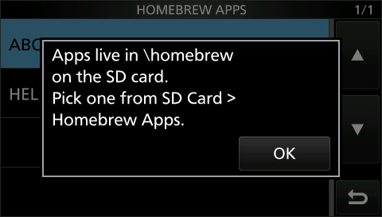

# `about-box` — two popups in a row

```c
ui_message_box("Homebrew SDK for the IC-7300");
ui_message_box("Apps live in \\homebrew\non the SD card.\nPick one from SD Card >\nHomebrew Apps.");
```

The second `ui_message_box()` runs only after the first one's OK. The app is paused between them
while the radio keeps running (see `sdk/loader/README.md`, "The app runtime"). It's the second
app in the loader's picker test (`sdk/loader/test_emu.py`), and it also shows a multi-line
message.



Build: `python3 sdk/tools/build_app.py --keep sdk/examples/about-box/build -o ABOUT.BIN
sdk/examples/about-box/main.c`, then put `ABOUT.BIN` in `\homebrew\` on the card.
