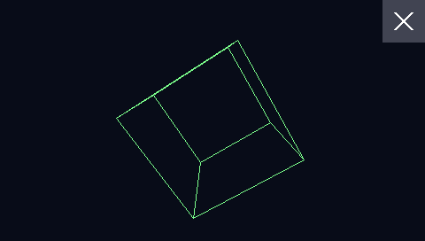
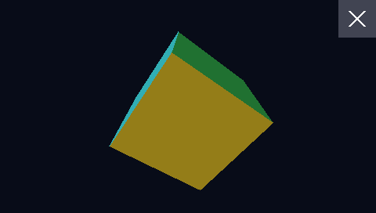

# `cube` — a spinning 3D cube, the first graphics app

Tap the cube to switch between wireframe and filled faces. Tap the X in the top right corner to
exit back to the app picker.

| Wireframe | Filled |
|---|---|
|  |  |

`main.c` is plain C against the SDK's graphics, input and math headers (`hb/gfx.h`,
`hb/input.h`, `hb/math.h`). Each frame it does the following:

1. Reads the touchscreen.
2. Rotates the 8 vertices by the elapsed time (`hb_millis()`) and projects them.
3. Clears the back buffer, then draws either the 12 edges or the visible faces. Faces pass a
   back-face cull on the projected winding, get Lambert shading from the face normal, and are
   drawn as two triangles each.
4. Draws the exit button.
5. Calls `hb_gfx_present()`.

The tap handling works like this:

- A tap toggles the mode when it starts inside the cube's projected bounding box.
- The exit button acts on release, and only if the finger is still on it. Sliding off cancels.

How the screen and touch are taken over (the GR3 overlay and the input grab) is described in
`sdk/loader/README.md`, "Graphics and input".

## Tested (2026-09-25, `qemu-machine`, `--icount off`)

`sdk/loader/test_emu.py` launches it from the picker and checks each of the following:

- GR3 is enabled as an opaque overlay on one of the SDK framebuffers, and input is grabbed.
- It animates at **30 frames/s**. That's wall-clock on the emulator, where all of this is
  software-emulated, so real-hardware speed is not measured.
- The framebuffer centre is background in wireframe mode, cube-coloured after a tap on the cube,
  and background again after a second tap.
- A tap over where a picker row sits underneath doesn't reach the picker: its cursor is
  unchanged, and no app is launched.
- The X exits: GR3 goes back to its stock state, the grab is released, `main()` returns, and the
  picker is back. HELLO launches normally afterwards.

Build: `python3 sdk/tools/build_app.py --keep sdk/examples/cube/build -o CUBE.BIN
sdk/examples/cube/main.c`, then put `CUBE.BIN` in `\homebrew\` on the card.
