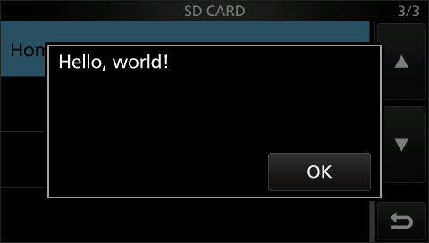
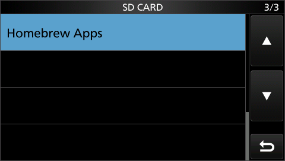

# `hello-gui` — the first homebrew GUI app

```c
#include "hb/app.h"

int main(void)
{
    ui_message_box("Hello, world!");
    return 0;
}
```

Tapping **MENU → SET → SD Card → Homebrew Apps** opens the radio's own popup dialog with our
text and an OK button. `ui_message_box()` blocks until OK is tapped, then `main()` returns and
the app exits. The rest of the radio keeps running the whole time.



After OK the dialog closes and the SD CARD menu is back, exactly as before the tap:



It's plain C built against the SDK (`sdk/include/hb/`, `sdk/runtime/`). It runs on top of the
one-time loader firmware in [`sdk/loader/`](../../loader/). How it works is described in
[`sdk/loader/README.md`](../../loader/README.md): coroutine runtime, APP.BIN header, idle tick,
borrowed dialog.

## Build and run in the emulator

```
python3 sdk/loader/build.py                        # -> scratch/hb_loader_142.dat (flash once)
python3 sdk/tools/build_app.py --keep sdk/examples/hello-gui/build \
    -o scratch/hello-gui/APP.BIN sdk/examples/hello-gui/main.c

emu/.venv/bin/python3 qemu-machine/tools/build_flash.py scratch/hb_loader_142.dat scratch/hello-gui/flash.bin
python3 qemu-machine/tools/build_sdcard.py -o scratch/hello-gui/sdcard.img --size-mb 128
mmd   -i scratch/hello-gui/sdcard.img@@1M ::IC-7300
mcopy -i scratch/hello-gui/sdcard.img@@1M scratch/hello-gui/APP.BIN ::IC-7300/APP.BIN

python3 sdk/examples/hello-gui/test_emu.py         # scripted end-to-end check, below
# or interactively:
python3 qemu-machine/tools/run_gui.py --no-pwrk --icount off \
    --flash scratch/hello-gui/flash.bin --sd scratch/hello-gui/sdcard.img
```

On real hardware: install `hb_loader_142.dat` once with SET > SD Card > Firmware Update, then
copy `APP.BIN` to `IC-7300\APP.BIN` on the card. **Not yet tried on real hardware** (see
the loader README's open items).

## What was verified (2026-09-25, `qemu-machine`, `--icount off`)

`test_emu.py` boots the loader firmware and taps through the real menus like a user would. It
reads guest memory over QMP and takes a screenshot at each step. All checks pass:

- The main screen comes up normally with the loader's `main_idle_loop` hook in place.
- Before the tap, no app is resident (loader `idle_hook == NULL`).
- On the tap, dialog item `0x66` is up with the app's `on_ok` as its OK callback. The
  borrowed record's line 0 reads `Hello, world!` and its button slot reads `OK`.
- While the dialog is up, the app is suspended inside `hb_wait_until` (`idle_hook == hb_idle`)
  and `main()` hasn't returned.
- On OK, the dialog closes (`active_item == 0`) and `on_ok` has fired. `main()` returns,
  `idle_hook` is cleared, and the stock dialog's text pointers are restored.
- **A second launch in the same session behaves identically.** Every check above passes again,
  so the runtime re-zeroes its state and rebuilds the coroutine each time.
- EXIT back to the main screen works; the radio stays responsive.
- **Fail-closed**: a card with no `APP.BIN`, and a card holding the old headerless
  `sd-card-app` binary, both make the tap a no-op. There's no dialog, nothing stays resident,
  and the UI stays responsive. The old binary is refused by the header check; this test
  shows only that nothing observable happened.

## One mistake caught along the way

The first build rendered `OK` as a second text line and left the button blank. My first dump
of the message-record table had misread its layout; the corrected layout is in
`notes/ui-menu.md` and `sdk/include/hb/firmware.h`. Button labels live in fixed slots 6/7, not
"the lines after the text". Even that broken build proved the rest of the path: the blank
button still dismissed the dialog, the app resumed, and the stock text was restored.
