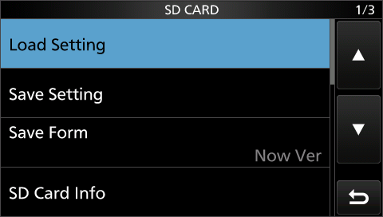
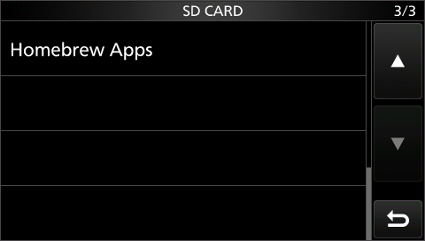

# `homebrew-apps-menu` — a real, visible "Homebrew Apps" menu button

Live-tested 2026-09-25 in `qemu-machine`, driven through the real touchscreen UI (not a
shortcut). This is the other half of the user's original ask that
[`civ-hello-world`](../civ-hello-world/) and [`sd-card-app`](../sd-card-app/) didn't cover: both
of those trigger via a hidden front-panel key combo. This one adds a **real row in the real SD
CARD menu** that does the same SD-card app load `sd-card-app` does — MENU → SET → SD Card →
"Homebrew Apps".

## What it does



Tapping **SET → SD Card** now shows **3 pages** instead of the stock 2 — the new row lives alone
on the third:



Tapping it opens `C:\IC-7300\APP.BIN` from the SD card, reads it, and runs it — exactly
`sd-card-app`'s own mechanism, just triggered by a real menu tap instead of a key combo.
`sd-card-app/app_main.s` is reused **completely unmodified** as the loaded app.

## How it's installed — two data patches, no instruction touched

Unlike the other two examples (which retarget one `main_idle_loop` instruction), this one only
ever changes **data**, found by tracing the real menu-list engine (`notes/ui-menu.md`'s "SET-style
settings-list engine" section, traced the same day):

- **`g_settings_category_registry[0x18]`** (`0x20199500`, the SD CARD menu's own entry): item
  count `8 → 9`, list pointer retargeted to a new 9-entry copy (the original 8 items, unchanged,
  plus one new one).
- **One new 20-byte record** in `g_settings_item_catalog` (`0x2018ed48 + 0x881×20 =
  0x2019975c`), inside a padding gap confirmed unused by anything else: `{action =
  homebrew_menu_action, query = NULL (always selectable), flags = 0x00010700 (copied from the
  real "Format" row), en = jp = "Homebrew Apps"}`.

**Revised in an adversarial review pass**: the new 9-entry list and the "Homebrew Apps" label text
now live in the same read-only padding gap as the catalog record itself (`build.py` copies their
byte content out of the assembled hook and into the firmware image directly), not at their
appended-RAM linked addresses. Reasoning: this menu is also the Firmware Update recovery path — if
the appended-RAM region were ever found unsafe the way an earlier address in this same region was,
a list/label living there would mean the *entire SD CARD menu* renders garbage, not just this one
new row. Only the new row's own `action` pointer still has to point into appended code (there's no
room in the padding gap for the actual open/read/close logic); every other row's own data, and the
menu's own rendering, is unaffected even in that scenario now.

`homebrew_menu_action` (`menu_hook.s`) is called with **no arguments** — the exact convention
`settings_list_activate_row` uses to tail-call any type-3 row's action — and just does
`sd-card-app`'s open/read/close/call sequence, then returns. Because it never calls
`operating_mode_change_dispatch` the way a screen-switching row (like Format or Firmware Update)
does, tapping it doesn't navigate away — the SD CARD menu just stays where it was, which is
exactly the right behavior for "run this app" as opposed to "go to this settings screen".

## Building and testing

```
python3 sdk/examples/homebrew-apps-menu/build.py
# -> scratch/homebrew_apps_menu_142.dat  (flash this once)
# -> scratch/APP.BIN                     (drop this on the SD card, same as sd-card-app)
```

Then boot and put `APP.BIN` on the card exactly as in `sd-card-app/README.md`. No key combo —
navigate for real: **MENU → SET → (page 2 of 2) SD Card → (page 3 of 3) Homebrew Apps**.

## What was actually observed (2026-09-25 session)

Driven through the real UI via QMP input events and `tools/fp.py`, with `screendump` screenshots
at each step (not just CI-V — the actual rendered screen, confirming nothing else broke):

- Main screen renders normally before touching anything.
- MENU → SET → SD Card: the list genuinely shows **"1/3"** where stock firmware shows "1/2" —
  the item count patch took effect, pagination adjusted itself automatically (this project's own
  code recomputes page count from the registry's count field, not a fixed constant).
- Pages 1–2 show the original 8 items, unchanged, in the original order.
- Page 3 shows exactly one row: **"Homebrew Apps"**, correctly labeled, no rendering glitches.
- Tapping it produces the identical CI-V frame `sd-card-app` produces:
  `fe fe e0 94 51 53 44 41 50 50 fd` (`cmd 0x51 "SDAPP"`) — the SD-card app genuinely ran.
- The menu screen stays on "Homebrew Apps" (selected), no crash, no stray dialog.
- Backing out with EXIT navigates normally all the way to the main screen.
- `civ 03`/`civ 04` (read frequency/mode) both get normal replies throughout and after.
- **Fail-closed, tested with an empty SD card**: boots fine, the menu still shows 3 pages with
  "Homebrew Apps" on page 3, tapping it produces no frame at all, and the radio remains fully
  responsive to CI-V commands afterward.

## Corrections from an adversarial review pass (2026-09-25)

An Opus review of all three `sdk/examples/` (full report in `sdk/app-loader-design.md`) found
several issues that also apply here, since `menu_hook.s` started as a copy of `sd-card-app/
loader_hook.s`. Fixed and **re-verified through the real UI afterward** (same screenshots, same
3-page menu, same `SDAPP` frame on tap, same fail-closed with no `APP.BIN`):

- The same failed-read-executes-garbage bug, and the same missing cache-maintenance-before-jump
  gap — see `sd-card-app/README.md`'s own corrections section for the full detail, identical fix
  here.
- The same stack-alignment fix, including the same second bug this session's own regression
  testing caught in the first attempt at it (padding `try_open`/`try_read`/`try_close` with
  `push/pop {r0, lr}` silently destroys the return value in `r0`) — see `sd-card-app/README.md`.
  **This is exactly how the ROM-relocation regression test below caught it**: after the first
  (buggy) alignment fix, the menu still rendered fine and the open still succeeded, but no frame
  came out — tracing live memory (`sd_handle` set, `sd_read_actual` stuck at 0) pointed straight
  at the corrupted return value.
- The list/label ROM relocation (see above) is itself a direct response to this review — not a
  bug fix, but a real risk-reduction change it prompted.

**Not fixed, documented as open risks** (same as `sd-card-app`, inherited unchanged since this
example calls the identical wrapper functions): `RPC_WAIT`'s unbounded wait, no SD-ready/recorder-
busy gate, no `APP.BIN` content validation, cache maintenance unverified on real hardware. One
finding specific to this example: `homebrew_menu_action`'s catalog index (`0x881`) is read as a
truncated `u8` by one consumer (`FUN_2003fd6c`) — confirmed harmless in the 1.42 image checked
(the truncated value, `0x81`, doesn't collide with any other slot's own low byte), but worth
re-checking against any other firmware version before reusing this technique there.

## Known limitations

- Only one app row, one fixed path, same 32 KB cap as `sd-card-app` — no real app-management UI
  (an app picker, multiple installed apps) yet.
- `-icount`: not independently re-tested here, but see `civ-hello-world/README.md` — the other two
  examples both hang under `-icount` and work under plain unthrottled execution; this one was
  tested with `--icount off` from the start on the same basis.
- The new catalog record's index (`0x881`) and its home in the post-registry padding gap were
  chosen based on static analysis of the 1.42 image specifically — re-verify both before reusing
  this technique against a different firmware version.
- The registry/catalog state this patches lives in an NVRAM-backed region (`g_nvram_region_table`
  region 2 covers it) — the saved menu cursor and a snapshot of the tapped row's own data persist
  to EEPROM. Confirmed benign against stock firmware (a stock reflash clamps the cursor to 7,
  within its own valid range), but a real, persistent side effect worth knowing about.
