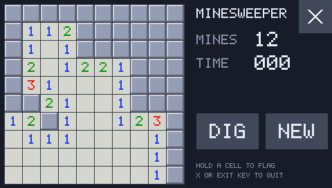
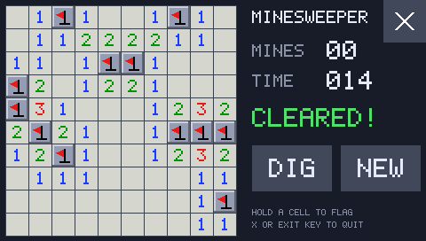
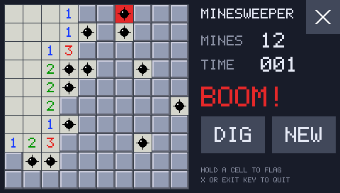

# `minesweeper` — App 3, a 10×10 Minesweeper

A touch game on a 10×10 board with 12 mines. It's the "simple game" from
`sdk/app-requirements.md` (App 3), with the target changed from Tetris to Minesweeper.

| Playing | Cleared | Boom |
|---|---|---|
|  |  |  |

**Controls:**

- **Tap** a cell to dig it.
- **Hold** a cell (450 ms) to plant or pull a flag. The **DIG/FLAG** button swaps what a tap
  and a hold do.
- Tap a dug number whose flags are all placed to dig its remaining neighbours (a "chord").
- **NEW** deals a fresh board.
- The **X** or the front-panel **EXIT** key quits.

Mines are laid on the first dig, never on or next to that cell, so every game opens with a free
area. The panel shows mines left (mines minus flags) and a timer. The board freezes on a win
(all mines get flagged) or a loss (the mine that went off is red, wrong flags are crossed out).

## Firmware GUI components or raw raster?

Raw raster. The app draws everything itself on the SDK's GR3 canvas (`hb/gfx.h`). The
firmware's UI toolkit was the first thing checked. Here is what it offers and why none of it
fits:

- **SET-style list screens** (`notes/ui-menu.md`, the settings-list engine, and the app picker
  in `sdk/loader/`) show one column of text rows, four per page. A tap reports only the row
  index in `fw_list_cursor`, with no column. A 10×10 board would need ten rows spread over three
  pages, with no way to tell which cell in a row was tapped. The firmware also has no free
  screen to use: the picker already has to borrow PLAYER SET.
- **Popup dialogs** (`ui_message_box`) hold up to 6 text lines and 1–2 buttons. That can't fit
  10 rows, and the text itself can't be tapped.
- **The Quick Menu tile widget** shows at most 4 tiles at a time, from a fixed table.
- **A general widget API** (a button at x/y with a callback) wasn't found. Each firmware screen
  is a fixed render function in `g_screen_descriptor_table`, drawn through an OpenVG stack whose
  API isn't catalogued. `sdk/api/display.md` records open questions on whether that stack can
  be shared with another task.
- **Firmware text** is TrueType (fonts in `chunk1`/`chunk2`), drawn through that same OpenVG
  stack, so it can't be used on the canvas either.

A canvas of our own has none of those limits: full-screen RGB565, touch in pixels, and no
reaction from the UI underneath (the input grab). What it needed was text, so the SDK gained
`hb_text()`, a built-in 5×7 bitmap font at any integer scale (`sdk/runtime/font.c`), and
`hb_key_down()` for the front-panel keys (`hb/input.h`).

The firmware dialogs could still be used around the game, for example a "BOOM!" popup, but only
with the canvas closed (GR3 is opaque over the GR2 dialog), so the radio's own screen would flash
through between. That's not worth it for a status line.

## How it works

`main.c` holds everything in plain C: the board as three 100-byte arrays (mine, cell state,
neighbour count), an iterative flood fill for zero cells, and a touch state machine. That
machine remembers what a touch started on (a cell, a button, the X) and cancels if the finger
slides off. It fires the hold action once, at 450 ms, and acts on a tap only on release.

The app redraws and presents only when something changes: a touch event, the hold firing, or
the timer's second ticking over. Otherwise it just `hb_yield()`s, so it costs the radio almost
nothing while idle. Each present redraws the whole frame, so neither buffer can go stale.

## Tested (2026-09-25, `qemu-machine`, `--icount off`)

`sdk/loader/test_emu.py` launches it from the picker (4th row, `MINES`) and checks:

- the GR3 overlay is up and input is grabbed; a new board is all hidden with no mines laid.
- The first dig lays exactly 12 mines, none on or next to that cell, and opens an area.
- Hold plants a flag and holding again pulls it. In FLAG mode a tap flags and a hold digs.
- Digging every safe cell (found by reading `g_mine`) wins, and every mine ends flagged.
- NEW gives a fresh board. Digging a mine loses, records it in `g_boom`, and freezes the board.
- The picker underneath never reacts to any of these taps.
- The EXIT key quits: GR3 is restored, the grab is released and `main()` returns. The screen
  is still the picker, so the key press didn't leak through to it.

Build: `python3 sdk/tools/build_app.py --keep sdk/examples/minesweeper/build -o MINES.BIN
sdk/examples/minesweeper/main.c`, then put `MINES.BIN` in `\homebrew\` on the card.

## Open

- **Resistive touch on real hardware.** A finger that drifts across a cell border cancels the
  tap. The 26 px cells may need a few pixels of slop on the real panel, which hasn't been
  measured.
- **The dials aren't grabbed** (`sdk/loader/README.md`), so the game doesn't use them. A dial
  cursor would tune the radio at the same time.
