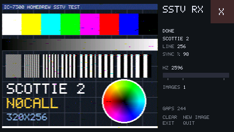

# sstv-rx — SSTV receiver (App 4, first version)

Decodes **Scottie 1/2/DX** and **Martin 1/2** images from the radio's receive audio and draws
them line by line. Tune to an SSTV frequency in USB (e.g. 14.230 MHz), then MENU > SET >
SD Card > Homebrew Apps > **SSTV**. The app listens for a VIS header, shows the mode, and
receives the image. CLEAR drops the image and listens again, and EXIT (or the X) quits.
Research and design: [`../../sstv-app-design.md`](../../sstv-app-design.md).



**Status:** runs in the emulator; not yet tried on hardware. It needs the loader built
from this tree (ABI v4, audio hook), so flash `sdk/loader/`'s output again.

## Files

| File | What |
|---|---|
| `sstv_core.c/.h` | The decoder: integer-only, no SDK dependencies. Quadrature FM discriminator at 12 kHz (1900 Hz NCO, 33-tap FIR, CORDIC phase difference), VIS decode, per-line sync re-lock, G/B/R pixel sampling. Mode timings from slowrx (ISC licence). |
| `sstv_tables.h`, `gen_tables.py` | Generated fixed-point tables (sine, FIR, CORDIC). |
| `main.c` | The app: `hb_audio_*` → `sstv_feed()` → a 320×256 image on the GR3 overlay, plus a status panel (mode, line, sync quality, live tone bar, audio gaps). |
| `host_test.c` | Runs the core on a 12 kHz file on the PC and writes a PPM. |
| `test_emu.py` | End to end in the emulator (below). |
| `audio_continuity.py` | Checks the app's audio ring against a stimulus file for lost or repeated blocks (`test_emu.py --noise FILE`). |
| `prototype/` | The Python prototype the core was checked against, plus the slowrx-cli comparison. |

## Test

```
cd sdk/examples/sstv-rx                         # host decode: run from this directory
mkdir -p build
cc -O2 -Wall -o build/host_test host_test.c sstv_core.c
build/host_test ../../../scratch/samples/SSTV.test.au build/host.ppm     # VIS 56, 256 lines
cd ../../..                                     # emulator test: run from the repo root
python3 sdk/examples/sstv-rx/test_emu.py        # about 5 min
```

The test recording `scratch/samples/SSTV.test.au` is not included in the repo. Supply any Scottie
or Martin SSTV recording (12 kHz mono 16-bit .au or .wav) there, or pass `--sample FILE` to
`test_emu.py`.

`test_emu.py` builds the loader, flash, app and SD card. Then it boots with `-icount shift=1`,
launches SSTV from the picker, and checks that the audio hook delivers 12 kHz per emulated
second. It plays `scratch/samples/SSTV.test.au` into DX_REC L through the fake DSP, waits for
DONE (VIS 56, 256 lines), and compares the image in guest RAM with `host_test`'s decode of the
same file. EXIT must clear the hook. Without `-icount` the guest falls behind and about 19% of
the audio blocks are lost.

## Audio gaps

Even under `-icount`, the emulated firmware's own pump misses about 0.1–0.4% of the 0.75 ms
DMA blocks, from boot on, with or without an app running (`RZA1H_DEBUG=dmac` counts the
overruns). Each lost block shifted the rest of its line by 9 samples, about 3 pixels. The
image was recognisable but speckled: PSNR 19.6 dB against the PC decode, and a simulation
with 0.4% dropped blocks on the PC gives 19.4 dB. A median filter doesn't help, because the
damage is timing, not spikes. So the runtime's audio ISR (`sdk/runtime/audio.c`) now tracks
the earliest time each block can arrive against OSTM0. A lost block shows up as a whole block
of lateness, and gets filled with 9 interpolated samples. After that, `audio_continuity.py`
finds no discontinuities with a noise stimulus. `hb_audio_gaps()` counts the fills, shown
as GAPS on screen. Whether real hardware loses blocks at all is open.

## Next

- Hardware: check that DX_REC L's low-pass and the IF filter keep 1100–2300 Hz, and measure
  the CPU load and GAPS.
- More modes: Robot 36/72 (YUV), PD 90/120/180; save to SD.
- Slant is handled by the per-line sync re-lock only. A fit over all syncs would help weak
  signals.
