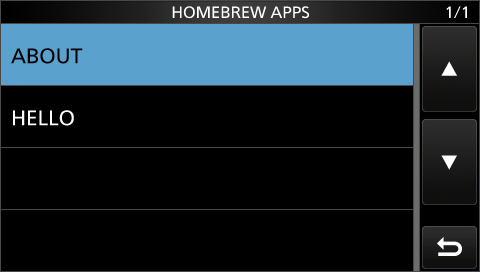

# `sdk/loader/` — the homebrew loader firmware (flash once)

`build.py` takes a stock **1.42** container and produces `scratch/hb_loader_142.dat`: the
stock firmware plus `loader.c`, appended at `0x20600000` and wired in with two patches. Install
it once with SET > SD Card > Firmware Update. From then on, an app is just a `.BIN` file in
`\homebrew\` on the SD card, built from C with `sdk/tools/build_app.py`. MENU > SET > SD Card >
**Homebrew Apps** opens a list of them; tap one to run it.

> **Untested on real hardware.** Before flashing this to a radio, read the warning in the top-level [README](../../README.md#scope): prepare and verify a way to re-flash a radio that no longer boots first.



This replaces the proof-of-concept chain in `sdk/examples/{civ-hello-world,sd-card-app,
homebrew-apps-menu}`. The menu row, file I/O and fail-closed read checks are the same, and it
adds what a real app needs:

| | proof-of-concept examples | this loader (ABI v1) |
|---|---|---|
| App language | hand-written ARM assembly | C, with `sdk/include/hb/` + `sdk/runtime/` |
| APP.BIN check | none, any bytes were executed | 16-byte header: magic `HB01`, ABI version, entry and RAM end, all bounds-checked |
| App lifetime | one call, must return immediately | may run as long as it likes, via the idle tick |
| Blocking calls | impossible (would freeze the UI) | `ui_message_box()`, `hb_wait_until()`, `hb_yield()` |
| Which app | one fixed `C:\IC-7300\APP.BIN` | any `\homebrew\*.BIN`, picked from a list |
| Relaunch while running | n/a | refused (no reload over resident code) |
| Graphics / touch | none | full-screen overlay canvas + input grab (ABI v2) |

## Patches (`build.py`, each checked against the stock bytes first)

1. **Idle tick**: `main_idle_loop`'s `bl civ_tx_pump` (`0x20052f64`) becomes `bl hb_idle_hook`.
   The hook runs `civ_tx_pump` exactly as before, restores the borrowed picker screen once it
   has been left (below), then runs the resident app's `idle_hook`, if one is set.
2. **Input grab**: `main_idle_loop`'s `bl ui_input_poll_tick` (`0x20052f24`) becomes
   `bl hb_input_hook`. The hook runs the stock function unless the app has set
   `api->input_grab`.
3. **Menu row**: the same two data patches as `homebrew-apps-menu`. The SD CARD registry goes
   8 → 9 items, and a new catalog record's action is `hb_menu_action`. The list, label and
   record live in the image's confirmed-unused padding gap. The 14 catalog slots right after
   the record (`0x882`–`0x88f`) are left zero for the picker's rows.
4. **RX audio** (ABI v4): `ssif0_rx_pump_dx_rec`'s `bl ssif_rx0L_ring_push36` (`0x200606d8`)
   becomes `bl hb_audio_hook`. It runs from the 250 µs tick ISR. The hook queues the
   36-sample 48 kHz block for the firmware's own reader as before, then passes it to the
   app's `api->audio_hook`, if set. The runtime wraps this as `hb/audio.h` (12 kHz, gap-filled).

## The app picker

Tapping Homebrew Apps (`hb_menu_action`):

1. **Lists `C:\homebrew`** with the firmware's own directory RPCs: opendir, readdir by position
   cookie, closedir (ids 6/9/7; `sdk/api/filesystem.md`). It keeps regular files named
   `<1-8 chars>.BIN` (any case) whose size could hold a valid app, sorted alphabetically. It
   keeps the first 14 in that order. Directories, other extensions and empty files are skipped.
2. **Fills one catalog record per app** in the reserved slots. Each gets the label (the name
   without `.BIN`) and the shared action `hb_app_row_action`. With no apps, a single
   non-selectable "No apps in \homebrew" row is shown, using the stock placeholder query.
3. **Borrows a stock list screen.** The firmware has no free list screen: every category
   `0x00`–`0x49` belongs to one, and both screen tables run straight into other data
   (`notes/ui-menu.md`, "Screens"). So the loader borrows **PLAYER SET** (screen `0x63`,
   category `0x40`, one stock row, deep under the voice recorder). It saves and replaces that
   category's row list, the screen's title and the category's saved cursor, then calls
   `operating_mode_change_dispatch(0x63)`. The firmware's navigation stack makes back return to
   SD CARD.
4. **Restores it** on the first idle-hook pass after the current screen is no longer `0x63`.
   The screen is only ever ours while it's on display, and the rows, title and saved cursor
   return to their exact stock values (checked by the test).

A row tap calls `hb_app_row_action`. It reads the tapped row from the list cursor
(`*(u16*)0x20390222`, absolute across pages; tested on pages 2 and 3), then loads and runs
`C:\homebrew\<name>` with the checks below.

## ABI v4 (`sdk/include/hb/abi.h`)

- **Memory map.** Everything is inside `0x20600000`–`0x207fffff`, cached and executable RAM
  the firmware never uses (`notes/memory-map.md`: marker sweep, static trace, MMU map):

  | Address | Size | Use |
  |---|---|---|
  | `0x20600000` | 64 KB | the loader (2.7 KB today) |
  | `0x20610000` | 1 MB | `HB_APP_REGION`: the app's code, data, bss and 16 KB stack |
  | `0x20710000`, `0x20750000` | 2 × 255 KB | `HB_FB0/1`, the graphics framebuffers |
  | `0x20790000`–`0x207fffff` | 448 KB | `HB_HEAP`, for `hb_malloc()` (`hb/heap.h`) |

  Above `0x20800000` the RAM is execute-never, then holds the firmware's page tables and
  uncached GPU/DMA memory.
- The chosen `.BIN` is read into `HB_APP_REGION` in 64 KB chunks until end of file, so no
  single file RPC moves more than 64 KB. A file bigger than the region is refused, and the
  picker doesn't list it.
- It starts with `struct hb_app_header {magic, abi_version, entry, image_end}`. The loader
  refuses the file unless the magic and version match, `entry` is word-aligned inside the bytes
  actually read, and `image_end` lies within the region.
- After cache maintenance, the loader calls `entry(&api)` from the menu tap, on the UI thread.
  `api` is `{abi_version, fw_build = 0x0142, idle_hook, input_grab, audio_hook}`. While the app leaves
  `idle_hook` set, the loader calls it once per `main_idle_loop` pass and won't load another
  app. While `input_grab` is set, the firmware's touch/key handling is skipped (below).
- v1 → v2 (2026-09-25) added `input_grab`. v2 → v3 (same day) grew the region from 128 KB to
  1 MB, moved the framebuffers from `0x20640000`/`0x20680000` and added the heap. v3 → v4
  (same day) added `audio_hook` (the RX-audio tap, patch 4); the loader clears it along
  with `input_grab` once the app is gone. The loader
  accepts only its own version, and an app's runtime refuses an older loader, so apps need a
  rebuild each time. That costs nothing while no loader has been installed on real hardware.

## The app runtime (`sdk/runtime/`)

The runtime lets apps make blocking calls without freezing the UI. Everything the firmware does
runs on one UI thread, `main_idle_loop`, including touch handling, dialog drawing and the menu
action that starts the app. A `while (!ok) {}` inside the app would therefore stop the very loop
that could set `ok`.

So `crt0.S` / `runtime.c` run `main()` as a **coroutine** on its own 16 KB stack, still on the
UI thread:

1. `_hb_start` zeroes bss, builds the coroutine's first frame and switches into `main()`.
2. A blocking call (`hb_wait_until(done, arg)`) records its condition and switches back to the
   host stack. The runtime then sets `api->idle_hook = hb_idle` and returns from the menu
   action, so the firmware carries on normally.
3. Each loop pass, `hb_idle()` checks the condition and, once it holds, switches back into the
   app, which continues right after its blocking call.
4. When `main()` returns, the runtime clears `idle_hook`; the app is gone.

Every firmware call an app makes therefore happens on the UI thread, as with the stock code.
There are no cross-task races, no new RTOS task, and no open ASID question
(`sdk/api/task-model.md`).

`ui_message_box(text)` (`ui_dialog.c`) uses the firmware's own popup machinery
(`notes/ui-menu.md`, "Popup message dialogs"):

- The message table has no free record past its last entry; it runs straight into string data.
  So the call borrows the stock one-button dialog, item `0x66` ("The USB SEND/Keying settings
  were corrected." [OK]).
- It first waits for any firmware dialog to go away. Then it saves record `0x53`, swaps in our
  up-to-6 text lines plus `OK`, and calls `ui_show_message_dialog(0x66, on_ok, 0, 0)`.
- It waits until item `0x66` is no longer the active dialog, then restores the stock text.
- It returns whether OK was tapped. The OK callback just notes the tap and returns 2, as the
  stock no-callback path does.

## Build and test

```
python3 sdk/loader/build.py                                   # -> scratch/hb_loader_142.dat
D=scratch/homebrew
python3 sdk/tools/build_app.py --keep sdk/examples/hello-gui/build -o $D/HELLO.BIN sdk/examples/hello-gui/main.c
python3 sdk/tools/build_app.py --keep sdk/examples/about-box/build -o $D/ABOUT.BIN sdk/examples/about-box/main.c
emu/.venv/bin/python3 qemu-machine/tools/build_flash.py scratch/hb_loader_142.dat $D/flash.bin
python3 qemu-machine/tools/build_sdcard.py -o $D/sdcard.img --size-mb 128
mmd   -i $D/sdcard.img@@1M ::homebrew
python3 sdk/tools/build_app.py --keep sdk/examples/cube/build -o $D/CUBE.BIN sdk/examples/cube/main.c
python3 sdk/tools/build_app.py --keep sdk/examples/minesweeper/build -o $D/MINES.BIN sdk/examples/minesweeper/main.c
mcopy -i $D/sdcard.img@@1M $D/HELLO.BIN $D/ABOUT.BIN $D/CUBE.BIN $D/MINES.BIN ::homebrew/
python3 sdk/tools/build_app.py --keep sdk/loader/test_apps/big/build -o $D/BIG.BIN sdk/loader/test_apps/big/main.c
python3 -c "d=open('$D/BIG.BIN','rb').read(); open('$D/TOOBIG.BIN','wb').write(d+bytes(0x100001-len(d)))"
python3 qemu-machine/tools/build_sdcard.py -o $D/sd_big.img --size-mb 128
mmd -i $D/sd_big.img@@1M ::homebrew; mcopy -i $D/sd_big.img@@1M $D/BIG.BIN $D/TOOBIG.BIN ::homebrew/

python3 sdk/loader/test_emu.py                                # scripted end-to-end test
python3 qemu-machine/tools/run_gui.py --no-pwrk --icount off --flash $D/flash.bin --sd $D/sdcard.img
```

`test_emu.py` scenarios, all passing on 2026-09-25 (`--icount off`):

| Card | Flags | Checks |
|---|---|---|
| `ABOUT.BIN`, `CUBE.BIN`, `HELLO.BIN`, `MINES.BIN` | (default) | picker title and sorted rows; launch HELLO, ABOUT (two dialogs in a row), CUBE (overlay on, input grabbed, 30 frames/s, taps don't reach the picker underneath, tap toggles wireframe/filled, X exits and restores GR3), MINES (first dig lays 12 mines clear of it, hold/FLAG-mode flags, digging every safe cell wins, a mine loses and freezes, no tap reaches the picker, EXIT key quits without reaching the picker), HELLO again; each app's dialog text and callback, clean exit, stock dialog text restored; back → SD CARD with the borrowed screen's rows, title and saved cursor restored; picker reopens |
| `BIG.BIN` (789 KB), `TOOBIG.BIN` (1 MB + 1) | `--big` | only BIG listed; its 768 KB blob arrives whole (markers at start, middle and end, checksum), and its heap checks pass: four 80 KB blocks in bounds and holding their data, an oversize request fails, freed neighbours coalesce, realloc moves and keeps the data, and the heap is whole again at the end ("BIG OK", 2.4 s from tap to dialog) |
| `A01`–`A16.BIN`, written A09–A16 first | `--paging` | exactly A01–A14 listed (the cap keeps the alphabetically-first 14); page 2 row 2 launches the right app (A06 = about-box), page 3 row 3 too |
| no `\homebrew` folder | `--expect-no-apps` | placeholder row only; tapping it does nothing |
| `README.TXT`, a directory `DIR.BIN`, a 0-byte `EMPTY.BIN` | `--expect-no-apps` | all skipped |
| `SnakeGame.BIN`, `lower.bin` | `--expect-rows LOWER,SNAKEG~1` | short-name labels |
| no card at all | `--sd none --expect-no-apps` | directory open fails cleanly → placeholder |

## Graphics and input (`hb/gfx.h`, `hb/input.h`; `runtime/gfx.c`, `runtime/input.c`)

**The screen.** The firmware draws its whole UI with the OpenVG GPU into VDC5 graphics plane
GR2: RGB565, 480×272, framebuffer `0x20974fe0`, continuously redrawn. Drawing into that would
fight the firmware. The VDC5 stacks GR0 < GR1 < GR2 < GR3 in fixed hardware order, and the
firmware leaves GR3 configured but set to "show the lower layer". So:

- **`hb_gfx_open()`** copies GR2's geometry (the `FLM1/3/4/5/6` and `AB2–AB5` registers) onto
  GR3, and points GR3 at SDK framebuffer 0. It sets GR3's `DISP_SEL` to CURRENT, enables its
  read, and sets `UPDATE` bits `0x111`. This follows the Renesas VDC5 driver's own sequence
  (`R_VDC_ReadDataControl` + `R_VDC_StartProcess`). The firmware keeps drawing GR2 underneath,
  unseen.
- **`hb_gfx_present()`** cleans the D-cache over the back buffer, then writes the new base to
  `GR3_FLM2` with `IBUS_VEN`. It waits, yielding, until the bit reads back 0, which means the
  flip happened at vsync. A 50 ms timeout covers the wait in case the bit never clears. Then the
  front and back buffers swap.
- **`hb_gfx_close()`**, which also runs automatically when `main()` returns, puts GR3 back to
  LOWER with its read off (the stock state). It keeps the input grab until the finger lifts.
- There are two framebuffers, `HB_FB0/1` at `0x20710000` and `0x20750000` (ABI v3; they were
  at `0x20640000`/`0x20680000` in v2).
- The drawing is software: clear, rectangle, line and filled triangle, all clipped.

**Touch and keys.** `hb_touch_read()` reads the front-panel register file
(`notes/front-panel-report.md`): tag `+0x13`, then X/Y big-endian at `+0x14/+0x16`, in
calibrated pixels. `hb_key_down()` reads a key's bit from the same file
(`+0x0d..+0x11`). While the app has grabbed input, `hb_input_hook` skips
`ui_input_poll_tick`, which handles touch, the key scanner, auto-repeat and long-press. It also
copies the live key bits into the scanner's latched shadow, so nothing held or released
meanwhile becomes a press afterwards. The dials aren't grabbed: they're consumed elsewhere in
`main_idle_loop`, and still tune the radio.

**Time.** `hb_millis()` reads `g_rtos_tick_count` (`0x20390a78`), which the RTOS tick handler
increments. It was measured live at 1 kHz.

**Emulator.** `qemu-machine/src/vdc5.c` used to scan out only one plane. It now composites the
planes in order, and it clears `GRn_UPDATE` at each frame so the flip wait works. A stock boot
still screenshots pixel-identical to the reference.

## Open items

- **Graphics on real hardware**: the GR3 overlay and D-cache cleaning follow the Renesas driver
  and ARM rules but are untested on silicon; tearing and frame rate aren't known either. The
  whole homebrew area (`0x20600000`–`0x207fffff`: app region, framebuffers, heap) passed the
  emulator's whole-range marker sweep and a static trace (2026-09-25, `notes/memory-map.md`).
  It hasn't been tested on hardware. The dials still reach the radio
  while an app has input.
- **Real hardware**: nothing here has run on the radio yet. The cache maintenance before
  jumping into an app in particular is unverified (QEMU models no cache incoherency).
- **Coroutine stack vs. the RTOS**: while the app runs, the UI task's `sp` points into
  `0x2061xxxx`, outside the stack FreeRTOS allocated for it. Preemption and IRQs during
  `main()` worked in every emulator run. Stock FreeRTOS's method-1 overflow check only fires
  for `sp` *below* the task's stack base, which this is not. Whether this build enables any
  check hasn't been looked at. Worth re-checking if the UI ever dies on hardware while an app
  is up.
- **Borrowed dialog**: if the firmware itself wants dialog `0x66` while ours is up (it shows it
  after a settings load that corrected USB SEND/Keying), it would briefly get our text. Nothing
  else ever sees the swap. A dedicated record would need the message table relocated.
- **Picker limits**: at most 14 apps (the padding gap's free catalog slots); labels are the
  8.3 short names, in upper case (tested: `SnakeGame.BIN` shows as `SNAKEG~1`, `lower.bin` as
  `LOWER`). The PLAYER SET screen's
  EEPROM-backed saved cursor is ours while the picker is up. It's restored in RAM when you leave,
  but a region-2 EEPROM write that happened to fire during that window would store our value;
  stock clamps an out-of-range cursor on the next visit.
- **Picker on real hardware**: the directory scan runs synchronously on the UI thread, like the
  stock SD-menu rows' own file checks. It's quick on the emulator; not measured on a real card.
- Inherited from the proof-of-concept loader and still open: `fw_rpc_wait` is unbounded if the
  SD RPC ring is full, and there's no SD-ready / recorder-busy gate before scanning or loading.
  With no card, the directory open simply fails and the picker shows "No apps".
- `--icount`: tested only with `--icount off`, like the earlier examples (open item in
  `civ-hello-world/README.md`).
